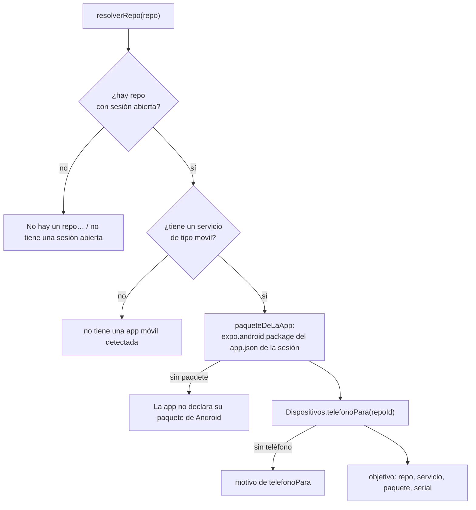

# Depuración de la app móvil

> Depurar la app del repo en el teléfono de verdad —logs, estado, archivos, base
> local, captura y diagnósticos— **sin un `adb shell`**. Cada herramienta mira
> sólo la app del repo, y la persona usa exactamente la misma implementación
> desde el panel del IDE.

Código: `packages/tools/src/codigo/telefono.ts` (las herramientas),
`apps/server/src/depuracion-movil.ts` (`crearTelefonoStorage` y las reglas puras),
`apps/web/src/routes/codigo/Depuracion.tsx` (el panel). Las dos herramientas que
**manejan** la app (`explorar_telefono`, `manejar_app`) están en [[QA móvil]].

## Por qué no es un shell

El teléfono es el de una persona: sus mensajes, sus fotos, las notificaciones de
todas sus apps. Un shell libre dejaba a un agente leer `/sdcard`, el texto de las
notificaciones (`dumpsys notification`) o desinstalar cosas. Por eso
(`telefono.ts`, comentario de cabecera):

- los **logs** se filtran por el uid de la app;
- los **archivos** se leen por `run-as` —su propio sandbox— y sólo en la build de
  desarrollo;
- la **captura** sólo se saca con la app al frente y la pantalla encendida;
- los **diagnósticos** pasan por una allowlist por token atada al paquete;
- lo **destructivo** (borrar los datos de la app) pide aprobación.

**Toda la seguridad vive en el servidor**, no en el prompt: las reglas son
funciones puras exportadas para fijarlas con tests. `packages/tools` no sabe de
adb: el servidor inyecta el `TelefonoStorage` (`Runtime.telefonoStorage`).

## Las ocho herramientas

| Herramienta | `readOnly` | Aprobación | Parámetros | Qué hace |
|---|---|---|---|---|
| `logs_del_telefono` | sí | no | `alcance` (`app` o `fallas`), `nivel` (V/D/I/W/E, default I), `lineas` (10-1.500, default 200), `buscar`, `repo` | consola de JavaScript + logcat de la app, o sus crashes |
| `estado_de_la_app` | sí | no | `repo` | versión instalada, proceso, primer plano, memoria, túneles, pantalla |
| `archivos_de_la_app` | sí | no | `accion` (`listar` o `leer`), `ruta` (default `.`), `repo` | el sandbox privado de la app |
| `consultar_base_de_la_app` | sí | no | `archivo`, `sql`, `repo` | una consulta de lectura sobre una **copia** de una base SQLite |
| `captura_del_telefono` | no | no | `repo` | PNG de la pantalla a `revision/` de la salida |
| `adb_diagnostico` | sí | no | `comando`, `repo` | un diagnóstico de una lista cerrada |
| `reiniciar_app` | no | no | `repo` | cierra y abre la app con sus túneles |
| `limpiar_datos_de_la_app` | no | **sí** | `motivo`, `repo` | `pm clear`: sesión, caché, base local y cola offline |

`repo` es opcional si el proyecto tiene uno solo. Todas se registran con
`origin: "skill"` y `additionalProperties: false`, **sólo si hay adb**
(`Runtime.registrarCodigoEn`). Aprobar `limpiar_datos_de_la_app` la ejecuta con
los argumentos que vio la persona (ver [[Aprobaciones y solicitudes]]).

## A qué app y a qué teléfono

Cada operación arranca por `objetivo(repo)` en `crearTelefonoStorage`:

- `resolverRepo` (`Runtime.telefonoStorage`): por id, nombre (sin distinguir
  mayúsculas) o slug; sin nombre, el único repo del proyecto o el primero con un
  servicio móvil. Exige una **sesión abierta** (el paquete se lee del worktree de la
  sesión).
- `telefonoPara`: el teléfono que tiene abierta la app de este repo; si no, el
  único conectado; con varios, pide que una persona la abra. Ver
  [[Build de desarrollo y túneles]].

## Qué hace cada una

### `logs_del_telefono`

Dos secciones, en este orden:

1. **`=== JavaScript (consola de la app) ===`** — de la `ConsolaJs` del Metro de la
   sesión (`inspector-rn.ts`), filtrada por nivel (`log`/`info` cuentan como I,
   `warn` como W, `error` y `excepcion` como E, `debug` como D) y por `buscar`. Sin
   el servicio móvil levantado dice que sin Metro no hay consola; mientras se
   conecta, que se está conectando.
2. **`=== Nativo (logcat de la app) ===`** — `pm list packages -U --user current
   <paquete>` da el uid; `logcat -d -v uid -t <min(40.000, lineas × 40)>` trae el
   buffer y `lineasDeLaApp` deja **sólo** las líneas de ese uid, desde el nivel
   pedido, sin la columna del uid.

Con `alcance: "fallas"`, la segunda sección es **`=== Crashes nativos ===`**:
`logcat -d -b crash -v threadtime --uid=<uid>` y `ultimasFallas` devuelve los tres
últimos crashes **desde su comienzo**. `lineas` también decide cuánto de cada
backtrace se muestra: la mitad, entre 30 y 160 líneas por crash —el módulo que
falló (libworklets, libexpo-sqlite…) suele aparecer más abajo que los primeros
marcos—. Cada marco pasa por `limpiarMarco` (sin la ruta hasheada del APK, sin
`offset` ni `BuildId`).

Todo pasa por `taparSecretos` y se acota a `TOPE_SALIDA` (15.000 caracteres):
**en un log se conserva el final** (el error está al final) y **en un crash el
principio** (señal, causa, hilo).

> [!danger] Tres cosas medidas en el S24 que no se ven leyendo el código
> - `logcat --uid` **no devuelve nada del buffer principal** (sí del de crashes):
>   por eso se lee todo con `-v uid` y se filtra en el servidor. De paso incluye los
>   procesos anteriores de la app: el que crasheó ya no tiene pid.
> - En React Native con la arquitectura nueva, el `console.log` de JavaScript **no
>   pasa por logcat** (no hay etiqueta `ReactNativeJS`) sino por el depurador: sin
>   `ConsolaJs`, un agente que depura "en el celular no anda" no ve el error de
>   JavaScript, que es casi siempre la causa. Ver [[Inspector de React Native]].
> - La cola de un tombstone son cien marcos de libart que no dicen nada: por eso un
>   crash se muestra desde su comienzo, sin los registros del procesador.

### `estado_de_la_app`

Ocho consultas en paralelo (`dumpsys package`, `pidof`, `dumpsys activity
activities`, `dumpsys meminfo`, `adb reverse --list`, `getprop ro.product.model` y
`ro.build.version.release`, `dumpsys power`) resumidas en seis líneas:

| Línea | De dónde |
|---|---|
| Teléfono: modelo, versión de Android, serial y **si la pantalla está encendida** (`mWakefulness`) | `getprop`, `dumpsys power` |
| App: versión, `versionCode` y última actualización, o "NO instalada" | `dumpsys package` |
| Depurable (build de desarrollo): sí/no | la bandera `DEBUGGABLE` |
| Proceso: corriendo (pid) o no, y si está en primer plano | `pidof`, `paqueteEnPrimerPlano` |
| Memoria (PSS total) | `dumpsys meminfo` |
| Túneles (`adb reverse`) — o "ninguno: la app no ve el Metro ni la API de la sesión; usá reiniciar_app" | `adb reverse --list` |

Es lo primero a mirar cuando "en el celular no anda".

### `archivos_de_la_app`

- `listar`: `run-as <paquete> ls -la <ruta>`.
- `leer`: `exec-out run-as <paquete> cat <ruta>`, en bytes. Si hay un byte nulo en
  los primeros 8.000, es binario: dice el tamaño y, si parece una base, sugiere
  `consultar_base_de_la_app`. Si es texto, lo devuelve tapado y acotado.
- `run-as` sólo funciona con la **build de desarrollo** (debuggable). Con la de
  release, `noDepurable` traduce "not debuggable / is unknown / Could not set
  capabilities" a: "La app instalada no es la build de desarrollo… Instalala desde
  la pestaña Mobile → Dispositivos."

### `consultar_base_de_la_app`

1. Valida la ruta (`validarRutaDeApp`) y el SQL (`validarSqlDeLectura`).
2. Copia **la base con su `-wal` y su `-shm`** a `tmp/sqlite-<hex>/base.db` del
   proyecto. Con journal WAL lo último escrito vive en `-wal`: copiar sólo el `.db`
   mostraría la base de hace un rato **sin avisar**.
3. Verifica que empiece con `SQLite format 3`.
4. Corre `sqlite3 -readonly -safe -header -box base.db "<sql>"` (20 s de corte).
5. Devuelve el resultado tapado y acotado, y **borra la copia** siempre.

La copia y los dos modos (`-readonly`, `-safe`) son la barrera; la validación del
SQL es la que **explica** qué no se acepta.

### `captura_del_telefono`

Sólo si la app del repo está **en primer plano** ("el resto del teléfono es de la
persona") y la pantalla está **encendida** (`mWakefulness=Awake`; apagada, la
captura saldría negra). `exec-out screencap -p` y se guarda como
`revision/telefono-<fecha ISO>.png` en la salida del proyecto, marcada como
generada (ver [[Salida de la empresa]]). El agente la abre con sus herramientas de
lectura: "no reportó errores" no es "se ve bien".

### `adb_diagnostico`

`validarDiagnostico` tokeniza el comando (`tokenizar`, sin shell), acepta que
empiece con `adb shell` o `adb`, exige caracteres seguros en cada token y sólo
deja pasar:

| Comando | Regla |
|---|---|
| `dumpsys meminfo` · `gfxinfo` · `package` · `batterystats` | siempre sobre el paquete del repo (se agrega solo; otro paquete se rechaza); `gfxinfo` acepta `framestats` o `reset` |
| `pm path` · `pm dump` | sólo el paquete del repo |
| `pidof` | sólo el paquete del repo |
| `getprop [clave]` | — |
| `wm size` · `wm density` | — |
| `settings get global <clave>` · `settings get system <clave>` | `secure` no (ahí está el `android_id`) |
| `df [-h]` · `uptime` | — |

Todo lo demás: "Ese comando no está permitido…", con la lista y a qué herramienta
ir para logs y archivos.

### `reiniciar_app`

`deps.reabrir` → `Dispositivos.abrir` con los túneles calculados en el momento:
lo mismo que "Abrir la app" en el IDE. Sin el servicio levantado: "no está
levantado: la app baja el JavaScript de su Metro. Lo levanta una persona desde la
pestaña Código." Ver [[Build de desarrollo y túneles]].

### `limpiar_datos_de_la_app`

`pm clear --user current <paquete>`; exige `Success` en la salida. Se lleva la
sesión, la caché, la base local y **la cola offline que no se sincronizó**: por eso
pide aprobación y un `motivo`.

## Las reglas puras

| Función | Qué decide | Ejemplos |
|---|---|---|
| `validarRutaDeApp` | relativa, sin `..`, sólo `[A-Za-z0-9._-/]` (se pasa sin comillas a `run-as`); `./` y `/` final se limpian; vacía = `.` | acepta `files/SQLite/inspia.db`; rechaza `/sdcard/DCIM`, `files/../../com.whatsapp`, `files; rm -rf .`, `files/$(id)` |
| `validarSqlDeLectura` | una sentencia (`;` final tolerado), empieza con `SELECT`, `WITH`, `PRAGMA` o `EXPLAIN`, sin comandos con punto del cliente, sin `PRAGMA x = y`, sin `ATTACH` ni `load_extension` | rechaza `DELETE`, `select 1; drop …`, `.shell id`, `PRAGMA journal_mode = DELETE` |
| `validarDiagnostico` | la allowlist de arriba | rechaza `dumpsys notification`, `pm uninstall`, `content query --uri content://sms/inbox`, `settings get secure …`, backticks |
| `taparSecretos` | JWT (`eyJ…`), `Bearer …`, `sb_secret_…` y `apikey=`/`token=`/`access_token=`/`refresh_token=` en URLs | la sesión de Supabase viaja como JWT |
| `uidDe` | `uid:NNNNN` de `pm list packages -U` | — |
| `paqueteEnPrimerPlano` | el paquete de `topResumedActivity`/`mResumedActivity` | — |
| `lineasDeLaApp` | líneas `-v uid` del uid (o su alias `u0_a<uid−10000>`), desde el nivel | las de otras apps nunca salen |
| `ultimasFallas` | inicios en `Fatal signal`, `FATAL EXCEPTION` o `*** *** ***` (dos a ≤2 líneas son la misma falla), sin registros del procesador (`x0…x28`, `lr`, `sp`, `pc`…), recortadas con "(… N líneas más del backtrace)" | — |
| `limpiarMarco` | saca `/data/app/…/base.apk!`, `(offset 0x…)` y `(BuildId: …)` | — |

## El panel Depuración del IDE

Modo **Depuración** de la vista del servicio móvil (`Depuracion.tsx`). No necesita
el servicio levantado, pero sin él no hay consola de JavaScript.

| Pestaña | Qué hace | Refresco |
|---|---|---|
| Logs | alcance, nivel, buscar, "En vivo"; 400 líneas; se pega al final si estás abajo; "Al chat" en las líneas W/E/F manda la línea y su contexto (3 antes, 12 después) al [[Chat de IA]] | cada 2 s en vivo |
| Estado | el texto de `estado` | cada 5 s |
| Archivos | navegación por carpetas con migas; un `.db` ofrece "Consultar" en Base local | a pedido |
| Base local | archivo (arranca en `files/SQLite/inspia.db`, el de INSPIA) + SQL (arranca listando tablas y vistas); ⌘↵ | a pedido |
| Diagnóstico | atajos (`dumpsys meminfo`, `gfxinfo`, `framestats`, `package`, `pidof`, versión, `wm size`, `wm density`) y un campo libre que igual pasa por la allowlist | a pedido |

Arriba: **Reiniciar app** y **Limpiar datos**. Limpiar pide confirmación en un
diálogo y **no pasa por una aprobación**: ahí decide la persona, como en todo
borrado desde la UI.

> [!note] Las líneas de JavaScript no llevan color ni "Al chat"
> El panel reconoce el nivel con el formato de logcat
> (`MM-DD hh:mm:ss.mmm pid tid N`). Las líneas de la consola de JavaScript llegan
> como `hh:mm:ss NIVEL texto`, así que se dibujan sin color y sin el botón "Al
> chat", aunque sean errores.

## Cuándo lo usa un agente

- El **resumen de código de cada turno** agrega la sección "App móvil en el
  teléfono" (`bloqueDeTelefono`, `apps/server/src/codigo-servidor.ts`) si el repo
  tiene un servicio `movil` y el rol tiene alguna de estas herramientas, con una
  línea por cada una que el rol **sí** tiene. Va en el resumen y no sólo en el
  prompt porque el prompt de un rol se guarda al crearlo: uno viejo nunca se
  enteraba de que tenía algo nuevo.
- El prompt del Mejorador (`MEJORADOR_DE_CODIGO`) pide depurar en el teléfono antes
  de suponer.
- En la plantilla `desarrollo-software`, el programador y QA tienen todas (el QA
  sin `limpiar_datos_de_la_app`) y el tech lead `logs_del_telefono` y
  `estado_de_la_app` (ver [[Referencia de plantillas de equipo]]).

## Casos borde

| Síntoma | Causa |
|---|---|
| "La app instalada no es la build de desarrollo (no es debuggable)" | hay una build de release instalada: `run-as` no entra |
| Sin sección de JavaScript | el servicio móvil no está levantado, o la app no está conectada al Metro (`reiniciar_app`) |
| "Hay varios teléfonos conectados y ninguno tiene abierta esta app" | abrila desde el IDE en el teléfono que corresponde |
| La captura se niega con la app abierta | la pantalla está apagada o en `Dozing`: la app puede quedar desconectada del Metro y la captura saldría negra |
| La base parece vieja | no pasa: se copian `-wal` y `-shm`; si igual, la app todavía no escribió |
| El agente busca `ReactNativeJS` y no encuentra nada | con la arquitectura nueva esa etiqueta no existe; la descripción de `logs_del_telefono` todavía la menciona |

## Qué fijan los tests

`apps/server/src/depuracion-movil.test.ts`:

- "las rutas quedan adentro del sandbox de la app" — absolutas, `..`, `;` y `$(…)` afuera.
- "sólo SQL de lectura, una sentencia y nada del cliente sqlite3".
- "los diagnósticos van atados a la app y nada más" — notificaciones, otras apps, `secure`, desinstalar, SMS y backticks afuera.
- "tapa las credenciales que pasan por los logs" — JWT, `sb_secret_`, `apikey=` en una URL.
- "lee el uid y la app al frente sin nombrar otras".
- "de un logcat -v uid quedan sólo las líneas de la app, desde el nivel pedido y sin el uid".
- "cada crash se muestra desde su comienzo, no por la cola del backtrace".
- "guarda console.* y las excepciones con su stack" — la `ConsolaJs`.

## Fuentes

- `packages/tools/src/codigo/telefono.ts` → `crearHerramientasDeTelefono`, `TelefonoStorage`, `HERRAMIENTAS_DE_TELEFONO`
- `apps/server/src/depuracion-movil.ts` → `crearTelefonoStorage`, `DepsDepuracion`, `taparSecretos`, `validarRutaDeApp`, `validarSqlDeLectura`, `validarDiagnostico`, `uidDe`, `paqueteEnPrimerPlano`, `lineasDeLaApp`, `ultimasFallas`, `limpiarMarco`, `TOPE_SALIDA`
- `apps/server/src/runtime.ts` → `telefonoStorage`, `registrarCodigoEn`
- `apps/server/src/codigo-servidor.ts` → `bloqueDeTelefono`, `HERRAMIENTAS_DE_CODIGO`
- `apps/server/src/rutas-codigo.ts` → `/api/repos/:repoId/telefono/logs`, `estado`, `archivos`, `base`, `diagnostico`, `reiniciar`, `limpiar-datos`
- `apps/web/src/routes/codigo/Depuracion.tsx` → `Depuracion`, `Logs`, `Estado`, `Archivos`, `Base`, `Diagnostico`

## Ver también

- [[QA móvil]] — las dos herramientas que manejan la app
- [[Inspector de React Native]] — de dónde sale la consola de JavaScript
- [[App móvil en el teléfono]]
- [[Referencia de herramientas]]
- [[Referencia de API de código y móvil]]
