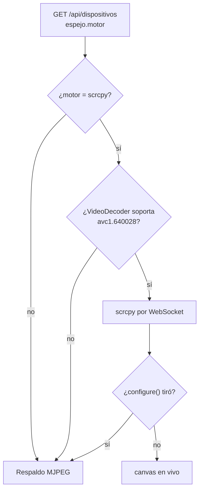
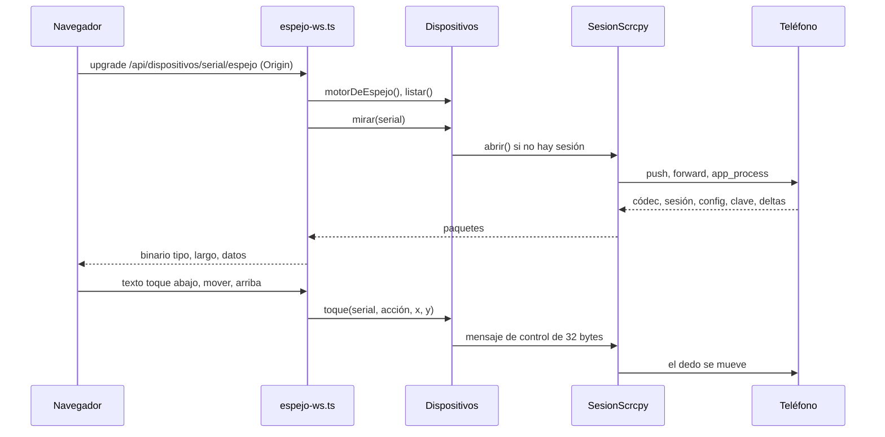

# Espejo del teléfono

> La pantalla real del teléfono, adentro del IDE: se ve fluida, se toca con el
> mouse, se arrastra, la rueda hace scroll y el teclado escribe en el campo con
> foco. Hay dos motores: **scrcpy** por un WebSocket, y **`screenrecord` → MJPEG**
> de respaldo.

Código: `apps/server/src/scrcpy.ts`, `apps/server/src/espejo-ws.ts`,
`apps/server/src/ws.ts`, `apps/server/src/dispositivos.ts` (respaldo y toques por
adb) y `apps/web/src/routes/codigo/Espejo.tsx`. Es el modo **Teléfono en vivo** de
la vista del servicio móvil (ver [[App móvil en el teléfono]]). Señalar un
elemento para el chat está en [[Inspector de React Native]].

## Por qué dos motores

El primer espejo fue `screenrecord` + ffmpeg → MJPEG: sin decodificador en el
navegador ni dependencias. No se pudo afinar hasta verse natural, por cuatro causas
medidas sobre un Galaxy S24 por Wi-Fi que se suman (`scrcpy.ts`, comentario de
cabecera; `ws.ts`):

1. **El H.264 crudo no dice dónde termina un cuadro.** adb lo entrega en pedazos de
   8 KB y adivinar el corte por silencio **partía cuadros** ("corrupt decoded
   frame").
2. **Recodificar a JPEG** limitaba a ~20 cuadros por segundo lo que el teléfono daba
   a 50.
3. **`adb shell input` arranca una JVM por evento** (~100 ms) y no sabe arrastrar: la
   pantalla recién se movía al soltar.
4. **Un toque por pedido HTTP**, pasando por el proxy de Vite, tenía picos de
   ~60 ms (p90; 1,4 ms directo): un arrastre con esos saltos no se siente natural por
   más fluido que sea el video.

`scrcpy-server` (Apache-2.0, el de `brew install scrcpy`) resuelve las tres
primeras en el teléfono: manda **cada paquete de MediaCodec con su tamaño y sus
banderas** —el cuadro llega entero o no llega—, y recibe toques (bajar, mover,
subir), rueda y texto UTF-8 por un socket de control. La cuarta la resuelve **un
solo WebSocket** que lleva el video hacia el navegador y los toques hacia el
teléfono, en orden. El navegador decodifica con **WebCodecs** y dibuja en un canvas.

Medido: de ~300 ms a ~110 ms entre el toque y el primer cuadro (comentario de
`scrcpy.ts`); en el navegador, primer cuadro 169 ms después de empezar a arrastrar
—antes, recién al soltar— y ~55 cuadros por segundo con mediana de 18 ms
(CLAUDE.md). Lo que queda es el Wi-Fi: por USB baja más.

El motor viejo sigue como **respaldo**: cuando scrcpy no está instalado o el
navegador no decodifica H.264.

## Cómo se elige el motor

- **Servidor**: `Dispositivos.motorDeEspejo()` devuelve `scrcpy` con su versión si
  `detectarScrcpy` encontró el servidor y su versión; si no, `screenrecord`. La
  detección se hace **una vez** (se memoriza la promesa): si instalás scrcpy con el
  servidor andando, reinicialo.
- **Navegador**: `useSoporteH264` pregunta
  `VideoDecoder.isConfigSupported({ codec: "avc1.640028" })`. Chrome sí; un
  Chromium sin códecs propietarios (el de Playwright) no.
- Si igual falla al configurar el decodificador, `onSinDecodificador` pasa al
  respaldo sin recargar (`Pantalla` se vuelve a montar con otra `key`).

## scrcpy

### Detección

`detectarScrcpy(env)` busca el servidor en `SCRCPY_SERVER_PATH`,
`/opt/homebrew/share/scrcpy/scrcpy-server`,
`/usr/local/share/scrcpy/scrcpy-server` y `/usr/share/scrcpy/scrcpy-server`. La
**versión** sale de `SCRCPY_VERSION` o de correr `<prefijo>/bin/scrcpy --version`
(o `scrcpy` del `PATH`), con 5 s de corte.

> [!danger] El protocolo es interno y cambia entre versiones
> El servidor de scrcpy **se niega a arrancar** si la versión que le pasa el
> cliente no es la suya. Por eso la versión se lee del `scrcpy` instalado junto al
> servidor y nunca se escribe a mano. Si no se puede leer, no hay scrcpy: se usa el
> respaldo. `scrcpy.test.ts` fija los bytes que esperan los tests del propio scrcpy
> (`app/tests/test_control_msg_serialize.c`): si una versión nueva cambia el
> formato, falla ahí y no en el teléfono de alguien.

### Abrir una sesión

`SesionScrcpy.abrir()`:

1. Un `scid` al azar (8 hex).
2. `adb push <scrcpy-server> /data/local/tmp/scrcpy-server-orq.jar` (30 s).
3. `adb forward tcp:<puerto> localabstract:scrcpy_<scid>` con un puerto entre 27183
   y 29182 (10 s). **Túnel forward**: la máquina se conecta, el teléfono escucha. No
   abre nada a la red.
4. `adb shell CLASSPATH=… app_process / com.genymobile.scrcpy.Server <versión>
   <opciones>`. Se guardan los últimos 4.000 caracteres de su salida; si termina, el
   `motivo` son sus últimas tres líneas.
5. **El socket de video**: hasta 60 intentos cada 100 ms. Con túnel forward, adb
   acepta la conexión y la corta mientras el servidor no escucha; el primer socket
   recibe un byte "dummy" cuando ya escucha. Ese socket queda **en pausa** hasta
   tener el lector: un socket que fluye sin oyentes tira lo que llega, y lo primero
   es el códec.
6. **El socket de control**. Lo que manda el teléfono por ahí (el portapapeles) se
   descarta.
7. El `LectorDeVideo` empieza a leer. Sin socket de video: "scrcpy no arrancó en el
   teléfono." con el final del registro.

| Opción | Valor | Por qué |
|---|---|---|
| `tunnel_forward` | `true` | la máquina se conecta al teléfono por adb |
| `audio` | `false` | — |
| `control` | `true` | toques, rueda, teclas y texto |
| `video_codec` | `h264` | lo que decodifica WebCodecs |
| `max_size` | 1280 | ancho de banda de Wi-Fi y nitidez de sobra para un panel |
| `max_fps` | 60 | — |
| `video_bit_rate` | 8.000.000 | — |
| `send_device_meta` | `false` | — |
| `cleanup` | `true` | restaura al cerrar lo que tocó (mantener la pantalla activa) |
| `stay_awake` | `true` | con la pantalla prendida mientras está enchufado, la depuración inalámbrica se cae menos |
| `log_level` | `warn` | — |

### El video

`LectorDeVideo.empujar` arma paquetes aunque lleguen cortados en cualquier lado:

| Bytes | Qué es |
|---|---|
| primeros 4 | el códec, `u32`: tiene que ser `0x68323634` ("h264"); si no, "Códec de video inesperado" y se cierra |
| cabecera de 12 con el bit `0x80` | paquete de **sesión**: ancho y alto (`u32` en 4 y 8). Las coordenadas de los toques van en ese sistema |
| cabecera de 12 sin `0x80` | paquete de **medios**: banderas `0x40` config (SPS/PPS) y `0x20` cuadro clave; tamaño `u32` en el offset 8; después, el paquete entero |

Hacia el navegador cada paquete viaja en un mensaje binario con
`empaquetar`: `[tipo u8][largo u32][datos]`, con tipo 0 sesión, 1 config, 2 clave,
3 delta.

### Los mensajes de control

| Mensaje | Tipo | Bytes | Contenido |
|---|---|---|---|
| tecla | 0 | 14 | acción (0 bajar, 1 subir), keycode `u32`, repetición y metastate en 0 |
| texto | 1 | 5 + n | largo `u32` y el texto UTF-8, **hasta 300 bytes** (`MAX_TEXTO`) |
| toque | 2 | 32 | acción (0 abajo, 1 arriba, 2 mover), id de puntero `u64` = −2 (`SC_POINTER_ID_GENERIC_FINGER`: un dedo, no un mouse), x e y `u32`, ancho y alto `u16`, presión `u16` (0xffff; 0 al soltar), botones en 0 |
| rueda | 3 | 21 | x e y `u32`, ancho y alto `u16`, desplazamientos h y v `i16` en punto fijo (±16 → ±1), botones en 0 |
| reiniciar video (`RESET_VIDEO`) | 17 | 1 | pide un cuadro clave ya |

Por scrcpy **llegan las tildes y las eñes**; por `adb shell input text`, no.

### Una sesión por teléfono, compartida

- `Dispositivos.espejo(serial)` devuelve la sesión viva o la que se está abriendo:
  dos espectadores que llegan juntos comparten **una** apertura (`abriendo`).
- `mirar(serial, alPaquete, alTerminar)` suscribe un espectador. Al irse el
  último, la sesión se cierra **a los 5 s**: cambiar de pestaña y volver no tiene
  que rearrancar el servidor en el teléfono.
- Al suscribirse, el recién llegado recibe el paquete de sesión (el tamaño) y, **si
  la captura ya arrancó**, se pide `RESET_VIDEO` para que reciba config y cuadro
  clave y pueda decodificar ya.

> [!danger] `RESET_VIDEO` antes de que exista la captura tira abajo el servidor
> `NullPointerException` en `Controller.resetVideo` (scrcpy 4.1). Por eso sólo se
> pide si `capturando` (ya llegó un paquete de medios): el primer espectador recibe
> la config y el cuadro clave igual, y los que llegan tarde o se atrasaron lo piden.

`cerrar()` destruye los sockets, mata el proceso y saca el `adb forward`.
`detenerCapturas()` cierra todas las sesiones al apagar el servidor.

### El WebSocket

`ws.ts` es un **WebSocket de servidor mínimo** (RFC 6455): handshake, marcos
enmascarados, largos de 7, 16 y 64 bits, fragmentación, ping/pong y cierre, sin
dependencias. Fastify no atiende upgrades: `construirApp` (`apps/server/src/app.ts`)
engancha `manejarEspejoWs` al servidor HTTP, y un upgrade que nadie reclama se
corta.

> [!warning] El `Origin` se verifica acá porque un WebSocket no pasa por CORS
> Sin esto, cualquier página abierta en el navegador podría manejar el teléfono.
> `aceptarWebSocket` contesta **403** si el pedido trae un `Origin` que no está entre
> los permitidos: el de `APP_URL`, `localhost`/`127.0.0.1` en el 5173 y en el puerto
> del servidor (`apps/server/src/index.ts`). Un pedido **sin** `Origin` (un cliente
> que no es un navegador) pasa, como en el CORS de la API.

`manejarEspejoWs` (`espejo-ws.ts`) atiende `/api/dispositivos/:serial/espejo`:

1. Si el motor no es scrcpy o el teléfono no está en `device`, manda
   `{"error": "…"}` como texto y cierra.
2. Se suscribe con `mirar` y reenvía cada paquete como binario.
3. **Contrapresión**: si el navegador no da abasto (una pestaña en segundo plano,
   una máquina cargada), los bytes pendientes de salir (`writableLength`) crecen.
   Pasado `TOPE_PENDIENTE` (1,5 MB), deja de mandar deltas y pide un cuadro clave;
   vuelve a mandar cuando llega el clave. Lo que se ve **salta al presente** en vez
   de ir cada vez más atrasado. Config y sesión siempre pasan.
4. Los mensajes de texto que llegan se validan con zod; lo que no es JSON o no
   cumple el esquema se ignora en silencio:

| Mensaje | Campos |
|---|---|
| `{ t: "toque" }` | `a`: `abajo`, `mover` o `arriba`; `x`, `y` en [0, 1] |
| `{ t: "rueda" }` | `x`, `y` en [0, 1]; `h`, `v` en [−16, 16] |
| `{ t: "tecla" }` | `k`: `atras`, `inicio`, `recientes`, `enter`, `borrar` o `menu` |
| `{ t: "texto" }` | `s`: de 1 a 300 caracteres |

Las coordenadas viajan **relativas** y el servidor las multiplica por el tamaño del
video (`Dispositivos.toque`, `rueda`): la vista se dibuja a cualquier tamaño. Un
toque sin sesión abierta tira "No hay un espejo abierto para ese teléfono." (el
WebSocket lo ignora: la sesión se está cerrando y el navegador reconecta).

### En el navegador

`useVideoScrcpy` (`Espejo.tsx`) abre `ws(s)://<host>/api/dispositivos/<serial>/espejo`
—por el proxy de Vite, que tiene `ws: true`—:

- **Config** (tipo 1): arma el códec `avc1.PPCCLL` desde el SPS (`codecDeSps`, NAL
  tipo 7) y configura un `VideoDecoder` con `optimizeForLatency` y
  `prefer-hardware`.
- **Clave** (tipo 2): la config (SPS/PPS) va **pegada adelante** del cuadro clave,
  que es como la espera WebCodecs en formato Annex B.
- **Delta** (tipo 3): sólo después de un clave (`esperandoClave`). Un error del
  decodificador vuelve a esperar un clave.
- Las marcas de tiempo son un reloj ficticio de 60 fps (+16.667 µs por paquete).
- Cada cuadro se dibuja en el canvas (que toma el tamaño del cuadro) y se cierra.
- **Sesión** (tipo 0): ancho y alto → la proporción de la vista.
- Si el WebSocket se cierra: "Se cortó la conexión con el teléfono: reconectando…",
  se vuelve a pedir la lista (el teléfono pudo volver con otro serial) y se
  reconecta **a 1 s**. Un `{"error"}` se muestra sobre la pantalla con
  "Reintentando…".

### Tocar en vivo

`Pantalla` (`Espejo.tsx`), con scrcpy:

| Gesto | Qué manda |
|---|---|
| apretar | `toque abajo` (y una marca que se desvanece en 450 ms: el teléfono tarda un momento y sin ella el clic parece perdido) |
| mover apretado | `toque mover` por cada evento: la lista se mueve mientras se arrastra |
| soltar | `toque arriba` en el último punto |
| rueda | un `rueda` por cuadro de animación: ~100 px del mouse es un paso, con tope ±16 |
| teclas imprimibles | se juntan y salen como `texto` a los 30 ms de silencio (hasta 300 caracteres) |
| Enter y Borrar | vacían el texto pendiente y mandan la `tecla` |
| Atrás, Inicio, Recientes | botones de la barra, por `POST /api/dispositivos/:serial/tecla` |

## El respaldo: `screenrecord` → MJPEG

`Dispositivos.transmitir(serial, alCuadro, alTerminar)`:

1. Lee el tamaño con `wm size` ("Override size" gana si la persona cambió la
   resolución) y achica: el lado mayor queda cerca de 1.152 px
   (`min(1, 720 / lado mayor × 1,6)`), en múltiplos de 16 para el codificador. La
   mitad alcanza para mirar y pesa un cuarto.
2. `adb exec-out screenrecord --output-format=h264 --size=<w>x<h>
   --bit-rate=6000000 --time-limit=0 -`: sin tope de tiempo, y sólo emite cuando la
   pantalla cambia (una pantalla quieta no gasta nada).
3. ffmpeg lo pasa a JPEG cuadro por cuadro:
   `-flags low_delay -threads 1 -probesize 32 -analyzeduration 0 -f h264 -i pipe:0
   -f image2pipe -vcodec mjpeg -pix_fmt yuvj420p -q:v 6 -threads 1 pipe:1`.
4. `partirJpeg` corta los JPEG completos (de `FFD8` a `FFD9`) y guarda el resto para
   el próximo pedazo.
5. Se manda **el último** cuadro, como mucho uno cada `INTERVALO_CUADRO_MS` (33 ms);
   el de cierre de una ráfaga nunca se pierde: si llega antes de tiempo, queda
   programado.

> [!danger] Tres trampas de ffmpeg que ya costaron
> - **Sin `-fflags nobuffer`**: con él, el decodificador no suelta ni un cuadro.
> - **`-pix_fmt yuvj420p`**: el H.264 del teléfono viene en rango limitado y el
>   codificador de JPEG lo rechaza.
> - **`-threads 1`**: el decodificador con hilos retiene un cuadro por hilo, y con la
>   pantalla quieta esos cuadros no salen nunca.

La vista "se pegaba" un cuadro atrás por tres retenciones que se suman: la de los
hilos, la de Chrome (abajo) y la del parser de H.264 crudo, que no sabe que un
cuadro terminó hasta que empieza el siguiente. Para esa última, cuando el teléfono
deja de mandar durante `SILENCIO_CUADRO_MS` se le escribe a ffmpeg un
**delimitador de unidad de acceso** (AUD, `00 00 00 01 09 F0`) que cierra el
cuadro. Medido: de 1 JPEG cada 9 envíos a uno por cuadro. El silencio es de
**60 ms**: con 12 ms se partían cuadros, porque por Wi-Fi un mismo cuadro llega en
pedazos de 8 KB separados por más que eso; 60 ms sólo demora el último cuadro de una
pantalla que se quedó quieta.

### El multipart

`GET /api/dispositivos/:serial/pantalla` sirve `multipart/x-mixed-replace` con
borde `cuadro`:

- **El borde va después de cada cuadro**: Chrome pinta una parte recién cuando ve el
  borde siguiente, y con la pantalla quieta el último cuadro quedaba sin pintar.
- **La captura se corta en el `close` de la respuesta**, no del pedido: el `close`
  del pedido llega apenas se leyó el GET, y con él la captura quedaba grabando.
- Antes de empezar verifica que el teléfono esté en `device` (409 si no).

En el navegador, `usePantallaEnVivo` lee el stream con **`fetch`**, no con un
``: un `` cuyo stream termina se queda con el último cuadro y no avisa
nada —la vista parecía viva y estaba congelada—. Con `fetch` se sabe cuándo llega
cada cuadro y cuándo termina el stream: dice "reconectando", vuelve a pedir la
lista y reconecta **a 1,5 s**. Cada cuadro se muestra como un `blob:` y el anterior
se libera un segundo después.

### Tocar sin scrcpy

Los toques van por **una `adb shell` abierta por teléfono** (`ShellDeTelefono`):
lanzar `adb shell` por cada uno costaba ~140 ms y así cuesta ~80 (lo demás es el
propio `input`). Los comandos van en fila; cada uno se escribe con `; echo __orq_N__`
y espera esa marca, con `CORTE_ADB_MS` (20 s) de corte ("El teléfono no contestó.").
Si la shell se murió, se abre otra.

| Gesto | Qué corre en el teléfono |
|---|---|
| clic (se movió menos de `UMBRAL_DESLIZAR`, 0,015 de la pantalla) | `input tap x y` |
| arrastrar | `input swipe x1 y1 x2 y2 ms`, con la duración real acotada a 50-2.000 ms |
| rueda | un `swipe` vertical de 250 ms, agrupado a los 120 ms, de hasta 0,6 de la pantalla |
| teclado | `input text`, agrupado a los 250 ms: **sólo ASCII**, espacios como `%s`, el resto escapado para la shell |
| Enter, Borrar, Atrás, Inicio, Recientes | `input keyevent` con `TECLAS` |

`TECLAS` (`dispositivos.ts`): atrás 4, inicio 3, recientes 187, enter 66, borrar 67,
menú 82, tab 61. Si hay una sesión de scrcpy viva, `tecla` y `escribir` van por
scrcpy aunque el pedido haya llegado por HTTP (por eso `manejar_app` escribe con
tildes sólo "con el espejo abierto", ver [[QA móvil]]).

## Constantes

| Nombre | Valor | Archivo | Por qué |
|---|---|---|---|
| `TOPE_PENDIENTE` | 1.500.000 bytes | `espejo-ws.ts` | pasado esto se saltan deltas hasta el próximo clave |
| `MAX_MENSAJE` | 1 MiB | `ws.ts` | un marco más grande del navegador cierra la conexión |
| `MAX_TEXTO` | 300 bytes | `scrcpy.ts` | tope del mensaje de texto |
| puerto del forward | 27183 + 0..1999 | `scrcpy.ts` | uno por sesión |
| espera del servidor | 60 × 100 ms | `SesionScrcpy.abrir` | hasta que llega el byte dummy |
| cierre sin espectadores | 5 s | `Dispositivos.mirar` | volver a la pestaña no rearranca scrcpy |
| `INTERVALO_CUADRO_MS` | 33 ms | `dispositivos.ts` | respaldo: como mucho ~30 cuadros por segundo |
| `SILENCIO_CUADRO_MS` | 60 ms | `dispositivos.ts` | AUD tras el silencio; con 12 ms se partían cuadros |
| bit-rate del respaldo | 6 Mbps | `transmitir` | — |
| `UMBRAL_DESLIZAR` | 0,015 | `Espejo.tsx` | toque contra deslizamiento |
| reconexión | 1 s (scrcpy), 1,5 s (MJPEG) | `Espejo.tsx` | — |
| refresco de la lista | 5 s | `Espejo.tsx` | — |

## Casos borde

| Síntoma | Causa |
|---|---|
| Se ve el espejo de respaldo aunque scrcpy está instalado | el navegador no decodifica H.264 (el Chromium de Playwright), o scrcpy se instaló con el servidor andando |
| "scrcpy no arrancó en el teléfono" en bucle | el servidor de scrcpy no levanta (versión que no coincide, teléfono ocupado); el navegador reintenta cada segundo y cada intento vuelve a subir el servidor |
| La imagen salta hacia adelante | contrapresión: el navegador se atrasó y se saltaron deltas hasta un cuadro clave |
| "Se cortó la conexión con el teléfono: reconectando…" | la depuración inalámbrica se cayó (pantalla bloqueada, Wi-Fi); vuelve sola, a veces con otro serial |
| Sin scrcpy, las tildes no llegan | `input text` sólo escribe ASCII: se avisa "esas letras se omitieron" |
| Sin scrcpy, `50%size` llega como `50 ize` | `%` no se escapa y `%s` es el espacio de `input text` |
| Cambiar la resolución del teléfono desfasa los toques del respaldo | el tamaño se guarda por serial la primera vez (`tamanoGuardado`) hasta reiniciar el servidor |

## Seguridad

- El WebSocket **verifica el `Origin`** (403): ninguna página puede manejar el teléfono.
- El video y el control viajan por `adb forward` a un socket abstracto del teléfono:
  no se abre nada a la red, y el forward se saca al cerrar.
- La API escucha en `127.0.0.1`.
- El espejo es **de la persona**: ningún agente lo usa. Un agente toca la app con
  `manejar_app`, por texto, con sus frenos ([[QA móvil]]).

## Integración

| Ruta | Qué hace |
|---|---|
| `GET /api/dispositivos` | incluye `espejo: { motor, version }` |
| WebSocket `/api/dispositivos/:serial/espejo` | video scrcpy + toques, rueda, teclas y texto |
| `GET /api/dispositivos/:serial/pantalla` | respaldo MJPEG |
| `POST /api/dispositivos/:serial/tocar`, `deslizar`, `tecla`, `texto` | toques del respaldo y botones de la barra |
| `GET /api/dispositivos/:serial/video`, `POST …/toque`, `POST …/rueda` | el paso anterior al WebSocket (video y toques por HTTP): siguen en el servidor y en `api.ts` (`urlVideo`, `toqueDispositivo`, `ruedaDispositivo`), pero **la UI ya no los usa** |

Ver [[Referencia de API de código y móvil]].

## Qué fijan los tests

- `apps/server/src/scrcpy.test.ts` — el toque como `test_serialize_inject_touch_event` (dedo genérico, presión 1.0 y 0 al soltar), la rueda como `test_serialize_inject_scroll_event`, tecla y texto UTF-8, el lector de video con el stream cortado en pedazos de 5 bytes, y el rechazo de un códec que no es h264.
- `apps/server/src/ws.test.ts` — contra el `WebSocket` de Node (el mismo cliente del navegador): texto enmascarado hacia el servidor y un binario de 70.000 bytes de vuelta (largo de 16 bits); un `Origin` ajeno recibe 403.
- `apps/server/src/dispositivos.test.ts` — `partirJpeg` corta JPEG completos y deja el resto; `escribir` escapa para la shell y avisa lo omitido.

## Fuentes

- `apps/server/src/scrcpy.ts` → `detectarScrcpy`, `SesionScrcpy`, `LectorDeVideo`, `empaquetar`, `mensajeToque`, `mensajeRueda`, `mensajeTecla`, `mensajeTexto`, `ACCION_TOQUE`, `MAX_TEXTO`
- `apps/server/src/espejo-ws.ts` → `manejarEspejoWs`, `TOPE_PENDIENTE`
- `apps/server/src/ws.ts` → `aceptarWebSocket`, `MAX_MENSAJE`
- `apps/server/src/app.ts` → `construirApp` (upgrade); `apps/server/src/index.ts` → `origenes`
- `apps/server/src/dispositivos.ts` → `motorDeEspejo`, `espejo`, `mirar`, `pedirCuadroClave`, `toque`, `rueda`, `transmitir`, `tamano`, `ShellDeTelefono`, `tocar`, `deslizar`, `tecla`, `escribir`, `TECLAS`, `partirJpeg`, `INTERVALO_CUADRO_MS`, `SILENCIO_CUADRO_MS`, `AUD`, `detenerCapturas`
- `apps/server/src/rutas-codigo.ts` → `/api/dispositivos/:serial/pantalla`, `/video`, `/toque`, `/rueda`, `/tocar`, `/deslizar`, `/tecla`, `/texto`
- `apps/web/src/routes/codigo/Espejo.tsx` → `Espejo`, `Pantalla`, `useVideoScrcpy`, `usePantallaEnVivo`, `useSoporteH264`, `codecDeSps`
- `apps/web/vite.config.ts` → proxy `/api` con `ws: true`

## Ver también

- [[Inspector de React Native]] — seleccionar un elemento en el espejo
- [[Vinculación del teléfono]] y [[Build de desarrollo y túneles]]
- [[Selector de elementos e inspector]] — lo mismo en la vista web
- [[Seguridad]]
