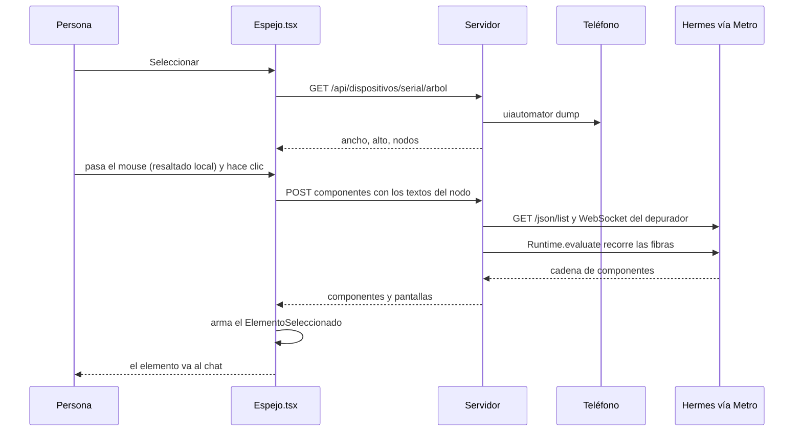

# Inspector de React Native

> Dos cosas que la app sabe y el teléfono no dice: **qué componente de React
> dibuja** lo que la persona señaló, y **qué escribió la app en su consola de
> JavaScript**. Las dos se le preguntan al depurador de Hermes que expone el Metro
> de la sesión.

Código: `apps/server/src/inspector-rn.ts` (`componentesEnPantalla`, `ConsolaJs`,
`abrirWebSocket`), `apps/server/src/dispositivos.ts` (`arbol`, `parsearArbol`) y el
modo selección de `apps/web/src/routes/codigo/Espejo.tsx`. Es la contraparte móvil
del [[Selector de elementos e inspector]] de la vista web.

## Por qué existe

- El **árbol de accesibilidad** (`uiautomator`) dice qué hay en pantalla —el texto,
  la descripción, dónde está— pero **no quién lo dibuja**. El chat necesita el
  componente y su archivo para ir derecho al código en vez de buscarlo.
- En React Native con la arquitectura nueva, en desarrollo, el `console.log` **no
  pasa por logcat** (se buscó la etiqueta `ReactNativeJS` en el teléfono y no hay
  nada) ni por la terminal de Metro: va al depurador. Sin esto, un agente que depura
  "en el celular no anda" no ve el error de JavaScript, que es casi siempre la
  causa.

## Leer la pantalla: el árbol de accesibilidad

`Dispositivos.arbol(serial)` corre
`adb exec-out uiautomator dump --compressed /dev/tty` (20 s de corte), corta el XML
en el último `</hierarchy>` y lo aplana con `parsearArbol(xml, ancho, alto)`. Es el
DOM de una app nativa, y tarda un par de segundos (~3 s; ~4 s medido en el S24
desde `manejar_app`): por eso el espejo lo lee **una vez** al entrar en modo
selección y el resaltado se calcula en el navegador.

`parsearArbol` se queda sólo con los nodos que **identifican algo** —texto,
descripción de accesibilidad (`content-desc`), `resource-id` (el `testID`) o
`clickable`— y con área positiva: los contenedores de maquetación no le dicen nada
a nadie. Los íconos de fuente llegan como un carácter de uso privado
(`U+E000–U+F8FF`) y no cuentan como texto.

### `NodoDePantalla`

| Campo | Qué es |
|---|---|
| `id` | posición en el árbol: clave estable mientras no se vuelva a leer |
| `padre` | el ancestro **visible** más cercano (los contenedores descartados no cortan la cadena) |
| `clase` | la última parte de la clase de Android (`TextView`, `EditText`, `ViewGroup`) |
| `texto` | el texto visible (sin íconos de fuente) |
| `descripcion` | la etiqueta de accesibilidad |
| `recurso` | el `resource-id` sin el prefijo `paquete:id/` (el `testID`) |
| `pulsable` | `clickable="true"` |
| `x`, `y`, `ancho`, `alto` | en **fracciones** de la pantalla (0..1): se dibuja a cualquier tamaño |

El mismo árbol es el que usa [[QA móvil]] para ubicar lo que nombra un agente.

## Seleccionar un elemento en el teléfono

1. **Seleccionar** (o Esc para cancelar) lee el árbol. Mientras el mouse se mueve,
   `nodoEn` elige el nodo **más chico** que contiene el punto —es el que la persona
   está mirando— y lo recuadra con su clase y su texto.
2. Al hacer clic, `elegir` junta los textos del nodo y de hasta 40 descendientes
   (texto, descripción, recurso) y pregunta por los componentes. Si falla, sigue
   sin ellos.
3. Arma el mismo `ElementoSeleccionado` que la vista web
   (`apps/web/src/routes/codigo/elemento.ts`), así que la búsqueda de archivos
   candidatos del chat es la misma:

| Campo | En el teléfono |
|---|---|
| `etiqueta` | la clase del nodo |
| `selector` | `Clase[accessibilityLabel="…"]` o `Clase[texto="…"]` |
| `texto` | los textos juntos, hasta 400 caracteres |
| `html` | el nodo y sus hijos como XML de inspector de Android, hasta ~40 líneas, con `bounds` en píxeles |
| `componentes` | la cadena limpia de React |
| `atributos` | `accessibilityLabel`, `testID`, `pulsable` |
| `ruta` | `pantalla ./login.tsx (app nativa)` si expo-router la nombró; si no, `(app nativa)` |
| `tamano` | ancho × alto en píxeles |

Ver [[Chat de IA]] para qué hace el chat con eso.

## Preguntarle a la app: `componentesEnPantalla`

`componentesEnPantalla(metro, buscados)`:

1. Limpia los buscados: sin repetidos ni vacíos, hasta 300 caracteres cada uno, **12
   como mucho**.
2. `GET http://127.0.0.1:<metro>/json/list` y toma la primera página con
   `webSocketDebuggerUrl` (el depurador de Hermes).
3. Abre ese WebSocket **con `Origin: http://127.0.0.1:<metro>`** y manda un
   `Runtime.evaluate` con `returnByValue`.
4. La expresión —JavaScript autocontenido que corre adentro de la app— usa
   `__REACT_DEVTOOLS_GLOBAL_HOOK__`: por cada raíz de fibras, recorre (hasta 300.000
   vueltas) buscando una fibra cuyas props coincidan con algún buscado:
   `children` (texto o lista de textos y números), `placeholder`,
   `accessibilityLabel`, `aria-label`, `testID`, `nativeID`, `value` o `title`. De
   la primera que coincide sube por `return` juntando nombres de componentes (hasta
   40, sin repetir).
5. `limpiarCadena` deja los componentes propios y las pantallas.

`metro` es el **puerto interno** del servicio móvil
(`ServiciosVivos.puertosParaDispositivo`): el Metro de verdad, detrás del proxy.

> [!warning] Metro rechaza un WebSocket sin `Origin` local
> Y el `WebSocket` nativo de Node no deja ponerlo. Por eso `abrirWebSocket` es un
> cliente mínimo sobre `http.request` (upgrade, marcos enmascarados, largos de 7,
> 16 y 64 bits, fragmentación de texto), con 8 s de corte.

### `limpiarCadena`

| Entra | Sale |
|---|---|
| `LoginScreen(./login.tsx)` | componente `LoginScreen` y pantalla `./login.tsx` |
| `Route(login)`, `Text`, `View`, `Pressable`, `ScrollView`… | afuera (`INTERNOS`) |
| nombres que empiezan con `Animated`, `Reanimated`, `RN`, `Expo`, `Native`, `Safe`, `Gesture`, `Screen` | afuera |
| nombres que terminan en `Provider` o `Context` | afuera |

El orden va del más cercano al más lejano.

**Todo es de mejor esfuerzo**: sin depurador (una build de release, el depurador
abierto por otro lado) o sin el servicio levantado, el elemento igual va al chat con
lo que dijo la accesibilidad. El endpoint nunca falla: devuelve listas vacías con
un `aviso` ("El servicio no está levantado.", "La app no dibuja ese texto con
React." o el error).

## La consola de JavaScript: `ConsolaJs`

Una por puerto de Metro (`consolaJs(metro)`, un mapa del módulo):

- `leer()` devuelve lo capturado **y la mantiene viva**: anota la hora de consulta y
  se asegura de estar conectada.
- Al conectar: `/json/list`, WebSocket del depurador con el `Origin` local, y
  `Runtime.enable`.
- Guarda `Runtime.consoleAPICalled` (nivel = `log`, `warn`, `error`…; los
  argumentos unidos; en `warn` y `error`, "(en <función>)" del primer marco) y
  `Runtime.exceptionThrown` (nivel `excepcion`, con la descripción y su stack).
- **Hasta 1.000 entradas**, cada una de hasta 8.000 caracteres.
- Si la conexión se cae (la app se reinició y cambió la página del depurador),
  reintenta **cada 5 s** mientras alguien la haya consultado en los **últimos 10
  minutos**; después deja de intentar. El `estado` (`conectada` o `desconectada`) es
  lo que usa `logs_del_telefono` para decir si se está conectando.

La consumen `logs_del_telefono` y la pestaña Logs del panel (ver
[[Depuración de la app móvil]]).

## Constantes

| Nombre | Valor | Archivo | Por qué |
|---|---|---|---|
| `CORTE_MS` | 8 s | `inspector-rn.ts` | un depurador que no contesta no cuelga la selección |
| buscados | 12, de hasta 300 caracteres | `componentesEnPantalla` | — |
| vueltas por raíz | 300.000 | la expresión | tope para una app enorme |
| cadena | 40 nombres | la expresión | — |
| `MAX_ENTRADAS` | 1.000 | `inspector-rn.ts` | la consola no crece sin fin |
| texto por entrada | 8.000 caracteres | `ConsolaJs.guardar` | — |
| reintento | 5 s, mientras hubo consultas en 10 min | `ConsolaJs.reintentar` | deja de intentar cuando nadie mira |
| corte de `uiautomator dump` | 20 s | `Dispositivos.arbol` | — |

## Casos borde

| Síntoma | Causa |
|---|---|
| El elemento llega sin componentes | build de release, depurador tomado por otro cliente, o el texto no lo dibuja React |
| "sin-hook" | la app no expone `__REACT_DEVTOOLS_GLOBAL_HOOK__` (no es desarrollo) |
| "No se pudo leer la pantalla" | `uiautomator dump` falló (otra captura en curso, teléfono bloqueado) |
| La consola dice "conectando" y nunca conecta | la app no está conectada al Metro: `reiniciar_app` o "Abrir la app" |
| Después de 10 min sin mirar los logs, faltan mensajes | la consola dejó de reconectar; se reengancha en la próxima lectura |

## Integración

| Qué | Dónde |
|---|---|
| `GET /api/dispositivos/:serial/arbol` | el árbol aplanado |
| `POST /api/repos/:repoId/servicios/:servicioId/dispositivo/componentes` (`{ buscados }`, hasta 20) | `{ componentes, pantallas, aviso? }` |
| `logs_del_telefono`, panel Logs | leen `ConsolaJs` |

## Qué fijan los tests

- `apps/server/src/dispositivos.test.ts` — "aplana el árbol de accesibilidad: sin contenedores ni íconos de fuente, con padres y fracciones"; "de la cadena de fibras quedan los componentes propios y la pantalla de expo-router".
- `apps/server/src/depuracion-movil.test.ts` — "guarda console.* y las excepciones con su stack" (y que un mensaje que no es JSON se ignora).

## Fuentes

- `apps/server/src/inspector-rn.ts` → `abrirWebSocket`, `componentesEnPantalla`, `limpiarCadena`, `INTERNOS`, `ConsolaJs`, `consolaJs`, `CORTE_MS`, `MAX_ENTRADAS`
- `apps/server/src/dispositivos.ts` → `Dispositivos.arbol`, `parsearArbol`, `NodoDePantalla`
- `apps/server/src/rutas-codigo.ts` → `/api/dispositivos/:serial/arbol`, `…/dispositivo/componentes`
- `apps/web/src/routes/codigo/Espejo.tsx` → `Pantalla` (`activarSeleccion`, `nodoEn`, `elegir`), `descendientes`, `comoXml`

## Ver también

- [[Espejo del teléfono]]
- [[Selector de elementos e inspector]] — la versión web
- [[Depuración de la app móvil]]
- [[QA móvil]]
