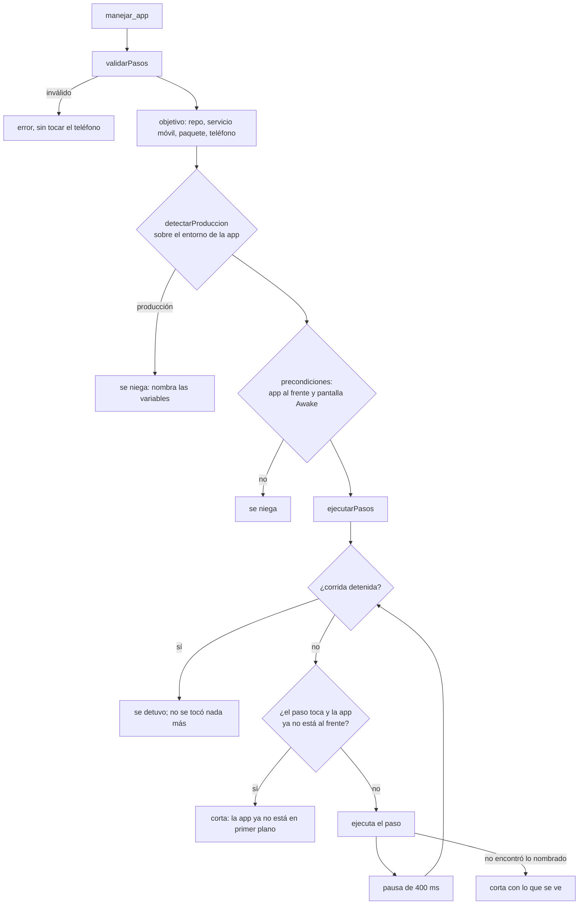

# QA móvil

> Un agente maneja la app del repo en el teléfono como lo haría una persona:
> **nombra lo que toca** —nunca coordenadas—, el servidor lo ubica en la pantalla de
> ese momento, y todo corre **sólo sobre staging** y **sólo adentro de la app**.

Código: `packages/tools/src/codigo/telefono.ts` (`explorar_telefono`,
`manejar_app`), `packages/tools/src/codigo/pasos-app.ts` (`validarPasos`),
`apps/server/src/qa-movil.ts` (las reglas puras), `apps/server/src/depuracion-movil.ts`
(`explorar`, `actuar`) y el rol `QA_MOVIL` (`packages/shared/src/plantillas.ts`). El
caso completo está en [[CU-07 Barrido de QA en el teléfono]].

## Por qué por texto

Un toque en (540, 1200) no dice qué se quiso tocar. Cuando la pantalla se corre
—el banner de «Sin conexión» baja todo ~130 px, aparece el teclado— el mismo número
cae en otro botón o, peor, **afuera de la app**. Por eso el agente nombra lo que toca
(su texto, su descripción de accesibilidad o su `testID`) y el servidor lo busca en
el [[Inspector de React Native|árbol de accesibilidad]] leído en ese momento. Si no
está, el paso se corta ahí y devuelve lo que sí se ve, sin seguir tocando a ciegas
(`pasos-app.ts`, comentario de cabecera).

## Las dos herramientas

| Herramienta | `readOnly` | Parámetros | Qué devuelve |
|---|---|---|---|
| `explorar_telefono` | sí | `buscar` (hasta 10 textos de hasta 120 caracteres), `repo` | la pantalla en texto: cada elemento con su texto o descripción, "(tocable)", `#testID`, de arriba abajo; y si cada buscado está visible |
| `manejar_app` | no | `pasos` (hasta 20), `repo` | "Hecho:" con la bitácora, "Se detuvo en:" si algo falló, y la pantalla final o al detenerse |

Se registran junto a las de depuración, sólo si hay adb. Un paso que falla a mitad
de camino vuelve como **error para el agente** (`fail`) pero con lo que se alcanzó a
hacer y lo que se ve; `ok: false` del storage es que no se pudo ni empezar
(producción, app cerrada, pantalla apagada).

## Los pasos

`validarPasos` (`pasos-app.ts`) valida **antes** de llegar al teléfono y completa
los valores por defecto:

| Paso | Campos | Límites |
|---|---|---|
| `tocar_texto` | `texto`, `n` (la aparición, 1 = la primera de arriba abajo), `exacto` | texto de 1 a 120; `n` 1-20 (default 1); `exacto` default `false` |
| `esperar_texto` | `texto`, `segundos`, `exacto` | 1-30 s (default 10): hasta que aparezca **y quede quieto** |
| `escribir` | `texto` | hasta 500 caracteres, **sin saltos de línea** (un enter se pide como tecla) |
| `tecla` | `tecla` | `atras`, `enter`, `tab`, `borrar` |
| `deslizar` | `direccion` | `arriba`, `abajo`, `izquierda`, `derecha` |
| `esperar` | `segundos` | 1-10 (default 1) |

Una acción desconocida —por ejemplo `{accion: "tocar", x, y}`— se rechaza con "no hay
toques por coordenadas: nombrá lo que querés tocar con tocar_texto". Más de 20 pasos:
"partilo en tramos y verificá entre uno y otro". Los números fuera de rango se
**acotan**, no se rechazan. El texto a escribir va literal: se escapa al ejecutarlo.

## Cómo se ejecutan

`ejecutarPasos(pasos, puertos)` (`qa-movil.ts`) recibe el teléfono como
`PuertosDeApp`, que `actuar` conecta a `Dispositivos`:

| Puerto | Qué es |
|---|---|
| `enFrente()` | ¿la app del repo es la actividad en primer plano? (`dumpsys activity activities`) |
| `arbol()` | el árbol de accesibilidad de ahora |
| `tocar`, `escribir`, `tecla`, `deslizar` | los de `Dispositivos` (ver [[Espejo del teléfono]]) |
| `dormir(ms)` | la espera, que **se corta si la corrida se detiene** |
| `ahora()` | el reloj: las esperas se cuentan con él, no en vueltas |
| `cancelada()` | si la corrida que pidió los pasos ya se detuvo |

Por paso:

- **`tocar_texto`**: lee el árbol y `ubicarNodo`; si no está, espera 800 ms (una
  transición a medias) y relee. Toca **el centro** del nodo. Si no está: "no está en
  pantalla" o "hay N y pediste la n", más hasta 25 etiquetas de lo que se ve.
- **`esperar_texto`**: lee cada 700 ms (`INTERVALO_ESPERA_MS`) hasta el límite
  **contado con el reloj**; pasa cuando el texto está en dos lecturas seguidas **en el
  mismo lugar** (diferencia vertical < 0,005): ya no se está moviendo.
- **`escribir`**, **`tecla`**, **`deslizar`**: `deslizar` usa vectores fijos de 350 ms
  (`abajo` = el dedo de 0,7 a 0,3: **ver lo que está más abajo**).
- Entre paso y paso, `PAUSA_ENTRE_PASOS_MS` (400 ms). Al final, se relee y se resume
  la pantalla.

> [!danger] Las esperas se cuentan con el reloj, no en vueltas
> Medido en el S24: cada lectura del árbol tarda ~4 s. Contada en vueltas de 700 ms,
> «esperar 5 s» tardaba **28 s**; con el reloj, 6,8 s. Por eso `PuertosDeApp` tiene
> `ahora()` y el test lo fija con un árbol que tarda 4 s por lectura.

### Ubicar lo nombrado

`ubicarNodo(nodos, { texto, n, exacto })`:

- Compara contra **texto, descripción y `testID`**, normalizados: sin tildes (NFD),
  en minúsculas y con espacios colapsados. Con `exacto`, igualdad; si no, "contiene":
  `exacto` evita que «Fotos» toque «Fotos del proyecto».
- Sólo nodos con área y con el centro en la **zona útil** (`ZONA_UTIL`: entre 0,03 y
  0,94 de la altura). Arriba está la barra de estado y abajo la de navegación del
  sistema: **nunca se tocan**.
- Ordena en orden de lectura (arriba abajo, izquierda derecha) y toma la aparición
  `n`. Si no hay, devuelve cuántas hay: así el agente no insiste a ciegas.

### Resumir la pantalla

`resumirPantalla(nodos, { buscar })` es lo que el agente lee en vez de una imagen:
primero "Buscado «X»: visible (N)" o "no está en pantalla" por cada buscado; después
"En pantalla (N elementos, de arriba abajo):" y una línea por elemento
(`- «Guardar» (tocable) #btn-guardar`), sin repetidos, sin la franja del sistema, y
con tope de `TOPE_RESUMEN` (4.000 caracteres): lo que no entra se cuenta ("…y N
elementos más: deslizá o buscá uno puntual").

## Sólo staging

> [!warning] Con la app apuntando a producción, `manejar_app` se niega
> Cada toque puede crear datos reales. `actuar` lo verifica **antes** de mirar el
> teléfono.

`detectarProduccion(variables, marcadores)`:

- **Las variables** son las del entorno de la app: sus archivos `.env`
  (`servicio.archivosEntorno`) y encima `servicio.entorno` —lo mismo con que corre
  el Metro—. Se leen en el momento y nunca salen del servidor.
- Es producción si **un valor contiene un marcador** (sin distinguir mayúsculas) o si
  una variable que declara el entorno (`ENV`, `APP_ENV`, `NODE_ENV`,
  `EXPO_PUBLIC_ENV`, `ENVIRONMENT`…) vale `prod` o `production`.
- Los **marcadores** son los `marcadoresProduccion` del servicio móvil (la ref del
  proyecto de producción, su dominio). Se editan en la configuración del servicio
  —sólo en los de tipo móvil—, entre 5 y 200 caracteres y hasta 20; un marcador de
  menos de 5 caracteres no cuenta (casaría con cualquier cosa). Ver
  [[Configuración de repos y servicios]].
- El motivo **nombra las variables, nunca sus valores**: "La app apunta a producción
  (EXPO_PUBLIC_SUPABASE_URL): un agente no la maneja…".

`explorar_telefono` **sí** funciona sobre producción: sólo mira. El mismo
`detectarProduccion` protege [[Almacenamiento R2]].

## Sólo adentro de la app

- Antes de empezar (`explorar` y `actuar`): la app del repo al frente y
  `mWakefulness=Awake`. Si no: "La app del repo no está en primer plano…
  Abrila con reiniciar_app" o "La pantalla del teléfono está apagada. Que una persona
  lo desbloquee."
- **Antes de cada paso que toca** (`tocar_texto`, `escribir`, `tecla`, `deslizar`)
  vuelve a mirar: si la app ya no está al frente, lo que hay debajo del dedo es de la
  persona y se corta ahí.

> [!warning] Lo que se lee al cortar no pasa por ese control (deducido del código)
> `esperar_texto` y la relectura final no comprueban que la app siga al frente, y al
> cortar por "ya no está en primer plano" `cortar` relee el árbol **de lo que esté en
> pantalla** para devolverlo como "Pantalla al detenerse". Si un paso sacó al usuario
> de la app (una hoja de compartir, otra app), el resumen puede traer texto de otra
> app. Los tests fijan que no se **toca** nada más, no qué se **lee**. Si se corrige,
> el lugar es `ejecutarPasos`.

## Al detener la corrida, no se toca nada más

Si la persona detiene el pedido (el botón **Detener** del chat), la secuencia no
sigue tocando el teléfono con el chat ya cerrado: el turno había terminado y el
agente no iba a leer nunca lo que pasaba.

- `Orchestrator.stop` aborta su `AbortController`; esa señal llega como
  `ToolContext.signal` a la herramienta (`packages/engine/src/loop.ts`, también en
  los turnos delegados a un CLI, que ejecutan con el mismo contexto: ver
  [[Turnos delegados a un CLI]]).
- `manejar_app` la pasa a `actuar`, que arma `cancelada = () => signal.aborted` y un
  `dormir` que compite con el `abort`: una espera larga se corta al instante.
- `ejecutarPasos` mira `cancelada()` **antes de cada paso** y en cada vuelta de
  `esperar_texto`; si se detuvo, devuelve "la corrida se detuvo; no se tocó nada más"
  **sin releer la pantalla**.
- Pausar no aborta: el turno en vuelo termina (ver
  [[Scheduler y ciclo de una corrida]]).

Un pedido del chat que el agente ya respondió **termina la corrida** si no quedan
aprobaciones ni preguntas abiertas: antes, un aviso del sistema que llegaba con el
turno en vuelo lo volvía a convocar y el agente —sin memoria del turno anterior—
rehacía el pedido entero (medido: un agente que sacó otras diez fotos con el chat ya
respondido). Fijado en `packages/engine/src/scheduler.test.ts`.

## El rol QA móvil

`QA_MOVIL` (`packages/shared/src/plantillas.ts`) es un agente del chat del IDE, como
el Mejorador de código, pero **no edita código: informa**.

- **Se crea desde el chat** con el botón **QA móvil**, que aparece si el repo tiene un
  servicio móvil y la empresa todavía no tiene un rol con ese nombre
  (`POST /api/companies/:companyId/qa-movil` → `Runtime.crearQaMovil`). Es **uno por
  empresa**: crearlo otra vez devuelve el mismo.
- `crearAgenteDelChat`: departamento **Calidad** (se crea si no existe), autoridad
  `executor`, `maxTurns: 30`, `claude-code/opus` si está `claude-code` (si no, el
  proveedor preferido en tier `smart`).
- **Herramientas** (22): las de lectura de código (`listar_repositorios`,
  `mapa_del_codigo`, `buscar_codigo`, `buscar_archivos`, `leer_codigo`, `estado_git`),
  `ejecutar_comando`, `solicitar_comando`, `servicios`, `probar_servicio`, **las diez
  del teléfono** y `r2_listar`, `r2_objetos`. Ninguna que escriba código: **nunca toma
  el arriendo del repo**, así que puede probar mientras el Mejorador corrige (ver
  [[Arriendo de escritura y resumen de código]]).
- `startRun` lo **pone al día** antes de cada pedido: si aparecieron herramientas
  nuevas (por ejemplo, adb se instaló después), se le suman.
- Aparece en el selector de agentes del chat (el chat lista los roles con
  `editar_codigo` o `manejar_app`), con el placeholder "¿Qué funcionalidad querés que
  pruebe en el teléfono?".

El prompt (en inglés, con la salida en castellano) le pide:

1. **Cargar primero el skill de QA del repo** (`SKILL.md` en `.claude/skills` o
   `.agents/skills`; en INSPIA, `mobile-emulator-qa`) y sus notas de QA: ahí está el
   conocimiento del dominio (cuentas de prueba, rutas, bugs conocidos). El skill se
   escribió para un emulador con Bash; se conserva el conocimiento y se **traducen las
   mecánicas**: `adb input` → `manejar_app`; `screencap` → `captura_del_telefono`
   (y mirarla); `force-stop` + `monkey` → `reiniciar_app`; `curl` → `probar_servicio`;
   subidas → `r2_objetos`. Cortar el Wi-Fi **no se puede** (el teléfono está conectado
   por depuración inalámbrica) y subir imágenes a la galería tampoco: esos casos se
   marcan como no validados.
2. **Armar la matriz de casos desde el código**, antes de tocar el teléfono.
3. **Precondiciones** con `estado_de_la_app`.
4. Por caso: explorar → manejar (tramos cortos, `esperar_texto` después de navegar o
   guardar) → verificar en pantalla, logs, base local, servidor y bucket. Un caso pasa
   sólo si la UI **y** la fuente de verdad coinciden.
5. **Reglas**: sólo staging (nunca rodear la negativa), prefijo `QA-ORQ` en los datos
   que crea, no borrar lo ajeno, `limpiar_datos_de_la_app` sólo con motivo, reproducir
   una falla dos veces antes de reportarla y señalar el código probable.
6. **Informe**: Matriz (✅/❌/⚠️), Hallazgos, Datos de prueba y Pendiente.

En la plantilla `desarrollo-software`, el QA (Irene) y el programador (Tomás) tienen
también `explorar_telefono` y `manejar_app`, y el prompt del QA trae un protocolo de QA
móvil propio (ver [[Referencia de plantillas de equipo]]).

## Constantes

| Nombre | Valor | Archivo | Por qué |
|---|---|---|---|
| `MAX_PASOS` | 20 | `pasos-app.ts` | partir en tramos y verificar entre uno y otro |
| texto buscado | 120 caracteres | `pasos-app.ts` | — |
| texto escrito | 500 caracteres | `pasos-app.ts` | un agente no escribe una novela en el teléfono de alguien |
| `esperar_texto` | 1-30 s, default 10 | `pasos-app.ts` | ninguna espera sin tope |
| `esperar` | 1-10 s, default 1 | `pasos-app.ts` | — |
| `n` | 1-20 | `pasos-app.ts` | — |
| `ZONA_UTIL` | 0,03 a 0,94 de la altura | `qa-movil.ts` | fuera quedan las barras del sistema |
| `TOPE_RESUMEN` | 4.000 caracteres | `qa-movil.ts` | una lista larga no llena el contexto del agente |
| `PAUSA_ENTRE_PASOS_MS` | 400 ms | `qa-movil.ts` | la app alcanza a reaccionar |
| `INTERVALO_ESPERA_MS` | 700 ms | `qa-movil.ts` | entre lecturas de `esperar_texto` |
| reintento de `tocar_texto` | 800 ms, una vez | `ejecutarPasos` | una transición a medias |
| quieto | < 0,005 de diferencia vertical | `ejecutarPasos` | dos lecturas en el mismo lugar |
| deslizar | 350 ms | `ejecutarPasos` | — |

## Trampas para quien prueba

| Síntoma | Causa |
|---|---|
| Un toque cae en otro lado después de quedarse sin red | el banner de «Sin conexión» corre la pantalla: por eso se toca por texto |
| `tecla: atras` sacó de la pantalla | `atras` **navega** hacia atrás, no sólo cierra el teclado; para pasar de campo, `tab` |
| Faltan tildes en lo escrito | sin el espejo abierto, adb sólo escribe ASCII; la bitácora lo avisa ("se omitieron caracteres no ASCII") |
| Con el espejo abierto, un texto largo quedó cortado y la bitácora habla de "no ASCII" | por scrcpy el texto se corta a 300 bytes (`MAX_TEXTO`) y se reporta con el mismo aviso |
| "hay 3 y pediste la 5" | `n` fuera de lo que hay en la zona útil; mirá con `explorar_telefono` |
| `esperar_texto` falla aunque el texto aparece | se sigue moviendo (una animación, una lista que carga): subí `segundos` |
| "La app apunta a producción" | un marcador o una variable de entorno de producción en el entorno de la app: pasala a staging |

## Qué fijan los tests

- `apps/server/src/qa-movil.test.ts` — ubicar por texto o descripción sin tildes ni mayúsculas; `exacto` y `n` en orden de lectura; la barra del sistema no cuenta; si no está, dice cuántas hay; el resumen en orden, con lo tocable, lo buscado y tope; producción por marcador sin devolver el valor, por variable declarada, y marcadores cortos que no cuentan; tocar en el centro y terminar con la pantalla; detenerse si no encuentra; detenerse si la app deja el frente; **no tocar más si la corrida se detuvo**; `esperar_texto` quieto, con tiempo acotado y **contado con el reloj** aunque leer tarde 4 s; aviso de tildes omitidas; `deslizar abajo` sube el dedo.
- `apps/server/src/qa-movil-storage.test.ts` — sobre staging toca; sobre producción se niega **sin leer el árbol ni tocar**; explorar producción sí; con otra app al frente o la pantalla apagada no mira ni toca.
- `packages/tools/src/codigo/telefono.test.ts` — las dos herramientas registradas, `explorar_telefono` limpia y acota `buscar`, `manejar_app` no llega al teléfono con pasos inválidos, devuelve bitácora y pantalla, y un paso fallido es error con lo hecho.
- `packages/tools/src/codigo/pasos-app.test.ts` — valores por defecto, sin coordenadas, rechazos, topes y texto literal sin saltos de línea.
- `apps/server/src/roles-vivos.test.ts` → `crearQaMovil` — sin herramientas que escriben código, `executor`, departamento Calidad, uno por empresa.

## Fuentes

- `packages/tools/src/codigo/telefono.ts` → `explorar_telefono`, `manejar_app`, `TelefonoStorage.explorar`, `TelefonoStorage.actuar`
- `packages/tools/src/codigo/pasos-app.ts` → `validarPasos`, `PasoDeApp`, `MAX_PASOS`
- `apps/server/src/qa-movil.ts` → `ubicarNodo`, `resumirPantalla`, `detectarProduccion`, `ejecutarPasos`, `PuertosDeApp`, `ZONA_UTIL`, `TOPE_RESUMEN`, `PAUSA_ENTRE_PASOS_MS`, `INTERVALO_ESPERA_MS`
- `apps/server/src/depuracion-movil.ts` → `precondiciones`, `entornoDe`, `explorar`, `actuar`
- `apps/server/src/runtime.ts` → `crearQaMovil`, `crearAgenteDelChat`, `startRun`
- `apps/server/src/rutas-codigo.ts` → `/api/companies/:companyId/qa-movil`
- `packages/shared/src/plantillas.ts` → `QA_MOVIL`; `packages/shared/src/schema.ts` → `servicioSchema.marcadoresProduccion`
- `packages/engine/src/scheduler.ts` → `Orchestrator.stop`, cierre del pedido respondido
- `apps/web/src/routes/codigo/Chat.tsx` → botón QA móvil; `Servicios.tsx` → marcadores de producción

## Ver también

- [[CU-07 Barrido de QA en el teléfono]]
- [[Depuración de la app móvil]]
- [[Almacenamiento R2]]
- [[Chat de IA]]
- [[App móvil en el teléfono]]
