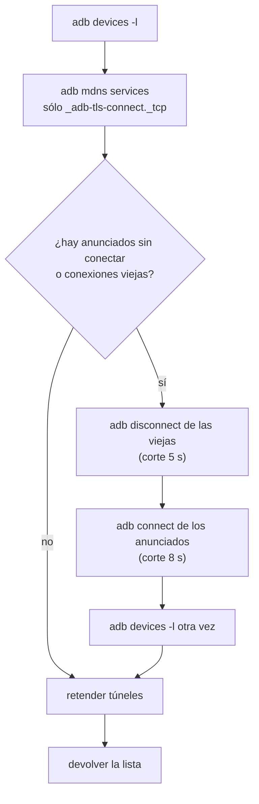
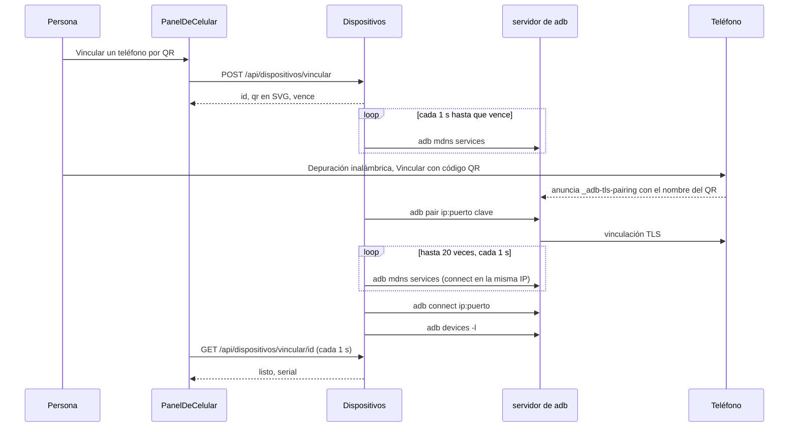
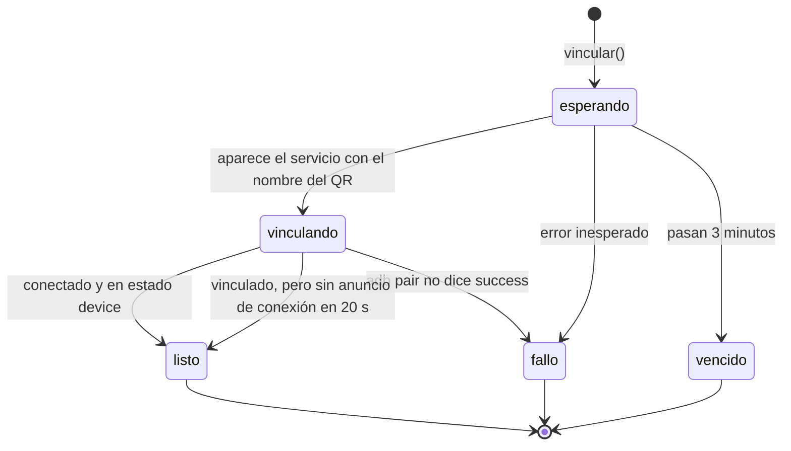

# Vinculación del teléfono

> El teléfono se vincula con el **QR de la depuración inalámbrica de Android**
> —el mismo de Android Studio—, no con el de Expo Go. Después, cada vez que se
> pide la lista, se reconecta solo lo que ya estaba vinculado.

Código: `apps/server/src/dispositivos.ts` (clase `Dispositivos`), panel
`apps/web/src/routes/codigo/Celular.tsx` (`PanelDeCelular`). Es el primer paso del
recorrido de [[App móvil en el teléfono]].

## Por qué así

- **El QR de Android, no el de Expo Go.** Expo Go no trae los módulos nativos de la
  app y muere al abrir la primera pantalla que los usa. El QR de depuración
  inalámbrica (`WIFI:T:ADB;S:<nombre>;P:<clave>;;`) vincula el teléfono con `adb`
  y sirve para cualquier app (`dispositivos.ts`, comentario de cabecera).
- **El nombre del QR identifica al teléfono.** Al escanear, el teléfono anuncia
  por mDNS un servicio de vinculación **con el nombre que vino en el QR**: así se
  sabe que es el nuestro y no otro teléfono vinculándose en la misma red
  (`esperarTelefono`).
- **adb no reconecta solo.** El puerto de la depuración inalámbrica cambia cada vez
  que se prende. Por eso `listar` conecta lo que ve anunciado, en cada consulta.

## Encontrar adb

`detectarAdb(env)` prueba, en orden, y se queda con el primero que existe:

1. `$ANDROID_HOME/platform-tools/adb`
2. `$ANDROID_SDK_ROOT/platform-tools/adb`
3. `~/Library/Android/sdk/platform-tools/adb` (Android Studio en macOS)
4. `~/Android/Sdk/platform-tools/adb`
5. cada carpeta del `PATH`

Se llama **una vez**, como valor por defecto del constructor de `Dispositivos`
(el `Runtime` lo construye al arrancar). `Dispositivos.disponible` es `adb != null`.
Sin adb:

- `listar()` devuelve `[]` y `GET /api/dispositivos` contesta `disponible: false`;
  el panel dice "No encontré `adb`. Instalá Android Studio (o las platform-tools)".
- `vincular()` tira "No se encontró adb: instalá Android Studio (o las
  platform-tools) para usar un celular." (409 por HTTP).
- Las herramientas del teléfono no se registran ([[Depuración de la app móvil]]).

Cada comando de adb pasa por `Correr` (`correrReal`: `execFile` con corte de
`CORTE_ADB_MS` y 8 MiB de salida máxima). La función se inyecta en el
constructor: los tests usan un adb falso que contesta como el de verdad.

## Listar los teléfonos

`Dispositivos.listar()` es la consulta que usa todo lo demás (el panel cada 5 s,
cada herramienta del teléfono, el espejo, la vigilancia de túneles):



- **Anunciados sin conectar** (`nuevos`): servicios `_adb-tls-connect._tcp` cuya
  dirección no está entre los `device` y cuyo nombre mDNS no es el prefijo de
  ningún serial conectado.
- **Conexiones viejas** (`viejas`): entradas inalámbricas que no están en `device`
  y cuya IP aparece anunciada **en otro puerto**. Se sueltan con `adb disconnect`:
  si no, quedan en la lista y confunden a quien elige.
- **Sólo se conecta lo ya vinculado**: a un teléfono sin vincular, adb le contesta
  que no. Un teléfono ajeno en la misma red con la depuración inalámbrica prendida
  recibe igual el intento de `connect` en cada consulta; falla sin consecuencias.
- **Retender**: después de listar, los teléfonos con una app abierta desde acá
  recuperan sus túneles si la conexión cambió. Ver [[Build de desarrollo y túneles]].

### `Dispositivo`

`parsearDispositivos` lee `adb devices -l`:

| Campo | Qué es |
|---|---|
| `serial` | `IP:puerto` si es inalámbrico, el serial USB, o el nombre mDNS (`…._adb-tls-connect._tcp`) |
| `estado` | `device` (listo), `unauthorized` (falta aceptar el aviso en el teléfono), `offline`, `authorizing`, `no permissions` |
| `modelo` | el `model:` de adb con `_` pasados a espacios (`SM S921B`), o `null` |
| `inalambrico` | serial con `:puerto` o con `._adb-tls-connect.` |
| `transporte` | el `transport_id`: cambia en **cada** reconexión aunque el serial sea el mismo; es la identidad de la conexión |

`parsearMdns` lee `adb mdns services` (`nombre`, `tipo`, `ip:puerto`), se queda
sólo con los tipos que empiezan con `_adb` y les saca el punto final
(`_adb-tls-pairing._tcp.` → `_adb-tls-pairing._tcp`).

## Vincular por QR



Paso a paso (`Dispositivos.vincular` y `esperarTelefono`):

1. **El QR.** Un id `vin_<12 hex>`, un nombre `orq-<8 hex>` y una clave de 9
   dígitos (`randomInt(100_000_000, 999_999_999)`). `textoDeVinculo` arma
   `WIFI:T:ADB;S:orq-…;P:…;;` y `qrSvg` lo dibuja con `qrcode-generator`
   (corrección M, celdas de 6, margen 2, escalable).
2. **La respuesta no lleva ni el nombre ni la clave sueltos**: `publico()` los saca;
   sólo viajan adentro del QR. El test lo fija con `not.toMatch(/"clave"|"nombre"/)`.
3. **La espera corre por detrás** (`void esperarTelefono(...)`): cada segundo pide
   `adb mdns services` y busca un `_adb-tls-pairing._tcp` **con el nombre del QR**.
   Los que se vinculan con otro nombre se ignoran.
4. **Vincular.** Pasa a `vinculando` y corre `adb pair <ip:puerto> <clave>` con 30 s
   de corte. Si el código no es 0 o la salida no dice `success`, queda `fallo` con
   "El teléfono no aceptó la vinculación: …" (los primeros 300 caracteres).
5. **Conectar.** El servicio de conexión aparece un momento después: hasta 20
   vueltas de 1 s buscando un `_adb-tls-connect._tcp` **en la misma IP**; cuando
   aparece, `adb connect` (corte 10 s) y `adb devices -l`. Si el teléfono quedó en
   `device`, el vínculo pasa a `listo` con su `serial` y "Vinculado: <modelo>.".
6. **Vinculado pero sin anuncio.** Si en esas 20 vueltas no apareció el servicio de
   conexión, igual queda `listo`, con el aviso "Vinculado, pero el teléfono todavía
   no anunció la depuración: si no aparece en la lista, apagá y prendé la
   depuración inalámbrica.". El vínculo ya está hecho: la próxima `listar` lo
   conecta cuando se anuncie.
7. **Vencido.** Si pasan `TIEMPO_VINCULO_MS` (3 min) sin el anuncio, queda `vencido`
   con "Pasaron tres minutos sin que el teléfono escaneara el código.".

### `Vinculo` y sus estados

| Campo | Qué es |
|---|---|
| `id` | lo que pregunta el panel |
| `estado` | `esperando` · `vinculando` · `listo` · `fallo` · `vencido` |
| `detalle` | el mensaje para la persona (o `null`) |
| `serial` | el del teléfono conectado, al quedar `listo` |
| `qr` | el SVG listo para dibujar |
| `vence` | `Date.now() + 3 min` |



### El panel

`PanelDeCelular` (`Celular.tsx`) se abre con el botón **Dispositivos** del espejo
(o solo, cuando no hay ningún teléfono):

- La lista (`GET /api/dispositivos`, cada 5 s y con el botón de refrescar) muestra
  modelo y serial, con ícono de Wi-Fi si es inalámbrico. Un teléfono que no está en
  `device` aparece deshabilitado; si es `unauthorized`, dice "aceptá en el
  teléfono".
- Con un vínculo en `esperando` o `vinculando`, pregunta
  `GET /api/dispositivos/vincular/:id` **cada 1 s** y muestra el QR con los tres
  pasos: misma red Wi-Fi; Opciones de desarrollador → Depuración inalámbrica
  prendida; "Vincular dispositivo con código QR". Al quedar `listo`, elige ese
  serial y refresca la lista.
- Debajo, "La app de la sesión" para el teléfono elegido: instalar la build de
  desarrollo o abrir la app. Ver [[Build de desarrollo y túneles]].

## Constantes

| Nombre | Valor | Archivo | Por qué |
|---|---|---|---|
| `TIEMPO_VINCULO_MS` | 3 min | `dispositivos.ts` | lo que se espera el escaneo antes de dar el QR por vencido |
| intervalo de la espera | 1 s | `esperarTelefono` | cada cuánto se consulta `adb mdns services` |
| corte de `adb pair` | 30 s | `esperarTelefono` | la vinculación TLS puede tardar |
| vueltas hasta el anuncio de conexión | 20 × 1 s | `esperarTelefono` | el `_adb-tls-connect` aparece un momento después de vincular |
| corte de `adb connect` | 10 s al vincular, 8 s en `listar` | `dispositivos.ts` | — |
| corte de `adb disconnect` | 5 s | `listar` | — |
| `CORTE_ADB_MS` | 20 s | `dispositivos.ts` | corte por default de todo comando de adb: un adb colgado no puede colgar una herramienta |
| refresco de la lista | 5 s | `Celular.tsx`, `Espejo.tsx` | — |
| consulta del vínculo | 1 s | `Celular.tsx` | — |

## Samsung y `--user current`

En un Samsung con **carpeta segura**, `pm` sin usuario falla ("user 150"): el
teléfono tiene más de un usuario. Todo lo que pregunta por un paquete lleva
`--user current` (`instalada`, `abrir`, `logs`, `limpiarDatos`). Si agregás un
comando de `pm` o `am`, sumalo también.

## Casos borde

| Síntoma | Causa |
|---|---|
| El teléfono aparece con "aceptá en el teléfono" | `unauthorized`: falta aceptar el aviso de depuración en el teléfono |
| El vínculo queda `listo` con un aviso y el teléfono no está en la lista | vinculado, pero no anunció `_adb-tls-connect` en 20 s: apagar y prender la depuración inalámbrica |
| "El teléfono no aceptó la vinculación" | `adb pair` falló: clave vencida o el teléfono salió de la pantalla de vinculación |
| "Cancelar" y el servidor sigue consultando adb | Cancelar sólo lo olvida la UI; `esperarTelefono` sigue hasta vencer (3 min). Cada QR nuevo arranca su propia espera |
| Después de apagar la depuración, el teléfono vuelve con otro serial | el puerto cambió; `listar` conecta el anuncio nuevo y suelta la conexión vieja |
| No aparece el panel para vincular | el modo Teléfono en vivo necesita el servicio móvil levantado (ver [[App móvil en el teléfono]]) |
| Instalé Android Studio y sigue diciendo que no hay adb | `adb` se detecta una vez al arrancar: reiniciá el servidor |

## Falla conocida: adb deja de ver los anuncios mDNS

> [!danger] El QR se queda «esperando» aunque el teléfono lo escaneó
> Observada en esta máquina y **sin arreglo en el código**: no hay reintento ni
> reinicio de adb en `dispositivos.ts`. Lo que sigue es cómo reconocerla y cómo
> salir.

**Síntoma.** La persona escanea el QR, el teléfono intenta vincular, y el panel
sigue en «esperando». A los tres minutos vence con "Pasaron tres minutos sin que
el teléfono escaneara el código" —un mensaje que culpa al teléfono cuando el
teléfono **sí** escaneó—. Un QR nuevo repite exactamente lo mismo.

**Causa (lo que se vio).** `esperarTelefono` sólo sabe lo que devuelve
`adb mdns services`. El servidor de adb que levantó el orquestador puede dejar de
registrar anuncios mDNS nuevos: `adb mdns services` sale vacío mientras el
teléfono **sí** anuncia el servicio `_adb-tls-pairing._tcp` con el nombre del QR.

**Diagnóstico.** Con el QR en pantalla y después de escanearlo, compará las dos
vistas de la red:

```bash
adb mdns services                  # vacío, o sin ninguna línea orq-…
dns-sd -B _adb-tls-pairing._tcp    # (macOS) muestra el orq-xxxxxxxx del QR
```

Si `dns-sd` lo ve y `adb` no, el problema es el servidor de adb, no el teléfono
ni la red. Si ninguno de los dos lo ve, el teléfono no está anunciando (otra red
Wi-Fi, la depuración inalámbrica apagada, el teléfono salió de la pantalla del QR).

**Salida.** Reiniciar el servidor de adb y generar un QR nuevo:

```bash
adb kill-server
```

El próximo comando de adb lo levanta de nuevo (la lista del panel lo pide cada
5 s). Eso hizo reaparecer el anuncio. Usá el mismo `adb` que encontró el servidor
(el primero de la lista de `detectarAdb`), para no mezclar versiones de cliente y
servidor.

> [!warning] Qué se lleva puesto `adb kill-server`
> Corta **todas** las conexiones de adb: los otros teléfonos vinculados, sus
> túneles `adb reverse` y el espejo de scrcpy (que usa un `adb forward`). Por el
> código deberían volver solos: `listar` reconecta lo que se anuncia, `retender`
> re-tiende los túneles porque la conexión nueva tiene otro `transport_id`, y el
> espejo se reconecta desde el navegador. No está medido.

> [!note] Probable efecto en la reconexión (deducido del código, no observado)
> `listar` usa el mismo `adb mdns services` para encontrar los
> `_adb-tls-connect._tcp` y reconectar un teléfono ya vinculado que volvió en otro
> puerto. Con adb ciego a los anuncios, esa reconexión automática tampoco ocurre y
> el teléfono desaparece de la lista hasta reiniciar adb.

## Seguridad

- La clave de vinculación **no sale del servidor** salvo adentro del QR, y vence a
  los 3 minutos.
- Sólo se vincula el teléfono que anuncia **el nombre del QR**: un teléfono ajeno
  vinculándose en la misma red se ignora (fijado por test).
- No se abre nada a la red local: después de vincular, todo va por adb (túneles
  `reverse` y `forward`). Ver [[Build de desarrollo y túneles]].
- Las rutas HTTP escuchan en localhost con CORS cerrado a la app (ver
  [[Seguridad]]).

## Integración

| Qué | Dónde |
|---|---|
| `GET /api/dispositivos` | `{ disponible, dispositivos, espejo: { motor, version } }`; corre `listar()` |
| `POST /api/dispositivos/vincular` | arranca un vínculo; 409 sin adb |
| `GET /api/dispositivos/vincular/:id` | el estado del vínculo; 404 si no existe |
| Panel | `PanelDeCelular` en `Celular.tsx`, abierto desde `Espejo.tsx` |
| Estado persistido | ninguno: los vínculos viven en memoria |

Ver [[Referencia de API de código y móvil]].

## Qué fijan los tests

`apps/server/src/dispositivos.test.ts`:

- "lee adb devices y mdns services" — estados, modelo, `transport_id`, y el punto final de los tipos mDNS.
- "el QR es el de la depuración inalámbrica de Android" — el texto exacto del QR y que el SVG sea un SVG.
- "vincula sólo al teléfono que anuncia el nombre del QR, con su clave, y lo conecta" — con otro teléfono vinculándose en la misma red; un solo `pair`, con la clave, y el `connect` a la dirección de conexión.
- "sin adb lo dice en vez de fallar lejos" — `disponible: false`, `listar() = []`, `vincular()` tira.

## Fuentes

- `apps/server/src/dispositivos.ts` → `detectarAdb`, `correrReal`, `parsearDispositivos`, `parsearMdns`, `textoDeVinculo`, `qrSvg`, `Dispositivos.listar`, `Dispositivos.vincular`, `Dispositivos.vinculo`, `esperarTelefono`, `publico`, `TIEMPO_VINCULO_MS`, `CORTE_ADB_MS`
- `apps/server/src/rutas-codigo.ts` → `/api/dispositivos`, `/api/dispositivos/vincular`, `/api/dispositivos/vincular/:id`
- `apps/web/src/routes/codigo/Celular.tsx` → `PanelDeCelular`
- `apps/server/src/runtime.ts` → constructor (`new Dispositivos(...)`)

## Ver también

- [[App móvil en el teléfono]] — el recorrido completo
- [[Build de desarrollo y túneles]] — lo que sigue: instalar y abrir la app
- [[Espejo del teléfono]]
- [[Diagnóstico de problemas]]
- [[Dependencias del sistema]]
