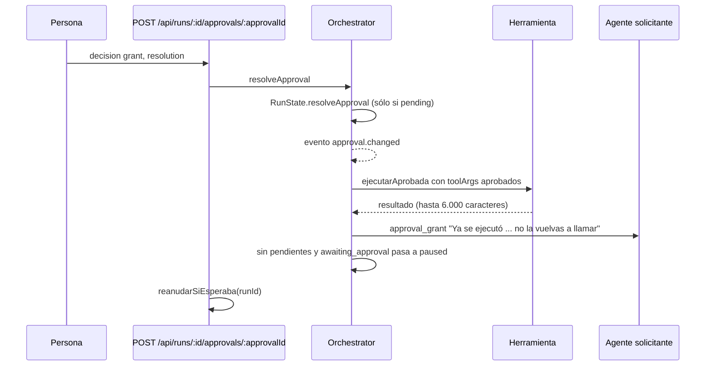
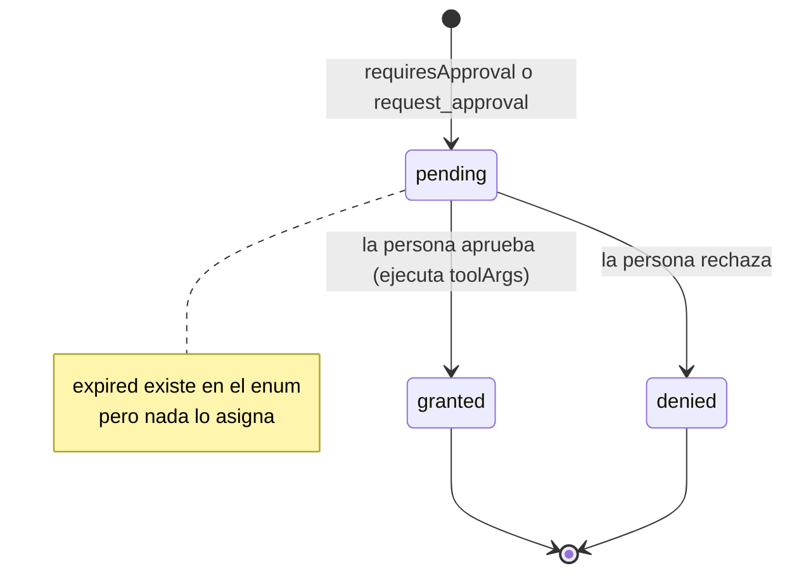
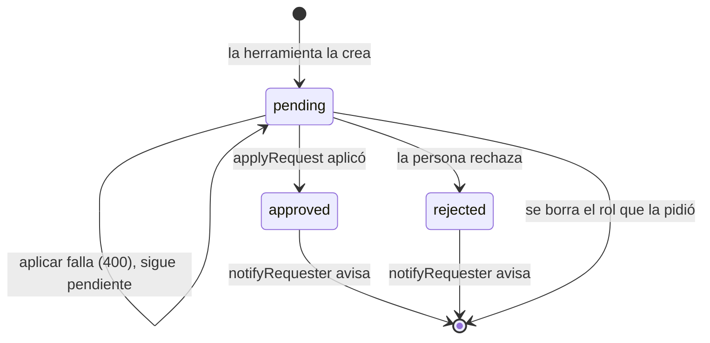
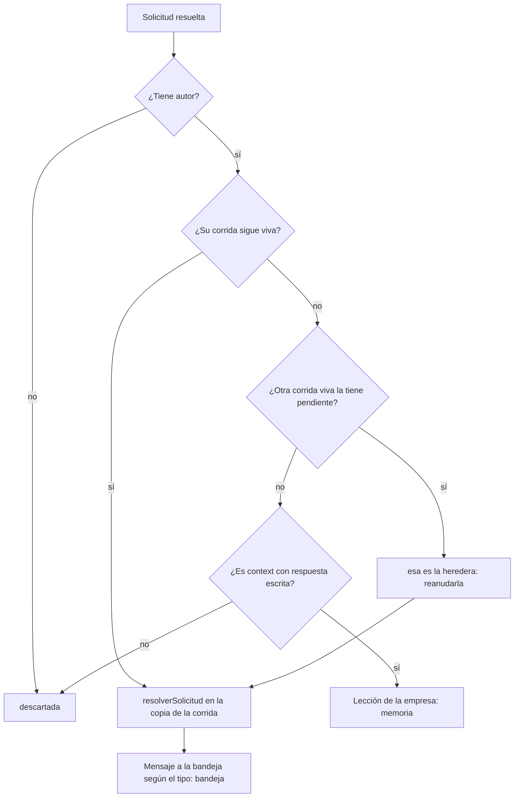

# Aprobaciones y solicitudes

Hay cosas que un agente no puede resolver hablando con sus colegas: ejecutar
algo sensible, incorporar a alguien, conocer un dato que sólo tiene el cliente,
conseguir una herramienta, conectar un servidor, correr un comando o instalar
una librería. Para eso hay **dos mecanismos** con destinatario humano y una
**decisión** pendiente, no una respuesta de otro agente:

| | Aprobación (`ApprovalRequest`) | Solicitud (`AgentRequest`) |
|---|---|---|
| Qué pide | Permiso para **una llamada concreta** (o un permiso genérico) | Cambiar la empresa o recibir información de afuera |
| Quién la abre | El loop, ante una herramienta con `requiresApproval`; o `request_approval` | Seis herramientas, una por tipo |
| Ámbito | **Corrida** (`approvals.run_id`) | **Empresa** (`agent_requests.company_id`) |
| Frena | La corrida **entera** al cerrar el ciclo | Sólo cuando ya nadie más tiene trabajo |
| Dónde se decide | [[Pantalla Proceso en vivo]] (pestaña aprobaciones) y [[Chat de IA]] | [[Pantalla Solicitudes]] |
| Qué hace aprobar | **Ejecuta** la llamada con los argumentos aprobados | **Aplica** el cambio (`Runtime.applyRequest`) |
| Sobrevive a un reinicio | No: vive con la corrida en memoria | Sí: se hereda a la corrida siguiente |

La regla de fondo es la misma: el agente propone, **decide una persona**, y
aprobar hace el trabajo de verdad. Una bandeja que sólo marca casillas sería
decorativa.

## Aprobaciones

### De dónde salen

1. **Una herramienta con `requiresApproval`.** `executeOne`
   (`packages/engine/src/loop.ts`) no la ejecuta: crea una aprobación con
   `approverRoleId = reportsTo del actor`, `reason: "<rol> quiere ejecutar
   <tool>"`, `toolName` y **los argumentos exactos** en `toolArgs`; emite
   `approval.changed` (pendiente) y un `tool.end` con `ok: false` y preview
   "esperando aprobación"; le devuelve al modelo "Esta herramienta requiere
   aprobación. Se abrió la solicitud … Terminá el turno"; y **corta el turno**.
2. **`request_approval`** (coordinación): `reason` obligatorio; crea una
   aprobación sin `toolName`. La respuesta dice "Aprobación solicitada a
   *jefe*".

Qué herramientas requieren aprobación hoy: las de un servidor MCP con
`autoApproveTools` apagado que el servidor **no** declara de sólo lectura
(`annotations.readOnlyHint`, en `packages/tools/src/mcp/bridge.ts`: listar
tablas corre solo, una migración espera a una persona) y
`limpiar_datos_de_la_app` del teléfono.

> [!warning] `approverRoleId` es informativo
> Ningún agente puede resolver una aprobación: no existe la herramienta. Decide
> siempre la persona, desde la UI. El texto "Aprobación solicitada a *jefe*" de
> `request_approval` es engañoso: el jefe no recibe nada en su bandeja.

### Aprobar ejecuta

`Orchestrator.ejecutarAprobada` (`packages/engine/src/scheduler.ts`) corre **esa**
llamada, a nombre de quien la pidió, con el mismo rastro que el loop:
`tool.start`/`tool.end` con `callId: aprobada-<id>` y una entrada en la
actividad con `detail: "aprobada: …"`. El agente no puede cambiar el SQL
después de que la persona lo vio.

> [!danger] Antes aprobar sólo avisaba
> Aprobar mandaba "Aprobación concedida" y, si el agente volvía a llamar la
> herramienta, se pedía aprobación otra vez: **una migración aprobada no se
> aplicaba nunca**. Ahora aprobar es ejecutar, y el mensaje le dice al agente
> que no la repita.

Si la herramienta o el rol ya no existen, el resultado lo dice ("la herramienta
ya no está disponible" / "el rol ya no existe"). Rechazar no ejecuta nada:
manda `approval_deny` ("Aprobación denegada") con el comentario.

### Ciclo de vida

Mientras haya alguna pendiente, `Orchestrator.checkBlockers` pone la corrida en
`awaiting_approval` con "Hay *N* aprobación(es) pendiente(s). Resolvelas para
continuar." y no arranca el ciclo siguiente: **la corrida entera espera**, no
"esta rama" como dice la descripción de `request_approval`. Resolver otra vez la
misma, o una que no existe, contesta 404 ("aprobación pendiente"). Si la
corrida ya no está en memoria, 409.

## Solicitudes

### Datos

`packages/shared/src/schema.ts` → `agentRequestSchema`:

| Campo | Qué es |
|---|---|
| `id` | `req_…` |
| `companyId`, `runId` | Empresa, y corrida que la abrió (puede ya no existir) |
| `requestedByRoleId` | Quién pidió |
| `type` | `agentRequestTypeSchema`: `create_role`, `context`, `tool_access`, `mcp_server`, `comando`, `dependencia` |
| `reason` | Por qué: es lo que la persona lee para decidir |
| `roleProposal` | `{name, title, departmentName, systemPrompt, authority, reportsToName}` para `create_role` |
| `question` | La pregunta, para `context` |
| `toolNames` | Para `tool_access` |
| `mcpProposal` | Servidores **ya saneados** (sin secretos) para `mcp_server` |
| `comando` | `{repoId, argv}` exacto |
| `dependencia` | `{repoId, gestor, paquetes (1-10), dev, carpeta}` |
| `status` | `pending` \| `approved` \| `rejected` |
| `resolution` | Respuesta, comentario o motivo del rechazo (hasta 8.000) |

### Ciclo de vida

1. **Creación.** `RunState.createRequest` deduplica contra las **pendientes**
   por una huella normalizada (tipo, nombre del rol propuesto, pregunta,
   herramientas y servidores ordenados, `repo:argv`, `repo:carpeta:paquetes`):
   un agente sin respuesta vuelve a pedir lo mismo en el ciclo siguiente. Si
   existe, devuelve la existente sin avisar. Se persiste y, para las cuatro de
   coordinación, se emite `request.created`.
2. **Espera.** Una pregunta pendiente no frena a toda la empresa: cuando ya
   nadie tiene trabajo y queda alguna solicitud pendiente, la corrida pasa a
   `awaiting_approval` con "*N* solicitud(es) esperando una respuesta… sigue
   sola cuando respondas" en vez de terminar. Terminar dejaba la pregunta
   huérfana.
3. **Resolución.** `POST /api/companies/:companyId/requests/:id` con
   `{decision: approve|reject, resolution, roleProposal?, comando?}`. Si ya no
   está pendiente, 409. Si se aprueba, `Runtime.applyRequest`; si tira, 400 con
   el motivo y **la solicitud queda pendiente** (aprobar algo que no quedó
   aplicado le mentiría al agente). Después se guarda con su estado,
   `notifyRequester` avisa y `reanudarSiEsperaba(runId)` destraba. La respuesta
   HTTP trae `{request, aplicado, entrega}`.

### Los seis tipos

| Tipo | Herramienta | Validación al pedir | Aprobar hace | Nota |
|---|---|---|---|---|
| `create_role` | `request_new_role` | nombre no repetido | crea el rol | abajo |
| `context` | `request_context` | una consulta pendiente por rol | la respuesta viaja al agente | abajo |
| `tool_access` | `request_tool_access` | al menos una herramienta | le asigna las que existen | abajo |
| `mcp_server` | `solicitar_servidor_mcp` | config saneada, servidor nuevo | instala, conecta y otorga | [[Integración MCP]] |
| `comando` | `solicitar_comando` | argv válido, no permitido ya | lo permite una vez o siempre | [[Comandos y sandbox]] |
| `dependencia` | `instalar_dependencia` | paquetes del registro, `package.json` | instala en el sandbox | [[Instalación de dependencias]] |

#### `create_role` — `request_new_role`

Argumentos: `name`, `title`, `department`, `system_prompt`, `reason`
(obligatorios) y `reports_to` (vacío = a quien pide). La propuesta nace con
`authority: "executor"`. Si ya hay un rol con ese nombre: "escribile con
send_message".

La persona puede **editar la propuesta** antes de aceptar (nombre, cargo, área,
jefe e instrucciones; la API acepta también otra autoridad). Aprobar
(`applyRequest`): nombre repetido → 400; crea el departamento si no existe;
busca el jefe por `reportsToName` o, si no, quien pidió; el modelo es el de la
empresa con `conEscaladoPorAutoridad`; `toolIds: []`, `maxTurns: 6`; lo guarda y
lo suma con `addRole` a la corrida que abrió la solicitud. El agente recibe "Tu
solicitud fue aprobada… Ya está incorporado y disponible desde el próximo ciclo:
escribile con send_message".

Para sumar a alguien **ya**, sin esperar, está `convocar_especialista`: la
diferencia no es de permisos sino de tiempo (ver [[Especialistas convocados]]).

#### `context` — `request_context`

Argumentos: `question` (respondible en pocas líneas) y `reason`. **Una consulta
pendiente por rol**: con otra sin responder, rechaza con "Esperá esa respuesta
antes de preguntar otra cosa… sumalo cuando te contesten, en una sola
consulta". Medimos a un agente repetir tres preguntas que ya le habían
contestado.

En la pantalla, aprobar exige escribir la respuesta. Aprobar no cambia la
configuración; `notifyRequester` manda un mensaje **tipo `response`** con asunto
"Respuesta a: *pregunta*", el dato primero y al final "Ya lo tenés: no lo
vuelvas a preguntar". Rechazar manda `approval_deny` "No hay respuesta para tu
consulta".

> [!warning] Una pregunta se contesta con una respuesta, no con un permiso
> Todo salía como `approval_grant` con el asunto "Tu solicitud fue aprobada":
> el agente veía "Aprobación concedida" y el dato quedaba escondido en el
> cuerpo. Lo medimos: volvió a preguntar tres de las mismas cosas en el ciclo
> siguiente.

Si la corrida ya cerró y ninguna la heredó, la respuesta se guarda como
lección de la empresa (ver [[Memoria de la empresa]]).

#### `tool_access` — `request_tool_access`

Argumentos: `tools` (nombres exactos) y `reason`. No valida contra el catálogo
al pedir; la pantalla marca con ⚠ las que no existen ("se ignora al aprobar").
Aprobar suma al rol las que existen y devuelve `{otorgadas, inexistentes}`; en
la corrida que la abrió actualiza sus `toolIds` (`updateRoleTools`). El agente
recibe el JSON de lo aplicado.

#### `mcp_server` — `solicitar_servidor_mcp`

Argumentos: `config` (el bloque `{"mcpServers": …}` del README, o el mapa a
secas) y `reason`. Se sanea **en la herramienta** con `parsearConfigMcp`: un
secreto literal se descarta con aviso, así que lo que llega a la bandeja ya no
puede llevar una credencial, y el agente ve los avisos en el momento. Si la
config no define ningún servidor, rechaza con los avisos. Si la empresa ya tiene
un servidor con ese nombre, no abre solicitud: "pedilas con
request_tool_access".

Aprobar llama a `Runtime.instalarServidoresMcp`: guarda la configuración
(con `autoApproveTools: true`), sincroniza **esperando el handshake**, descubre
las herramientas, se las **otorga al solicitante** y las incorpora a la corrida
que la abrió (`incorporarHerramienta` + `updateRoleTools`: la corrida congela su
catálogo al arrancar). Si todos los propuestos ya existían, 400. Detalle en
[[Integración MCP]] y [[Tienda MCP]].

#### `comando` — `solicitar_comando`

`origin: "skill"`, en `packages/tools/src/codigo/index.ts`. Argumentos:
`comando`, `motivo` y el repo. Si ya está permitido, contesta que lo corra; si
hay una pendiente por el mismo argv, "seguí con otra cosa". Al aprobar, la
persona elige **una vez** (el argv exacto, que se consume al usarse) o
**siempre** (un prefijo recortable, que tiene que ser el principio del comando y
pasar `validarPrefijoPermitido`). `requiresApproval` no sirve acá: aprobar sólo
avisaba y la herramienta volvía a pedir para siempre. Ver
[[Comandos y sandbox]].

#### `dependencia` — `instalar_dependencia`

`origin: "skill"`. Argumentos: `paquetes` (hasta `MAX_PAQUETES_POR_PEDIDO` = 10,
sólo nombres del registro), `motivo`, `dev`, `carpeta` (monorepo) y el repo.
Exige `package.json` en la carpeta y deduce el gestor por el lockfile. Aprobar
**instala** (`Runtime.instalarDependencias`): revalida todo, se niega si un
agente tiene el arriendo del repo, corre el gestor en el sandbox con
`--ignore-scripts` y un corte de 5 minutos; si falla, 400 y sigue pendiente. El
agente recibe "Instalado: …" con la salida del gestor. Ver
[[Instalación de dependencias]].

### Cómo le llega la respuesta: `notifyRequester`

Devuelve `"bandeja" | "memoria" | "descartada"` y la pantalla lo dice: "Le llegó
a la bandeja del agente…", "Su corrida ya había terminado, así que la respuesta
quedó en la memoria de la empresa…" o "No se pudo entregar…".

> [!danger] La corrida tiene su propia copia de las solicitudes
> Resolver por la API sólo tocaba la base: la copia en memoria seguía diciendo
> `pending` y la corrida quedaba trabada para siempre informando que esperaba
> respuestas ya dadas. Ahora `RunState.resolverSolicitud` la refleja, y
> `runContinuous` se destraba solo si está en `awaiting_approval` sin nada
> pendiente.

### Solicitudes heredadas

Las corridas cargan **todas** las solicitudes de la empresa al arrancar
(`CompanyConfig.requests`). Una pendiente de una corrida anterior sigue
contando: la corrida nueva también va a esperar por ella cuando se quede sin
trabajo. Cuando se resuelve, `notifyRequester` busca la corrida viva que la
tiene pendiente y la reanuda a ella (la ruta reanuda el `runId` original, que ya
no sirve). Lo medimos: una corrida con todo el trabajo aprobado, trabada en su
cierre por una solicitud ya resuelta en la base.

## Contestar reanuda

`Runtime.reanudarSiEsperaba` corre al resolver una aprobación o una solicitud:
si la corrida está en `awaiting_approval` **o `paused`** y no queda ninguna
solicitud ni aprobación pendiente, la retoma con `runContinuous` sin bloquear la
respuesta HTTP (con su `.catch`: una promesa rechazada sin dueño tumba Node).
Vale desde `paused` porque resolver la última aprobación deja la corrida en
pausa; sin eso aprobar no hacía nada visible.

## Casos borde

| Síntoma | Causa |
|---|---|
| La corrida quedó en `awaiting_approval` "esperando una respuesta" sin preguntas nuevas | Hay una solicitud pendiente heredada de una corrida vieja |
| Aprobé un rol heredado y el agente no lo ve en su corrida | `applyRequest` suma el rol (y las herramientas de `tool_access` o `mcp_server`) sólo a la corrida del `runId` original, no a la heredera; el mensaje igual dice "disponible desde el próximo ciclo". Llega en la corrida siguiente |
| Otorgué una herramienta y el agente no la ve | `tool_access` actualiza `toolIds` pero no incorpora al catálogo congelado de la corrida: una herramienta que no existía al arrancar recién aparece en la siguiente |
| No hay `request.created` para un comando o una dependencia | El loop sólo emite ese evento para las cuatro solicitudes de coordinación; las de código son `origin: "skill"` |
| Una corrida manual o pausada a propósito arrancó sola en continuo | Contestar la última pendiente reanuda con `runContinuous` |
| Un rechazo a una consulta quedó en la memoria | Con la corrida cerrada, `notifyRequester` guarda cualquier `context` con texto, aunque sea rechazado |
| La aprobación no se puede resolver después de reiniciar | Las aprobaciones viven con la corrida en memoria; se abre una nueva |
| Borré un rol y desaparecieron sus pedidos | `Store.deleteRole` borra sus solicitudes y `RunState.removeRole` las saca de la corrida viva |

## Seguridad

- Aprobar ejecuta **los argumentos que vio la persona**; el agente no puede
  cambiarlos después.
- Los secretos de un servidor propuesto se descartan en la herramienta, antes de
  llegar a la bandeja: aprobar nunca escribe una credencial en la base.
- Comandos y dependencias se revalidan **al aprobar** aunque la herramienta ya
  los validó: lo que llega a la base no se da por bueno.
- Los servidores instalados por solicitud nacen con `autoApproveTools: true`:
  sus herramientas no piden aprobación.

## Qué fijan los tests

- `packages/engine/src/scheduler.test.ts` → "queda esperando en vez de terminar cuando le preguntó algo a la persona"; "retoma cuando la solicitud queda resuelta"; "aprobaciones": aprobar ejecuta con sus argumentos una vez y le lleva el resultado; rechazar no ejecuta nada.
- `packages/tools/src/coordination.test.ts` → `solicitar_servidor_mcp`: JSON inválido rebota; el secreto se descarta y el aviso queda a la vista; un servidor existente no abre solicitud; abre con la propuesta saneada. Y `request_approval` sin `reason` se rechaza.
- `packages/engine/src/roles.test.ts` → `removeRole` se lleva las solicitudes pendientes del eliminado.

## Fuentes

- `packages/tools/src/coordination.ts` → `requestApproval`, `requestNewRole`, `requestContext`, `requestToolAccess`, `solicitarServidorMcp`
- `packages/tools/src/codigo/index.ts` → `solicitar_comando`, `instalar_dependencia`
- `packages/engine/src/loop.ts` → `executeOne` (rama `requiresApproval`), `emitCoordinationEffect`
- `packages/engine/src/scheduler.ts` → `Orchestrator.resolveApproval`, `ejecutarAprobada`, `checkBlockers`, `esperaAlgo`, `runContinuous`
- `packages/engine/src/state.ts` → `createRequest`, `resolverSolicitud`, `requestApproval`, `resolveApproval`, `pendingApprovals`
- `apps/server/src/runtime.ts` → `applyRequest`, `instalarServidoresMcp`, `instalarDependencias`, `notifyRequester`, `reanudarSiEsperaba`, `resolveApproval`
- `apps/server/src/routes.ts` → `/api/companies/:companyId/requests`, `/api/runs/:id/approvals/:approvalId`
- `packages/shared/src/schema.ts` → `approvalRequestSchema`, `agentRequestSchema`, `agentRequestTypeSchema`, `roleProposalSchema`, `servidorMcpPropuestoSchema`
- `apps/web/src/routes/Requests.tsx` → `Requests`, `RequestCard`

## Ver también

- [[Pantalla Solicitudes]]
- [[Integración MCP]]
- [[Comandos y sandbox]]
- [[Instalación de dependencias]]
- [[Especialistas convocados]]
- [[Scheduler y ciclo de una corrida]]
