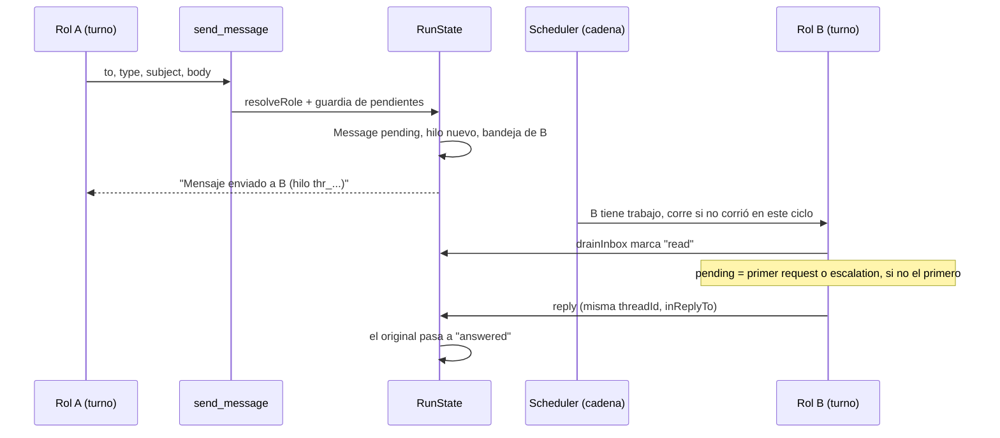
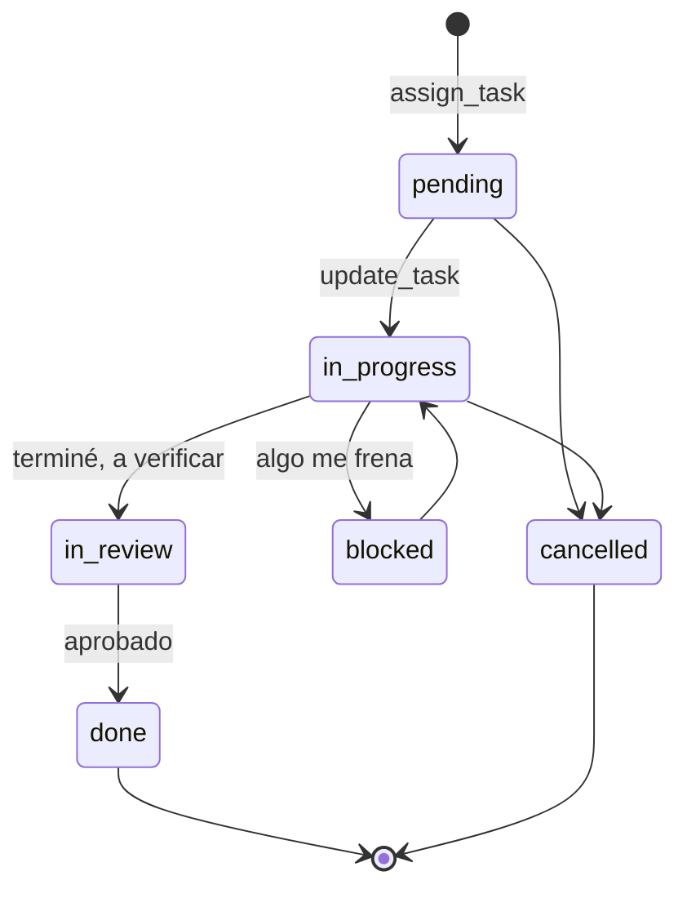

# Coordinación entre agentes

Las herramientas de coordinación son lo que hace que una empresa del
orquestador se comporte como una organización y no como un modelo hablando
solo. Los agentes **no comparten contexto**: cada rol tiene bandeja propia y sólo
sabe lo que le escriben. Todo lo que un rol sabe de otro llegó por una de estas
herramientas.

Esta nota documenta el contrato de las herramientas de mensajería, tareas,
auditoría en vivo y cálculo. Las demás herramientas de coordinación tienen su
nota: entregables en [[Entregables]], memoria en [[Memoria de la empresa]],
pedidos a la persona en [[Aprobaciones y solicitudes]], supervisión en
[[Supervisión y continuidad]], convocatoria en [[Especialistas convocados]],
creación de herramientas en [[Herramientas compuestas]] y el vault en
[[Vault de contexto]]. Quién puede qué según su autoridad está en
[[Organización de agentes]].

## Por qué así

La jerarquía y las guardias se validan **en el código de la herramienta**, no en
el prompt. Cada guardia de esta nota salió de una corrida real medida: un
agente puede ignorar una instrucción, pero no puede saltearse el ejecutor. Y el
rechazo siempre dice qué hacer en su lugar, porque un rechazo sin alternativa
hace que el agente repita la misma llamada.

## Cómo circula un mensaje



El ciclo es una **cadena**: lo que A emite lo toma B en el mismo ciclo si B
todavía no corrió; si ya corrió, espera al siguiente. Cada rol corre como mucho
una vez por ciclo, y eso hace imposible el ping-pong infinito. Los textos de
las herramientas todavía dicen "lo lee en el ciclo siguiente", que es el peor
caso. Ver [[Scheduler y ciclo de una corrida]].

## Contrato común

Todas las herramientas de esta nota viven en `packages/tools/src/coordination.ts`
(salvo `calcular` y `verificar_cifras`, en `calculo.ts`) y comparten:

- **`origin: "coordination"`**: `ToolRegistry.forRole` las otorga siempre, sin
  mirar `role.toolIds`, y el router las expone siempre sin competir por el
  ranking (`isAlwaysExposed` en `packages/tools/src/router.ts`).
- **Roles por nombre.** `resolveRole` acepta id, nombre o cargo, sin mayúsculas.
  Si no encuentra, el error trae `roleNames`: la lista `"Nombre" (Cargo)` de toda
  la empresa, para que el agente se corrija en la vuelta siguiente.
- **Campos obligatorios.** `readRequired` rechaza un campo faltante **o en
  blanco** en vez de coercionarlo a `""`: sin eso la herramienta "tenía éxito"
  produciendo un mensaje sin cuerpo. Si los argumentos traen `__raw` (el JSON
  llegó cortado porque el modelo agotó `maxOutputTokens`), el error lo dice:
  "Los argumentos llegaron cortados… volvé a llamarla con un contenido más
  breve".
- **Un error no rompe el turno.** `fail()` (`packages/tools/src/types.ts`)
  devuelve `ok: false` con el texto prefijado `ERROR:`; el modelo lo lee y
  corrige.
- **La actividad la graba el loop**, no el agente: cada llamada deja
  `{roleId, tick, tool, ok, detail}` en `RunState.activity` (`executeOne` en
  `packages/engine/src/loop.ts`).
- **Efectos visibles.** Tras un éxito, `emitCoordinationEffect` emite el evento
  que anima el organigrama:

| Herramienta | Evento |
|---|---|
| `send_message`, `reply`, `broadcast`, `escalate` | `agent.message` |
| `assign_task`, `update_task` | `task.changed` (`created: true` al asignar) |
| `write_artifact` | `artifact.created` |
| `request_new_role`, `request_context`, `request_tool_access`, `solicitar_servidor_mcp` | `request.created` |
| `request_approval` | `approval.changed` |

- **Memo de lecturas.** Las de lectura (`readOnly: true`) corren en paralelo y
  una relectura idéntica en el mismo turno devuelve un puntero en vez del
  contenido. Las de mensajería no invalidan el memo (sólo la huella de
  `check_activity`); cualquier otra mutación lo vacía (`invalidarMemo`).

## Catálogo

| Herramienta | Lectura | Qué hace | Nota |
|---|---|---|---|
| `send_message` | no | Mensaje a un rol | esta |
| `reply` | no | Responde el mensaje que el turno está atendiendo | esta |
| `broadcast` | no | Anuncio a un departamento | esta |
| `escalate` | no | Sube un asunto al jefe | esta |
| `assign_task` | no | Crea una tarea para un reporte | esta |
| `update_task` | no | Mueve una tarea propia de etapa | esta |
| `list_my_tasks` | sí | Tareas abiertas propias | esta |
| `check_activity` | sí | Qué ejecutó cada agente y con qué resultado | esta |
| `calcular` | sí | Una cuenta de verdad | esta |
| `verificar_cifras` | sí | Todas las cifras de un documento en una llamada | esta |
| `estado_del_proceso` | sí | Foto del encargo entero | [[Supervisión y continuidad]] |
| `write_artifact`, `edit_artifact`, `read_artifact`, `list_artifacts`, `buscar_en_entregables` | mixto | Entregables | [[Entregables]] |
| `record_lesson` | no | Lección con evidencia | [[Memoria de la empresa]] |
| `request_approval`, `request_context`, `request_new_role`, `request_tool_access`, `solicitar_servidor_mcp` | no | Pedidos a la persona | [[Aprobaciones y solicitudes]] |
| `convocar_especialista` | no | Suma un rol en el acto | [[Especialistas convocados]] |
| `crear_herramienta` | no | Compone una herramienta nueva | [[Herramientas compuestas]] |
| `leer_contexto`, `buscar_contexto`, `escribir_contexto` | mixto | Vault de la empresa | [[Vault de contexto]] |

`crear_herramienta` y las tres del vault no están en `coordinationTools`: el
servidor las registra por empresa (`Runtime.companyRuntime`) porque necesitan el
catálogo o el vault de esa empresa. Igual son `origin: "coordination"`, así que
todos los roles las reciben.

## Mensajería

### `send_message`

| Argumento | Tipo | Obligatorio | Qué es |
|---|---|---|---|
| `to` | string | sí | Nombre, cargo o id del destinatario |
| `type` | `request` \| `report` | sí en el esquema | `request` espera respuesta o acción; `report` sólo informa. Cualquier otro valor se toma como `request` |
| `subject` | string | sí | Asunto corto |
| `body` | string | sí | Todo el contexto: el otro no ve tu conversación |

Validaciones, en orden:

1. `to`, `subject` y `body` presentes (`readRequired`).
2. El destinatario existe (`resolveRole`); si no, lista los válidos.
3. No es uno mismo: "No podés enviarte un mensaje a vos mismo."
4. **Uno por persona hasta que conteste.** Si el actor ya le escribió a ese rol
   y ese mensaje no está `answered`, rechaza: "Ya le escribiste a *X* y todavía
   no te contestó… insistir no lo acelera… avanzá con lo que puedas hacer sin
   su respuesta o pedile a otra área lo que sí depende de ella."

Efecto: `RunState.sendMessage` crea un `Message` con hilo nuevo (`threadId`
`thr_…`), estado `pending`, lo guarda y lo pone en la bandeja del destinatario.
Resultado: "Mensaje enviado a *X* (hilo …)".

> [!warning] Insistir no acelera a nadie
> Sin la guardia medimos **diez mensajes de un coordinador a la misma persona
> en una corrida** —pedido, recordatorio, seguimiento, escalamiento— sobre lo
> mismo. Cada uno le comía lugar en la bandeja y contexto a los dos, y el que
> insistía se quedaba esperando en vez de avanzar.

La guardia usa `mensajesSinResponder()` de la vista del actor: **cualquier**
mensaje suyo con `toRoleId` igual al destinatario y estado distinto de
`answered`, sin importar el tipo. Un `report` también cuenta: si B nunca le
contesta ese informe (porque atendió otro pedido de su bandeja), A no puede
volver a escribirle en esa corrida. Los `broadcast` no cuentan (van a un
departamento, no a un rol).

### `reply`

| Argumento | Tipo | Obligatorio |
|---|---|---|
| `body` | string | sí |

Responde **el mensaje que el turno está atendiendo**. El loop lo elige al
arrancar el turno (`runAgentTurn`): el primer `request` o `escalation` de la
bandeja, y si no hay, el primer mensaje. Al retomar un turno cortado se conserva
el que estaba atendiendo.

- Sin mensaje en curso: "No hay ningún mensaje que responder en este turno. Si
  querés iniciar una conversación, usá send_message."
- Si el mensaje lo escribió **la persona** (tipo `human`, sin rol emisor):
  rechaza con "Ese mensaje lo escribió la persona a cargo, no un rol: no hace
  falta acusar recibo… Si te falta un dato que sólo ella tiene, pedíselo con
  request_context".
- Si no: manda un `response` con asunto `Re:`, en el mismo hilo e
  `inReplyTo` del original, que pasa a `answered`.

> [!danger] Acusar recibo del encargo costaba una iteración por intento
> En una corrida real, 14 de 25 llamadas a `reply` fueron el coordinador
> intentando contestarle al encargo de la persona, que no tiene bandeja. Ahora
> la herramienta explica que no hace falta y cuál es el canal que sí llega.

### `broadcast`

| Argumento | Obligatorio | Qué es |
|---|---|---|
| `department` | sí | Nombre o id del departamento |
| `subject` | sí | Asunto |
| `body` | sí | Cuerpo |

Crea **un** mensaje tipo `broadcast` con `toDepartmentId`, que se expande a la
bandeja de cada rol del área (salvo el emisor). Es para anuncios, no para
pedidos. Si el departamento no existe, lista los disponibles.

### `escalate`

| Argumento | Obligatorio | Qué es |
|---|---|---|
| `reason` | sí | Por qué escalás, en una frase |
| `detail` | sí | Qué pasó, qué intentaste, qué hay que decidir |

- Sin jefe (`reportsTo: null`): "Sos *cargo* y no reportás a nadie: esta
  decisión es tuya. Tomala y seguí, o pedile aprobación a la persona con
  request_approval."
- Si no: mensaje `escalation` al jefe, asunto `Escalamiento: <reason>`, en el
  hilo del mensaje que se está atendiendo.

> [!note] Escalar cierra el pedido que se atendía
> `escalate` manda con `inReplyTo` igual al mensaje en curso, así que ese
> mensaje pasa a `answered`: para quien lo escribió, el pedido quedó contestado
> por la vía del escalamiento.

## Tareas

El tablero es lo único que muestra en qué anda cada cosa. Estados
(`taskStatusSchema`): `pending`, `in_progress`, `in_review`, `blocked`, `done`,
`cancelled`. `in_review` existe para que la verificación sea una etapa
**visible** y no un mensaje suelto.



`update_task` no impone el orden: el dueño puede saltar de cualquier estado
abierto a cualquier otro. El orden lo pide el prompt (`WORKING_AGREEMENT` en
`packages/engine/src/prompt.ts`).

> [!warning] Sólo `pending` e `in_progress` convocan
> `RunState.rolesWithWork` cuenta como trabajo sólo esas dos. Un rol con todo
> en `blocked` o `in_review` no vuelve a correr por sus tareas: lo despierta un
> mensaje nuevo. Si alguien se destraba, alguien tiene que escribirle. Ver
> [[Supervisión y continuidad]].

### `assign_task`

| Argumento | Obligatorio | Qué es |
|---|---|---|
| `assignee` | sí | Nombre del rol |
| `title` | sí | Título breve y accionable |
| `detail` | sí | Qué hay que hacer y con qué criterio está terminada |
| `priority` | no | `low` \| `normal` \| `high` \| `urgent`; default `normal` |

1. **Jerarquía.** Pasa si el actor es `executive` o si el destinatario está en
   sus reportes directos (`directReports`). Si no: "*X* no te reporta, así que
   no podés asignarle tareas. Tu equipo directo es: … Si necesitás algo de otro
   área, usá send_message."
2. **Sin duplicados.** Compara el título normalizado (`normalizarTitulo`: sin
   tildes, mayúsculas ni puntuación) contra las tareas **abiertas** del
   destinatario. Si coincide, rechaza nombrando la tarea existente y su id: el
   tablero terminaba con dos tarjetas iguales y una quedaba colgada para
   siempre. Una tarea cerrada no bloquea reasignar el mismo título.

Efecto: `Task` en `pending`, `createdByRoleId` = actor, `dueTick: null`,
evento `task.changed` con `created: true`.

### `update_task`

| Argumento | Obligatorio | Qué es |
|---|---|---|
| `task_id` | sí | Id de la tarea (aparece en "Tus tareas" del prompt) |
| `status` | sí | `in_progress` \| `in_review` \| `blocked` \| `done` \| `cancelled` |
| `result` | no | Resultado, o el motivo del bloqueo |

**Cada uno mueve sólo lo suyo**, sin excepción por autoridad: la herramienta
busca el id entre las tareas abiertas del actor y, si no está, rechaza con "La
tarea *id* no es tuya… escribile a quien la tiene con send_message".

> [!warning] Por qué ni el CEO mueve tareas ajenas
> Medimos a un coordinador asignarle un diagnóstico a otra persona y moverlo él
> mismo a `in_progress` y después a `blocked` sin que ella hubiera empezado: el
> tablero mostraba a alguien trabado en algo que nunca tocó. Un tablero que
> miente es peor que no tener tablero.

Consecuencias que conviene saber:

- Como la búsqueda es sobre tareas **abiertas**, una tarea ya `done` o
  `cancelled` no se puede volver a mover (el mensaje dice "no es tuya").
- `pending` no está en el enum: una tarea no vuelve a "sin empezar".
- Supervisar no es mover tarjetas ajenas: se escribe al dueño, o se asigna una
  tarea nueva a otro (la vieja queda abierta con su dueño).

### `list_my_tasks`

Sin argumentos. Lista las tareas **abiertas** del actor como
`- [estado] id: título (prioridad …)`. Las cerradas no aparecen.

## Auditar lo que un agente hizo: `check_activity`

| Argumento | Obligatorio | Qué es |
|---|---|---|
| `role` | no | Nombre del rol a auditar; vacío = todos |
| `only_failures` | no | `true` = sólo las llamadas que fallaron |

Lee `RunState.activity`: cada llamada a herramienta con su resultado **real**,
grabada por el loop. La corrida conserva las últimas **500** entradas
(`recordActivity`) y la herramienta muestra las últimas **60** que pasen el
filtro, así:

```
- c3 Mateo · export_pdf · ok · Documento guardado en …
- c4 Sofía · edit_artifact · FALLÓ · ERROR: edit_artifact: el cambio 1 no encontró …
```

También aparecen las herramientas propias del CLI de un turno delegado
(`cli:Edit`, `cli:Read`…) y las ejecutadas al aprobar (`detail` empieza con
`aprobada:`).

Es lo único que detecta la clase de error más repetida: **ejecutar algo con
éxito y después informar que no se pudo**, o decir que se produjo un
entregable que nunca se escribió. Ver [[CU-04 Control de calidad entre agentes]].

## Cálculo verificable

Un modelo hace cuentas por patrón, y las cuatro fallas de calidad más caras del
proyecto fueron aritmética, no criterio: un margen de 38,2% donde era 35,0%, un
ahorro de $80.000.000 donde daba $14.400.000, 29,3% donde daba 28,5% y 940
horas/mes con una capacidad de 260. Las cuatro pasaron un control de calidad.

### `calcular`

| Argumento | Obligatorio | Qué es |
|---|---|---|
| `expresion` | sí | La cuenta: `"(114100 - 74165) / 114100"` |
| `esperado` | no | El valor que afirma el documento |
| `concepto` | no | Rótulo para la traza; **no** entra en la huella del memo |

- Evaluador propio, **sin `eval`**: la expresión la escribe un modelo y no puede
  ser un canal para ejecutar código (`calcularExpresion`).
- Operadores `+ - * / ( ) ^` y `%` como sufijo (`35%` es 0,35); acepta `× · ÷ −`.
- Números como los escribe la gente (`normalizarNumero`): con coma, la coma es
  decimal (`3.200.000,50`); varios puntos son miles; un solo punto con tres
  dígitos detrás es miles (`1.500`), salvo que la parte entera sea 0 (`0.650`).
- Tolerancia de **0,5%** relativo al comparar con `esperado`.
- Una cifra que **no** coincide devuelve igual `ok: true` con
  "✗ NO coincide… Corregilo antes de que salga": es un resultado, no un fallo.
- `clavesDeCache: ["expresion", "esperado"]`: lo medimos, el auditor calculó
  dos veces `933 * 22000` con rótulos apenas distintos.

### `verificar_cifras`

| Argumento | Obligatorio | Qué es |
|---|---|---|
| `entregable` | no en el esquema, sí en la práctica | Clave del entregable verificado |
| `cifras` | sí | Filas `{concepto, expresion, esperado, fuente?}` |

Verifica todas las cifras de un documento **en una sola llamada** y devuelve la
tabla lista para pegar (`Cifra · Cuenta · Dice el documento · Da la cuenta ·
Veredicto`). Existe porque `calcular` sola no alcanzó: el auditor verificó tres
cifras de una docena y cerró el turno, y una cifra que nadie miró se leía igual
que una verificada. Hacer que el camino completo sea el más barato: doce cifras,
una llamada, y lo que falta se ve porque falta una fila.

Con `entregable`, registra en la corrida un `VerificacionCifras`
(`{version, total, malas, sinVerificar, roleId}`) contra **esa versión** del
entregable (`RunState.registrarVerificacion`, en memoria). Es lo que mira la
exportación: un documento con cifras (`$` con 4+ dígitos o un porcentaje) no sale
a Word ni a PDF sin verificación de la versión actual y con cero cifras malas
(`revisarCifras` en `packages/tools/src/skills/index.ts`, ver
[[Documentos Word y PDF]]).

> [!danger] Volver a correrla "con la clave" en el mismo turno no registra
> `verificar_cifras` es de lectura y declara `clavesDeCache: ["cifras"]`: el
> argumento `entregable` **no** entra en la huella del memo. Si el agente la
> corre primero sin `entregable` y después, en el mismo turno, repite las mismas
> filas agregando la clave —que es justo lo que le pide el aviso "Volvé a
> correrla con la clave"—, el memo devuelve un puntero, la herramienta no se
> ejecuta y la verificación **no queda registrada**. La exportación va a seguir
> rechazando. Hay que pasar `entregable` desde la primera llamada, o cambiar
> alguna fila.

Detalles: una fila sin `expresion` o `esperado`, o que no se puede calcular,
cuenta como "sin verificar" (⚠️) y no como mala; la tolerancia es la misma
0,5%; el resultado es `ok: true` aunque haya cifras malas ("*N* de *M* cifras NO
coinciden. No sale así."). La verificación vive en la corrida y no en la base: si
el documento se reescribe, la de la versión anterior no vale.

## Casos borde

| Síntoma | Causa |
|---|---|
| "Ya le escribiste a *X* y todavía no te contestó" sin que haya un pedido abierto | La guardia cuenta cualquier mensaje no `answered`, también un `report` |
| `reply` falla con "Ese mensaje lo escribió la persona a cargo" | El turno atiende el encargo (`human`): no se acusa recibo, se trabaja |
| Un pedido desaparece sin respuesta | Leer vacía la bandeja; `reencolarSolicitudesSinResponder` lo vuelve a poner hasta 2 veces (ver [[Supervisión y continuidad]]) |
| "La tarea … no es tuya" sobre una tarea propia | Ya está `done` o `cancelled`: no se puede mover |
| Un `executor` no puede delegar | No tiene reportes; `assign_task` sólo va hacia abajo |
| La exportación rechaza aunque se verificó | Se verificó sin `entregable`, o sobre otra versión, o quedó alguna cifra mala |

## Qué fijan los tests

`packages/tools/src/coordination.test.ts`:

- "validación de argumentos obligatorios": `write_artifact`, `send_message`, `reply`, `assign_task`, `escalate` y `request_approval` rechazan nombrando lo que falta; el JSON cortado se avisa; una cadena en blanco cuenta como faltante.
- "assign_task no duplica trabajo ya asignado": mismo título con otro formato se rechaza; una tarea cerrada deja reasignar.
- "update_task: cada uno mueve sólo lo suyo": rechaza la ajena y dice qué hacer; deja mover la propia.
- "send_message: uno por persona hasta que conteste": rechaza insistir; no frena escribirle a otra persona.
- "auditar lo que los agentes hicieron": `check_activity` muestra resultados, filtra fallos y por nombre, devuelve los roles válidos, dice que no hay nada en vez de listar vacío y es de sólo lectura.

Además:

- `packages/engine/src/loop.test.ts` → "contestarle a la persona que dio el encargo": no se inventa una respuesta y el aviso nombra `request_context`.
- `packages/engine/src/scheduler.test.ts` → "respeta la jerarquía" y "dos agentes que se escriben sin parar corren una vez cada uno" (en `continuidad.test.ts`).
- `packages/tools/src/calculo.test.ts` → números "como los escribe la gente"; evalúa sin `eval` (precedencia, `%` como sufijo, signos de modelo, no ejecuta código, avisa la división por cero); caza el margen mal atribuido y el ahorro inflado de dos casos reales; `verificar_cifras` arma la tabla, marca la mala y no oculta lo que no pudo verificar.

## Cómo extender

- Una herramienta de coordinación nueva va en `coordinationTools` si es global,
  o se registra por empresa en `Runtime.companyRuntime` si necesita algo de la
  empresa. Si cambia el estado visible, sumale su evento en
  `emitCoordinationEffect` y, si es nuevo, la variante en
  `packages/shared/src/events.ts` (ver [[Cómo agregar un evento]]).
- Si sólo "habla" (crea mensajes o solicitudes), sumala a `COMUNICACION` en
  `loop.ts` para que no vacíe el memo, y a `HABLAR_NO_ES_EVIDENCIA` para que no
  cuente como evidencia de una lección.
- Toda guardia nueva con un rechazo que diga la alternativa, y un test.

## Fuentes

- `packages/tools/src/coordination.ts` → `resolveRole`, `normalizarTitulo`, `readRequired`, `sendMessage`, `reply`, `broadcast`, `escalate`, `assignTask`, `updateTask`, `listMyTasks`, `checkActivity`, `coordinationTools`
- `packages/tools/src/calculo.ts` → `normalizarNumero`, `calcularExpresion`, `calcular`, `verificarCifras`
- `packages/tools/src/types.ts` → `AgentWorkspace`, `ToolContext`, `ok`, `fail`
- `packages/engine/src/state.ts` → `RunState.sendMessage`, `createTask`, `updateTask`, `listTasks`, `recordActivity`, `rolesWithWork`, `registrarVerificacion`
- `packages/engine/src/loop.ts` → `runAgentTurn` (elección del mensaje en curso), `executeOne`, `emitCoordinationEffect`, `COMUNICACION`, `invalidarMemo`, `huellaDeLectura`
- `packages/tools/src/skills/index.ts` → `revisarCifras`
- `packages/shared/src/schema.ts` → `messageTypeSchema`, `messageSchema`, `taskStatusSchema`, `taskSchema`

## Ver también

- [[Organización de agentes]]
- [[Estado de una corrida]]
- [[Scheduler y ciclo de una corrida]]
- [[Referencia de herramientas]]
- [[Referencia de eventos]]
- [[CU-04 Control de calidad entre agentes]]
