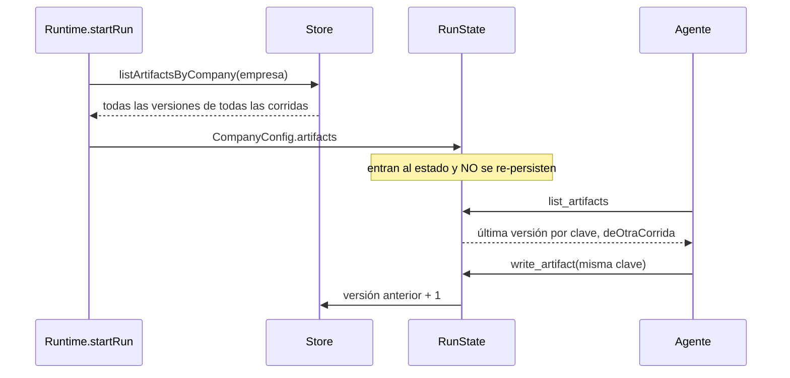

# Entregables

Un entregable (`Artifact`) es un documento que la empresa produce —una
propuesta, un informe, un guion, un plan— guardado en markdown con una **clave
estable** y una **versión**. Es la unidad de trabajo que se comparte entre
áreas, se revisa, se exporta a Word, PDF, video o deck, y sobrevive a la corrida
que lo escribió: los entregables son **de la empresa**, no de la corrida.

Existen porque un resultado que sólo vive en un mensaje se pierde, y porque las
habilidades de producción trabajan sobre un entregable ya escrito (reciben la
clave, nunca el contenido por argumento: ver
[[ADR-005 Las habilidades trabajan sobre entregables ya escritos]]).

## Datos

`packages/shared/src/schema.ts` → `artifactSchema`:

| Campo | Qué es |
|---|---|
| `id` | `art_…`, uno por **versión** |
| `runId` | Corrida que escribió esa versión |
| `key` | Identificador estable: `propuesta-retail`. Reusarlo crea la versión siguiente |
| `title` | Título legible |
| `contentType` | `markdown` (default), `json` o `text` |
| `content` | El documento, hasta 500.000 caracteres |
| `version` | Entero desde 1 |
| `authorRoleId` | Rol que escribió esa versión |
| `tick` | Ciclo en que se escribió |
| `createdAt` | Marca de tiempo |

> [!danger] No hay `updatedAt`
> Sólo `createdAt` y `version`. Ordenar por `updatedAt` para encontrar "el
> último" deja todo en `undefined` y el orden queda como salió de SQLite: lo
> pagamos renderizando un guion viejo encima del bueno, y el único síntoma fue
> que el video duraba 1m32s en vez de 2m54s. Se ordena por `version` y, a igual
> versión, por `createdAt`.

En la base (`apps/server/src/db.ts`), la tabla `artifacts` tiene `run_id` y
además `company_id`: `Store.saveArtifact(artifact, companyId)` lo completa y
`Store.listArtifactsByCompany` filtra por esa columna, **no** uniendo con
`runs`. Así un entregable sobrevive a que se borre su corrida (`deleteRun` se
lleva eventos, mensajes, tareas, aprobaciones y ledger, nunca artefactos). Se
van recién con la empresa (`artifacts` está en `TABLAS_POR_EMPRESA`).

## De la empresa, no de la corrida

- `RunState.writeArtifact` numera sobre la versión **máxima** de esa clave entre
  todo lo cargado: un área versiona lo que otra escribió la semana pasada en vez
  de volver a v1.
- `RunState.readArtifact` devuelve la versión más alta.
- `RunState.listArtifacts` devuelve la última versión de cada clave con
  `deOtraCorrida: runId !== corrida actual`. Sin esa marca el agente creía que
  lo había escrito él en este ciclo y lo daba por bueno sin leerlo.

## Las herramientas

Las cinco son `origin: "coordination"`: todo rol las tiene siempre. Viven en
`packages/tools/src/coordination.ts`, salvo `buscar_en_entregables`
(`packages/tools/src/busqueda.ts`).

### `write_artifact`

| Argumento | Obligatorio | Qué es |
|---|---|---|
| `key` | sí | Clave estable. Reusarla versiona |
| `title` | sí | Título legible |
| `content` | sí | Contenido **completo** |
| `content_type` | no | `markdown` (default) \| `json` \| `text` |

La descripción le pide al modelo escribir "como el documento que va a leer un
cliente": `# Título`, `## Secciones` con nombre, tablas para comparar, listas
para enumerar, nada sobre su proceso y los datos faltantes marcados como
pendientes.

Pasos del `execute`:

1. `readRequired` de `key`, `title`, `content` (en blanco cuenta como faltante;
   JSON cortado se avisa).
2. **Control de calidad**: `revisarCalidad(title, content)` (abajo). Un rechazo
   corta; un aviso deja guardar.
3. **Claves variantes**: si la clave es una variante de una existente, rechaza y
   ofrece la original (abajo).
4. `RunState.writeArtifact` → versión nueva, `persistence.saveArtifact`.
5. Resultado: "Entregable *título* guardado como *clave* v*N*." más el aviso de
   calidad si lo hubo. El loop emite `artifact.created`.

#### Claves variantes

Los agentes inventan una clave por ciclo (`propuesta-ciclo-3`,
`propuesta-v2`, `propuesta-final`) y el entregable termina partido en pedazos
que nadie integra. **Los modelos baratos fragmentan si esta guardia no está.**

La función `raiz` normaliza la clave: minúsculas, `_` y espacios a `-`, y quita
en cualquier posición `-ciclo N`, `-v N`, `-version N`, `-vers N`, `-parte N`,
`-rev N`, `-iter N`, un `-N` numérico suelto, y `-final`, `-inicial`,
`-borrador`, `-draft`, `-parcial`, `-actualizado/a`, `-nuevo/a`. Rechaza si:

- la raíz de la clave pedida es igual a la de una existente (distinta clave), o
- la pedida **cuelga** de una existente en frontera de guion:
  `plan-paginacion-detalle` sobre `plan-paginacion`. El agente lo usa para
  esquivar el versionado cuando el marcador no es un número.

Rechazo: "Ya existe el entregable *clave* (*título*, v*N*), que es lo mismo que
estás por crear con otra clave. Volvé a llamar write_artifact con key=*clave*…"

> [!warning] Una clave corta atrapa todo lo que cuelga de ella
> La regla del prefijo es asimétrica: con `plan` ya escrito, **cualquier**
> `plan-…` (por ejemplo `plan-comercial`) se rechaza como variante. Con
> `planificacion-comercial` no pasa, porque el corte es en frontera de guion. Y
> al revés no aplica: si existe `plan-paginacion-detalle`, crear
> `plan-paginacion` pasa. Conviene no usar claves genéricas de una palabra.

### `edit_artifact`

Corrige partes sin reescribir. Medido: entre v16 y v19 del mismo documento
cambió el 4% de las líneas y se reescribieron las 184 cada vez; el **21% de
todos los tokens de salida** de la corrida se fue en retipear texto idéntico. Y
reescribir 17.000 caracteres para tocar tres líneas es la forma más común de
agotar `max_tokens` a mitad del JSON.

| Argumento | Obligatorio | Qué es |
|---|---|---|
| `key` | sí | Entregable a corregir |
| `cambios` | sí | Lista de `{buscar, reemplazar}`, en orden; `reemplazar` vacío borra el bloque |

Reglas del `execute`:

- `cambios` tiene que ser una lista con al menos un elemento; cada uno con
  `buscar` no vacío.
- Si la clave no existe, lista las que hay y sugiere `write_artifact`.
- Cada `buscar` se cuenta **literal** (`contarApariciones`, sin regex). Si no
  aparece, se reintenta **ignorando cómo está partido el espacio**
  (`buscarIgnorandoEspacios`): los modelos copian una tabla de seis renglones
  aplanada en una línea, y es la causa de la mayoría de los rechazos medidos. El
  modo flexible sólo sirve si hay **un** candidato.
- 0 apariciones: rechaza y explica que, si juntó texto de secciones distintas,
  ese texto no existe seguido; sugiere apuntar a una sola línea o releer con
  `read_artifact(key, seccion)`. "Los cambios anteriores no se aplicaron: nada
  quedó a medias."
- Más de una: rechaza pidiendo contexto hasta que sea único.
- **Todo o nada**: los cambios se aplican sobre una copia; cualquier rechazo
  descarta los anteriores.
- Si el resultado es idéntico al original, no crea versión.
- La versión editada pasa **el mismo** `revisarCalidad`: por acá no entra lo
  que `write_artifact` rechazaría.
- Resultado: "*N* cambio(s), ahora es v*M*. Escribiste *X* caracteres en vez de
  los *Y* del documento entero."

> [!warning] `edit_artifact` no emite `artifact.created`
> `emitCoordinationEffect` (`packages/engine/src/loop.ts`) sólo emite el evento
> para `write_artifact`. Una versión creada por edición queda en la base y en
> la corrida, pero la traza en vivo no la anuncia como entregable nuevo: se ve
> sólo como la llamada a la herramienta.

### `read_artifact`

| Argumento | Obligatorio | Qué es |
|---|---|---|
| `key` | sí | Entregable |
| `seccion` | no | Encabezado tal como figura en el índice; parcial alcanza; **varias separadas por coma** |

Tres modos:

1. **Con `seccion`**: parte el pedido por comas y devuelve cada sección cuyo
   título **contenga** (sin mayúsculas) alguno de los pedidos. El texto va
   **literal**, con su encabezado y su nivel, precedido de "Recorte del
   entregable… tal cual está escrita en el documento". Si coinciden varias,
   avisa: "en el documento no van necesariamente seguidas". Si no coincide
   ninguna, lista los títulos reales.
2. **Documento largo**: si el contenido pasa `TOPE_ENTERO` (15.000 caracteres)
   **y** tiene más de un encabezado, devuelve el índice de títulos y cómo pedir
   varias secciones en una llamada o usar `buscar_en_entregables`.
3. **Si no**, el documento entero con `# Título (vN)` arriba.

> [!danger] Por qué 15.000 y por qué varias secciones por coma
> En un turno delegado cada llamada cuesta una vuelta entera: el prefijo de la
> conversación, 20.000 a 28.000 tokens, se reenvía completo. Con el tope viejo
> de 4.000 caracteres todo caía en el índice y se leía de a secciones: medimos
> 132 lecturas sobre 298 llamadas de un ciclo, y **90 lecturas del mismo
> documento en cinco turnos**. Traer 15.000 caracteres de una vez sale dos
> órdenes de magnitud más barato que 18 viajes.
>
> `TOPE_ENTERO` (15.000) está **acoplado** a `TOPE_RESULTADO` (16.000) de
> `packages/engine/src/acotar.ts`: lo que entra a un turno delegado se acota ahí,
> así que mandar más sería mandar algo que llega cortado. Si movés uno, mirá el
> otro. Ver [[Turnos delegados a un CLI]].

Casos borde:

- Un documento de más de 15.000 caracteres con **uno o ningún** encabezado se
  devuelve entero (no tiene índice útil) y en un turno delegado lo corta
  `acotar.ts`.
- El texto anterior al primer encabezado (preámbulo) no pertenece a ninguna
  sección: en modo índice no se puede pedir por `seccion`, sólo por
  `buscar_en_entregables`.
- Un título que contenga una coma no se puede pedir entero: la coma parte el
  pedido. Pedí un fragmento del título.
- La lectura se memoiza por turno: una relectura idéntica devuelve un puntero.
  `write_artifact` y `edit_artifact` vacían el memo, así que leer después de
  editar trae la versión nueva. **Entre turnos no hay memo**, a propósito: la
  conversación del CLI se reinicia y releer es legítimo.

### `list_artifacts`

Sin argumentos. `- clave: título (vN)` por cada clave, con la marca
"— ya existía de un trabajo anterior, leelo antes de tocarlo" en los de otra
corrida. La descripción pide mirarlo **antes** de escribir, para versionar en
vez de abrir una clave parecida.

### `buscar_en_entregables`

| Argumento | Obligatorio | Qué es |
|---|---|---|
| `pregunta` | sí | Qué se necesita saber, en palabras |
| `clave` | no | Limitar a un entregable |

Busca en **todo** lo que la empresa escribió y devuelve sólo los fragmentos que
responden, con su fuente. Existe por dos mediciones: 71 lecturas completas en
una corrida (6.570 caracteres de promedio, 21.291 el mayor) y 87 de 277
herramientas gastadas en mensajes entre agentes, buena parte pidiendo datos que
ya estaban escritos. Preguntarle a un colega cuesta un ciclo; buscar cuesta una
vuelta del mismo turno.

Cómo puntúa (léxico, sin red, determinista y testeable):

1. `terminos(pregunta)`: sin tildes ni mayúsculas, partido en palabras, se
   quedan las de **más de 3 caracteres** que no están en `VACIAS` (conectores
   del castellano y algunos del inglés).
2. Cada entregable (o sólo la `clave` pedida) se corta con `bloques`.
3. `puntuar`: por cada término, +3 si aparece en el título del bloque, +1 si
   sólo en el cuerpo.
4. Orden por puntos y, a igual puntaje, el fragmento más corto primero. Salen
   los **5** mejores, cada uno recortado a **900** caracteres, con
   `--- clave vN › título`. Si hay más, lo dice.

Sin términos útiles: "La pregunta no tiene palabras con las que buscar". Sin
resultados: "Nada sobre … Si el dato no está escrito, buscalo con web_search o
pedíselo a quien lo tenga."

> [!note] Siglas de tres letras no cuentan
> Como sólo cuentan los términos de más de tres caracteres, `IVA`, `USD` o
> `PDF` no se buscan: "precio USD" busca sólo "precio". Una pregunta hecha sólo
> de siglas cortas rebota por falta de términos.

La búsqueda es léxica a propósito: sobre unas decenas de documentos rinde casi
igual que una semántica. Si la biblioteca crece a cientos, el reemplazo natural
son embeddings, y la interfaz de la herramienta no cambia.

## Buscar parte el documento; mostrar, no

`packages/tools/src/busqueda.ts` tiene dos cortadores y la diferencia no es de
estilo:

| | `bloques` | `secciones` |
|---|---|---|
| Para qué | **Buscar**: puntuar fragmentos | **Mostrar**: índice y lectura por sección |
| Encabezados | `#` a `####`, guarda el título sin `#` | `#` a `####`, guarda el encabezado **con** sus `#` y su nivel |
| Tramos largos | Parte al pasar 1.200 caracteres y **repite el título** en cada tramo | Nunca parte: una sección larga sigue siendo una |
| Preámbulo | Bloque con título vacío | No pertenece a ninguna sección |
| Texto | Recortado y rearmable | **Recorte literal**: se puede copiar tal cual a un `buscar` |

> [!danger] Usar `bloques` para el índice mintió dos veces
> Un informe de **18 encabezados se anunciaba como 23 secciones**: cinco títulos
> aparecían dos veces porque sus secciones pasaban los 1.200 caracteres. Dos
> agentes leyeron eso como encabezados duplicados y gastaron nueve llamadas
> fallidas más una reescritura entera en "corregir" un documento sano. Y al
> rearmar el texto se reponían los `#` a mano con `##` fijo: en la costura entre
> dos tramos aparecía un `## Resumen ejecutivo` que el documento no tenía, el
> agente lo copiaba a un `buscar` y `edit_artifact` no lo encontraba nunca.

El corolario vale para cualquier herramienta: **si un agente concluye que una
herramienta está rota, sospechá primero de lo que la herramienta le mostró**.
Esa conclusión quedó grabada como lección —"`edit_artifact` no sirve para
multilínea, reescribí el documento entero"— y desde la memoria iba a inducir el
mismo gasto en todas las corridas siguientes. Ver
[[CU-12 Refutar una lección falsa]].

## Control de calidad al escribir: `revisarCalidad`

`revisarCalidad(title, content)` devuelve `{rechazo?}` (no se guarda) o
`{aviso?}` (se guarda y se avisa). Se verifica en la herramienta y no sólo en el
prompt: el render puede maquetar lo que recibe, pero no puede inventar una
estructura que no está.

| Regla, en orden | Resultado | Por qué |
|---|---|---|
| Título con palabras de **dictamen** (`PALABRAS_DE_DICTAMEN`): corrección/es, revisión, observaciones, hallazgos, devolución, feedback, checklist de calidad/revisión, control de calidad, informe de revisión | rechazo: "es una revisión, no un entregable. Una devolución se manda con reply…" | Un revisor guardó sus correcciones **con la clave del guion**: la versión siguiente del guion eran las notas de revisión, y lo que se filmó fue una lista de correcciones leída en voz alta |
| Título con palabras de **proceso** (`PALABRAS_DE_PROCESO`): "ciclo N", "bandeja de entrada", "respuesta a pedido", "seguimiento del pedido", "mi turno", "herramienta(s) (no) disponible(s)" | rechazo: "habla de tu proceso interno… titulalo por lo que resuelve" | Títulos reales como "Respuesta a pedido (Ciclo 4 - Bandeja de entrada)" |
| Contenido de menos de 400 caracteres | pasa | Una nota corta no necesita estructura |
| Sin ningún `#`–`###` al inicio de línea y con menos de 3 ítems de lista | rechazo: "bloque de texto sin estructura" | El muro de texto con punto y coma se exporta exactamente así de mal |
| Algún párrafo de más de 900 caracteres que no sea una tabla (no empieza con barra vertical) | **aviso**, se guarda | Rechazarlo costaba un turno por intento: un agente agotó sus 8 iteraciones peleando con esto |

> [!warning] El filtro de dictamen mira sólo el título, y es amplio
> Un entregable legítimo titulado "Hallazgos del diagnóstico" o "Manual de
> revisión de tableros" se **rechaza**: las palabras están en el título. El
> test "no confunde un documento que sólo menciona una revisión" usa en realidad
> el título "Informe de estado", así que no cubre ese caso. El agente tiene que
> retitular ("Diagnóstico: resultados").

## Verificación de cifras antes de exportar

La exportación a Word y PDF rechaza un entregable con cifras (`$` con 4+
dígitos, o un porcentaje) si nadie corrió `verificar_cifras` sobre **esa
versión** con cero cifras malas (`revisarCifras` en
`packages/tools/src/skills/index.ts`). Editar o reescribir el documento invalida
la verificación anterior. El contrato de `verificar_cifras` está en
[[Coordinación entre agentes]] y la exportación en [[Documentos Word y PDF]].

## Integración

- **Eventos**: `artifact.created` (sólo `write_artifact`) con `artifactId`,
  `key`, `title`, `version`, `authorRoleId`. Ver [[Referencia de eventos]].
- **HTTP**: `GET /api/runs/:id` trae los artefactos de la corrida
  (`Store.listArtifacts(runId)`). Ver [[Referencia de API]].
- **Pantallas**: la pestaña de entregables del proceso en vivo y la salida
  exportada ([[Pantalla Proceso en vivo]], [[Pantalla Salida]]).
- **Habilidades**: `export_docx`, `export_pdf`, `export_video`,
  `export_slides`… reciben `artifact_key` (ver [[Habilidades de producción]]).
- **Detector de corrida vacía**: el scheduler cuenta entregables para decidir si
  una corrida "no produjo nada" (ver [[Supervisión y continuidad]]).

## Qué fijan los tests

`packages/tools/src/coordination.test.ts`:

- "un solo entregable por tema": rechaza `-ciclo-3`, `-v2`, `_final`, `-2`; deja un documento distinto; deja versionar con la misma clave.
- "normalización de claves con marcadores en medio": casos observados (`-ciclo3-final`, `-ciclo5_v1`), sufijos colgados (`-detalle`, `-tecnico-anexo`), y no confunde `planificacion-comercial` con `plan`.
- "un entregable tiene que parecer un documento": acepta secciones y listas; rechaza dictámenes y títulos de proceso con el camino correcto en el mensaje; rechaza el muro de texto; deja la nota corta; el párrafo interminable se guarda con aviso; una tabla larga no es un párrafo.
- "editar un entregable por reemplazo": aplica y versiona; rechaza lo ambiguo; no deja a medias; no versiona si nada cambió.
- "editar tolerando cómo quedó partido el espacio": encuentra la tabla aplanada; sigue rechazando si hay más de un candidato.
- "read_artifact: costo de leer": ~8.000 caracteres llegan enteros; ~30.000 devuelven índice; varias secciones en una llamada con el aviso de que no van seguidas.

`packages/tools/src/busqueda.test.ts`: cada fragmento viaja con su encabezado; devuelve el fragmento y no el documento; dice que no está; rechaza preguntas sin términos; `secciones` no parte, es literal, conserva el nivel, no inventa una sección para el preámbulo.

`packages/engine/src/roles.test.ts` → "entregables compartidos entre áreas": otra área lee lo anterior, versiona sobre lo existente, distingue los de antes y no re-persiste.

## Cómo extender

- Una regla de calidad nueva va en `revisarCalidad`, con su test en
  "un entregable tiene que parecer un documento". Preferí **aviso** a rechazo si
  el documento ya tiene estructura: cada rechazo cuesta un turno.
- Si cambiás `TOPE_ENTERO`, revisá `TOPE_RESULTADO` en `acotar.ts`.
- Para mostrarle un documento a un agente usá `secciones`; `bloques` es sólo
  para puntuar.

## Fuentes

- `packages/tools/src/coordination.ts` → `writeArtifact`, `editArtifact`, `readArtifact`, `listArtifacts`, `revisarCalidad`, `PALABRAS_DE_PROCESO`, `PALABRAS_DE_DICTAMEN`, `buscarIgnorandoEspacios`, `contarApariciones`
- `packages/tools/src/busqueda.ts` → `bloques`, `secciones`, `puntuar`, `terminos`, `buscarEnEntregables`
- `packages/engine/src/state.ts` → `RunState.writeArtifact`, `readArtifact`, `listArtifacts`
- `packages/engine/src/loop.ts` → `emitCoordinationEffect`, `invalidarMemo`
- `packages/engine/src/acotar.ts` → `TOPE_RESULTADO`
- `packages/tools/src/skills/index.ts` → `revisarCifras`, `buscarEntregable`
- `apps/server/src/db.ts` → `saveArtifact`, `listArtifactsByCompany`, `deleteRun`
- `packages/shared/src/schema.ts` → `artifactSchema`

## Ver también

- [[Coordinación entre agentes]]
- [[Habilidades de producción]]
- [[Documentos Word y PDF]]
- [[Turnos delegados a un CLI]]
- [[CU-01 Propuesta comercial]]
- [[CU-04 Control de calidad entre agentes]]
