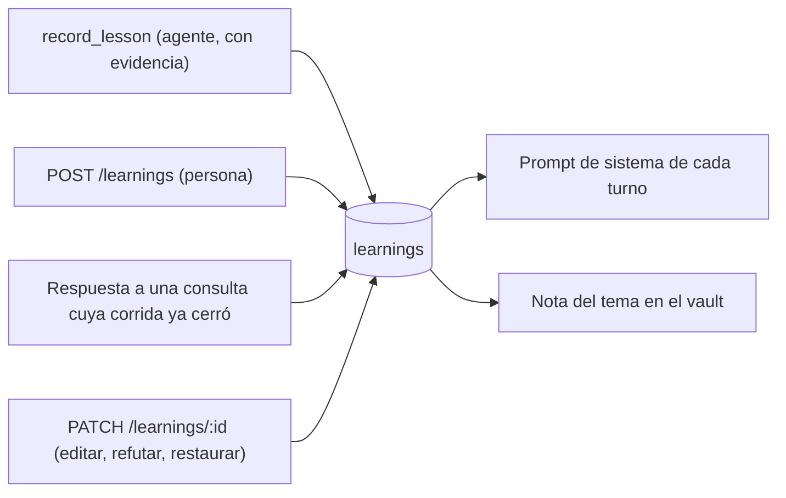

# Memoria de la empresa

Las corridas son efímeras; lo que la empresa **aprende** no. La memoria son
lecciones cortas —una tarifa, un criterio de estimación, un error a no repetir—
que viven a nivel empresa y entran en el prompt de **cada turno** de todas las
corridas siguientes. Es lo que evita volver a pagar por conocimiento que la
empresa ya tiene: sin memoria, cada corrida re-deriva lo mismo a fuerza de
mensajes entre agentes.

Y es **memoria gobernada**: una lección es un reclamo que requiere evidencia,
no un hecho a guardar. Se registra con evidencia, se confirma sólo con otra
corrida u otro autor, viaja con su procedencia y, si resulta falsa, una persona
la refuta sin borrarla.

## Por qué existe, y por qué gobernada

Medido en una corrida real: un entregable producido con modelos gratuitos
**citó la memoria sembrada** —tomó las "900-1200 horas" y el "plan de migración
sin cortar la operación" de las lecciones en vez de re-derivarlas—. Es la
demostración de que la memoria evita repetir consumo (ver
[[Estado del producto]]).

Pero una memoria que acepta todo se envenena. Un rol concluyó que
`edit_artifact` estaba rota —era el índice de `read_artifact` el que le mostraba
secciones duplicadas que no existían— y la lección falsa entró a la memoria,
lista para degradar todas las corridas siguientes. De ahí salen la evidencia
obligatoria, las confirmaciones independientes, la procedencia en el prompt y
la refutación humana. El caso completo está en
[[CU-12 Refutar una lección falsa]].

## Dos memorias, y la línea la fija la aritmética

| | Memoria corta (esta nota) | Memoria larga ([[Vault de contexto]]) |
|---|---|---|
| Qué | Una lección de un párrafo | Dossiers, mapas de pantalla, decisiones con su porqué |
| Dónde | Tabla `learnings` de SQLite | Vault de Obsidian por empresa |
| Cómo llega al agente | **Siempre**, en el prompt de sistema | Viaja el **mapa**; el contenido se abre con `leer_contexto` |
| Se escribe con | `record_lesson` | `escribir_contexto` |

Una llamada a herramienta dentro de un turno delegado cuesta una iteración
entera —20.000 a 28.000 tokens de prefijo reenviado—, así que por debajo de
unos **800 caracteres** sale más barato **mandar** que ir a buscar, y por encima
al revés. La memoria corta va en el prompt y no detrás de una herramienta a
propósito: detrás de una tool el agente gastaría un turno en descubrirla, otro
en llamarla, y muchas veces no la llamaría.

## Datos: `Learning`

`packages/shared/src/schema.ts` → `learningSchema`:

| Campo | Qué es |
|---|---|
| `id` | `lrn_…` |
| `companyId` | Ámbito **empresa**: sobrevive a la corrida que la produjo |
| `topic` | Agrupador corto, hasta 120 caracteres: `precios`, `estimación`, `cliente:retail` |
| `lesson` | La lección, autocontenida y accionable, hasta 4.000 caracteres |
| `authorRoleId` | Rol que la registró; `null` si vino de una persona |
| `runId` | Corrida en la que se aprendió |
| `timesConfirmed` | Veces que se reafirmó (arranca en 1); ordena el prompt |
| `evidencia` | Qué la respalda: herramienta y resultado (hasta 600) |
| `estado` | `activa` (default) \| `cuestionada` \| `refutada` |
| `refutacion` | `{motivo, at}`: el tombstone; sólo lo pone una persona |
| `confirmaciones` | Quién la reafirmó de verdad: `{roleId, runId, at}`, hasta 20 |
| `createdAt`, `updatedAt` | Marcas de tiempo |

## Cómo entra

### `record_lesson` (un agente)

`packages/tools/src/coordination.ts` → `recordLesson`, `origin: "coordination"`.

| Argumento | Obligatorio | Qué es |
|---|---|---|
| `topic` | sí | Agrupador corto |
| `lesson` | sí | Autocontenida: alguien que no vio la conversación tiene que poder aplicarla |
| `evidence` | sí | Qué hizo en esta corrida que la respalda: "edit_artifact falló 9 veces con el mismo error de texto no encontrado" |

1. Los tres campos presentes (`readRequired`). Sin `evidence`, la llamada ni
   entra.
2. **Gate de evidencia**: la actividad del actor en **esta** corrida tiene que
   mostrar al menos una herramienta que no esté en `HABLAR_NO_ES_EVIDENCIA`.
   Si no: "tu actividad en esta corrida no muestra ninguna herramienta que pueda
   respaldar una lección — sólo mensajes. Trabajá primero… Si la lección te
   llegó por un mensaje, que la registre quien lo comprobó."
3. `evidence` se recorta a 600 caracteres y se guarda en `evidencia`.
4. `RunState.recordLesson` deduplica y persiste (abajo).
5. Respuesta: "Lección registrada bajo *tema*…" o, si ya existía y
   `timesConfirmed > 1`, "Lección reafirmada".

`HABLAR_NO_ES_EVIDENCIA` es una lista **por nombre**, no por origen: `send_message`,
`reply`, `broadcast`, `escalate`, `record_lesson`, `list_my_tasks`,
`list_artifacts`, `check_activity`, `estado_del_proceso`, `request_context`,
`request_approval`, `request_new_role`, `request_tool_access`,
`solicitar_servidor_mcp`. El corte no es por origen porque `edit_artifact`
también es de coordinación y sus fallos son exactamente la evidencia que se
pide. El gate es **binario** a propósito —¿hizo algo observable, más allá de
hablar?— sin validar la cita semánticamente: eso sería burocracia frágil. Leer
cuenta (`read_artifact`): un revisor que sólo leyó puede registrar lo que vio.

> [!note] Lo que el gate deja pasar
> Cualquier herramienta fuera de la lista cuenta, también un fallo. Algunas que
> sólo piden cosas no están en la lista y sí cuentan como evidencia:
> `solicitar_comando`, `instalar_dependencia` (que el loop sí trata como
> comunicación en `COMUNICACION`), `convocar_especialista`,
> `crear_herramienta`, `leer_contexto`, `escribir_contexto`. Y sólo cuenta la
> actividad **propia**: la de otro rol no respalda.

### El POST de una persona

`POST /api/companies/:companyId/learnings` con `{topic (1-120), lesson (1-4000)}`
(`apps/server/src/routes.ts`). Aplica **la misma regla de dedupe** que
`record_lesson`: si ya existe, suma una confirmación (`roleId: null, runId: null`)
y devuelve la existente; si no, crea una con `evidencia: "cargada a mano por la
persona a cargo"` y responde 201. En los dos casos espeja el tema al vault. Es
la forma más barata de que una empresa arranque sabiendo algo: sembrarla desde
la pantalla Memoria antes de la primera corrida.

### La respuesta a una consulta, cuando la corrida ya cerró

Contestar un `request_context` cuya corrida ya no está viva (ni hay otra que la
herede) no llega a ninguna bandeja: `Runtime.notifyRequester` la guarda como
lección con `topic: "consulta: <pregunta>"` (recortado a 120), la respuesta
recortada a `TOPE_RESPUESTA` (600) y `evidencia: "respuesta de la persona a cargo
a una consulta"`. Si la respuesta es más larga, la completa va al vault en
`Consultas/<pregunta>.md` y la lección apunta ahí. Sin el recorte, esta puerta
metía respuestas de 5.570 caracteres como lecciones. Ver
[[Aprobaciones y solicitudes]].

## Dedupe y confirmaciones

La regla vive **una sola vez** en `@orq/shared`: `normalizarLeccion`
(minúsculas, sin tildes, todo lo que no sea `a-z0-9` o espacio pasa a espacio,
espacios colapsados). Dos lecciones son la misma si coinciden tema **y** texto
normalizados. La memoria entra por dos puertas (`record_lesson` y el POST) y con
dos copias de la regla lo que una consideraba repetido la otra lo creaba de
nuevo.

En `RunState.recordLesson` (`packages/engine/src/state.ts`), repetir una
lección existente **no crea fila**. Sube `timesConfirmed` y agrega una
confirmación sólo si es **independiente**: si la lección no tiene
confirmaciones, el nuevo registro tiene que venir de otro autor u otra corrida
que la original; si tiene, de otro autor u otra corrida que la **última**
confirmación. Si no es independiente, no se toca ni se re-persiste.

> [!warning] `timesConfirmed` era un contador de insistencia
> Antes cualquier repetición sumaba, y el número terminaba midiendo cuántas
> veces el mismo agente dijo lo mismo en el mismo turno —con cara de
> verificación, y encima ordenando el prompt—.

Límite conocido: la independencia se compara sólo contra la **última**
confirmación, así que A, B, A en la misma corrida cuenta tres.

## Cómo sale: el prompt

`buildMemorySection` (`packages/engine/src/prompt.ts`) arma la sección "## Lo
que esta empresa ya aprendió":

1. Descarta las `refutada`.
2. Ordena por `timesConfirmed` y, a igual, por `updatedAt` (`RunState.learnings`).
3. Toma hasta **25**.
4. Recorre acumulando caracteres hasta `TOPE_MEMORIA` (3.200); una lección de
   más de `TOPE_LECCION` (400) se recorta con "… (recortada)".
5. Cada línea lleva su **procedencia**, fuera del recorte:
   `— <autor o "cargada a mano">, <mes año>, confirmada N×`. Las `cuestionada`
   van con `(?)` adelante.
6. Agrupa por tema (`**tema**` y viñetas).
7. Si quedaron lecciones afuera o recortadas, lo dice y sugiere preguntar con
   `request_context` nombrando el tema.

El encabezado ya no dice "dalo por válido": pide usar la memoria como punto de
partida, dar más peso a lo confirmado por varias corridas, y registrar la
corrección con `record_lesson` citando evidencia si lo actual lo contradice.

> [!danger] La memoria llegó a ser el 54% del prompt
> Medido en una empresa: 2.532 tokens de memoria, el 54% del prompt de sistema,
> reenviados en cada llamada: 825k tokens en una corrida, el **19% del gasto**,
> casi todo material que no tenía nada que ver con el turno. La inflaron tres
> respuestas a consultas guardadas enteras (hasta 5.570 caracteres, contra 167
> de una lección de verdad). De ahí el tope por tamaño y no sólo por cantidad.

El formato de la fecha es fijo (`es-AR`, mes corto) para que el prompt sea
determinista y el caché de prefijo no se invalide.

## Refutar, cuestionar, editar, borrar

`PATCH /api/companies/:companyId/learnings/:id` acepta parcialmente `topic`,
`lesson`, `estado` y `motivoDeRefutacion` (1-600):

| Acción | Efecto |
|---|---|
| `estado: "refutada"` + motivo | `refutacion = {motivo, at}`; sale del prompt; **queda** en la base y en el vault, tachada bajo "Refutadas" |
| `estado: "refutada"` sin motivo | 400: "Refutar exige el motivo: es lo que evita re-aprender el mismo error." |
| `estado: "activa"` (restaurar) | Limpia el tombstone; vuelve al prompt |
| `estado: "cuestionada"` | Entra al prompt con `(?)` y en el vault como "(sin verificar)". La pantalla Memoria no ofrece este estado: sólo la API |
| `topic` / `lesson` | Edita; si cambia el tema, se reescriben la nota vieja y la nueva |

`DELETE /api/companies/:companyId/learnings/:id` borra la fila y reescribe la
nota del tema (o la borra si quedó vacía). Borrar es **olvidar**; para una
lección falsa se refuta, porque el registro de por qué se creyó y por qué era
falso evita re-aprender el mismo error.

La refutación es **humana a propósito**: un agente que discrepa registra la
corrección con evidencia (`record_lesson`), y la tensión la resuelve una persona
desde [[Pantalla Memoria]].

## El espejo al vault

Cada cambio de memoria reescribe la nota de su tema en el vault
(`Runtime.espejarAprendizajes`): el `saveLearning` del puerto de persistencia de
la corrida (o sea cada `record_lesson`) y el POST, el PATCH y el DELETE de la
API. Se reescribe la nota **entera** —se lee como documento, no como log— y un
tema sin lecciones se **borra**: el vault seguía enseñando una lección ya
borrada de la base, y nadie sospecha de una nota que está ahí. El formato de la
nota está en [[Vault de contexto]].

> [!warning] La lección que nace de una consulta no se espeja
> `notifyRequester` guarda la lección de "consulta: …" con `store.saveLearning`
> directo, sin pasar por `espejarAprendizajes`: esa tercera puerta no llega al
> vault hasta que otro cambio toque el mismo tema o se corra
> `scripts/vault-contexto.ts`. La respuesta larga sí queda en `Consultas/`.

## Constantes

| Constante | Valor | Dónde | Por qué |
|---|---|---|---|
| Límite de lecciones | 25 | `buildMemorySection(state, limit = 25)` | Techo por cantidad |
| `TOPE_MEMORIA` | 3.200 caracteres | `prompt.ts` | Techo por tamaño: la memoria llegó al 54% del prompt |
| `TOPE_LECCION` | 400 caracteres | `prompt.ts` | Que una sola no se coma el cupo |
| Evidencia | 600 caracteres | `recordLesson` (recorte) y `learningSchema` | Una cita, no un volcado |
| `TOPE_RESPUESTA` | 600 caracteres | `Runtime.notifyRequester` | Las respuestas enteras inflaban el prompt |
| Confirmaciones guardadas | 20 | `learningSchema`, `recordLesson` | El contador sigue subiendo; la lista no |
| `topic` / `lesson` | 120 / 4.000 | `learningSchema` | Validado al **leer**, no al guardar (ver abajo) |

## Invariantes

- **`Store.listLearnings` parsea por Zod** (`learningSchema.parse`), y es el
  único punto de lectura. `Store.many` hace `JSON.parse` crudo y los
  `.default()` no se aplican solos: las filas anteriores al cambio de esquema no
  tienen `estado` ni `confirmaciones`, y sin el parse el filtro de refutadas
  compararía contra `undefined`. Hay un test de compatibilidad
  (`insertarCrudoParaTests`).
- La regla de dedupe es una: `normalizarLeccion`.
- Refutar no borra; borrar es otra acción.
- La corrida carga **todas** las lecciones de la empresa al arrancar (también
  las refutadas: el filtro está en el prompt).

## Casos borde

| Síntoma | Causa |
|---|---|
| El agente registra y recibe "sólo mensajes" | No ejecutó nada fuera de `HABLAR_NO_ES_EVIDENCIA` en esta corrida |
| Una lección refutada "se reafirma" | La dedupe la encuentra aunque esté refutada: suma confirmación, **sigue refutada** y fuera del prompt, pero la herramienta contesta "Lección reafirmada" |
| Una lección de una persona aparece como "cargada a mano" aunque vino de una consulta | `authorRoleId: null` en las dos puertas humanas; la diferencia está en `evidencia` |
| "un rol que ya no está" en la procedencia | El autor fue borrado de la empresa |
| La memoria de una empresa deja de cargar y la corrida no arranca | Una fila con `topic` de más de 120 o `lesson` de más de 4.000 caracteres: nadie valida al guardar y `listLearnings` hace `parse` directo, que tira. `record_lesson` no acota esos largos |
| Un rechazo de consulta aparece como lección | Con la corrida cerrada, `notifyRequester` guarda la `resolution` de un `context` aunque la solicitud se haya **rechazado** |

## Integración

- **Herramienta**: `record_lesson` ([[Coordinación entre agentes]]).
- **HTTP**: `GET /api/companies/:companyId/learnings` (ordenadas por
  confirmaciones y fecha), `POST`, `PATCH /:id`, `DELETE /:id`. Ver
  [[Referencia de API]].
- **Pantalla**: [[Pantalla Memoria]]: lista por tema, refutadas tachadas con su
  motivo, evidencia, "reafirmada ×N", editar (con refutar/restaurar) y olvidar.
- **Vault**: [[Vault de contexto]], `CONTEXTO_DIR`.
- **Eventos**: no hay variante propia; en la traza se ve el `tool.end` de
  `record_lesson`.
- **Borrado**: `learnings` está en `TABLAS_POR_EMPRESA`: se va con la empresa.

## Qué fijan los tests

- `packages/engine/src/memory.test.ts` → lo aprendido entra al prompt sin gastar un turno; sin memoria no ensucia; acota por cantidad priorizando las reafirmadas y por tamaño; repetir no duplica y confirmar exige otro autor; queda atribuida a su autor; se persiste con ámbito empresa; una refutada no entra pero sigue en la lista; cada lección viaja con su procedencia; una cuestionada entra marcada.
- `packages/tools/src/coordination.test.ts` → "record_lesson exige evidencia": sin `evidence` no entra; quien sólo habló no puede; los fallos propios sí son evidencia; la actividad ajena no cuenta.
- `apps/server/src/routes.test.ts` → "memoria por HTTP": 400 con detalle de Zod; cargar dos veces confirma en vez de duplicar; PATCH refuta con motivo y la saca del prompt sin borrarla; DELETE saca la lección y su nota.
- `apps/server/src/memoria-persistida.test.ts` → ciclo completo con SQLite y vault reales: persiste, llega al prompt, la refutación la saca sin borrarla y el vault conserva el tombstone.
- `apps/server/src/contexto.test.ts` → `notaDeAprendizajes` agrupa por tema con las reafirmadas arriba.

## Cómo extender

Si agregás otra puerta de entrada a `learnings`: deduplicá con
`normalizarLeccion`, leé siempre por `Store.listLearnings` (parse por Zod),
validá largos antes de guardar y llamá a `Runtime.espejarAprendizajes` con el
tema. Un campo nuevo en `learningSchema` necesita `.default()` para que las
filas viejas sigan parseando.

## Fuentes

- `packages/tools/src/coordination.ts` → `recordLesson`, `HABLAR_NO_ES_EVIDENCIA`
- `packages/engine/src/state.ts` → `RunState.recordLesson`, `learnings`
- `packages/engine/src/prompt.ts` → `buildMemorySection`, `procedencia`, `TOPE_MEMORIA`, `TOPE_LECCION`
- `packages/shared/src/schema.ts` → `learningSchema`, `normalizarLeccion`
- `apps/server/src/db.ts` → `saveLearning`, `listLearnings`, `deleteLearning`, `insertarCrudoParaTests`
- `apps/server/src/routes.ts` → rutas `/api/companies/:companyId/learnings`
- `apps/server/src/runtime.ts` → `espejarAprendizajes`, `notifyRequester`, persistencia `saveLearning` en `startRun`
- `apps/server/src/contexto.ts` → `notaDeAprendizajes`, `rutaDeTema`
- `apps/web/src/routes/Memory.tsx` → `EditorDeLeccion`

## Ver también

- [[Vault de contexto]]
- [[CU-12 Refutar una lección falsa]]
- [[Prompt de un turno]]
- [[Costos y presupuesto]]
- [[Aprobaciones y solicitudes]]
- [[Pantalla Memoria]]
