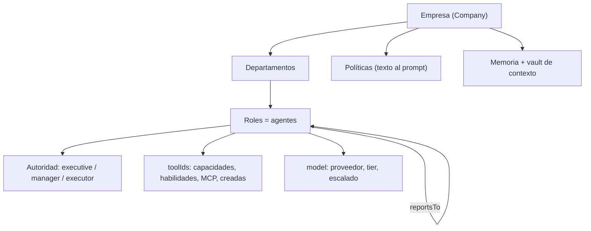

# Organización de agentes

Una empresa del orquestador es un **organigrama de agentes**: cada rol es un
agente con su propio prompt, su modelo, sus herramientas, un nivel de autoridad y
un jefe (`reportsTo`). Los roles se agrupan en departamentos y **no comparten
contexto**: un agente sólo sabe lo que le escriben, igual que una persona en una
organización real.

La metáfora no es decorativa. La jerarquía decide a quién se le puede asignar
trabajo, quién puede sumar gente o herramientas, quién puede borrar un
entregable y con qué modelo corre cada turno. Y todo eso se valida **en el
ejecutor de la herramienta, no en el prompt**: un agente puede ignorar una
instrucción, pero no puede saltearse el código que rechaza la llamada.

Esta nota es la puerta de la carpeta: define las piezas (roles, departamentos,
autoridad, jerarquía) y dice qué habilita cada nivel. El detalle de cada
mecanismo vive en su propia nota.

## Mapa de la carpeta

| Nota | Qué cubre |
|---|---|
| [[Coordinación entre agentes]] | Mensajería, tareas, auditoría en vivo y cálculo: el contrato de cada herramienta de coordinación |
| [[Entregables]] | `write_artifact`, `edit_artifact`, `read_artifact`, versiones, control de calidad, secciones y búsqueda |
| [[Memoria de la empresa]] | Lecciones cortas que viajan en el prompt, con evidencia y refutación |
| [[Vault de contexto]] | El conocimiento largo de cada empresa como vault de Obsidian |
| [[Aprobaciones y solicitudes]] | Lo que un agente le pide a una persona y lo que una persona aprueba |
| [[Supervisión y continuidad]] | `estado_del_proceso`, tareas heredadas y cómo se retoma un encargo largo |
| [[Especialistas convocados]] | `convocar_especialista` y la empresa que crece en plena corrida |
| [[Herramientas compuestas]] | `crear_herramienta`: procedimientos que un agente deja armados |
| [[Auditoría de corridas]] | La auditoría procedimental de una corrida terminada (`npm run auditar`) |
| [[Plantillas de equipo]] | Organigramas probados para arrancar un proyecto con equipo |

## Las piezas

### Empresa

`packages/shared/src/schema.ts` → `companySchema`. Lo que importa para la
organización:

| Campo | Para qué |
|---|---|
| `mission` | Misión de la empresa; entra al prompt de todos los roles |
| `context` | Contexto de negocio (hasta 20.000 caracteres) que **todos** los agentes reciben en su prompt |
| `budgetUsd` | Tope de gasto por corrida (default US$1); el motor corta al superarlo |
| `defaultModel` | Modelo que heredan los roles nuevos, los convocados y los aprobados |

### Departamento

`departmentSchema`: `id`, `companyId`, `name`, `purpose`, `parentId`, `position`.

- `purpose` entra al prompt del rol ("Departamento: X. <propósito>").
- `broadcast` le escribe a todos los roles de un departamento a la vez (ver
  [[Coordinación entre agentes]]).
- `convocar_especialista` y `request_new_role` **crean el departamento por
  nombre** si no existe (comparación sin mayúsculas). Un especialista suele
  traer un área que la empresa no tenía.
- `parentId` existe en el esquema pero **ningún comportamiento lo usa**: todos
  los caminos de alta lo dejan en `null` y sólo se remapea al importar un
  blueprint (`apps/server/src/routes.ts`). La jerarquía real es la de los roles.
- `position` es sólo presentación.

### Rol

`roleSchema`. Un rol **es** un agente: persiste entre ciclos, tiene bandeja propia
y no ve la conversación de nadie más.

| Campo | Default | Qué controla |
|---|---|---|
| `name`, `title` | — | Cómo lo nombran los demás. Las herramientas resuelven roles **por nombre, cargo o id**, sin mayúsculas (`resolveRole` en `packages/tools/src/coordination.ts`): los modelos confunden identificadores opacos |
| `departmentId` | — | Área a la que pertenece |
| `systemPrompt` | `""` | Instrucciones propias, hasta 20.000 caracteres; se compone con el contexto de la empresa |
| `model` | — | Proveedor, tier, slug fijo y escalado por dificultad (ver [[Escalado por dificultad]]) |
| `toolIds` | `[]` | Herramientas asignadas. Las de coordinación se otorgan **siempre**, sin mirar este campo |
| `authority` | `executor` | Nivel de autoridad (abajo) |
| `reportsTo` | `null` | A quién escala. `null` = tope de la jerarquía |
| `maxTurns` | 8 (máx. 50) | Iteraciones máximas del loop en un turno |
| `spendApprovalThresholdUsd` | `null` | Monto por encima del cual el prompt le pide `request_approval` |
| `position` | `{0,0}` | Lugar en el organigrama |

> [!note] Las de coordinación no se asignan
> `ToolRegistry.forRole` (`packages/tools/src/registry.ts`) devuelve **todas**
> las de `origin: "coordination"` más las que `toolIds` nombra. En la UI de
> asignación no se presentan como quitables, porque no lo son. Ver
> [[Herramientas y tool router]].

### Políticas

`policySchema`: `name`, `statement` (va al prompt de los roles alcanzados),
`appliesToRoleIds` (vacío = toda la empresa) y un `gate` opcional
`{ type: "spend_above", amountUsd, requiresRoleId }`.

> [!warning] El `gate` de gasto no se evalúa
> El comentario del esquema dice que el `gate` "se evalúa en código antes de
> dejar pasar una acción", pero ningún archivo lo lee: hoy una política es
> **texto en el prompt**, nada más. Lo mismo con
> `spendApprovalThresholdUsd`: sólo agrega una línea al prompt
> (`buildAuthoritySection` en `packages/engine/src/prompt.ts`). No hay freno
> duro de gasto por rol; el único corte real es `budgetUsd` de la corrida.

## Los tres niveles de autoridad

`authorityLevelSchema`: `executor` ejecuta lo asignado y escala cualquier
decisión; `manager` decide dentro de su área y escala lo que cruza
departamentos; `executive` decide por toda la empresa.

Lo que el agente **lee** sobre su autoridad sale de `buildAuthoritySection`
(`packages/engine/src/prompt.ts`):

| Nivel | Lo que dice su prompt |
|---|---|
| `executor` | "Ejecutás lo que se te asigna. Las decisiones que cambien el alcance, el presupuesto o los compromisos con terceros no son tuyas: escalá a *jefe* con escalate" |
| `manager` | "Decidís dentro de tu área sin consultar. Lo que cruza departamentos, compromete a la empresa con un tercero o cambia el presupuesto: escalá…" |
| `executive` | "Decidís por la empresa. Rendís cuentas ante la persona a cargo, no ante otro rol." |

Si el rol no tiene jefe, la instrucción de escalar se reemplaza por "pedí
autorización a la persona a cargo con request_approval".

### Qué habilita cada nivel, herramienta por herramienta

Esto es lo que el **código** hace cumplir. Lo que no aparece acá (mandar
mensajes, contestar, escribir entregables, pedir cosas a la persona, registrar
lecciones) no depende de la autoridad: producir queda abierto para todos.

| Dónde | `executor` | `manager` | `executive` | Fuente |
|---|---|---|---|---|
| `assign_task` | sólo a sus reportes directos (normalmente no tiene) | sólo a sus reportes directos | a **cualquiera** | `assignTask` en `coordination.ts` |
| `convocar_especialista` | no | no (se le sugiere `request_new_role`) | sí, hasta 4 por corrida | `convocarEspecialista` |
| `crear_herramienta` | no (se le sugiere `request_tool_access`) | sí | sí | `createCrearHerramienta` en `compuestas.ts` |
| `crear_repositorio` | no | sí | sí | `crear` en `apps/server/src/codigo-servidor.ts` |
| Borrar archivos de la salida | nada | material de apoyo, no `.docx/.pdf/.pptx/.xlsx` | todo | `puedeBorrar` en `packages/tools/src/skills/permisos.ts` |
| Escalado de modelo al aprobarse un rol propuesto | `cheap`..`standard` | `cheap`..`standard` | `standard`..`smart` | `conEscaladoPorAutoridad` en `apps/server/src/runtime.ts` |
| Recibe el encargo al arrancar | — | — | el `executive` sin jefe (si no hay, el primero sin jefe) | `Runtime.startRun` |
| Revisión de cierre ("¿está cumplido el encargo?") | — | — | el primer `executive` | `Orchestrator.tick` en `packages/engine/src/scheduler.ts` |

`update_task` tampoco mira la autoridad, pero sí la **propiedad**: cada uno
mueve sólo sus tareas, aunque sea el CEO (ver [[Coordinación entre agentes]]).

> [!tip] Un rechazo nombra la salida
> Todos los rechazos por autoridad dicen qué hacer en su lugar —escalar,
> proponer, pedir la herramienta—. Un rechazo sin alternativa hace que el
> agente reintente la misma llamada.

### Roles que nacen con autoridad fija

- **Convocado** con `convocar_especialista`: nace `executor`, reporta a quien lo
  convocó, `maxTurns` 10, escalado `cheap`..`standard` (`free`..`free` si la
  empresa está en `free`). Ver [[Especialistas convocados]].
- **Propuesto** con `request_new_role`: la herramienta propone `executor`; la
  pantalla Solicitudes no deja cambiarlo (sí nombre, cargo, área, jefe e
  instrucciones), aunque la API acepta otra autoridad en la propuesta editada.
  Nace con `toolIds: []` y `maxTurns` 6. Ver [[Aprobaciones y solicitudes]].
- **Alta manual** desde la configuración: `executor`, `maxTurns` 8 y un jefe
  sugerido (`jefeSugerido` en `apps/web/src/routes/Settings.tsx`: quien dirige
  el área, o el jefe que comparten sus compañeros, o el `executive`).

## La jerarquía: `reportsTo`

`reportsTo` es la única línea de mando, y la usan cuatro mecanismos:

1. **`escalate`** manda el asunto a `reportsTo`. Sin jefe, la herramienta
   rechaza: "esta decisión es tuya".
2. **`assign_task`** calcula el equipo con `RunState.directReports` (quienes
   tienen `reportsTo` igual a este rol). Sólo reportes **directos**: un
   `manager` no le asigna al reporte de su reporte.
3. **`request_approval`** y las herramientas con aprobación guardan
   `approverRoleId = reportsTo`, que hoy es sólo informativo: decide siempre
   una persona (ver [[Aprobaciones y solicitudes]]).
4. **El prompt** le dice a cada rol a quién reporta, quién le reporta y la
   lista del resto de la empresa con su área (`buildOrgSection`): sin esa lista
   los agentes inventan destinatarios y las herramientas los rechazan.

Al borrar un rol, quienes le reportaban pasan a reportarle a **su** superior:
lo hace la UI antes de borrar (`removeRole` en `Settings.tsx`) y lo hace la
corrida viva (`RunState.removeRole`).

## La organización en una corrida

La corrida **congela** el organigrama al arrancar (`CompanyConfig` en
`packages/engine/src/state.ts`), pero hay cuatro caminos por los que cambia en
vivo:

| Cambio | Cómo llega a la corrida | Fuente |
|---|---|---|
| Un `executive` convoca a alguien | `RunState.incorporarRol` → `addRole` (bandeja nueva) | [[Especialistas convocados]] |
| Una persona aprueba `create_role` | `RunState.addRole` sobre la corrida que lo pidió | `Runtime.applyRequest` |
| Una persona edita un rol | `Runtime.actualizarRolEnCorridasVivas` → `RunState.actualizarRol` (e incorpora al catálogo las herramientas nuevas) | `apps/server/src/runtime.ts` |
| Una persona borra un rol | `Runtime.removeRoleFromLiveRuns` → `RunState.removeRole`: sale del roster, se descarta su bandeja y sus solicitudes, sus reportes suben un nivel | `apps/server/src/runtime.ts` |

El detalle de `RunState` está en [[Estado de una corrida]] y el ciclo en
[[Scheduler y ciclo de una corrida]].

> [!danger] El actor se ata por turno
> `RunState.forActor(actorId)` devuelve una vista con el actor en el closure.
> Hubo un bug serio por guardar el actor en un campo mutable: con turnos en
> paralelo un agente pisaba al otro y los mensajes quedaban firmados por el rol
> equivocado. Es invariante de arquitectura (ver [[Invariantes de arquitectura]]).

## Cómo se ve en el organigrama

`apps/web/src/routes/OrgGraph.tsx` dibuja la empresa como un grafo **radial**:

- Cada rol es un nodo con sus iniciales, nombre y cargo. Los que no reportan a
  nadie (`alMando`) van al centro, con el avatar más grande.
- El color sale del departamento (`tonosPorArea`: un tono por área), y el área
  se muestra como un punto de color en la franja inferior.
- Las aristas son `reportsTo`, más gruesas cuanto más conversan los dos roles.
- La franja inferior muestra el estado en vivo: "pensando…", la herramienta que
  corre, "en espera" o "sin correr"; un globo con los mensajes sin leer.
- Un `reportsTo` que apunta a un rol borrado cuenta como raíz, y un ciclo en
  `reportsTo` no cuelga el cálculo.

La **autoridad no se dibuja** en el nodo: se ve y se edita en la ficha del rol
de la configuración. Las pantallas se documentan en
[[Pantalla Empresa y organigrama]] y [[Pantalla Configuración]].

## Casos borde

| Síntoma | Causa |
|---|---|
| Un agente le escribe a alguien que no existe y la herramienta falla | Nombró mal al rol; el error trae la lista de nombres válidos para que se corrija solo |
| Un `executor` "delega" y no pasa nada | `assign_task` lo rechaza: no tiene reportes. Tiene que usar `send_message` |
| Un `manager` no puede sumar a un especialista | Convocar es sólo `executive`; el `manager` propone con `request_new_role` |
| El organigrama muestra dos raíces | Hay más de un rol con `reportsTo: null` (o apuntando a un rol borrado) |
| Una política de gasto no frena nada | El `gate` no se evalúa en código (ver arriba) |

## Qué fijan los tests

- `packages/engine/src/scheduler.test.ts` → "respeta la jerarquía: nadie asigna tareas fuera de su equipo".
- `packages/tools/src/coordination.test.ts` → `convocar_especialista`: executor y manager no convocan; executive sí.
- `packages/tools/src/compuestas.test.ts` → "un executor no crea herramientas".
- `packages/engine/src/roles.test.ts` → `RunState.removeRole`: se lleva las solicitudes, reasigna a los reportes, conserva los mensajes, el eliminado deja de tomar turnos.
- `packages/engine/src/memory.test.ts` → "un rol incorporado empieza a trabajar y los demás lo ven".
- `apps/server/src/roles-vivos.test.ts` → una herramienta otorgada desde la configuración llega a la corrida en curso.

## Cómo extender

- **Un permiso nuevo por autoridad** va en el `execute` de la herramienta, con
  un rechazo que nombre la alternativa, y un test en el `*.test.ts` de su
  paquete. No lo pongas en el prompt: el prompt explica, el ejecutor frena.
- **Un campo nuevo del rol** entra primero en `roleSchema` (Zod es la única
  fuente de verdad, ver [[ADR-002 Zod como única fuente de verdad]]) y después
  en `buildOrgSection`/`buildAuthoritySection` si el agente tiene que saberlo.
- Si querés que el `gate` de políticas frene de verdad, hoy no hay punto de
  evaluación: habría que agregarlo en el loop antes de `executeOne`.

## Fuentes

- `packages/shared/src/schema.ts` → `companySchema`, `departmentSchema`, `authorityLevelSchema`, `roleSchema`, `policySchema`
- `packages/engine/src/prompt.ts` → `buildOrgSection`, `buildAuthoritySection`
- `packages/engine/src/state.ts` → `RunState.forActor`, `directReports`, `incorporarRol`, `addRole`, `removeRole`, `actualizarRol`
- `packages/tools/src/coordination.ts` → `resolveRole`, `assignTask`, `escalate`, `convocarEspecialista`
- `packages/tools/src/compuestas.ts` → `createCrearHerramienta`
- `packages/tools/src/skills/permisos.ts` → `puedeBorrar`
- `packages/tools/src/registry.ts` → `ToolRegistry.forRole`
- `apps/server/src/runtime.ts` → `conEscaladoPorAutoridad`, `startRun`, `applyRequest`, `actualizarRolEnCorridasVivas`, `removeRoleFromLiveRuns`
- `apps/server/src/codigo-servidor.ts` → `crear` (repos)
- `apps/web/src/routes/OrgGraph.tsx` → `AgentNode`, `tonosPorArea`
- `apps/web/src/routes/Settings.tsx` → `jefeSugerido`, `removeRole`

## Ver también

- [[Modelo de dominio]]
- [[Coordinación entre agentes]]
- [[Plantillas de equipo]]
- [[Escalado por dificultad]]
- [[Archivos de salida y permisos de borrado]]
- [[Pantalla Empresa y organigrama]]
