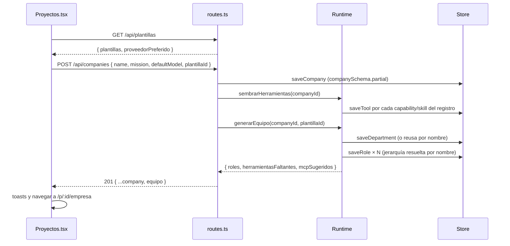

# Plantillas de equipo

Un proyecto puede **nacer con equipo**: al crearlo elegís una plantilla
—consultora, estudio audiovisual, lanzamiento, desarrollo de software,
investigación— y el servidor crea las áreas, los roles con su jerarquía, sus
herramientas asignadas y su modelo con escalado por dificultad. Existe porque
un proyecto vacío obligaba a diseñar un organigrama desde cero antes del primer
encargo, y los organigramas que funcionan ya estaban probados en los seeds.
El contenido de cada plantilla está en [[Referencia de plantillas de equipo]].

## Cómo funciona

1. **La UI pide el catálogo** — `GET /api/plantillas` devuelve
   `PLANTILLAS_EQUIPO` y `runtime.proveedorPreferido()`: el alta arma el
   `defaultModel` de la empresa con ese proveedor (tier `standard`, escalado
   `cheap..smart`) en vez de un `openrouter` fijo.
2. **Se crea la empresa** — `POST /api/companies` separa `plantillaId` del
   cuerpo, valida el resto con `companySchema.partial({id, createdAt,
   updatedAt})` y la guarda.
3. **Se siembran las herramientas** — `Runtime.sembrarHerramientas` levanta el
   runtime de la empresa y guarda en la tabla `tools` cada herramienta
   `capability` y `skill` del registro que todavía no tenga fila. Sin filas,
   `role.toolIds` no puede apuntar a nada y el agente termina explicando que no
   encuentra `export_docx`. Las de coordinación quedan afuera a propósito: se
   otorgan siempre y mostrarlas en el asignador las presentaría como quitables.
4. **Se genera el equipo** — `Runtime.generarEquipo(companyId, plantillaId)`:
   - busca la plantilla (`plantillaEquipo`) o tira `No existe la plantilla "…"`;
   - vuelve a sembrar y arma un mapa **nombre → id** con el catálogo;
   - elige el proveedor: el primero de `plantilla.proveedores` que esté
     configurado, si no `proveedorPreferido()`; sin ninguno, tira pidiendo una
     API key;
   - crea las áreas en fila (`x = 120 + i·260`, `y = 80`), o **reusa** una
     existente con el mismo nombre sin distinguir mayúsculas;
   - crea cada rol con `toolIds` resueltos por nombre; los nombres que no están
     van a `herramientasFaltantes` (**se nombran, nunca se descartan en
     silencio**);
   - resuelve `reportsTo` en una segunda pasada, cuando todos los roles existen,
     y recién ahí guarda.
5. **La respuesta** trae `equipo: { roles, herramientasFaltantes, mcpSugeridos }`.
   La UI avisa "Equipo creado: N agentes…", "Sin registrar en esta máquina: …"
   si faltaron herramientas y "Este equipo aprovecha servidores MCP: … Instalálos
   desde la Tienda.", y abre `/p/:id/empresa`.

## Qué modelo recibe cada rol

`generarEquipo` arma el `ModelSelection` así:

| Campo | Valor |
|---|---|
| `providerId` | preferido de la plantilla o `proveedorPreferido()` |
| `modelSlug` | `null` (un slug apagaría el escalado) |
| `tier` | `rol.escalado.tierMinimo` |
| `escalado` | `{ activo: true, tierMinimo, tierMaximo }` de la plantilla |
| `temperature` | `null` |
| `maxOutputTokens` | `4096` |

El resto del rol: `authority`, `maxTurns` y `systemPrompt` de la plantilla,
`spendApprovalThresholdUsd: null` y `position: {0,0}` (el organigrama acomoda
las posiciones repetidas con `OrgGraph.autoLayout`). El `defaultModel` de la
empresa **no** se usa: los rangos los fija la plantilla.

### `proveedorPreferido()`

`apps/server/src/runtime.ts`. Recorre, entre los proveedores registrados:

`claude-sesion` → `anthropic` → `claude-code` → `opencode` → `openrouter`

y si ninguno está, el primero de `providers.list()`; sin proveedores, `null`.
Los Claude van primero porque sus tiers resuelven por el mapa curado de
`modelos-claude.ts` y el escalado funciona sin fijar slugs; OpenRouter cierra
porque resuelve por bandas de precio. Ver [[Capa LLM y tiers]].

## Los MCP sugeridos no se instalan solos

`mcpSugeridos` son ids de la tienda (`CATALOGO_MCP`). Conectar un servidor es
decisión de una persona: instala desde [[Pantalla Tienda]]. Y ojo con el otro
lado: la tienda instala **sin otorgarle las herramientas a nadie**, así que
después hay que asignarlas a un rol en [[Pantalla Empresa y organigrama]] o no
las usa nadie. Ver [[Tienda MCP]].

## Reglas e invariantes

- **Resolución por nombre, nunca por id**: las plantillas viven en el repo y
  los ids de herramientas son de cada base.
- **Faltantes nombradas**: la misma regla que convocar especialistas; un agente
  al que le prometieron una herramienta que no tiene gasta su primer turno
  buscándola.
- **Un solo `executive`**, sin jefe, por plantilla (test).
- **Las plantillas se aplican al crear**: el único camino por la API es
  `POST /api/companies` con `plantillaId`. Cambiar una plantilla no actualiza
  equipos ya generados; sumarles herramientas lo decide una persona desde
  Empresa.
- **Las herramientas de código se registran aunque no haya repo**
  (`Runtime.registrarCodigoEn`): un proyecto nace de la plantilla antes de que
  alguien cargue su código, y `generarEquipo` sólo puede otorgar lo que está en
  el catálogo.

## Casos borde y fallas conocidas

> [!danger] Falso "Sin registrar" para `calcular`, `verificar_cifras` y `buscar_en_entregables`
> Las plantillas `consultora` e `investigacion` nombran estas tres herramientas,
> que son de **coordinación** (se otorgan siempre). `sembrarHerramientas` sólo
> persiste `capability` y `skill`, así que el mapa nombre → id no las encuentra y
> `generarEquipo` las devuelve en `herramientasFaltantes`. La UI muestra "Sin
> registrar en esta máquina: …" aunque los agentes las tienen igual. Arreglo
> posible: saltear en `generarEquipo` los nombres que el registro tiene como
> `coordination`, o sacarlas de las plantillas.

- **Faltantes legítimas**, condicionadas al entorno: `generar_imagen` (sin API
  key de imágenes), `revisar_lamina`, `export_video_estudio`, `grabar_clip`,
  `export_video_clips` (sin Chrome) y las diez del teléfono (sin `adb`).
- **Plantilla inexistente o sin proveedor**: la respuesta es 400, pero la
  empresa **ya quedó creada** y con sus herramientas sembradas, sin equipo.
- **Aplicar dos veces** (sólo posible por código): las áreas se reusan por
  nombre pero los roles se duplican.
- **Empresa pensada para `free`**: los roles igual nacen con los rangos de la
  plantilla (`cheap`/`standard`/`smart`), que en un proveedor sin crédito van
  derecho a un 402. Ajustá el tier en el diseñador.
- **Un prompt de rol no se actualiza**: se guarda al crear.

## Presets del chat del IDE

`MEJORADOR_DE_CODIGO` y `QA_MOVIL` no son plantillas: son un rol cada uno, que
se crea con un click desde el IDE (`crearMejorador`, `crearQaMovil`) y se pone al
día antes de cada pedido. Detalle en [[Referencia de plantillas de equipo]].

## Integración

| Pieza | Dónde |
|---|---|
| Catálogo | `GET /api/plantillas` |
| Alta con equipo | `POST /api/companies` con `plantillaId` |
| Presets | `POST /api/companies/:id/mejorador`, `POST /api/companies/:id/qa-movil` |
| Pantalla | [[Pantalla Proyectos]] → "Equipo inicial" |
| Datos | `packages/shared/src/plantillas.ts` |

## Qué fijan los tests

- `apps/server/src/equipo.test.ts`:
  - la consultora queda con `toolIds` que apuntan a filas reales, jerarquía
    resuelta, y todos sus roles con el proveedor preferido (`anthropic` gana a
    `openrouter`), escalado activo y sin slug;
  - alguien del equipo puede `export_pdf`;
  - una plantilla desconocida falla nombrándola, y en el estudio las únicas
    faltantes son las condicionadas al entorno;
  - el equipo de software recibe las herramientas de código sin repo, y QA no
    recibe `editar_codigo`. Este caso espera `herramientasFaltantes` vacío, así
    que **depende de que la máquina tenga `adb`** (las del teléfono sólo se
    registran con él).
- `packages/shared/src/plantillas.test.ts`: forma y coherencia de las plantillas
  (ver [[Referencia de plantillas de equipo]]).

## Cómo extender

Una plantilla nueva es un objeto más en `PLANTILLAS_EQUIPO`: nombres de
herramientas que existan en el registro, un solo `executive`, `SALIDA_ES` al
principio de cada prompt, `mcpSugeridos` que estén en la tienda. Los tests de
`plantillas.test.ts` atrapan casi todo en CI. Ver
[[Cómo agregar una plantilla de equipo]].

## Fuentes

- `packages/shared/src/plantillas.ts` — `PLANTILLAS_EQUIPO`, `plantillaEquipo`
- `apps/server/src/runtime.ts` — `generarEquipo`, `sembrarHerramientas`, `proveedorPreferido`, `registrarCodigoEn`, `crearAgenteDelChat`
- `apps/server/src/routes.ts` — `GET /api/plantillas`, `POST /api/companies`
- `apps/web/src/routes/Proyectos.tsx` — `NuevoProyecto`, mutación `crear`
- `apps/web/src/api.ts` — `EquipoGenerado`, `plantillas`, `createCompany`

## Ver también

- [[Referencia de plantillas de equipo]]
- [[CU-11 Proyecto nuevo desde una plantilla]]
- [[Organización de agentes]]
- [[Gestión de proyectos]]
- [[Escalado por dificultad]]
