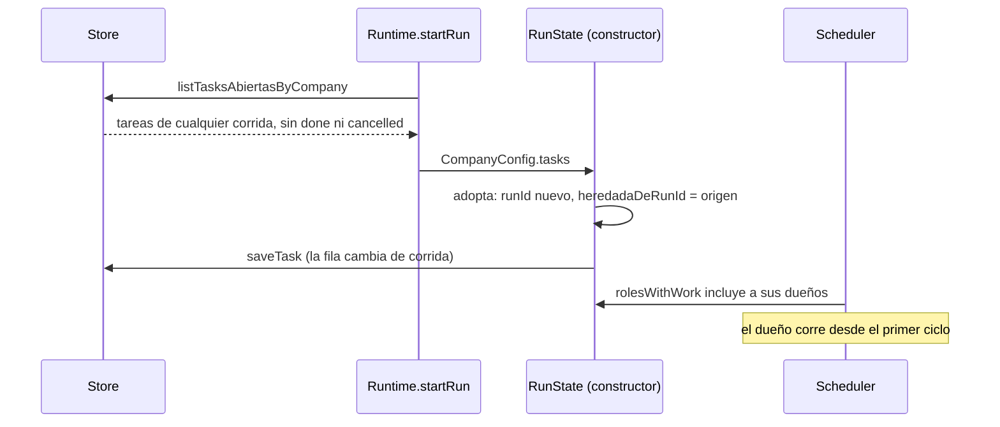

# Supervisión y continuidad

Un encargo largo —una producción de doce clips, un diagnóstico con diseño y
precio— no entra en una corrida. Supervisar es saber **dónde está trabado el
trabajo** sin creerle a cada agente lo que cuenta, y continuar es que la corrida
siguiente encuentre el tablero como quedó y no uno vacío. Esta nota junta las
piezas que lo hacen posible: `estado_del_proceso`, las tareas heredadas, los
frenos contra corridas que no avanzan y el cierre explícito.

## Tres preguntas, tres herramientas

| Pregunta | Herramienta | Alcance |
|---|---|---|
| ¿Qué me toca a mí? | `list_my_tasks` | Tareas abiertas propias |
| ¿Qué ejecutó cada uno? | `check_activity` | Actividad real, filtrable por rol y fallos ([[Coordinación entre agentes]]) |
| ¿Dónde está trabado el encargo? | `estado_del_proceso` | Tablero de **todos**, entregables, quién no produjo, últimos fallos |

Sin la tercera, supervisar era preguntarle a cada agente y creerle, que es
justo el error que el sistema ya sabe que se comete: informar como hecho lo que
no se hizo.

## `estado_del_proceso`

`packages/tools/src/coordination.ts` → `estadoDelProceso`, coordinación, sólo
lectura.

| Argumento | Obligatorio | Qué es |
|---|---|---|
| `solo_pendiente` | no | `true` = sólo tareas abiertas; default `false` |

Arma, en este orden:

1. `Ciclo N de la corrida.`
2. **TAREAS**, agrupadas por dueño (`listAllTasks`): `- [estado] título`, con
   "← TRABADA" si está `blocked`, "· viene de una corrida anterior" si tiene
   `heredadaDeRunId` y "· resultado: …" (120 caracteres) si lo tiene. Sin
   tareas, lo dice como problema: "se está coordinando sólo por mensajes y no
   hay forma de ver el avance: pedile a quien reparte que use assign_task".
   Abiertas son `pending`, `in_progress`, `in_review` y `blocked`.
3. **ENTREGABLES**: `clave vN · "título"`, marcando los de un trabajo anterior.
4. **AGENTES**: cada rol con sus llamadas y errores, o "sin ejecutar nada
   todavía".
5. **ÚLTIMOS FALLOS**: los últimos 8 de la actividad, con el consejo "Si un
   agente repite el mismo error, no le pidas que insista: cambiale el enfoque o
   reasignale la tarea".

La descripción sugiere corregir "con update_task, assign_task o send_message",
pero `update_task` sólo mueve tareas **propias**: quien supervisa corrige
escribiéndole al dueño o asignando una tarea nueva a otro (la original queda
abierta con su dueño hasta que él la cancele).

## Tareas heredadas

- `Store.listTasksAbiertasByCompany` une `tasks` con `runs` por empresa y deja
  afuera `done` y `cancelled`: lo terminado no es trabajo, y su registro vive en
  la traza.
- `RunState` las **adopta**: les pone el `runId` nueva y guarda en
  `heredadaDeRunId` la corrida donde nacieron (si ya venía heredada, conserva el
  origen original). Al revés que los entregables, **sí** se persisten: la tarea
  cambia de corrida, y `upsertRunScoped` actualiza también la columna `run_id`.
- Una corrida **enfocada** (el chat del IDE) no adopta: `config.tasks = []`.
- Borrar un rol cancela sus tareas abiertas "diciendo por qué" (`Store.deleteRole`),
  para que la corrida siguiente no herede trabajo de alguien que no existe.

El prompt del turno no marca las heredadas: se ven en `estado_del_proceso`.

## Qué hace que un rol sea convocado

`RunState.rolesWithWork`: bandeja con algo, tareas `pending` o `in_progress`, o
un turno interrumpido para continuar.

> [!warning] `blocked` e `in_review` no convocan
> Un rol con todas sus tareas en `blocked` no vuelve a correr por ellas: sólo lo
> despierta un mensaje. Si alguien lo destraba, tiene que escribirle. Lo mismo
> con `in_review`: quien verifica tiene que recibir el pedido por mensaje.

### Frenos contra la corrida que no avanza

| Freno | Valor | Dónde | Qué evita |
|---|---|---|---|
| Turnos vacíos | `TURNOS_VACIOS_TOLERADOS` = 2 | `scheduler.ts` | Un rol que habla sin ejecutar nada deja de convocarse por sus tareas hasta que le llegue un mensaje. Medimos **catorce ciclos seguidos** así, hasta morir por límite sin producir nada |
| Pedidos sin respuesta | `REENVIOS_MAX` = 2 | `RunState.reencolarSolicitudesSinResponder` | Leer vacía la bandeja: un agente que se quedaba sin turnos hacía desaparecer el pedido y la corrida cerraba en el ciclo 3 sin entregable. Un `request` sin contestar vuelve a la bandeja hasta 2 veces |
| Orden de urgencia | pedido esperando ×10, bandeja ×2 (hasta 5), tareas (hasta 5), fallos −4 | `ordenarPorUrgencia` | Con concurrencia acotada, el orden decide el ciclo |
| Ciclos sin turnos buenos | 3 | `TICKS_FALLIDOS_TOLERADOS` | Un proveedor caído no quema todos los ciclos |

El detalle del ciclo está en [[Scheduler y ciclo de una corrida]].

## Cerrar es una decisión

Cuando nadie tiene trabajo:

1. Si hay una solicitud pendiente, la corrida **espera** (`awaiting_approval`),
   no termina. Ver [[Aprobaciones y solicitudes]].
2. La **primera vez**, si hubo mensajes entre roles, el primer `executive` recibe
   "Antes de cerrar: ¿está cumplido el encargo?" con el objetivo original: si
   falta una etapa, la asigna; si no, termina sin llamar herramientas. Medimos un
   encargo de diagnóstico, diseño y precio que cerró `completed` con sólo el
   diagnóstico.
3. Si no hay entregables, ni mensajes entre roles, ni código editado, ni una
   consulta del chat respondida, termina **`failed`**: "La corrida terminó sin
   producir nada… El encargo llegó a destino pero no se ejecutó." Un
   `completed` en tres ciclos sin entregable es un pedido perdido, no un éxito.
4. Si no, `completed`.

> [!warning] El detector de "no produjo nada" cuenta entregables viejos
> `RunState.artifacts` incluye los de corridas anteriores. En una empresa que
> ya tiene entregables, la condición "ningún entregable" nunca se cumple, y una
> corrida que no hizo nada termina `completed` salvo que tampoco haya habido
> mensajes entre roles.

## Continuidad entre reinicios

- **Una corrida no sobrevive al reinicio**: su estado vivo está en memoria. La
  traza, los entregables, las tareas abiertas y las solicitudes pendientes sí
  quedan, y la corrida siguiente los hereda.
- `Store.sanearCorridasHuerfanas()` corre al arrancar y cierra en `stopped` las
  que quedaron `running`, `awaiting_approval` o `paused` tras una caída dura,
  explicando por qué. Sin esto la UI mostraba una corrida en curso inexistente y
  `tieneCorridaViva` bloqueaba las misiones de la empresa.
- `POST /api/runs/:id/resume` valida `Runtime.estaEnMemoria` **antes** de
  contestar: retomar una corrida que no sobrevivió devolvía `started: true` y el
  error viajaba por una promesa sin dueño que **mataba el proceso de Node**.
- Un turno cortado por el proveedor se guarda y continúa hasta 3 veces
  (`REANUDACIONES_MAX`); ver [[Estado de una corrida]].

## Qué fijan los tests

- `packages/tools/src/coordination.test.ts` → `estado_del_proceso`: dice que no hay tablero en vez de dar el encargo por encaminado; agrupa por dueño y marca las trabadas; `solo_pendiente` deja afuera lo terminado; señala lo heredado; nombra a quien no ejecutó nada; muestra los últimos fallos y qué hacer.
- `packages/engine/src/continuidad.test.ts` → adopta las tareas, recuerda y persiste el origen; conserva el origen de una ya heredada; no adopta lo propio; sin previas el tablero arranca vacío; el dueño de una heredada trabaja desde el primer ciclo; quién va primero; la cadena.
- `packages/engine/src/state.test.ts` → reencola los pedidos y deja de insistir después del tope.
- `packages/engine/src/scheduler.test.ts` → deja de convocar al que habla sin hacer nada; distingue la consulta respondida de la corrida vacía.

## Fuentes

- `packages/tools/src/coordination.ts` → `estadoDelProceso`
- `packages/engine/src/state.ts` → constructor de `RunState` (adopción), `rolesWithWork`, `reencolarSolicitudesSinResponder`, `listAllTasks` (vía `forActor`)
- `packages/engine/src/scheduler.ts` → `tick` (cierre, corrida vacía), `ordenarPorUrgencia`, `TURNOS_VACIOS_TOLERADOS`, `TICKS_FALLIDOS_TOLERADOS`
- `apps/server/src/db.ts` → `listTasksAbiertasByCompany`, `sanearCorridasHuerfanas`, `deleteRole`
- `apps/server/src/runtime.ts` → `startRun`, `estaEnMemoria`
- `apps/server/src/routes.ts` → `/api/runs/:id/resume`
- `packages/shared/src/schema.ts` → `taskSchema.heredadaDeRunId`

## Ver también

- [[Coordinación entre agentes]]
- [[Auditoría de corridas]]
- [[CU-04 Control de calidad entre agentes]]
- [[Pantalla Tablero]]
- [[Misiones programadas]]
