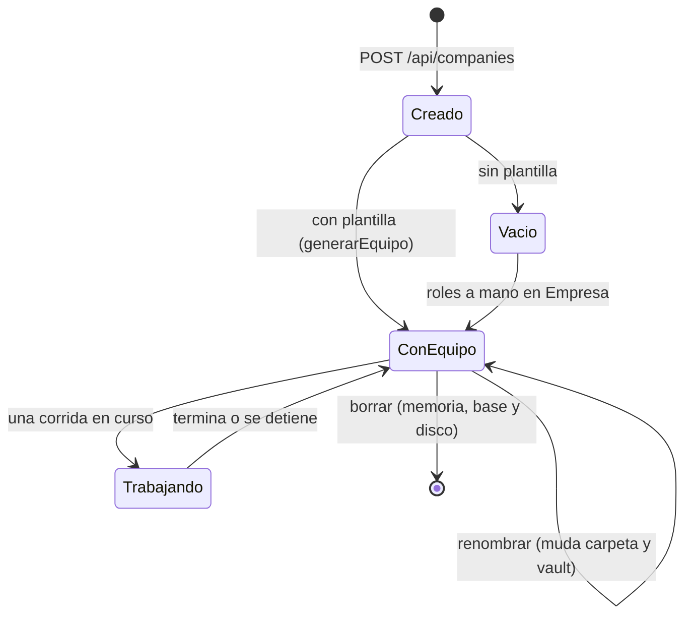
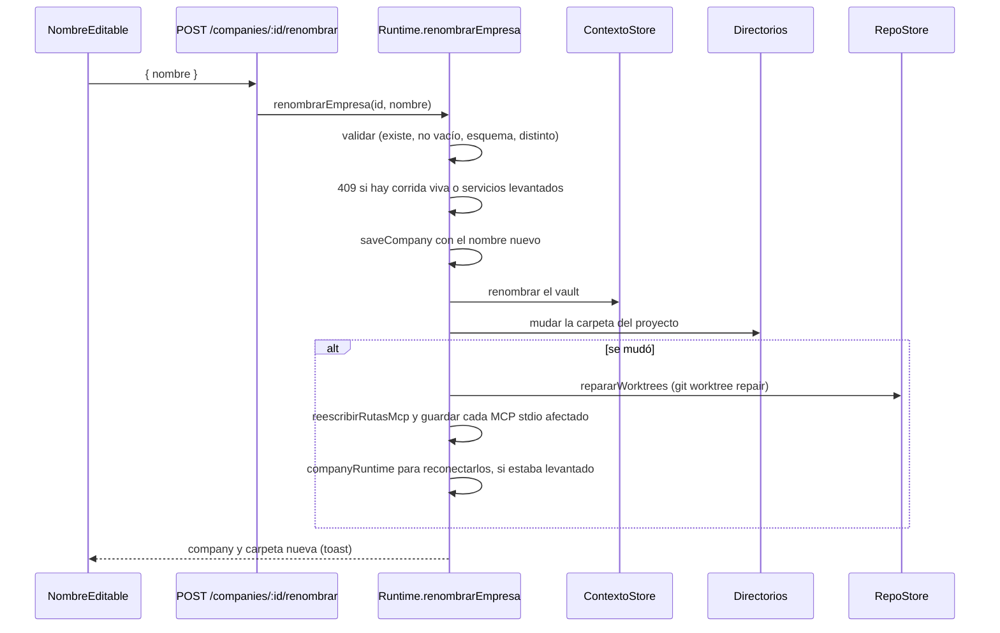

# Gestión de proyectos

Un **proyecto** es una empresa completa: agentes, departamentos, políticas,
herramientas, memoria, misiones, código cargado y su propia carpeta en disco. La
pantalla Proyectos (`apps/web/src/routes/Proyectos.tsx`, ruta `/proyectos`) es la
puerta de entrada: ahí se crea, se elige, se renombra y se da de baja.

## Proyecto vs. empresa

"Proyecto" es **el rótulo de una pantalla**, no una entidad. El dominio sigue
siendo `Company` / `companyId`, y adentro se habla de empresa, agentes y
departamentos. Es deliberado: toda la metáfora del producto es organizacional
—organigrama, jerarquía, un ejecutivo que delega— y renombrarla la dejaría sin
sentido. Lo que sí es un proyecto es **la unidad de trabajo**: elegís uno y
trabajás adentro. No renombres el dominio.

## Ciclo de vida

## La pantalla

Una tarjeta por proyecto con **agentes, áreas, misiones, corridas, entregables y
peso en disco**, cuándo fue la última corrida, cuántos archivos de salida tiene y
si está trabajando ahora ("en curso"). Existe para **decidir sin entrar**: con
cuatro proyectos, "¿cuál era el que no usé nunca?" se contesta mirando la
tarjeta. Acciones: abrir (`/p/<id>/empresa`), renombrar en el lugar
(`NombreEditable`), borrar con confirmación, y "+ proyecto". Detalle visual en
[[Pantalla Proyectos]].

Con una corrida en curso, renombrar y borrar quedan deshabilitados y el `title`
dice por qué. El servidor lo vuelve a verificar (409): la guardia de la UI es
comodidad, no seguridad.

## Crear un proyecto

La UI manda nombre, misión, un `defaultModel` y, si se eligió, `plantillaId`:

- `providerId`: el **proveedor preferido** que devuelve `GET /api/plantillas`
  (`Runtime.proveedorPreferido`: `claude-sesion` > `anthropic` > `claude-code` >
  `opencode` > `openrouter` > el primero registrado); `openrouter` si no llegó.
- `tier: "standard"` —el que sirve para roles que coordinan— con escalado por
  dificultad activo de `cheap` a `smart`: los turnos livianos bajan solos. Ver
  [[Escalado por dificultad]].

`POST /api/companies` (`apps/server/src/routes.ts`):

1. Separa `plantillaId` y valida el resto con
   `companySchema.partial({ id, createdAt, updatedAt })`. Sólo `name` y
   `defaultModel` son obligatorios; `mission`, `voz`, `marca`, `context`,
   `currency` y `budgetUsd` (1) tienen default.
2. `store.saveCompany`.
3. `runtime.sembrarHerramientas(id)`.
4. Con plantilla, `runtime.generarEquipo(id, plantillaId)`: departamentos,
   roles con jerarquía resuelta por nombre, herramientas por nombre y modelo del
   proveedor disponible con escalado. Las herramientas que el catálogo no tiene
   y los MCP sugeridos vuelven en `equipo`. Ver [[Plantillas de equipo]].
5. 201 con la empresa y `equipo`.

La UI avisa con toasts: cuántos agentes se crearon, qué herramientas **no se
registraron en esta máquina** (nombradas, nunca calladas: una habilidad
condicionada al entorno —imágenes, navegador— puede faltar legítimamente) y qué
MCP conviene instalar desde la Tienda. Los MCP sugeridos **no se instalan
solos**: conectar lo decide una persona. Después entra directo al proyecto.

> [!warning] Si la plantilla falla, la empresa ya quedó creada
> `generarEquipo` corre después de `saveCompany`. Una plantilla inexistente o sin
> proveedor configurado contesta 400, pero el proyecto existe (vacío) y aparece
> en la lista al refrescar.

### Un proyecto nuevo nace usable

> [!danger] Sin sembrar, el proyecto nace sin nada que asignarle a un agente
> `ToolRegistry.forRole` sólo regala las de coordinación; las de `capability` y
> `skill` dependen de `role.toolIds`, que apunta a filas de la tabla `tools`. Un
> proyecto creado desde la UI no tenía ninguna, y el primer agente al que le
> pedías un PDF contestaba —con razón— que no encontraba `export_docx`. Es la
> misma trampa de `npm run db:seed`, que filtraba sólo `capability`.

`Runtime.sembrarHerramientas` levanta el runtime de la empresa (que registra
todo lo de esa máquina) y guarda una fila por cada herramienta `capability` o
`skill` que todavía no esté, por nombre: búsqueda web y fetch, correo, las
habilidades de producción, las de código (aun sin repo), las de R2 y, con `adb`,
las del teléfono. Es idempotente y devuelve cuántas agregó. **Cuántas son
depende de la máquina**: las condicionadas (imágenes, Chrome, adb) no se
registran si no se pueden cumplir. Las de **coordinación quedan afuera**: se
otorgan siempre, y mostrarlas en el asignador las presentaría como quitables.

## El resumen es una consulta agregada

`GET /api/companies/resumen` = `Store.resumenEmpresas()` + dos datos del
runtime:

| Campo | De dónde |
|---|---|
| `roles`, `departamentos`, `corridas`, `entregables`, `misiones` | `SELECT company_id, COUNT(*) … GROUP BY company_id`, una por tabla |
| `ultimaCorridaAt` | `MAX(started_at)` de `runs` |
| `corridaViva` | `Runtime.tieneCorridaViva` (`running` o `awaiting_approval`) |
| `disco` | `ExportStore.medirEmpresa`: archivos y bytes de la **carpeta entera** del proyecto —salida, clones, worktrees y tmp—, sin crearla |

Se cuenta con `GROUP BY` y no trayendo las filas: la pantalla muestra todos los
proyectos juntos, y cargar los entregables para contarlos sería traerse el
contenido de cada documento a memoria. Y mide la carpeta entera porque un repo
clonado pesa más que todos los PDF juntos: esconderlo haría mentir a "cuánto
ocupa este proyecto".

> [!warning] Un `GROUP BY` a secas pierde los proyectos vacíos
> El que no tiene ninguna fila en ninguna tabla no aparece en ningún resultado,
> y ése es justo el recién creado, el único que hay que poder abrir. Se parte de
> `listCompanies()` y las cuentas se cruzan encima con cero por defecto. Hay un
> test.

## Renombrar un proyecto

Renombrar **no es un PATCH del nombre**. La fila sola es lo fácil; lo que se
rompe en silencio es el resto: el vault se resuelve por nombre y abría uno vacío
al lado del que tenía la memoria, la carpeta de `data/proyectos/` seguía con el
nombre viejo y, al mudarla, git queda con rutas absolutas a la carpeta anterior.

- **Rechaza** (409) con una corrida `running` o `awaiting_approval` —sus agentes
  tienen archivos y comandos abiertos en la ruta vieja— y con **servicios de la
  vista previa levantados**, que corren adentro de la carpeta. Una empresa que no
  existe es 404; un nombre vacío o inválido, error sin tocar nada; el mismo
  nombre, éxito sin mudar.
- **El vault** (`ContextoStore.renombrar`) busca un destino libre (`Nombre` o
  `Nombre (xxxxxx)`) y si están los dos tomados deja el viejo donde está:
  mezclar dos vaults no se deshace.
- **La carpeta** la muda `Directorios.mudar` (ver [[Directorios en disco]]).
- **Los worktrees**: git anota la ruta absoluta en los dos lados de un worktree;
  sin `git worktree repair` un `git status` dentro de la sesión falla. El test lo
  fija corriendo git **desde adentro** del worktree, que es como lo abre una
  persona en su terminal.
- **Los MCP** con la ruta en sus argumentos (el Playwright con `--output-dir`)
  se reescriben y se resincronizan: un proceso arrancado con la ruta vieja la
  recrearía.

`PATCH /api/companies/:id` con un `name` distinto **deriva** a
`renombrarEmpresa` (409 si falla) antes de guardar el resto.

Renombrar un **repo** es otra cosa: cambia sólo el nombre, no la carpeta
`repos/<slug>` (el slug es técnico y moverlo obligaría a reparar worktrees por
nada), y no puede repetirse porque es el argumento `repo=` de las herramientas.
Ver [[Repositorios y sesiones]].

> [!warning] Dos huecos del renombre
> - **No es transaccional**: la fila se guarda antes de mudar vault y carpeta. Si
>   algo falla a mitad, el nombre nuevo ya está en la base.
> - **Una corrida pausada no lo bloquea** (`tieneCorridaViva` sólo cuenta
>   `running` y `awaiting_approval`). Esa corrida guardó al arrancar la ruta de
>   la salida como valor (`dirDeTrabajo`), así que si se retoma queda apuntando a
>   la carpeta vieja.

## Borrar un proyecto

`DELETE /api/companies/:id` → `Runtime.eliminarEmpresa`: 409 con una corrida en
curso; si no, detiene sus servicios, suelta de memoria sus corridas y sus
procesos MCP, borra todas sus filas y **la carpeta entera del proyecto** (salida,
clones, worktrees, tmp), y devuelve cuántos archivos y bytes se llevó. Quedan: su
vault en `data/contexto/`, los tokens OAuth de sus MCP y las ramas que ya se
integraron al repo de la persona. El detalle, y por qué toca varios lugares, en
[[Limpieza y mantenimiento]].

## Navegación

La navegación vive en la URL (react-router): `/proyectos`, `/proveedores` y
`/p/:companyId/<sección>`. El selector del encabezado cambia de proyecto
**conservando la sección**. Un id que ya no existe muestra "Ese proyecto ya no
existe" con un enlace a Proyectos (`ProyectoLayout`), y borrar desde
Mantenimiento navega a `/proyectos` (`onCompanyGone`).

> [!note] En `/proyectos` no hay proyecto activo
> `ProyectosRuta` le pasa `activeId` desde `useParams()`, pero esa ruta no tiene
> `:companyId`: siempre es `null`, así que ninguna tarjeta se marca "abierto" ni
> ofrece "ir al diseñador".

## Exportar e importar

`GET /api/companies/:id/blueprint` devuelve la empresa entera como JSON
versionable: empresa, departamentos, roles, políticas, servidores MCP (con los
secretos **por referencia**), las herramientas que no son MCP (esas se
redescubren al conectar) y sólo los repos con origen git, sin `baseSha`, sin los
permisos de una vez y sin las rutas de `.env` —rutas de esta máquina no
significan nada en otra—. `POST /api/companies/import` reasigna **todos** los ids
(se puede importar dos veces sin pisar la original) y clona los repos en segundo
plano, con sus comandos **pendientes de confirmar**: importar un JSON no puede
autorizar a correr nada. No hay botón en la UI: `api.ts` tiene las funciones pero
ninguna pantalla las usa. Ver [[Base de datos]].

## API

| Método | Ruta | Qué hace |
|---|---|---|
| `GET` | `/api/companies/resumen` | una línea por proyecto |
| `GET` | `/api/plantillas` | plantillas y proveedor preferido |
| `POST` | `/api/companies` | crea, siembra y opcionalmente genera el equipo |
| `PATCH` | `/api/companies/:id` | modifica; un nombre nuevo deriva al renombre |
| `POST` | `/api/companies/:id/renombrar` | renombra y muda (404/409) |
| `DELETE` | `/api/companies/:id` | memoria, base y disco (409 con corrida viva) |
| `GET` / `POST` | `/api/companies/:id/blueprint`, `/api/companies/import` | exportar / importar |

Contrato completo en [[Referencia de API]].

## Qué fijan los tests

- `db.test.ts` → "resumen de proyectos": cuenta cada uno sin mezclar; un proyecto
  vacío aparece en cero, no ausente; la última corrida es la más reciente.
- `renombrar.test.ts`: muda la carpeta y la sesión de código sigue andando (git
  desde adentro del worktree); el vault sigue al nombre; no pisa la carpeta de
  otro proyecto homónimo (toma el sufijo); rechaza un nombre vacío; un repo se
  renombra sin mover la carpeta y un nombre repetido se rechaza.
- `equipo.test.ts`: el equipo nace con `toolIds` válidos, jerarquía resuelta,
  habilidades incluidas y las faltantes nombradas.
- `routes.test.ts` crea empresas por HTTP en cada caso (201).

## Fuentes

- `apps/web/src/routes/Proyectos.tsx` → `Proyectos`, `NuevoProyecto`, `Tarjeta`
- `apps/web/src/App.tsx` → rutas, `ProyectoLayout`, `ProyectosRuta`
- `apps/server/src/routes.ts` → `POST/PATCH/DELETE /api/companies`, `resumen`, `renombrar`, `blueprint`, `import`
- `apps/server/src/runtime.ts` → `sembrarHerramientas`, `generarEquipo`, `proveedorPreferido`, `renombrarEmpresa`, `eliminarEmpresa`
- `apps/server/src/db.ts` → `resumenEmpresas`
- `apps/server/src/exports.ts` → `medirEmpresa`
- `apps/server/src/directorios.ts` → `mudar`; `apps/server/src/contexto.ts` → `renombrar`; `apps/server/src/repos.ts` → `repararWorktrees`

## Ver también

- [[Pantalla Proyectos]] · [[Pantalla Empresa y organigrama]]
- [[Limpieza y mantenimiento]]
- [[Directorios en disco]]
- [[Plantillas de equipo]] · [[CU-11 Proyecto nuevo desde una plantilla]]
- [[Runtime del servidor]]
- [[Empresas de ejemplo]]
