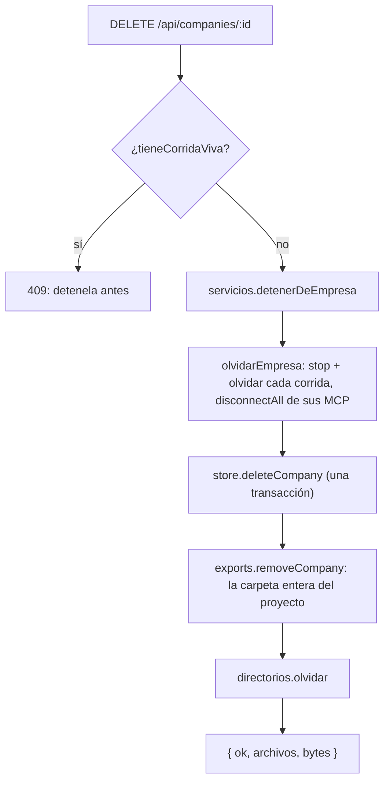

# Limpieza y mantenimiento

Lo que se acumula acá es **invisible desde el resto de la aplicación**: todas las
pantallas navegan por empresa, y lo que queda de una empresa borrada ya no tiene
empresa por la que navegar. Y nada de esto es reversible: no hay papelera ni en
el disco ni en la base.

## Dónde se hace

- La sección **Mantenimiento**, al pie de la pestaña Empresa
  (`apps/web/src/routes/Settings.tsx` → `Mantenimiento`). Arranca cerrada: son
  las únicas acciones de esa pantalla que destruyen trabajo. El diagnóstico
  (`GET /api/mantenimiento`) **sólo se pide con la sección abierta**, porque
  recorre el disco entero. Cada acción dice antes qué se lleva y qué no, y pide
  confirmación. Con residuos a la vista aparece la etiqueta "hay residuos".
- Borrar **una** corrida y "limpiar terminadas" de un proyecto están en la
  pestaña Proceso ([[Pantalla Proceso en vivo]]).

## Las acciones

| Acción | Endpoint | Se lleva | Conserva |
|---|---|---|---|
| Vaciar la salida | `POST /api/companies/:id/exports-vaciar` | lo que la empresa generó según el manifiesto | lo que subiste vos (el logo, fotos), respaldos de repos, AAB |
| Borrar la empresa | `DELETE /api/companies/:id` | agentes, políticas, corridas, entregables, memoria, misiones, MCP, repos y la carpeta entera del proyecto | su vault, sus tokens OAuth (ver abajo) |
| Corridas terminadas (todas las empresas) | `DELETE /api/runs/terminadas` | mensajes, tareas, aprobaciones, ledger y eventos | **los entregables** |
| Filas sueltas | `POST /api/mantenimiento/purgar` `{ residuos: true, compactar: true }` | filas que apuntan a una empresa o corrida inexistente, y compacta | todo lo que tiene dueño |
| Carpetas sin empresa | `POST /api/mantenimiento/purgar` `{ carpetas: [...] }` | las carpetas de `data/proyectos/` elegidas | las de proyectos vivos |

## Borrar una empresa

`Runtime.eliminarEmpresa(id)`:

Tocar varios lugares no es prolijidad, son dos fallas que pagamos:

> [!danger] Los procesos MCP no se caen porque borres filas
> El runtime de empresa sostiene **procesos de servidores MCP**. Sin
> `olvidarEmpresa`, borrar una empresa dejaba sus conexiones vivas hasta
> reiniciar, y el Hub seguía mostrando en verde servidores de algo que ya no
> existe. Es `olvidarCorrida` un nivel más arriba, por el mismo motivo: una
> corrida borrada que sigue en memoria es un orquestador escribiendo eventos de
> algo que no existe.

> [!danger] La carpeta quedaba huérfana para siempre
> La base quedaba limpia pero los Word, PDF y videos seguían en disco, sin
> ninguna pantalla desde la cual verlos. Es la misma regla que en SQLite —un
> entregable sobrevive a su corrida, no a su empresa— aplicada a los bytes.

`store.deleteCompany` corre en una transacción: las corridas de la empresa (por
`json_extract(data, '$.companyId')`), sus filas de `TABLAS_POR_CORRIDA`, las
corridas, las filas de `TABLAS_POR_EMPRESA` —`artifacts` incluida— y la empresa.
`removeCompany` borra recursivo **sólo** la carpeta que la marca `.empresa`
atribuye a esa empresa: el nombre que le *tocaría* podría ser el de otra cosa.
Que no hubiera carpeta no es un error: una empresa que nunca produjo nada se
borra igual.

**Lo que queda después de borrar una empresa:**

- **Su vault** (`data/contexto/<Nombre>/`): `eliminarEmpresa` no lo toca, y el
  diagnóstico de carpetas no mira `data/contexto/`. El diálogo dice que se va la
  memoria; en la base se va, en Obsidian sigue.
- **Los tokens OAuth** de sus servidores MCP (`data/mcp-oauth/<serverId>.json`):
  se borran al eliminar **un** servidor (`eliminarServidorMcp`), no al borrar la
  empresa.
- **Las ramas que ya se integraron o subieron** al repo de la persona: ese repo
  es suyo.

## Borrar corridas

`Store.deleteRun(runId)` borra, en una transacción, `events`, `messages`,
`tasks`, `approvals`, `ledger` y la fila de `runs`. **Los entregables quedan**:
`artifacts.company_id` existe para eso, `listArtifactsByCompany` filtra por esa
columna (no une con `runs`) y `migrarArtefactosAEmpresa` la completa en bases
viejas al abrir el `Store`. Limpiar la lista de corridas no puede costarle a la
empresa el trabajo que produjo.

Reglas del lado HTTP:

- `DELETE /api/runs/:id`: 409 si está `running` y 409 si todavía se puede
  continuar (pausada, esperando una respuesta). Antes de borrar, `olvidarCorrida`.
- "Limpiar terminadas" (`limpiarTerminadas` en `routes.ts`) borra lo que
  **no** se puede continuar (`!sePuedeContinuar`): con `estaViva` —sólo
  `running`— se llevaba puestas las pausadas.

> [!warning] Borrar una corrida se lleva sus tareas abiertas
> El trabajo abierto sobrevive a su corrida **cuando la siguiente lo adopta**
> (la adopción mueve la fila de `run_id`). Si borrás una corrida terminada antes
> de que otra la herede, sus tareas abiertas se van con ella y la próxima
> corrida arranca sin ese pendiente.

## Vaciar la salida

`ExportStore.vaciarGenerado` borra lo que figura en `.orq-generado.json` y
conserva todo lo demás. El criterio es **el manifiesto y nada más**, no la
extensión.

> [!warning] Un `kind: "all"` se lleva el logo
> El logo es un `.png` que subiste vos, vive en una ruta fija (`marca/logo.png`)
> y **no se vuelve a generar solo**. Por eso vaciar compara contra la
> procedencia y no contra si el archivo es multimedia. Hay un test.

> [!warning] Lo publicado también se va
> `publicar` muda la entrada del manifiesto a `publicado/…`: lo aprobado sigue
> contando como generado, y "Vaciar la salida" lo borra. Ver
> [[Salida de la empresa]].

Vaciar dos veces no falla ni borra de más.

## Residuos en la base

`Store.residuos()` cuenta y `Store.purgarResiduos()` borra. Los borrados en
cascada de hoy no dejan nada suelto, pero una base de antes arrastra basura: se
midieron **10 entregables y 21 corridas** apuntando a empresas inexistentes.

- **Por empresa**: primero `runs` cuya empresa no existe (va aparte: `runs` no
  está en `TABLAS_POR_EMPRESA` porque su cascada se hace a mano) y después cada
  tabla de `TABLAS_POR_EMPRESA` con `company_id` inexistente.
- **Por corrida**: cada tabla de `TABLAS_POR_CORRIDA` cuyo `run_id` no está entre
  las corridas **que van a sobrevivir** (las de una empresa existente).

`purgarResiduos`, en una transacción, borra primero las corridas sin empresa,
después lo que cuelga de corridas inexistentes y al final lo que cuelga de
empresas inexistentes. El orden importa: al irse, las corridas dejan huérfanas
sus propias filas; al revés habría que correrlo dos veces. Devuelve el
diagnóstico previo, que es exactamente lo que borró.

> [!danger] Un botón destructivo que subdeclara no se vuelve a creer
> La primera versión anunciaba **1 fila y borraba 3**: no contaba la corrida
> huérfana ni su mensaje, porque comparaba contra `runs` a secas y esa corrida
> todavía existía. Ahora se compara contra las que van a sobrevivir, y un test
> fija que lo anunciado sea lo borrado.

## Compactar

`VACUUM`. SQLite no devuelve al sistema el espacio de lo que borrás: lo marca
libre y lo reusa, así que después de purgar miles de eventos el archivo pesa lo
mismo y parece que la limpieza no hizo nada. **No puede correr dentro de una
transacción**, así que va suelto y al final. `pesoEnDisco` es
`page_count × page_size`. La ruta mide **antes** de tocar nada: sin compactar,
"antes" y "después" son iguales a propósito, y eso es justo lo que explica para
qué está la opción.

## Las dos listas compartidas

`apps/server/src/db.ts`:

- `TABLAS_POR_EMPRESA`: `departments`, `roles`, `policies`, `misiones`,
  `mcp_servers`, `tools`, `learnings`, `agent_requests`, `artifacts`,
  `repositorios`, `sesiones_codigo`.
- `TABLAS_POR_CORRIDA`: `events`, `messages`, `tasks`, `approvals`, `ledger`.

Las usan el borrado en cascada (`deleteCompany`) y el barrido (`residuos`,
`purgarResiduos`). Una tabla nueva agregada en un solo lado deja basura que el
barrido no ve, o hace que el barrido se lleve filas con dueño. `artifacts` va por
empresa a propósito: sobrevive a su corrida, no a su empresa.

> [!note] `deleteRun` repite la lista a mano
> `deleteRun` recorre un arreglo literal con las mismas cinco tablas en vez de
> `TABLAS_POR_CORRIDA`. Hoy coinciden; una tabla nueva por corrida hay que
> agregarla en los dos lugares.

## Carpetas sin empresa

`ExportStore.carpetasResiduales(idsVivos)` lista las carpetas de primer nivel de
`data/proyectos/` (sin las ocultas) cuyo dueño —por la marca `.empresa`, o el id
saneado en el layout por id— no está entre los vivos. Una carpeta **sin marca**
también es residual. Vienen ordenadas por peso: lo primero que uno quiere ver es
qué ocupa lugar.

> [!danger] Un diagnóstico que crea al pasar produce los residuos que busca
> `dirFor` crea la carpeta al consultar: pedir el árbol de una empresa borrada
> alcanzaba para dejarla de nuevo en disco. Todo el camino de medición usa
> `pathFor` y `Directorios.ruta`, que no escriben.

Dos guardias antes de borrar:

1. **Sólo lo que el diagnóstico marca como residual en ese momento**: la ruta
   vuelve a calcular `carpetasResiduales` antes de borrar y rechaza ("Ya no
   figura como residual") lo que cambió, por ejemplo si alguien creó esa
   empresa entre el diagnóstico y el click.
2. **`removeCarpeta` acepta un solo segmento** (nada de `/`, `\`, `.`, `..` ni
   vacío), verifica la ruta ya resuelta contra la raíz y exige que sea una
   carpeta: acá se borra recursivo y un `..` costaría el directorio de otra
   empresa.

## El orden de la purga

`POST /api/mantenimiento/purgar` hace, en este orden: medir la base → borrar
corridas terminadas (si se pidió) → purgar residuos (después de las corridas,
porque cada una deja huérfanas sus filas) → borrar carpetas → `VACUUM` → medir
otra vez. Devuelve `corridas`, `residuos`, `carpetas`, `rechazadas`,
`bytesEnDisco` y `base: { antes, despues }`.

## Qué NO limpia nada de esto

- **Los entregables al borrar una corrida.** Son de la empresa.
- **Lo que subió una persona**, salvo que borres la empresa entera.
- **`data/musica/`**: las pistas son tuyas y tienen licencia.
- **El vault y los tokens OAuth** de una empresa borrada (ver arriba).
- **`data/exports/`**: las carpetas del layout viejo sin empresa se informan al
  arrancar y no se tocan ([[Directorios en disco]]).

## API

| Método | Ruta |
|---|---|
| `GET` | `/api/mantenimiento` — `base: { bytes, residuos }`, `carpetas`, `corridasTerminadas`; no borra nada |
| `POST` | `/api/mantenimiento/purgar` — `{ residuos?, carpetas?, corridas?, compactar? }` |
| `DELETE` | `/api/runs/terminadas` — todas las empresas |
| `DELETE` | `/api/companies/:companyId/runs/terminadas` — una empresa |
| `DELETE` | `/api/runs/:id` |
| `POST` | `/api/companies/:companyId/exports-vaciar` |
| `DELETE` | `/api/companies/:id` |

Ver [[Referencia de API]].

## Qué fijan los tests

`apps/server/src/db.test.ts`:

- Borrar una corrida conserva los entregables, se lleva el rastro y no toca otras.
- Residuos: una base sana no tiene; se cuentan por tabla; **se anuncia
  exactamente lo que se borra** (3 = corrida + mensaje + entregable); la purga
  se lleva en una pasada la corrida y su rastro; no toca lo que tiene dueño;
  **borrar una empresa no deja residuos** (la garantía de las listas
  compartidas); compactar no rompe la base.
- Borrar un rol cierra su trabajo abierto con motivo y se lleva sus solicitudes.

`apps/server/src/exports.test.ts` → "limpieza del directorio de salida": borrar
la empresa informa lo que se llevó, medir no crea, residuales contra el id
saneado, `removeCarpeta` no sale de la raíz, vaciar conserva el logo y es
idempotente. `apps/server/src/directorios.test.ts`: borrar la empresa se lleva la
carpeta entera del proyecto; una carpeta sin marca es residual.

## Cómo extender

- **Una tabla nueva** va en `TABLAS_POR_EMPRESA` o en `TABLAS_POR_CORRIDA` (y en
  `deleteRun` si es por corrida). El test "borrar una empresa no deja residuos"
  es el que avisa si quedó afuera.
- **Un lugar nuevo en disco** que sea de una empresa: si vive adentro de la
  carpeta del proyecto se va solo; si vive afuera (como el vault), hay que
  sumarlo a `eliminarEmpresa` y al diagnóstico, o se vuelve residuo invisible.

## Fuentes

- `apps/server/src/runtime.ts` → `eliminarEmpresa`, `olvidarEmpresa`, `olvidarCorrida`, `sePuedeContinuar`, `eliminarServidorMcp`
- `apps/server/src/db.ts` → `TABLAS_POR_EMPRESA`, `TABLAS_POR_CORRIDA`, `deleteCompany`, `deleteRun`, `residuos`, `purgarResiduos`, `vacuum`, `pesoEnDisco`, `migrarArtefactosAEmpresa`
- `apps/server/src/exports.ts` → `removeCompany`, `removeCarpeta`, `carpetasResiduales`, `vaciarGenerado`, `medirEmpresa`
- `apps/server/src/routes.ts` → `limpiarTerminadas`, `/api/mantenimiento`, `/api/mantenimiento/purgar`
- `apps/web/src/routes/Settings.tsx` → `Mantenimiento`

## Ver también

- [[Gestión de proyectos]]
- [[Salida de la empresa]]
- [[Persistencia y esquema SQL]] · [[Base de datos]]
- [[Directorios en disco]]
- [[Runtime del servidor]]
- [[Seguridad]]
