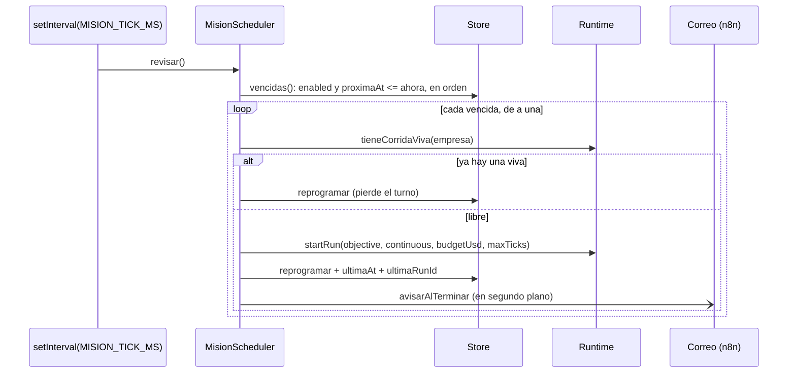
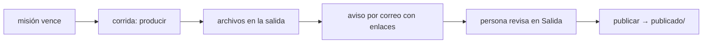

# Misiones programadas

Una misión es **la receta de una corrida, más cuándo repetirla**: un encargo que
se dispara solo, produce, avisa por correo y espera a que una persona apruebe.
Esquema en `packages/shared/src/schema.ts` (`misionSchema`,
`programacionSchema`), cálculo puro en `packages/shared/src/programacion.ts`,
planificador en `apps/server/src/misiones.ts` (`MisionScheduler`).

> [!warning] No confundir con `mode: "cron"`
> `mode: "cron"` de una corrida pacea los ciclos **dentro** de esa corrida (un
> tick cada `cronIntervalMs`). Una misión **larga una corrida nueva** cada vez.

## `Mision`

| Campo | Tipo y default | Para qué |
|---|---|---|
| `id`, `companyId` | ids | la misión y su empresa |
| `name` | 1 a 200 caracteres | aparece en el asunto del aviso |
| `objective` | 1 a 8.000 caracteres | el encargo, tal como se lo daría una persona |
| `programacion` | una de las tres formas | cuándo dispara |
| `enabled` | `true` | pausarla sin borrarla |
| `budgetUsd` | positivo, 1 | tope de gasto de la corrida que genera |
| `maxTicks` | entero o `null` | tope de ciclos; `null` usa `DEFAULT_MAX_TICKS` (50) |
| `avisarA` | correos, `[]` | a quién se le avisa al terminar; sin nadie, no hay aviso |
| `proximaAt` | instante o `null` | el próximo disparo. `null` = pausada, sin calcular o expresión inválida |
| `ultimaAt`, `ultimaRunId` | `null` | cuándo corrió por última vez y qué corrida larga (su traza) |
| `createdAt`, `updatedAt` | instantes | |

`avisarA` es lo que convierte a la misión en **algo que se revisa antes de
publicar** en vez de algo que pasa sin que nadie se entere.

## Las tres formas de programar

Las mismas del nodo *Schedule* de n8n, porque son las que la gente necesita:

| Forma | Ejemplo | Semántica |
|---|---|---|
| `intervalo` | `{ "type": "intervalo", "cada": 6, "unidad": "horas" }` | `desde + cada × unidad` (`minutos`, `horas`, `dias`, `semanas`), relativo al momento en que se recalcula |
| `semanal` | `{ "type": "semanal", "dias": [1, 3, 5], "hora": 7, "minuto": 0 }` | tal día a tal hora; `0` = domingo; `dias` no puede venir vacío (nunca dispararía); `minuto` default 0 |
| `cron` | `{ "type": "cron", "expresion": "30 8 * * 1-5" }` | cinco campos: minuto, hora, día del mes, mes, día de la semana |

Sin `semanal` habría que escribir cron para "todos los días a las 7", que es el
caso más común de todos.

## El cálculo es puro

`proximaCorrida(programacion, desde)` → instante o `null`. Vive en
`@orq/shared` y no en el servidor porque es una regla del dominio y porque así
se prueba sin relojes: **el bug clásico de un scheduler es que anda en la
máquina de quien lo escribió y no el domingo a medianoche**. Todo se resuelve en
la **hora local del servidor**: "todos los días a las 7" son las 7 de su
mañana, no UTC.

- **`intervalo`**: suma directa.
- **`semanal`**: prueba de hoy a siete días adelante, fija la hora pedida y
  devuelve el primero posterior a `desde` en un día pedido.
- **`cron`**: `parseCron` entiende `*`, `5`, `1-5`, `1,3,5`, `*/15`, `1-9/2` y
  `5/10` (de 5 al máximo, de a 10); `7` y `0` son domingo; un rango al revés, un
  valor fuera de rango, un paso `0` o menos de cinco campos → `null`. Después
  busca **minuto a minuto** desde el minuto siguiente, hasta
  `MINUTOS_A_MIRAR` = 2 × 366 × 24 × 60 (dos años): lento de escribir,
  imposible de equivocar, y sólo corre al recalcular.

Dos reglas fijadas con tests:

1. **El próximo disparo es estrictamente posterior a `desde`.** Si no, una
   misión que acaba de correr se redisparaba en el mismo minuto, para siempre.
2. **Una expresión inválida deja `proximaAt` en `null`** en vez de disparar a
   cualquier hora.

Y una de compatibilidad: en cron, con día del mes **y** día de la semana
restringidos, dispara con **cualquiera** de los dos (OR), no con los dos. Es el
comportamiento histórico, y con AND `0 0 1 * 1` —el primero del mes o los
lunes— casi no dispararía.

> [!warning] "El primer lunes del mes" no se puede escribir
> El comentario de `programacionSchema` dice que sin cron no se podría pedir.
> Con cron tampoco: por la regla del OR, `0 7 1-7 * 1` dispara **todos** los días
> del 1 al 7 **y** todos los lunes. El parser no soporta extensiones como `1#1`.

`describirProgramacion` la pone en palabras para el aviso: "cada hora", "cada 6
horas", "los lunes a las 09:00", "lunes, miércoles y viernes a las 07:30",
"todos los días a las 07:00", "cron: …".

## El planificador es a propósito tonto

- **`start()`** calcula `proximaAt` de las habilitadas que no lo tienen y arranca
  un `setInterval` cada `MISION_TICK_MS` (30 s por defecto) con `unref()`, para
  no impedir que el proceso termine.
- **`revisar()`** recorre las vencidas de a una. Si una falla (por ejemplo
  `startRun` tira "La empresa no tiene roles"), lo loguea y la reprograma: una
  misión que falla no frena a las demás ni tira el servidor.
- **`disparar(mision)`** larga la corrida en modo `continuous` —entra como
  "Encargo" al rol ejecutivo— y reprograma desde **ahora**.
- **`reprogramar(mision, desde)`** guarda `proximaAt` (o `null` si está
  deshabilitada). Se llama al crear, al editar, al disparar y al fallar.

### El próximo disparo se guarda en la base

`proximaAt`, no un timer por misión: un timer se pierde entero al reiniciar y
obliga a reprogramarlo cada vez que alguien edita la misión. Dos consecuencias:

- **Sobrevive al reinicio**: apagás y prendés, y la misión sigue programada para
  el mismo momento.
- **Si el servidor estuvo apagado a la hora**, dispara **una vez** en el primer
  tick después de arrancar (no una por cada turno perdido), y se reprograma
  desde ahí.

### Una empresa, una corrida viva

`Runtime.tieneCorridaViva` —`running` o `awaiting_approval`— hace que la misión
**pierda el turno y se reprograme**. Dos equipos completos escribiendo sobre los
mismos entregables se pisan y queda una versión que mezcla dos trabajos. Cuenta
la que espera una aprobación porque sigue viva aunque no avance.

## El aviso por correo

`avisarAlTerminar` sale **cuando la corrida termina**, no cuando arranca: lo que
le interesa a quien recibe el mail es qué produjo.

1. Sin `avisarA`, no hace nada.
2. Sondea la fila de la corrida cada 15 s hasta un estado terminal (`completed`,
   `stopped`, `failed`, `budget_exceeded`) o hasta 6 horas. Sondea en vez de
   escuchar el bus porque los caminos de cierre (presupuesto, error, límite de
   ciclos) no emiten lo mismo, pero todos dejan la fila en un estado terminal.
3. Junta los entregables de la corrida y los archivos de la salida **modificados
   desde que arrancó** (el directorio tiene todo lo anterior).
4. Manda por el webhook: asunto `[<nombre>] <resultado>` ("listo para revisar",
   "se detuvo", "falló", "se quedó sin presupuesto"), un cuerpo escrito para
   alguien que no vio la corrida —qué se produjo, dónde mirarlo, "Qué tenés que
   decidir: si esto se publica o no", "Nada se publica solo"— y un adjunto por
   archivo nuevo, como **enlace**, no bytes.
5. Si el envío falla, queda en el log del servidor.

> [!warning] Los enlaces se abren desde la misma máquina
> Los adjuntos apuntan a `APP_URL/api/companies/<id>/exports/<ruta>` —la UI, que
> proxea a la API—, no a `API_URL` (esa la usa el `send_email` de los agentes). Y
> la API escucha sólo en `127.0.0.1`: con la configuración por defecto, el enlace
> anda en la máquina del orquestador y no desde otra de la red.

> [!warning] El aviso corre sin `.catch`
> `disparar` lo lanza con `void`. Si algo adentro rechaza —por ejemplo, un archivo
> que desaparece mientras se lista la salida hace fallar el `stat` de `tree`—, la
> promesa queda sin dueño, y en Node eso tira el proceso. Ver
> [[API HTTP y SSE]].

## El circuito completo

**Publicar es lo único que un agente no puede hacer**: no hay herramienta, sólo
el botón de la pestaña Salida. Ver [[ADR-008 Publicar lo decide una persona]] y
[[Salida de la empresa]] (incluidos sus huecos: un agente puede escribir adentro
de `publicado/`, y lo publicado sigue siendo borrable).

## Cómo se administra

**No hay editor de misiones en la UI**: la tarjeta del proyecto sólo muestra
cuántas tiene. Se crean, editan y disparan por la API:

| Método | Ruta | Detalle |
|---|---|---|
| `GET` | `/api/companies/:companyId/misiones` | lista |
| `POST` | `/api/companies/:companyId/misiones` | valida con `misionSchema`, calcula `proximaAt` y devuelve 201 con la misión |
| `PATCH` | `/api/companies/:companyId/misiones/:id` | fusiona y **recalcula `proximaAt` desde ahora** |
| `DELETE` | `/api/companies/:companyId/misiones/:id` | 204; borra por id |
| `POST` | `/api/companies/:companyId/misiones/:id/run` | dispara ya; 409 si la empresa tiene una corrida viva |

Ejemplo en [[CU-03 Misión semanal con aprobación humana]].

## Constantes

| Nombre | Valor | Dónde |
|---|---|---|
| `MISION_TICK_MS` | 30.000 ms (env) | `apps/server/src/env.ts` |
| sondeo del aviso | 15.000 ms | `avisarAlTerminar` |
| espera máxima del aviso | 6 h | `avisarAlTerminar` |
| corte del webhook | 15 s | `crearCorreo` |
| `MINUTOS_A_MIRAR` | 1.054.080 (dos años) | `programacion.ts` |
| `budgetUsd` por defecto | 1 | `misionSchema` |

## Casos borde y fallas

| Síntoma | Causa |
|---|---|
| no dispara nunca | `enabled: false`, o `proximaAt` en `null` por expresión inválida |
| se redispara en el mismo minuto para siempre | el próximo disparo tiene que ser **estrictamente posterior**; cubierto por tests, es lo primero a mirar si tocás `programacion.ts` |
| `0 0 1 * 1` dispara más de lo esperado | día del mes y día de la semana restringidos son un OR |
| se saltea turnos | ya había una corrida viva de esa empresa |
| dos misiones de la misma empresa vencen juntas y corre una | la primera deja la corrida viva y la segunda pierde el turno |
| corre con una corrida **pausada** en memoria | `tieneCorridaViva` no cuenta las pausadas; si después se retoma la pausada, trabajan dos equipos a la vez |
| editar el nombre de una misión por intervalo corre su reloj | `PATCH` y el disparo manual recalculan desde ahora |
| el disparo manual funciona con la misión deshabilitada | `disparar` no mira `enabled`; al reprogramar queda en `null` otra vez |
| una misión de una empresa que no existe loguea un error en cada turno | el alta no verifica la empresa; `startRun` falla y se reprograma |
| la misma misión corrió dos veces | el intervalo no espera a que termine la revisión anterior: si `startRun` tarda más que `MISION_TICK_MS` (un MCP lento en el handshake), la revisión siguiente la ve todavía vencida |
| con cambio de hora, un disparo doble o faltante | la búsqueda cron avanza de a un minuto real contra la hora local: una hora que se repite puede coincidir dos veces |
| llega el correo sin enlace abrible | `APP_URL` no alcanzable desde donde se abre, o el servidor en `127.0.0.1` |
| no llega ningún correo | falta `N8N_EMAIL_WEBHOOK_URL`, `avisarA` vacío, o el flujo de n8n no está activo; el servidor avisa al arrancar |

## Qué fijan los tests

`packages/shared/src/programacion.test.ts`, con instantes fijos para no depender
de cuándo se corre:

- `intervalo` suma la unidad pedida.
- `semanal`: cae en el próximo día pedido; si hoy ya pasó la hora, salta a la
  próxima vuelta; **nunca devuelve el mismo instante**; "todos los días" cae al
  día siguiente.
- `cron`: los cinco campos, pasos y listas, rangos de día de semana, domingo como
  0 o 7, el **OR** con día del mes y de la semana, **expresión inválida → `null`**,
  rangos al revés rechazados.
- `describirProgramacion` se lee sin explicación.

`MisionScheduler` no tiene tests propios: `vencidas` es pública "para testear
sin reloj", pero hoy sólo se construye en el arnés de `routes.test.ts`.

## Cómo extender

- **Una forma de programar nueva**: variante en `programacionSchema`, rama en
  `proximaCorrida` (respetando "estrictamente posterior" y `null` si no
  dispara), texto en `describirProgramacion` y tests con instantes fijos.
- **Otro canal de aviso**: `avisarAlTerminar` ya junta qué produjo; hoy sólo
  habla con `Correo`. Poné el `.catch` que le falta.

## Fuentes

- `packages/shared/src/schema.ts` → `programacionSchema`, `misionSchema`
- `packages/shared/src/programacion.ts` → `proximaCorrida`, `parseCron`, `coincide`, `describirProgramacion`, `MINUTOS_A_MIRAR`
- `apps/server/src/misiones.ts` → `MisionScheduler` (`start`, `stop`, `reprogramar`, `vencidas`, `revisar`, `disparar`, `avisarAlTerminar`), `cuerpoDelAviso`, `etiquetaDeEstado`
- `apps/server/src/routes.ts` → rutas `/misiones`
- `apps/server/src/runtime.ts` → `tieneCorridaViva`, `startRun`
- `packages/tools/src/correo.ts` → `crearCorreo`
- `apps/server/src/index.ts` → `new MisionScheduler`, `misiones.start()`

## Ver también

- [[CU-03 Misión semanal con aprobación humana]]
- [[Correo y avisos]] · [[ADR-007 Correo por webhook de n8n]]
- [[Salida de la empresa]] · [[Pantalla Salida]]
- [[Scheduler y ciclo de una corrida]]
- [[Runtime del servidor]]
