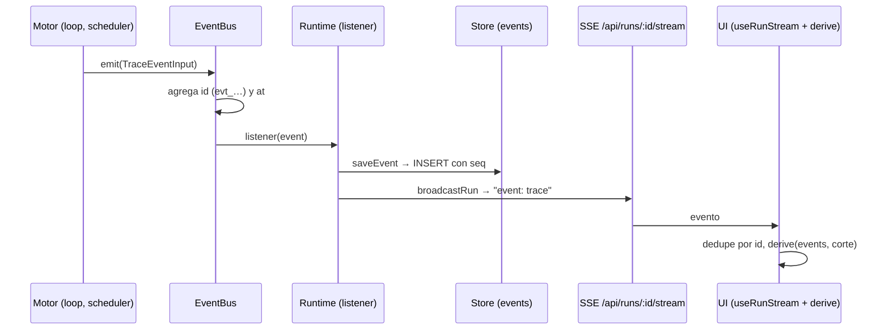

# Observabilidad y trazas

Todo lo que pasa en una corrida emite un **evento**: el motor lo publica en un
`EventBus`, el servidor lo guarda con número de secuencia y lo reemite por SSE,
y la UI **reconstruye** el organigrama animado, el tablero y la cronología
reproduciendo esos eventos. De ahí sale la promesa más importante del producto:
"ver en vivo" y "retroceder en el timeline" son **la misma operación** con un
corte distinto. Aparte, los propios agentes pueden auditar lo que hizo el
equipo (`check_activity`) y una persona puede auditar una corrida entera
(`npm run auditar`).

> **Un paso que no emite evento es un paso invisible.** (`CLAUDE.md`,
> "Todo lo que pasa tiene que emitir un evento")

Se paga caro no cumplirlo: un turno que fallaba sin emitir `agent.turn_end`
dejaba el nodo "pensando…" para siempre; antes de `model.selected`, un turno que
costaba diez veces más que el anterior no tenía explicación en la traza.

## El circuito

1. **Emitir** — `packages/engine/src/events.ts` → `EventBus.emit` recibe el
   evento sin `id` ni `at`, los completa y llama a cada suscriptor en orden. Un
   suscriptor que tira (una conexión SSE rota) se ignora: no puede tumbar la
   corrida.
2. **Un bus por corrida** — `apps/server/src/runtime.ts` → `Runtime.startRun`
   crea el `EventBus` y lo suscribe una sola vez: `store.saveEvent(event)` y
   después `broadcastRun(run.id, event)`. Guardar **antes** de reemitir es lo que
   hace que el replay muestre exactamente lo que se vio en vivo.
3. **Persistir** — `apps/server/src/db.ts` → `saveEvent` en la tabla `events`
   (`seq` autoincremental, `id`, `run_id`, `tick`, `type`, `data` JSON; índice
   `(run_id, seq)`). El `seq` existe porque varios eventos del mismo tick caen en
   el mismo milisegundo y el timestamp no ordena.
4. **Reemitir** — `routes.ts` → `GET /api/runs/:id/stream` (`openSse`) primero
   manda **toda la traza guardada** y recién después se engancha al vivo. Las
   dos operaciones son sincrónicas, así que no hay hueco entre ellas; si hubiera
   solapamiento, la UI deduplica por `id`.
5. **Derivar** — `apps/web/src/lib/stream.ts` → `useRunStream` acumula y
   `apps/web/src/lib/derive.ts` → `derive(events, upTo)` reconstruye el estado.

El catálogo de variantes, con quién emite y quién consume cada una, está en
[[Referencia de eventos]].

## Cada paso emite antes de ejecutarse

`packages/engine/src/loop.ts`: `model.selected` y `tool.selection` antes de la
primera llamada al modelo, `agent.thinking` al empezar cada iteración,
`tool.start` antes de ejecutar. Así la UI muestra lo que está pasando y no un
resumen a posteriori. La excepción es `agent.turn_end`, que va en el `finally`
del turno para salir **aunque el turno falle**.

## Los streams

| Stream | Evento SSE | Contenido | Alcance |
|---|---|---|---|
| `GET /api/runs/:id/stream` | `trace` | `TraceEvent` (primero la traza guardada) | una corrida |
| `GET /api/mcp/stream` | `mcp` | `McpServerHealth` | global, todas las empresas |
| `GET /api/companies/:id/codigo/stream` | `codigo` | `EventoDeCodigo` (repo cargado, sesión, checkpoint, servicio) | una empresa; la UI sólo invalida consultas |

`openSse` (`apps/server/src/routes.ts`) escribe `text/event-stream` con
`Cache-Control: no-cache, no-transform` y `X-Accel-Buffering: no`, arranca con
`: conectado` y manda `: ping` cada **20 s** para que ningún proxy corte la
conexión. El proxy de Vite (`apps/web/vite.config.ts`) deja pasar los streams
sin buffering.

Lecturas REST que completan la traza:

| Endpoint | Para qué |
|---|---|
| `GET /api/runs/:id/events` | la traza completa, en orden de `seq`: el replay |
| `GET /api/runs/:id` | corrida, mensajes, tareas, entregables, aprobaciones y ledger |
| `GET /api/companies/:id/progreso` | el pulso: corrida más reciente, si está viva y `progresoDeCorrida` |

## Cómo la UI deriva el estado

### `useRunStream`

Abre un `EventSource`, **deduplica por `id`** (al abrir y al reconectar el
servidor reenvía la traza previa) y retiene una ventana de `MAX_EVENTS = 5000`
eventos para que la pestaña no se coma la memoria. `connected` refleja
`onopen`/`onerror`.

### `derive(events, upTo)`

Recorre los eventos hasta `upTo` y devuelve un `DerivedState`:

| Campo | Sale de |
|---|---|
| `roles` (`thinking`, `modelSlug`, `providerId`, `tier`, `escaladoPorDificultad`, `motivoModelo`, `runningTool`, `turns`, `costUsd`, tokens, `lastSummary`) | `agent.thinking`, `model.selected`, `tool.start`/`tool.end`, `agent.turn_end`, `cost.updated` |
| `flows` | `agent.message` → aristas animadas (`recentFlows`, ventana de 4 s) |
| `tasks` con `historia` y `from` | `task.changed` → tablero |
| `acciones` (últimas 120), `mcpCalls` | `tool.end` |
| `toolSelections` | `tool.selection` |
| `totalCostUsd`, `budgetUsd`, `inputTokens`, `outputTokens`, `cachedInputTokens` | `cost.updated` |
| `status`, `stopReason` | `run.status` |
| `tick`, `maxTick`, `eventsPerTick` | todos (densidad del timeline) |

Lo consumen `routes/LiveProcess.tsx` (organigrama, panel del agente, cronología
`armarCronologia`, timeline), `routes/Board.tsx` (tarjetas) y, sin `derive`,
`routes/codigo/Chat.tsx` (pasos, respuesta y checkpoints de cada pedido).

### Ver en vivo y retroceder

`LiveProcess.tsx` guarda `scrub`: `null` sigue el vivo; un número congela la
vista en ese evento. Al retroceder se pide la traza completa
(`api.runEvents`) —el stream sólo retiene la ventana— y se llama al mismo
`derive(events, cut)`. Congelado, las aristas resaltadas son las del último tick
del corte y no las "recientes". El tablero muestra cómo estaba en ese ciclo.

> [!warning] La traza no se pollea; otras cosas sí
> `CLAUDE.md` dice que la UI "no hace polling". Es exacto para la traza, pero
> varias pantallas refrescan REST con intervalo: lista de corridas (5 s),
> detalle de la corrida en Proceso (3 s) y Tablero (5 s), Solicitudes (4 s),
> Memoria y Salida (5 s), Hub MCP (10 s), pulso (5 s viva, 30 s si no) y varias
> vistas del IDE (3 s). Pendientes de aprobación, bandejas y ledger salen de ahí,
> no de los eventos.

## El pulso: ¿esto avanza o está trabado?

`Store.progresoDeCorrida(runId)` cuenta con agregados sobre el índice
—`COUNT(*)` de eventos y `tool.end` como **acciones**— y lee **una** fila, la
última, para saber cuándo dio señal. Traer 8.000 eventos para pintar un contador
sería absurdo. `tool.end` y no el total porque el trabajo fino es lo único que
siempre ocurre: un agente puede pensar minutos sin mover una tarea.

`apps/web/src/lib/progreso.ts` → `calcularProgreso` es pura (recibe `ahora`) y
decide la salud:

| Salud | Condición |
|---|---|
| `detenida` | no está viva o su estado no es `running` |
| `trabajando` | última señal hace ≤ `CALLADO_MS` = 120.000 ms |
| `callado` | más de 2 min sin señal |
| `sin-señal` | más de `SIN_SENAL_MS` = 360.000 ms (6 min) |

Los cortes salen del trabajo real: una grabación de clip tarda 20 a 100 s y un
turno delegado puede pasar minutos entre herramienta y herramienta.
`ui/PulsoDeCorrida.tsx` lo muestra en la barra de todas las pantallas, con el
reloj corriendo en el navegador.

## `model.selected`: el modelo no es una decisión invisible

Con escalado por dificultad el modelo cambia de un turno a otro, y una empresa
puede mezclar suscripciones. Por eso `runAgentTurn` emite `model.selected` en
**todo** turno con proveedor, slug, tier, si escaló y el `motivo`
(`"bandeja cargada (6 mensajes) + contexto largo → smart (puntaje 6, rango cheap..smart)"`).

- El organigrama muestra el modelo del último turno de cada agente
  (`ui/modelo.tsx` → `ModeloBadge`) con el motivo en el tooltip.
- La cronología lo dibuja **sólo cuando escaló**: el modelo fijo de siempre no
  es noticia y duplicaría cada turno.
- `auditarCorrida` marca `turno-sin-modelo` si un turno cerró sin su
  `model.selected`.

Ver [[Escalado por dificultad]].

## Costos

| Dónde | Granularidad | Uso |
|---|---|---|
| `cost.updated` | una por llamada al modelo | barra de presupuesto, tokens por rol, % de caché (`porcentajeCache`) |
| `agent.turn_end.costUsd` | por turno | panel del agente |
| `tick.end.costUsd` | por ciclo | encabezado del ciclo |
| `LedgerEntry` (tabla `ledger`) | una por llamada | pantalla Costos (`Settings.tsx` → `Costs`): por agente y por modelo |

Los tokens importan tanto como el costo: un turno caro con poca salida es
contexto reenviado, y se corrige distinto que uno caro por escribir mucho. Ver
[[Costos y presupuesto]].

## Auditar lo que se hizo, no lo que se contó

### `RunState.activity` y `check_activity`

El agent loop —no el agente— registra cada llamada con su resultado real
(`packages/engine/src/state.ts` → `recordActivity`, entrada
`{roleId, tick, tool, ok, detail}` con el detalle recortado a 200). Entran las
llamadas normales, las herramientas propias del CLI (`cli:Edit`, agregadas por
nombre con las rutas) y las ejecutadas al aprobar. Se conservan las **últimas
500**.

`check_activity` (`packages/tools/src/coordination.ts`, coordinación, sólo
lectura) las muestra filtradas por `role` y `only_failures`, las últimas 60, como
`- c<tick> <rol> · <tool> · ok/FALLÓ · <detalle>`. Es lo único que detecta el
error más repetido del sistema: ejecutar algo con éxito y después informar que
no se pudo, o al revés. La misma lista alimenta `RunState.fallosConsecutivos`
(medidor de dificultad y orden por urgencia) y el detector de corridas vacías
(`Orchestrator.escribioCodigo`). Para la foto del encargo entero está
`estado_del_proceso`; ver [[Supervisión y continuidad]].

### `npm run auditar`

`apps/server/src/auditoria.ts` → `auditarCorrida(eventos)` es pura y corre sobre
la traza persistida; `scripts/auditar-corrida.ts` la trae de la base y la
imprime. Reglas: `turno-sin-modelo`, `exito-sin-respaldo` (el resumen declara
una entrega sin ninguna herramienta exitosa del rol en ese tick —el caso del
`INSTRUCCIONES-PDF.txt`—), `export-sin-verificacion`, `tasa-de-fallos` (≥ 5
llamadas y > 30 % fallidas) y `relectura-repetida` (> 6 lecturas iguales en un
tick). Ver [[Auditoría de corridas]].

## Otros rastros

- **`log`**: reintentos, avisos del proveedor (fallback de modelo, suscripción
  cerca del límite), compactación, freno por error repetido, turnos cortados,
  roles que hablan sin hacer nada. Va a la cronología con su color.
- **Transcripciones del CLI**: cada turno de `claude-code` deja la suya en
  `CLAUDE_CODE_WORKDIR/transcripciones/` (las últimas 300). Ver
  [[Proveedor claude-code]].
- **Telemetría MCP**: `McpServerHealth` (latencia, invocaciones, errores,
  reconexiones) en el Hub. Ver [[Integración MCP]].
- **Log del servidor**: pino con `pino-pretty` (`apps/server/src/index.ts`).

## Constantes

| Nombre | Valor | Archivo | Por qué |
|---|---|---|---|
| heartbeat SSE | 20.000 ms | `routes.ts` → `openSse` | que los proxies no corten |
| `MAX_EVENTS` | 5.000 | `lib/stream.ts` | ventana en memoria del navegador |
| acciones recientes | 120 | `lib/derive.ts` | lo que alguien puede leer mientras mira |
| ventana de aristas | 4.000 ms | `lib/derive.ts` → `recentFlows` | el destello se apaga solo |
| `CALLADO_MS` · `SIN_SENAL_MS` | 120.000 · 360.000 ms | `lib/progreso.ts` | cortes medidos sobre trabajo real |
| actividad retenida | 500 entradas | `state.ts` → `recordActivity` | una ventana revisable |
| `check_activity` | últimas 60 | `coordination.ts` | lo viejo ya se revisó |
| preview de `tool.end` | 400 caracteres (default de `preview`) | `packages/tools/src/types.ts` | no volcar el payload |
| preview de `agent.message` | 300 | `loop.ts`, `runtime.ts` | |

## Casos borde y fallas conocidas

- **Tablero vacío con trabajo heredado.** Las tareas adoptadas de una corrida
  anterior no emiten `task.changed`; como el tablero se deriva de la traza,
  aparecen recién cuando alguien las mueve.
- **Encargos y avisos del sistema sin arista.** El encargo inicial, el pedido de
  cierre al responsable y las notificaciones de aprobación entran a la bandeja
  sin `agent.message`.
- **Entregables y solicitudes que no se ven en la traza.** `edit_artifact` no
  emite `artifact.created`; `solicitar_comando` e `instalar_dependencia` no
  emiten `request.created` (son `skill`, y los efectos de coordinación sólo
  corren para `coordination`).
- **Una corrida cerrada por reinicio.** `sanearCorridasHuerfanas` cambia la fila
  a `stopped` sin evento: la traza termina en el último estado emitido.
- **Si la base falla al guardar un evento**, el listener tira antes de
  reemitir y `EventBus` se traga el error: ese evento no se ve ni se guarda.
- **`mcp.status` no llega nunca** por la traza: la salud MCP va por su stream.
- **Los efectos de coordinación leen "el último" del estado** (último mensaje,
  tarea más reciente, último entregable) en vez del valor que devolvió la
  herramienta. Funciona porque entre escribir y emitir no hay un `await` que
  ceda el control a otro turno; si agregás uno, con turnos en paralelo el evento
  podría describir la acción de otro agente.

## Qué fijan los tests

- `packages/engine/src/memory.test.ts` — un turno que falla igual emite
  `agent.turn_end`.
- `packages/engine/src/loop.test.ts` — `model.selected` con tier y motivo, y
  `escalado: false` con slug fijo.
- `apps/server/src/auditoria.test.ts` — cada regla de `auditarCorrida` sobre
  trazas armadas a mano.
- `apps/web/src/lib/progreso.test.ts` — reloj, ciclo, acciones y los cortes de
  salud.
- `packages/tools/src/coordination.test.ts` — `check_activity` y
  `estado_del_proceso`.

## Cómo extender

Una variante nueva sigue [[Cómo agregar un evento]]: entra en
`packages/shared/src/events.ts`, se emite **antes** de que el paso ocurra (o en
`finally` si es un cierre), y `derive` o la cronología deciden cómo dibujarla.
Si el dato sirve para una cuenta barata del servidor, agregalo a
`progresoDeCorrida` con agregados sobre el índice, no leyendo la traza entera.

## Fuentes

- `packages/engine/src/events.ts` — `EventBus`
- `packages/engine/src/loop.ts` — `runAgentTurn`, `executeOne`, `emitCoordinationEffect`
- `packages/engine/src/state.ts` — `recordActivity`, `fallosConsecutivos`
- `packages/tools/src/coordination.ts` — `check_activity`, `estado_del_proceso`
- `apps/server/src/runtime.ts` — `startRun` (suscripción), `subscribeRun`, `broadcastRun`, `subscribeMcp`, `subscribeCodigo`
- `apps/server/src/db.ts` — tabla `events`, `saveEvent`, `listEvents`, `progresoDeCorrida`
- `apps/server/src/routes.ts` — `openSse`, `/api/runs/:id/stream`, `/api/runs/:id/events`, `/api/mcp/stream`, `/api/companies/:id/progreso`
- `apps/server/src/auditoria.ts` — `auditarCorrida`
- `apps/web/src/lib/stream.ts` · `derive.ts` · `progreso.ts`
- `apps/web/src/routes/LiveProcess.tsx`, `Board.tsx`, `codigo/Chat.tsx`, `ui/PulsoDeCorrida.tsx`

## Ver también

- [[Referencia de eventos]]
- [[API HTTP y SSE]]
- [[Pantalla Proceso en vivo]]
- [[Pantalla Tablero]]
- [[Costos y presupuesto]]
- [[Auditoría de corridas]]
