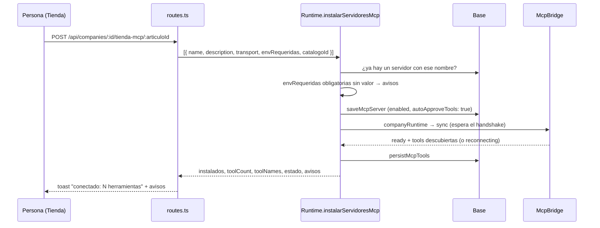

# Tienda MCP

Un catálogo curado de servidores MCP conocidos —GitHub, Brave, Playwright,
Notion…— instalables en un click desde la pestaña **Tienda**. Instalar hace el
ciclo entero del lado del servidor: alta, handshake, descubrimiento, y responde
"conectado, N herramientas" o qué credencial falta.

## Por qué existe

Dar de alta un servidor era pegar el JSON de su README y confiar. Dos problemas:
una credencial faltante se descubría recién en el handshake, lejos de su causa, y
nadie sabía qué servidores valía la pena conectar. La tienda declara **de
antemano** qué variables necesita cada artículo (`envRequeridas`) y la
instalación reusa el mismo ciclo que ya hacía la aprobación de
`solicitar_servidor_mcp`. Pegar JSON sigue existiendo en el Hub para lo que no
está en el catálogo ([[CU-05 Conectar un servidor MCP]]).

## El catálogo

`packages/shared/src/tienda-mcp.ts` → `CATALOGO_MCP` (25 artículos en 8
categorías, listados en [[Referencia de la tienda MCP]]). Vive en `shared`
porque lo consumen los dos lados: el servidor instala y la web muestra.

`articuloDeTiendaSchema`:

| Campo | Regla | Para qué |
|---|---|---|
| `id` | 1-64 | clave del artículo; va en la URL de instalación y en `catalogoId` |
| `nombre`, `descripcion` | ≤ 100 / ≤ 500 | la tarjeta |
| `categoria` | `archivos`, `desarrollo`, `web`, `datos`, `productividad`, `navegador`, `comunicacion`, `conocimiento` | agrupa en la pantalla |
| `icono` | nombre de Lucide en kebab-case | uno que no existe degrada a la lupa |
| `servidor.name` | `^[a-z0-9_-]+$`, ≤ 64 | segmento de `mcp__<name>__<tool>` |
| `servidor.description` | `""` | descripción del servidor |
| `servidor.transport` | `mcpTransportSchema` | hoy todos `stdio` con `npx`/`uvx`, armados con el ayudante `stdio()` |
| `envRequeridas` | `{ ref, descripcion, obligatoria }[]` | qué variables necesita, por **nombre** |
| `docsUrl` | URL | dónde leer si el paquete se rompe |

El catálogo **se valida en CI, no en runtime**: una entrada rota se descubre en
un test, no cuando alguien la instala. `articuloDeTienda(id)` busca por id.

## Instalar

`Runtime.instalarServidoresMcp(companyId, servidores, { otorgarARolId?, runId? })`
es el único camino de instalación y lo reusan la tienda y la aprobación de
`solicitar_servidor_mcp`:

1. **Dedupe por nombre**: los que ya existen van a `yaExistian`, no son error
   (instalar dos veces el mismo nombre rompería los ids de las tools).
2. **Chequeo de variables**: cada `envRequeridas` obligatoria sin valor en
   `process.env` agrega un aviso ("necesita X y no está en el entorno: agregala al
   .env del servidor y reconectá"). **No frena** la instalación: la credencial la
   carga la persona por su lado.
3. **Alta** con `mcpServerSchema.parse`, `enabled: true`,
   `autoApproveTools: true` y el `catalogoId`.
4. **Conectar** es sincronizar contra la base: `companyRuntime` → `sync`, que
   **espera el handshake** para poder decir qué herramientas aparecieron.
5. **Descubrir**: `persistMcpTools` y leer las filas de los servidores nuevos.
6. **Otorgar**, sólo si viene `otorgarARolId` (la aprobación de un pedido): se le
   suman al rol y, si su corrida está viva, se incorporan a su catálogo
   (`incorporarHerramienta` + `updateRoleTools`).
7. Devuelve `{ instalados, yaExistian, estado, toolCount, toolNames,
   herramientasOtorgadas, avisos }`.

La ruta de la tienda contesta **409** con los avisos si el artículo ya estaba
instalado.

> [!important] La tienda instala sin otorgarle a nadie
> Después de instalar, las herramientas no las tiene ningún rol. Asignalas desde
> la matriz del Hub o desde el rol; eso llega a las corridas vivas. Lo medimos:
> Brave instalado y `ready`, y una corrida entera sin usarlo porque la corrida
> vieja no lo tenía en su catálogo (ver [[Integración MCP]]).

## Qué muestra la pantalla

`GET /api/tienda-mcp?companyId=` devuelve cada artículo con dos campos
calculados:

- `instalado`: algún servidor de la empresa tiene ese `catalogoId` **o el mismo
  nombre** (un servidor pegado a mano con el mismo nombre cuenta como instalado);
- `envFaltantes`: las `envRequeridas` obligatorias sin valor en `process.env`.

`apps/web/src/routes/Tienda.tsx` los agrupa por categoría con búsqueda por
nombre, descripción o categoría; cada tarjeta muestra el ícono, el enlace a la
documentación, una etiqueta por variable (verde si está, "· falta" si no, "sin
credenciales" si no pide ninguna) y el botón **instalar**, que avisa en su
`title` si va a instalar sin credencial. El resultado llega como toast. El Hub
tiene además una versión compacta (`TiendaMinima`).

## Plantillas y tienda

Las plantillas de equipo sugieren artículos (`mcpSugeridos`), pero **no se
instalan solos**: conectar lo decide una persona. Al crear un proyecto con
equipo, la UI avisa "Instalálos desde la Tienda". Un test
(`plantillas.test.ts`) exige que cada sugerido exista en el catálogo. Ver
[[Plantillas de equipo]].

## Casos borde

| Síntoma | Causa |
|---|---|
| "instalado" pero `reconnecting` | falta el paquete, `npx`/`uvx` no está en el `PATH` o falta la credencial y el servidor muere al arrancar |
| agregué la variable al `.env` y sigue faltando | `process.env` se lee al arrancar: reiniciá el servidor |
| el artículo sale como instalado sin haberlo instalado | hay un servidor pegado a mano con el mismo `name` |
| `filesystem` o `sqlite` miran otra carpeta | sus rutas (`.`, `data/mcp-sqlite.db`) son relativas al directorio de trabajo del servidor |

## Qué fijan los tests

`packages/shared/src/tienda-mcp.test.ts`: todas las entradas validan contra el
esquema; ids y nombres de servidor no se repiten; ningún `env` lleva un valor con
pinta de secreto (usa el mismo `referenciaDe` del importador); toda variable del
transporte está declarada en `envRequeridas`; hay al menos 15 artículos en 5
categorías; `articuloDeTienda` devuelve `null` para lo desconocido. **No hay**
tests de `instalarServidoresMcp` ni de las rutas de la tienda.

## Fuentes

- `packages/shared/src/tienda-mcp.ts` → `CATALOGO_MCP`, `articuloDeTiendaSchema`, `categoriaDeTiendaSchema`, `articuloDeTienda`
- `apps/server/src/runtime.ts` → `instalarServidoresMcp`
- `apps/server/src/routes.ts` → `GET /api/tienda-mcp`, `POST /api/companies/:companyId/tienda-mcp/:articuloId`
- `apps/web/src/routes/Tienda.tsx` · `apps/web/src/routes/McpHub.tsx` → `TiendaMinima`

## Ver también

- [[Referencia de la tienda MCP]] · [[CU-10 Instalar un servidor desde la tienda]]
- [[Cómo agregar un servidor a la tienda MCP]] · [[Integración MCP]] · [[Pantalla Tienda]]
