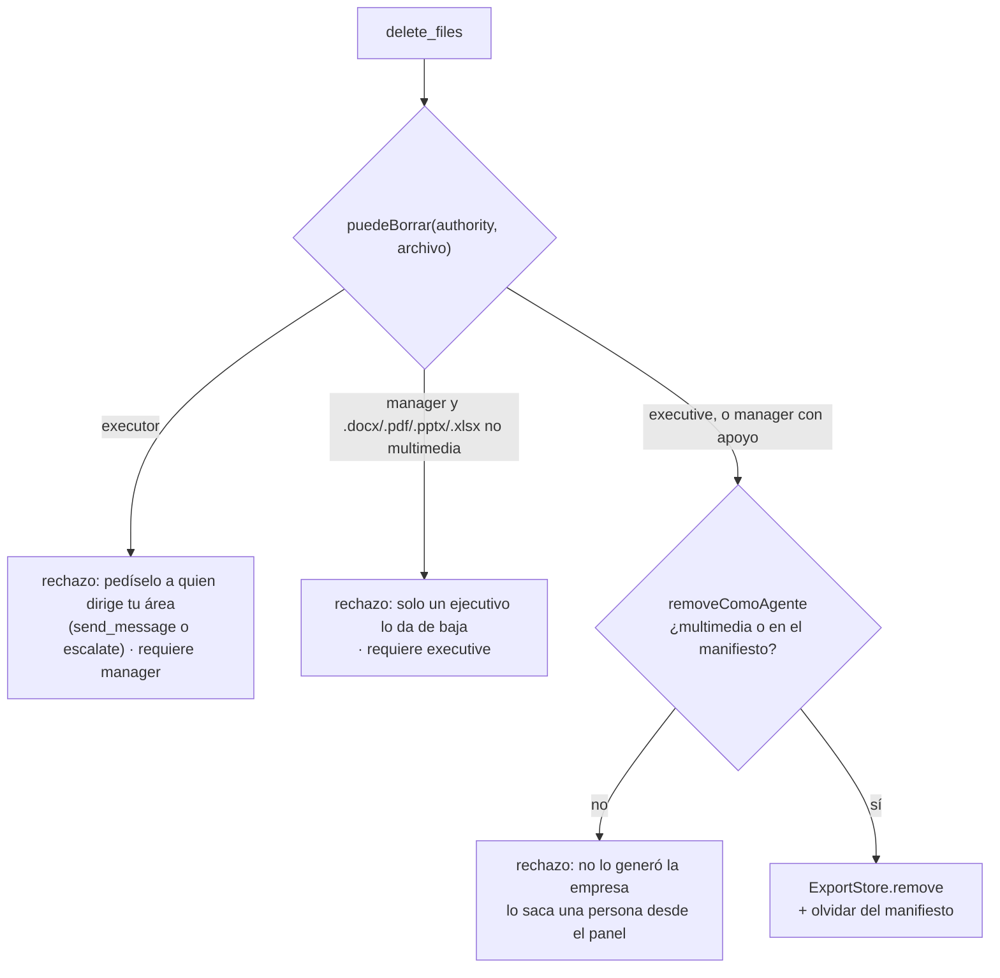

# Archivos de salida y permisos de borrado

> Borrar es la única acción del directorio de salida que no se puede deshacer,
> así que es la única que mira la jerarquía.

Cada empresa tiene un directorio de salida
(`data/proyectos/<Nombre legible>/salida/`) donde caen el Word, el PDF, el deck,
el video y las imágenes. Sobre ese directorio los agentes **crean, modifican,
leen y borran** con cuatro habilidades: `write_output_file`,
`read_output_file`, `list_output` y `delete_files`. Crear y modificar quedan
abiertos: un ejecutor tiene que poder producir sin pedir permiso. Borrar pasa
por **dos reglas independientes**: la procedencia (un agente sólo borra lo suyo
o multimedia) y la autoridad (`puedeBorrar`). Cómo guarda y sanea los archivos
el `ExportStore` por dentro está en [[Salida de la empresa]].

## Las herramientas del agente sobre la salida

Todas son `origin: "skill"`, se registran siempre (`createSkillTools`) y se
asignan por rol con `toolIds`, como cualquier habilidad.

### `write_output_file` — crear o reemplazar un archivo de texto

| | |
|---|---|
| `readOnly` / aprobación | `false` / no |
| `path` (obligatorio) | Ruta destino, `informes/notas-reunion.md`. La carpeta se crea sola. |
| `content` (obligatorio) | Contenido completo. |

- **Sobrescribe sin avisar.** El historial va en `write_artifact`, no acá:
  versionar en disco duplicaría lo que ya hace el entregable.
- **Le saca la versión al nombre** (`sinVersionEnNombre`): `paquete-comercial-v25.md`
  se escribe como `paquete-comercial.md`. Lo pagamos con una corrida que dejó
  `paquete-comercial-v25.md` al lado del PDF sin versión, y con v22, v23 y v25
  conviviendo sin saber cuál valía. La regex saca `[-_ ]*[vV]\d+` al final del
  nombre sin extensión; no toca `plan-2026.md` ni una carpeta `v2/`, y si el
  nombre era sólo la versión (`v2.md`) lo deja como estaba.
- **Avisa si parece código fuente** (`.js .ts .tsx .py .go .rs .java .kt .cs
  .rb .php .swift .c .cpp .h`…): se escribe igual —puede ser un ejemplo en un
  informe— pero la respuesta dice que un programa va en un repo
  (`crear_repositorio` + `escribir_codigo`). Lo medimos: un equipo entero
  escribió un simulador archivo por archivo en la salida porque el proyecto no
  tenía repo. Ver [[Trabajo con código]].
- Rechaza `path` vacío y `content` vacío o sólo espacios ("Escribir un archivo
  vacío no le sirve a nadie").
- Es la vía con la que se escriben las láminas HTML del motor de estudio. Ver
  [[Motor estudio de láminas HTML]].

### `read_output_file` — releer un archivo de texto

| | |
|---|---|
| `readOnly` | `true` |
| `path` (obligatorio) | `escenas/02-lo-que-hacemos.html` |

Existe porque un agente podía escribir y no volver a leer: quien programa una
lámina necesita releerla para corregirla, y la única alternativa era reescribirla
entera de memoria.

- Devuelve hasta **`TOPE_LECTURA` = 24.000 caracteres**; si sigue, corta y dice
  cuántos tiene. Lo que devuelve una herramienta se reenvía en cada iteración
  del turno, así que un archivo grande leído dos veces sale más caro que el
  trabajo que habilita; con 24.000 entra una lámina holgada.
- Un binario leído como UTF-8 no falla: vuelve con bytes nulos y caracteres de
  reemplazo. Si aparece `\u0000` o `�`, se rechaza ("no es un archivo de
  texto: se mira desde la pestaña Salida") en vez de meterle basura al contexto.
- Si la ruta no existe, lista hasta 40 rutas que sí existen.

### `list_output` — qué hay y qué se puede borrar

| | |
|---|---|
| `readOnly` | `true`, sin argumentos |

Una línea por archivo, sin la estructura de carpetas:

```text
3 archivos, 1 multimedia:
- informes/propuesta.pdf (48 KB) — documento, de la empresa · SE PUEDE BORRAR
- marca/logo.png (12 KB) — multimedia, externo · SE PUEDE BORRAR
- contratos/firmado.pdf (230 KB) — documento, externo · NO SE PUEDE BORRAR: lo trajo una persona
```

**La etiqueta es el permiso, no sólo la procedencia**: decir "externo" de un
multimedia hacía que el agente lo salteara, aunque la regla sí permite borrarlo.
La etiqueta refleja sólo la regla de procedencia; la de autoridad se aplica
después, al borrar.

### `delete_files` — borrar uno o un grupo

| | |
|---|---|
| `readOnly` / aprobación | `false` / no |
| `path` | Un archivo concreto. |
| `kind` | `"multimedia"` (imágenes, audio, video), `"documents"` (todo lo que no es multimedia) o `"all"`. |
| `folder` | Limita el `kind` a una carpeta. Vacío = todo el directorio. |

La descripción avisa en mayúsculas: **NO HAY PAPELERA**.

- **`path` gana sobre `kind`.** Los modelos completan todos los campos del
  esquema aunque uno solo aplique: rechazar la llamada por eso dejó la
  herramienta inusable —28 llamadas seguidas rechazadas, cero borrados—. Si
  vienen los dos, borra la ruta y aclara "se ignoró kind".
- **"Borrá toda la multimedia" es una llamada**, no una por archivo: encadenarlas
  hacía que el agente fallara a la mitad y dejara el directorio en un estado
  intermedio que nadie pidió.
- Sin `path` ni `kind` válido, no adivina: pide uno de los dos y sugiere
  `list_output`.
- Si no había nada que borrar: `ok` con "No había nada que borrar".
- Si **ningún** candidato se puede borrar por autoridad, falla con el motivo
  (que nombra a quién escalar) en vez de responder "borré 0" en verde, que
  parece que no había nada.
- Si se borró una parte, responde `ok` con la lista de borrados y "No se
  pudieron borrar N: ruta (motivo); …".

## Dos reglas para borrar



### 1. Autoridad: `puedeBorrar`

`packages/tools/src/skills/permisos.ts`. La escala sigue **el riesgo de lo que
se pierde**, no la antigüedad del rol. El rechazo **nombra a quién escalarle**
(`requiere`) para que el agente siga con `escalate` o `send_message` en vez de
trabarse.

| Autoridad | Multimedia (imagen, audio, video) | Apoyo (md, csv, json, html, txt…) | Entregable (`.docx`, `.pdf`, `.pptx`, `.xlsx`) |
|---|---|---|---|
| `executive` | Borra | Borra | Borra |
| `manager` | Borra | Borra | **No** → requiere `executive` |
| `executor` | **No** → requiere `manager` | **No** → requiere `manager` | **No** → requiere `manager` |

- **`executive`** responde por el trabajo de la empresa: da de baja cualquier
  cosa que la procedencia permita.
- **`manager`** borra material de apoyo pero no un Word ni un PDF: son el
  entregable. La lista es `FORMATOS_ENTREGABLE` y se mira por extensión, sin
  distinguir mayúsculas.
- **`executor`** no borra. Es deliberado: es el rol que más turnos gasta y el
  que más fácil interpreta de más una instrucción de limpieza. Produce y
  corrige; si algo sobra, lo escala.

> [!note] El deck y el video cuentan como apoyo
> `.html` y `.mp4` no están en `FORMATOS_ENTREGABLE`: un `manager` puede borrar
> el deck (`export_slides`) y el video, aunque para la empresa sean el
> entregable.

### 2. Procedencia: `removeComoAgente`

`apps/server/src/exports.ts`. Un agente limpia **lo suyo**: multimedia, o
archivos que la propia empresa generó. Lo que trajo una persona no lo toca: no
lo produjo, no sabe qué es, y "eliminá lo que sobra" no puede llevarse un
contrato firmado.

- La procedencia vive en `.orq-generado.json` dentro del directorio de la
  empresa (oculto: el árbol ignora lo que empieza con punto). Lo actualizan
  `save` y `writeText` al escribir, y `remove` al borrar.
- **Si el manifiesto no existe, todo cuenta como externo: falla seguro.**
- Un archivo borrado y vuelto a traer a mano deja de ser propio: el registro se
  limpia al borrar.
- La regla la aplica el **store**, no la herramienta: el límite no depende de
  que el modelo la haya entendido. `removeMany` pasa cada candidato por
  `removeComoAgente`: un lote no es la excusa para llevarse algo ajeno.

### En lote se filtra antes de borrar

`delete_files` con `kind` calcula los candidatos, corre `puedeBorrar` sobre cada
uno y le pasa a `removeMany` los rechazados en `excluir`. Un `kind: "all"` no
puede ser la vía para saltear la jerarquía: un manager que pide "borrá todo" se
lleva el apoyo y deja los PDF, con el motivo de cada uno en la respuesta.

## Matriz completa: quién hace qué

| Operación | `executor` | `manager` | `executive` | Persona en la UI |
|---|---|---|---|---|
| Crear/reemplazar texto (`write_output_file`) | Sí | Sí | Sí | — (no hay subida en la pestaña) |
| Exportar (`export_*`, `generar_imagen`, clips…) | Sí, si tiene la habilidad | Sí | Sí | — |
| Leer y listar | Sí | Sí | Sí | Sí, con vista previa |
| Borrar multimedia generada o traída | No | Sí | Sí | Sí, sin confirmación |
| Borrar apoyo generado | No | Sí | Sí | Sí, con confirmación |
| Borrar apoyo traído por una persona | No | No (procedencia) | No (procedencia) | Sí, con confirmación |
| Borrar `.docx`/`.pdf` generado | No | No | Sí | Sí, con confirmación |
| Borrar `.docx`/`.pdf` traído | No | No | No (procedencia) | Sí, con confirmación |
| Publicar (mover a `publicado/`) | No | No | No | Sí |
| Vaciar lo generado conservando lo traído | No | No | No | Sí (Configuración) |

**El borrado desde la UI no pasa por ninguna de las dos reglas**: el endpoint
`DELETE /api/companies/:companyId/exports/*` llama a `ExportStore.remove`
directo. Ahí decidís vos. La pestaña pide confirmación ("¿seguro? no se puede
deshacer") para todo lo que no es multimedia y marca como **externo** lo que no
generó la empresa. Publicar es la única acción del circuito que un agente no
puede hacer (ver [[ADR-008 Publicar lo decide una persona]] y
[[Pantalla Salida]]).

## El saneo sigue en pie siempre

Toda ruta que propone un agente se limpia **segmento por segmento**
(`ExportStore.safePath` / `safeSegment`): separadores fuera, tildes
descartadas, lo que no es `[\w.-]` a guion, `..` colapsado, puntos iniciales
fuera, 80 caracteres por segmento y **6 segmentos** como máximo. La verificación
final es sobre la ruta ya resuelta. Así se escribe y se borra dentro del
directorio de la empresa y en ningún otro lado. Consecuencias que se notan:

- `Área Comercial/2026` queda `Area-Comercial/2026`.
- Un agente **no puede escribir el manifiesto**: `.orq-generado.json` pierde el
  punto inicial y se escribe como `orq-generado.json`.
- Ni `delete_files` borra carpetas: el borrado es de archivos.

El detalle del algoritmo y de la disposición de carpetas está en
[[Salida de la empresa]] y [[Directorios en disco]].

## Casos borde y fallas conocidas

> [!danger] Una ruta sin sanear en la herramienta saltea la jerarquía
> `delete_files` decide la autoridad sobre el `path` o el `folder` **crudos**,
> pero el store borra la ruta **saneada**. Verificado con un `ExportStore`
> temporal: un `manager` con `path: "informes/propuesta.docx/"` borra el Word
> (el nombre crudo termina en `/` y no parece `.docx`), y un `executor` con
> `folder: "informes/"` borra la carpeta entera (el filtro busca
> `informes//…`, no encuentra candidatos que rechazar y `removeMany` sanea la
> carpeta). La regla de procedencia sí se sostiene, porque la aplica el store.

| Síntoma | Causa |
|---|---|
| Un agente borró el logo de la marca | `marca/logo.png` es multimedia: `removeComoAgente` la acepta aunque la haya traído una persona, y un `kind: "multimedia"` o `"all"` de un manager o ejecutivo se la lleva. El vaciado de la UI la conserva porque se guía por el manifiesto. |
| Un archivo de una persona pasó a ser "de la empresa" | `write_output_file` sobre una ruta existente la pisa **y la anota como generada**: la procedencia es "último que escribió". Desde ahí un agente puede borrarla. |
| El archivo quedó en `a/b/c/d/e/f` sin nombre | `save` junta carpeta y nombre y recién ahí corta a 6 segmentos: con una carpeta de 6 niveles el nombre se pierde y los bytes quedan en un archivo llamado como el sexto nivel. |
| `list_output` dice "SE PUEDE BORRAR" y el borrado falla | La etiqueta sólo mira procedencia; la autoridad se aplica al borrar. |
| El agente insiste con un archivo "externo" | El rechazo le dice que lo saca una persona desde el panel; no hay forma de que un agente lo borre. |

## Integración

- **Pantallas:** [[Pantalla Salida]] (árbol, vista previa, borrar, publicar) y
  [[Pantalla Configuración]] (vaciar lo generado).
- **Endpoints:** `GET /api/companies/:companyId/exports` (árbol),
  `POST …/exports/folders`, `DELETE …/exports/*`, `GET …/exports-preview/*`,
  `POST …/exports-publicar/*`, `POST …/exports-vaciar`, `GET …/exports/*`. Ver
  [[Referencia de API]].
- **Coordinación:** `escalate` y `send_message` son la salida de un rechazo. Ver
  [[Coordinación entre agentes]] y [[Organización de agentes]].
- **Plantillas:** "Estudio audiovisual" le da `delete_files` a la realizadora
  (`manager`).

## Qué fijan los tests

`packages/tools/src/skills/permisos.test.ts`:

- "un ejecutivo da de baja cualquier cosa"; "quien dirige un área borra apoyo
  pero no el entregable" (`requiere: "executive"`); "un ejecutor no borra nada".
- "el rechazo dice a quién escalarle" (menciona `escalate` o `send_message`).
- "un .docx cuenta como entregable igual que un .pdf"; un `.csv` no.
- La herramienta: el ejecutor recibe el rechazo y el archivo queda; **sí puede
  crear**; un `kind: "all"` de un manager deja el PDF y lo informa; el ejecutivo
  se lleva todo; sin nada borrable, falla con el motivo en vez de decir 0.

`packages/tools/src/skills/skills.test.ts` ("limpieza…" y "crear y modificar"):
el listado dice "SE PUEDE BORRAR"; `kind: "multimedia"` es una llamada;
`folder` acota; sin argumentos no adivina; `path` gana sobre `kind`; avisa
"No había nada"; la descripción dice "NO HAY PAPELERA"; escribir crea y
reemplaza, rechaza vacío y exige `path`; `sinVersionEnNombre` saca `-v25`,
`_v3` y `-V12` y respeta `plan-2026.md`, `ruta/v2/` y `v2.md`.

`apps/server/src/exports.test.ts` ("qué puede borrar un agente"): borra lo
generado y la multimedia ajena, no toca un documento traído, el lote tampoco,
la UI sí, el árbol dice la procedencia, el manifiesto no aparece, y un archivo
borrado y vuelto a traer deja de ser propio.

## Cómo modificar sin romperlo

- Una extensión que deba contar como entregable va en `FORMATOS_ENTREGABLE`; una
  que deba contar como multimedia, en `EXTENSIONES_MULTIMEDIA` de
  `exports.ts` (define qué puede borrar cualquier agente con autoridad).
- Si tocás la procedencia, mantené que **la regla viva en el store**: la
  herramienta decide autoridad, el store decide procedencia.
- Sanear en la herramienta antes de llamar a `puedeBorrar` cerraría el hueco de
  arriba; hoy el `SkillStorage` no expone el saneo.

## Fuentes

- `packages/tools/src/skills/index.ts` → `crearEscritura`, `crearLectura`, `crearListado`, `crearBorrado`, `sinVersionEnNombre`, `TOPE_LECTURA`, `SkillStorage`
- `packages/tools/src/skills/permisos.ts` → `puedeBorrar`, `FORMATOS_ENTREGABLE`, `VeredictoBorrado`, `ArchivoParaBorrar`
- `apps/server/src/exports.ts` → `ExportStore.forCompany`, `removeComoAgente`, `removeMany`, `writeText`, `remove`, `safePath`, `safeSegment`, `MANIFIESTO`, `EXTENSIONES_MULTIMEDIA`, `vaciarGenerado`
- `apps/server/src/routes.ts` → endpoints `/api/companies/:companyId/exports*`
- `apps/web/src/routes/Output.tsx` → `Nodo` (confirmación y marca "externo")
- Tests: `packages/tools/src/skills/permisos.test.ts`, `packages/tools/src/skills/skills.test.ts`, `apps/server/src/exports.test.ts`

## Ver también

- [[Habilidades de producción]] · [[Salida de la empresa]] · [[Directorios en disco]]
- [[Pantalla Salida]] · [[Organización de agentes]] · [[Seguridad]]
- [[ADR-008 Publicar lo decide una persona]]
