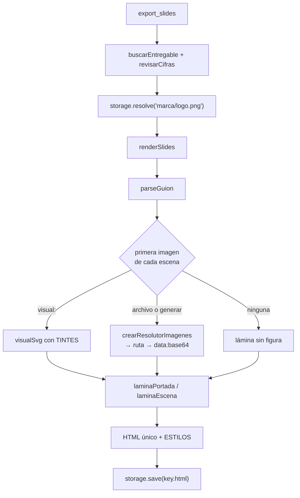

# Deck de slides

> Un video no se puede citar, ni copiar una frase, ni saltar a la escena siete.
> La mitad de las veces lo que hace falta es exactamente eso.

`export_slides` convierte el **mismo guion** que filma `export_video` en una
presentación HTML de un solo archivo, que se abre en cualquier navegador, se
imprime a PDF y se adjunta a un correo. Sale del mismo `parseGuion` que el video
(`packages/tools/src/skills/guion.ts`), así que las dos salidas no pueden decir
cosas distintas: si el guion cambia, cambian las dos. Lo que en el video es voz
en off, acá es la nota al pie de la lámina: en pantalla nadie la escucha, pero
sí la lee.

## Contrato de la herramienta

`crearSlides(storage, opciones)` en `packages/tools/src/skills/index.ts`.

| | Valor |
|---|---|
| Nombre | `export_slides` |
| Origen | `skill`, siempre registrada (no depende de nada instalado) |
| `readOnly` / `requiresApproval` | `false` / `false` |
| Archivo | `<folder>/<key>.html` |

| Argumento | Tipo | Qué es |
|---|---|---|
| `artifact_key` | string, **obligatorio** | La clave del guion, la misma que se le pasa a `export_video`. |
| `folder` | string, opcional | Carpeta de la salida (`"marketing/videos"`). Se crea sola. |

Respuesta:

```text
Presentación generada en marketing/lanzamiento.html: 7 láminas, 3 imágenes
incrustadas, 412 KB. Se abre en el navegador desde la pestaña Salida.
Atención: No existe el visual "embudo".
```

| Falla | Respuesta |
|---|---|
| Clave vacía o inexistente | La de `buscarEntregable` (lista las claves que existen). |
| `$` o `%` sin verificar | La de `revisarCifras`: ver [[Habilidades de producción#La guardia de cifras]]. |
| Guion sin escenas | "No se pudo armar la presentación de "x": El guion no tiene ninguna escena. Un guion es un título con `#`, y después una escena por cada `##`…" |

A diferencia de `export_docx`/`export_pdf`, **no borra archivos `key-vN.html`**
de la forma vieja: la limpieza de versiones en el nombre sólo está en
`crearSkill`.

## Cómo funciona



1. Se resuelven la clave y la guardia de cifras, igual que en todas las
   exportaciones.
2. Se busca el logo en la ruta fija `marca/logo.png` de la salida (`LOGO`). Si
   está, firma la portada; si no, no hay logo.
3. `renderSlides(markdown, meta, { resolverImagen, logo })` arma el HTML y lo
   devuelve como texto. **No escribe**: dónde va el archivo lo decide el
   `SkillStorage`, como en Word, PDF y video.
4. Se guarda como `<key>.html` con `storage.save`.

El `DocumentMeta` se arma igual que en los documentos (título, empresa, autor,
cargo, versión y fecha `es-AR` de la versión), pero el deck **sólo usa la
empresa, la fecha y el título**.

## Del guion a las láminas

Cada escena de `parseGuion` es una lámina (el detalle del parseo está en
[[Guion como línea de tiempo]]):

| En el guion | En el deck |
|---|---|
| Primer `#` (y lo narrado antes del primer `##`) | **Portada**: logo, ceja con la empresa, título (`escena.titulo` o el del guion) y la narración como bajada. Viñetas, citas y diálogos de la portada **no se muestran**. |
| Cada `##` (o `###`) | Una lámina con encabezado: ícono de la escena + título. |
| `:nombre:` al principio del `##` | Ícono de la escena (SVG del catálogo). |
| Viñetas y numeradas | Lista de viñetas; cada una con su ícono o un cuadradito. La numeración se pierde. |
| Fila de tabla | Una viñeta "celda — celda" (el encabezado de la tabla se pierde). |
| `> frase` | `<blockquote>` grande. Sólo queda la **última** cita de la escena. |
| `**Nombre:** texto` | Diálogo: `<dl>` con el personaje en mayúsculas y lo que dice. |
| Párrafos | Nota "Voz en off —" al pie de la lámina. Si la escena **sólo** tiene narración, pasa a ser el cuerpo (`.relato`): un título sobre el vacío con la frase escondida al pie no es una lámina. |
| `` | Diagrama SVG dibujado en la lámina (`figure.lienzo`), entero. |
| `` o `` | Foto incrustada como `data:` (`figure.foto`), recortada para llenar el hueco. |
| Código | Se descarta. |

Reglas de la lámina:

- **Una figura por lámina**: se muestra sólo la primera imagen de cada escena.
  Dos figuras en una lámina no es una lámina, es un collage; las demás quedan
  para el video, que sí las muestra una después de otra.
- **Una foto y un diagrama no se tratan igual** (`Medio`): la foto se recorta
  (`object-fit: cover`) y el diagrama entra entero o deja de leerse.
- En la portada sólo una **foto** se usa, como fondo a cuadro entero con el
  mismo velo oscuro que en el video; un visual en la portada se ignora.
- El folio (`01`, `02`…) es el índice de la escena, con la portada como 0; va
  del lado del texto, no sobre la foto (encima de una imagen clara desaparece).
- Todo texto del guion pasa por `esc` (`&`, `<`, `>`, `"`): el guion no puede
  inyectar etiquetas. El visual escapa sus textos con `escaparXml`.

### Imágenes incrustadas

El archivo es **uno solo y sin pedidos a la red**: las imágenes viajan como
`data:<tipo>;base64,…` adentro del HTML. Un deck que depende de rutas relativas
se rompe apenas alguien lo adjunta a un correo, que es justo lo que se hace con
un deck. El tipo sale de la extensión (`tipoDe`: jpg/jpeg, webp, gif; el resto
se declara `image/png`).

Las imágenes se resuelven con el mismo `crearResolutorImagenes` del video: una
ruta del directorio de salida se usa tal cual; `(generar)` se busca primero en
`<folder>/imagenes/` por su nombre derivado del prompt y sólo se paga si no
está. Ver [[Imágenes y medios]].

Lo que no se puede incrustar **no rompe el deck**: la lámina sale sin figura y
el motivo va a `avisos`, que la herramienta devuelve como "Atención: …" —es lo
único que el agente puede leer para corregir el guion—.

| Aviso | Cuándo |
|---|---|
| `No existe el visual "x".` | Nunca en la práctica: un `visual:` con nombre desconocido ya no se toma como visual en `parseGuion` y termina tratado como ruta, con el aviso de abajo. |
| `No se pudo incrustar la imagen "alt".` | La ruta no existe en la salida. |
| `No se pudo incrustar "alt": …` | El resolutor tiró error (por ejemplo `(generar)` sin proveedor de imágenes). |

## La firma es la empresa

El pie del deck es `empresa · fecha`. **No aparece el rol que lo produjo**: un
Word interno lleva el nombre de quien lo escribió porque alguien responde por
él; una pieza que se le manda a un cliente la firma la marca, y el nombre del
agente no le dice nada a quien la recibe. El `<title>` del HTML es el título del
guion (o el del entregable).

## El HTML por dentro

- Documento `lang="es"`, `color-scheme: dark`, tipografía Roboto → Helvetica
  Neue → Helvetica → Arial (la pila del sitio, sin pedir fuentes a la red).
- **Sin JavaScript.** Todo es CSS: la barra de lectura usa
  `animation-timeline: scroll()` y la entrada escalonada de cada lámina
  `animation-timeline: view()` dentro de `@supports` y
  `prefers-reduced-motion: no-preference` —donde no hay soporte, todo queda
  visible: una lámina que no aparece es peor que una sin animación—. La primera
  lámina entra con `@starting-style`; la foto de la portada, con un acercamiento
  de 14 s.
- Grano: un SVG de ruido embebido al 3,5% sobre todo el documento.
- Cada lámina es un **16:9** de `min(1200px, 100%)`: se mira en una sala y en un
  teléfono sin scroll lateral. Con figura, dos columnas (`1fr 38%`); por debajo
  de 720 px la figura se oculta.
- Impresión (`@media print`): fondo blanco, sin bordes ni radios, una lámina por
  página (`break-after: page`).
- La paleta sale del **logo** y está en OKLCH (`COLOR`): violeta `#5058e8`,
  turquesa `#40f8c0` y azul `#40a0f8` convertidos. OKLCH es perceptualmente
  uniforme: un degradado entre el violeta y el turquesa no vira por el medio, y
  deja derivar variantes con `color-mix()`.

> [!danger] Cinco tokens del `:root` se referencian a sí mismos
> En `ESTILOS`, `--bg`, `--fg`, `--fg-muted`, `--fg-dim`, `--primary`,
> `--accent` y `--border` están definidos como `var(--mismo)`. Una variable
> CSS en un ciclo es inválida, y toda propiedad que la usa queda sin valor.
> Verificado renderizando un deck en Chrome: **el título de la portada no se ve**
> (el `h1` es `color: transparent` con el texto recortado de un fondo que ya no
> existe), las láminas pierden su fondo degradado, el borde y la sombra, y
> desaparecen la barra de lectura, la raya de la ceja, el borde de la cita, el
> filete de la voz en off y el color de acento de viñetas e íconos (salen en
> blanco). Queda el lienzo oscuro por defecto del navegador. Sólo `--surface`,
> `--surface-up` y `--violet` toman valores de `COLOR`. Los **visuales** sí
> salen en la paleta, porque usan `TINTES` directamente. El arreglo es poner en
> esos tokens los valores de `COLOR` (`fondo`, `tinta`, `tintaTenue`,
> `tintaDebil`, `acento`, `realce`, `borde`).

## Seguridad: el deck se mira aislado

La vista previa de la pestaña Salida dibuja el `.html` en un `<iframe
sandbox="">` (sandbox vacío, sin `allow-same-origin` ni `allow-scripts`). El
archivo se sirve desde el **mismo origen** que la aplicación, y un `.html` que
escribió un agente no puede correr con la sesión de la persona: se le permite
dibujarse y nada más. Como el deck no usa JavaScript, el sandbox no le saca
nada. El servidor lo reconoce como `page` (`previewLiviano`) y lo sirve con
`text/html; charset=utf-8` (`contentTypeOf`): con `octet-stream` el navegador lo
descargaba en vez de dibujarlo. Ver [[Pantalla Salida]].

> [!warning] Abierto en otra pestaña no hay sandbox
> La descarga (`GET …/exports/<ruta>`) sale como `attachment`, pero con
> `?inline` el archivo se sirve tal cual desde el origen de la aplicación. El
> deck generado no trae scripts y todo texto va escapado; un `.html` escrito a
> mano con `write_output_file`, en cambio, sí podría traerlos.

## Casos borde y fallas conocidas

| Síntoma | Causa |
|---|---|
| El título de la portada no se ve, láminas planas y sin acento | Los tokens circulares del `:root` (callout de arriba). |
| Una escena con un clip (`video:…`) sale con una imagen rota y el HTML pesa lo que el video | `renderSlides` no distingue `clip`: el resolutor devuelve la ruta del `.mp4` y se incrusta entero como `data:image/png`. |
| Una lista numerada sale como viñetas | El guion no conserva la numeración. |
| Faltan las viñetas de la portada | `laminaPortada` sólo usa logo, empresa, título y narración. |
| De una cita de dos renglones queda sólo el último | Cada `>` es un bloque y la escena guarda un único `destacado`. |
| No aparece la tabla, sino viñetas | En pantalla una grilla no se lee: cada fila entra como viñeta. |
| `:crecimiiento:` visible en una viñeta | Nombre de ícono desconocido: la marca queda a la vista a propósito. |
| Un deck enorme | Cada imagen va en base64 (+33%). |

## Integración

- **Herramientas:** `write_artifact` (el guion), `estimar_duracion`,
  `export_video` / `export_video_estudio` (la misma clave), `generar_imagen`.
- **Endpoints:** descarga y vista previa de la salida; ver [[Referencia de API]].
- **Plantillas:** "Estudio audiovisual" (guionista) y "Lanzamiento y campaña"
  (productor de piezas) otorgan `export_slides`. Ver
  [[Referencia de plantillas de equipo]].
- La auditoría `export-sin-verificacion` **no** mira `export_slides` (sólo
  `export_pdf` y `export_docx`).

## Qué fijan los tests

`packages/tools/src/skills/guion.test.ts`, bloque "deck HTML":

- "una lámina por escena, con el mismo ícono que el video": dos láminas y el
  mismo trazo de `iconoSvg` que usa el video.
- "el pie lo firma la empresa, no el rol que lo produjo".
- "la voz en off queda escrita" (`class="off"`).
- "una escena sin nada que mostrar convierte la narración en el cuerpo"
  (`class="relato"` y sin nota al pie).
- "el texto del guion no puede inyectar etiquetas".
- "un guion sin escenas se rechaza igual que en el video".

No hay test que verifique el CSS renderizado: por eso el ciclo de tokens pasa
los tests.

## Fuentes

- `packages/tools/src/skills/index.ts` → `crearSlides`, `LOGO`, `crearResolutorImagenes`, `buscarEntregable`, `revisarCifras`
- `packages/tools/src/skills/slides.ts` → `renderSlides`, `laminaPortada`, `laminaEscena`, `narracionDe`, `ESTILOS`, `COLOR`, `TINTES`, `tipoDe`, `esc`, `icono`, `Medio`
- `packages/tools/src/skills/guion.ts` → `parseGuion`, `Escena`, `ImagenGuion`
- `packages/tools/src/skills/iconos.ts` → `iconoSvg`; `packages/tools/src/skills/visuales.ts` → `visualSvg`
- `apps/server/src/exports.ts` → `previewLiviano`, `contentTypeOf`; `apps/web/src/routes/Output.tsx` → `VistaPrevia`
- Test: `packages/tools/src/skills/guion.test.ts`

## Ver también

- [[Habilidades de producción]] · [[Íconos y visuales vectoriales]]
- [[Guion como línea de tiempo]] · [[Producción audiovisual]] · [[Motor de video ASS]]
- [[Documentos Word y PDF]] · [[Imágenes y medios]] · [[Pantalla Salida]]
