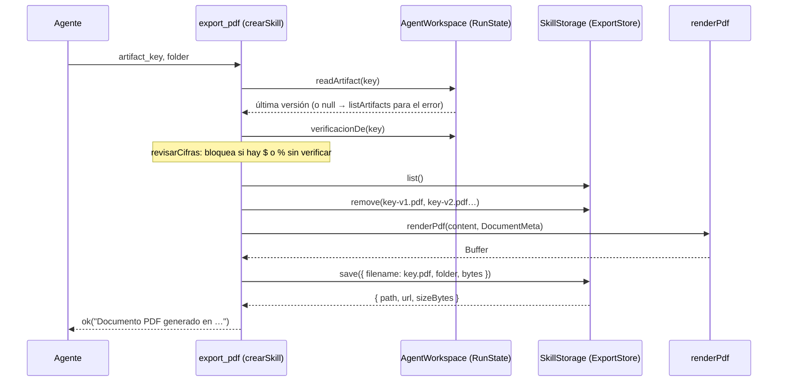

# Documentos Word y PDF

> Un entregable de la empresa se le manda a un cliente: tiene que parecer un
> documento y no un volcado de texto.

`export_docx` y `export_pdf` convierten un entregable ya escrito con
`write_artifact` en un `.docx` o un `.pdf` que alguien abre: portada con quién lo
firma, jerarquía visible, tablas con bordes, listas numeradas de verdad y número
de página. Los dos formatos salen **del mismo parseo** del markdown
(`packages/tools/src/skills/markdown.ts` → `parseMarkdown`), así que no pueden
decir cosas distintas. El render no toca el disco: devuelve bytes, y el
`SkillStorage` que inyecta el servidor decide dónde van (ver
[[Habilidades de producción]]). Por qué reciben una clave y no el contenido está
en [[ADR-005 Las habilidades trabajan sobre entregables ya escritos]].

## Contrato de las herramientas

Las dos salen de la misma fábrica, `crearSkill(formato, storage)` en
`packages/tools/src/skills/index.ts`, recorriendo la tabla `FORMATOS`.

| | `export_docx` | `export_pdf` |
|---|---|---|
| Origen | `skill` | `skill` |
| `readOnly` | `false`: escribe un archivo, no corre en paralelo a ciegas | `false` |
| `requiresApproval` | `false` | `false` |
| Render | `renderDocx` (librería `docx` 9.7.1) | `renderPdf` (`pdfkit`) |
| Archivo | `<folder>/<key>.docx` | `<folder>/<key>.pdf` |

| Argumento | Tipo | Qué es |
|---|---|---|
| `artifact_key` | string, **obligatorio** | La clave que se usó en `write_artifact`. Se recorta con `trim`. |
| `folder` | string, opcional | Carpeta de la salida, con `/` (`"comercial/propuestas"`). Se crea sola. Vacío = raíz de la salida. |

El esquema es cerrado (`additionalProperties: false`), así que el memo de
lecturas del motor puede calcular la huella sólo con lo declarado.

Respuesta cuando sale bien (el `summary` de la traza es la ruta):

```text
Documento PDF generado en comercial/propuestas/propuesta-comercial.pdf:
"Propuesta comercial — Retail Andina" (v3), 48 KB. Reemplaza la versión anterior
del mismo documento. Queda en el directorio de salida; no hace falta exportarlo
de nuevo salvo que cambies el contenido.
```

La frase "Reemplaza la versión anterior…" aparece sólo si se borraron archivos
`key-vN.ext` de la forma vieja (ver más abajo). El peso se informa en KB
redondeados, mínimo 1.

| Situación | Respuesta (`ok: false`) | Dónde |
|---|---|---|
| `artifact_key` vacío | "Falta artifact_key… si todavía no lo escribiste, usá write_artifact primero." | `buscarEntregable` |
| No hay ningún entregable | "No existe ningún entregable todavía. Escribí el contenido con write_artifact y después exportalo." | `buscarEntregable` |
| La clave no existe | "No existe el entregable "x". Los que hay son: a, b, c." | `buscarEntregable` |
| Cifras sin verificar | "…tiene cifras de plata o porcentajes y nadie las verificó, así que no sale. Corré verificar_cifras…" | `revisarCifras` |
| Verificación de otra versión | "La verificación de "x" es de la v2 y el documento ya va por la v3…" | `revisarCifras` |
| Cifras que no cierran | "…la verificación encontró N de M cifras que no coinciden con su cuenta…" | `revisarCifras` |

El error de clave inexistente **lista las que sí existen** a propósito: un "no
existe" a secas hace que el agente vuelva a intentar con la misma clave
inventada. La guardia de cifras es común a todas las exportaciones y se explica
en [[Habilidades de producción#La guardia de cifras]].

## Cómo funciona, paso a paso



1. `buscarEntregable` resuelve la clave con `ctx.workspace.readArtifact` (la
   última versión: los entregables son de la empresa, no de la corrida — ver
   [[Entregables]]).
2. `revisarCifras` decide si puede salir (ver la nota puerta).
3. Se listan los archivos de la salida y se borran los que se llaman
   exactamente `<key>-v<N>.<ext>` **del mismo formato**: ni el `.docx` cuando se
   exporta el PDF, ni los de otra clave. La regex es
   `^<key escapada>-v\d+\.<ext>$` sobre el nombre, en cualquier carpeta.
4. Se arma el `DocumentMeta` y se renderiza.
5. `storage.save` sanea el nombre (`ExportStore.safeSegment`), crea la carpeta,
   escribe y anota el archivo en el manifiesto de procedencia (ver
   [[Archivos de salida y permisos de borrado]]).

## La portada la arma el sistema: `DocumentMeta`

`DocumentMeta` (`render.ts`) es lo que va en la portada y en los metadatos del
archivo. **No lo escribe el modelo**: quién firma y de qué empresa es son datos
que el sistema ya tiene, y que un agente puede escribir mal.

| Campo | De dónde sale (`crearSkill`) | Dónde aparece |
|---|---|---|
| `title` | `artifact.title` | Título grande de la portada; encabezado del Word; metadato de título |
| `company` | `ctx.workspace.company.name` | Ceja en mayúsculas sobre el título; pie del PDF a la izquierda; metadato "Documento de …" |
| `author` | `ctx.actor.name` | "Preparado por"; metadato de autor |
| `authorTitle` | `ctx.actor.title` | "Preparado por Nombre — Cargo" |
| `version` | `artifact.version` | "Versión N" |
| `date` | `artifact.createdAt` con `toLocaleDateString("es-AR", { day: "2-digit", month: "long", year: "numeric" })` | "Fecha 26 de septiembre de 2026" |

> [!note] Firma quien exporta, no quien escribió
> `author` es el rol que llama a `export_*` (`ctx.actor`), no el
> `authorRoleId` de la versión. Si Finanzas escribe la propuesta y Comercial la
> exporta, la portada dice "Preparado por" el Director Comercial.

> [!note] La fecha es la de la versión
> Sale de `createdAt` de la versión exportada, no del momento de exportar. El
> render **no tiene reloj**: la fecha entra ya formateada desde el llamador, y
> por eso los tests son deterministas.

Dos reglas más de la portada:

- **La ceja con la empresa se omite si el título ya empieza con su nombre**
  (`mostrarEmpresa`, comparando sin acentos ni signos): "INSPIA" sobre "INSPIA —
  Informe de negocio" se lee como un error de armado.
- **El primer título del cuerpo se descarta si repite el de la portada**
  (`cuerpoSinTituloRepetido`): el entregable casi siempre abre con un `# Título`
  igual al de la portada y el documento mostraba el nombre dos veces. Se compara
  normalizado (NFD, sin tildes, minúsculas, lo no alfanumérico como espacio),
  con cualquier nivel de título.

`renderDocx(markdown, meta)` y `renderPdf(markdown, meta)` aceptan también un
string como `meta` (sólo el título): es la compatibilidad con quien no tiene los
datos de portada.

## El markdown que se entiende

`parseMarkdown` traduce el markdown a **bloques neutros** (`Block`) una sola
vez; Word, PDF, video y deck parten de ahí. Lo que no reconoce cae a párrafo:
un degradado legible, no una pérdida de contenido.

| Markdown | Bloque | Regla |
|---|---|---|
| `#` a `######` | `heading` nivel 1–3 | De `####` para abajo se aplana a 3: más niveles no aportan jerarquía legible. |
| Renglones seguidos | `paragraph` | Se unen con un espacio; una línea en blanco cierra el párrafo. |
| `- `, `* `, `+ ` | `bullet` | Nivel = sangría ÷ 2, tope 3. `- [ ] x` queda como texto: la casilla marca estado. |
| `1. ` o `1) ` | `numbered` | Guarda el número escrito (`index`) y el nivel por sangría. |
| `> ` | `quote` | **Una cita por renglón**: dos renglones con `>` son dos citas. |
| Bloque entre ```` ``` ```` | `code` | Literal hasta el cierre, sin interpretar nada (ni comentarios). |
| `---`, `***`, `___` | `rule` | Tres o más. |
| Fila con `\|` + fila separadora | `table` | Encabezado = la fila anterior al separador. Una línea en blanco seguida de otra fila no corta la tabla. |
| `` solo en su renglón | `image` | Dentro de un párrafo se descarta. |
| `<!-- … -->` | (nada) | Suelto, de una o varias líneas, se descarta; en medio de un renglón se saca. |

Dentro de cada bloque, `parseSpans` separa el texto en tramos (`Span`):

| Markdown en línea | Resultado |
|---|---|
| `**x**`, `__x__` | Negrita (`bold: true`). |
| `[texto](url)` | "texto (url)": en papel un link no se clickea y el lector perdería la referencia. |
| `` `x` `` | Se sacan los backticks; queda el texto. |
| `` en medio de un texto | Se descarta **antes** que los enlaces: comparten sintaxis salvo por el `!`. |
| `<!-- … -->` en medio de un renglón | Se saca. |
| `*x*`, `_x_`, `~~x~~` | **No se interpretan**: los signos quedan a la vista. |

> [!warning] Las marcas de ícono sólo existen en el video y el deck
> `:chequeo:` y `` los entiende `parseGuion`, no el render de
> documentos: en Word y PDF la marca de ícono sale como texto literal y el visual
> queda como su epígrafe. Ver [[Íconos y visuales vectoriales]].

La fila separadora se reconoce con `esSeparadorDeTabla`
(`^\s*\|?[\s:|-]+\|[\s:|-]*$` y al menos un `-`). Las celdas se recortan y se
les sacan los `|` de los bordes (`celdas`).

> [!danger] Una línea en blanco entre grupos de filas no termina la tabla
> Los agentes separan así los bloques de una tabla. Cuando eso la cortaba,
> quedaba media tabla maquetada y el resto como texto con los pipes a la vista.
> La contracara: **dos tablas separadas sólo por una línea en blanco se funden
> en una**, con el encabezado de la segunda y su fila de guiones como filas de
> datos. Para separarlas hace falta un párrafo o un título en el medio.

## Cómo sale cada bloque en cada formato

| Bloque | Word (`bloqueADocx`) | PDF (`renderPdf`) | Deck (vía `parseGuion`) |
|---|---|---|---|
| Título | Estilo Heading 1–3 real de Word, con `keepNext` | Helvetica-Bold 17 / 13,5 / 11,5 pt; reserva lugar antes | El primer `#` es la portada; cada `##`/`###` abre lámina |
| Párrafo | Párrafo con negritas reales | Helvetica 10,5 pt, negritas en Helvetica-Bold | Nota "Voz en off —" al pie (o cuerpo si la lámina no tiene otra cosa) |
| Viñeta | Viñeta de Word: ● ○ ■ según nivel | "•" dibujado, 14 pt de sangría por nivel | Viñeta con ícono o cuadradito |
| Numerada | Numeración real de Word ("1.") | El número que escribió el autor, en gris | Viñeta: se pierde el número |
| Cita | Cursiva gris, sangría y borde izquierdo azul; conserva negritas | Helvetica-Oblique gris con barra azul de 2 pt; pierde negritas | Frase destacada (sólo la última cita de la escena) |
| Código | Consolas 9 pt sobre gris, respeta renglones | Courier 9 pt sobre rectángulo gris | Se descarta |
| Tabla | Tabla real con bordes; encabezado sombreado y repetido en cada página | Tabla dibujada a mano con bordes y encabezado sombreado | Cada fila, una viñeta "celda — celda"; el encabezado se pierde |
| Imagen | Sólo el epígrafe (alt), cursiva gris | Sólo el epígrafe | Se incrusta la primera de la escena |
| Separador | Filete gris | Línea de 0,5 pt | Corta la escena si ya había contenido |
| Comentario | — | — | — |

La imagen no se incrusta en los documentos a propósito: el render recibe texto y
no archivos —quién puede leer el disco lo decide el servidor—. Queda el
epígrafe, que es lo que le da sentido en un informe; la imagen se ve en el video
y en el deck. Sin `alt`, el epígrafe dice "Imagen". El detalle del deck está en
[[Deck de slides]].

## Word por dentro

Paleta sobria: un solo color de acento y gris para lo secundario (`TINTA`
`1A1A1A`, `ACENTO` `1F4E79`, `GRIS` `6B6B6B`, `GRIS_CLARO` `E8E8E8`). Más colores
en un informe técnico distraen en vez de guiar.

| Qué | Valor | Dónde (`render.ts`) |
|---|---|---|
| Página | A4 vertical (11906 × 16838 twips), default de la librería | verificado en `word/document.xml` |
| Márgenes | 1134 twips (2 cm) los cuatro | `sections[0].properties.page.margin` |
| Texto base | Calibri 11 pt (`size: 22`), tinta, interlineado `line: 300` | `styles.default.document` |
| Títulos | H1 16 pt negrita acento · H2 13 pt negrita tinta · H3 11,5 pt negrita gris | `styles.default.heading1..3` |
| Encabezado | El título, a la derecha, 8 pt gris | `headers.default` |
| Pie | "Página X de Y" a la derecha, 8 pt gris (campos de página y total) | `footers.default` |
| Portada | 2400 twips de aire arriba; ceja con la empresa en mayúsculas 11 pt acento; título 28 pt negrita; filete acento; datos 10 pt con rótulo gris; salto de página | `portadaDocx` |
| Numeradas | Referencia `lista-numerada`, niveles 0–3, decimal `%n.`, sangría 420·(nivel+1), colgante 280 | `numbering.config` |
| Viñetas | `bullet: { level }` de la librería | `bloqueADocx` |
| Tabla | 100% de ancho, bordes simples `BFBFBF` en todos los lados e interiores, `tableHeader: true`, encabezado con relleno `E8E8E8` y negrita, márgenes de celda 80/120, centrado vertical | `bloqueADocx`, `celda` |
| Metadatos | `creator` = autor ?? empresa ?? "Orquestador Agéntico"; `title`; `description` "Documento de <empresa>" | `new Document` |

Detalles que no se ven leyendo sólo la tabla:

- **Los títulos son estilos de Word de verdad** (`HeadingLevel.HEADING_1..3`):
  el panel de navegación y un índice automático los reconocen.
- **`keepNext` en cada título**: un título no queda solo al pie de una página.
- **Numeración real**: se declara en `numbering` del documento. Cuando caían
  como viñetas, una lista de pasos perdía el orden, que en un procedimiento es
  el contenido.
- **El encabezado de la tabla se repite en cada página** (`tableHeader: true`):
  una tabla larga sin encabezado no se lee.
- Una fila con más celdas que el encabezado se recorta; con menos, se completa
  con celdas vacías (se recorre `block.header`).

## PDF por dentro

pdfkit no trae tablas ni pie de página: las dos cosas se dibujan a mano.

| Qué | Valor | Dónde (`render.ts`) |
|---|---|---|
| Página | A4, márgenes de 64 pt | `PDF.margen` |
| Texto base | Helvetica 10,5 pt; `lineGap` = 10,5 × 0,45 | `PDF.cuerpo`, `PDF.interlineado` |
| Títulos | 17 / 13,5 / 11,5 pt Helvetica-Bold; el nivel 1 en acento | `PDF.titulos` |
| Colores | tinta `#1A1A1A`, acento `#1F4E79`, gris `#6B6B6B`, gris claro `#E8E8E8` | `PDF` |
| Portada | Arranca al 32% del alto; empresa 11 pt con espaciado 1,2; título 28 pt; filete de 120 × 2 pt; datos 9,5 pt | `portadaPdf` |
| Reserva antes de escribir | Título: su tamaño × 2,6 · viñeta y numerada: 24 pt · párrafo: 28 pt · cita: 32 pt · separador y epígrafe: 20–24 pt; con 24 pt de colchón sobre el pie | `asegurarEspacio` |
| Viñetas | "•" en `margen + nivel × 14`; texto a `nivel × 14 + 14` | case `bullet` |
| Numeradas | "N." gris en `margen + nivel × 14`; texto a `+ 18` | case `numbered` |
| Pie | Todas las páginas menos la portada: empresa a la izquierda, "Página N de M" a la derecha, 8 pt gris, en `alto − margen + 12`. N arranca en 1 después de la portada | bucle final con `bufferPages` |
| Metadatos | `Title`, `Author` (autor ?? empresa ?? "Orquestador Agéntico"), `Subject` "Documento de <empresa>" | `new PDFDocument` |

El **control de huérfanos** es la reserva antes de cada título: se pide su alto
más el de la primera línea de lo que viene abajo, y si no entra se corta de
página antes de escribirlo.

### Las tablas del PDF

`dibujarTabla` reemplazó una versión que escribía la tabla como texto separado
por barras: se desalineaba con cualquier celda larga y se partía al llegar al
pie. Es la diferencia más visible entre un volcado y un documento.

1. El texto visible de cada celda (`textoDeCelda`) va sin marcas de negrita —se
   leían los asteriscos— y sin emoji.
2. Peso de cada columna = el largo de su celda más larga, entre 6 y 48
   caracteres: una columna larga no ahoga al resto.
3. Ancho proporcional al peso sobre el ancho útil.
4. **Mínimo por columna = el ancho de su palabra más larga** (en Helvetica-Bold
   10 pt) + 2 × 6 de relleno + 2, con techo en la mitad del ancho útil. Sin eso
   una columna angosta partía las palabras al medio —"Inspecto / r"— justo donde
   está el dato.
5. Si una columna queda debajo de su mínimo, la diferencia se le saca a la más
   ancha, siempre que la donante no quede debajo del suyo.
6. Cada fila mide lo que su celda más alta; si no entra, página nueva.
7. El encabezado va sombreado; una celda entera en negrita se dibuja en negrita
   (mezclar tipografías en una celda angosta se lee peor).

### Las trampas de pdfkit que ya costaron caro

| Trampa | Síntoma | Solución en el código |
|---|---|---|
| Escribir debajo del margen inferior **agrega una página** | El pie duplicaba el documento: el doble de páginas, la mitad vacías y sin numeración | Se baja `page.margins.bottom` a 0 mientras se dibuja el pie y se restaura enseguida |
| En texto `continued`, la posición y el ancho van **sólo en el primer tramo** | Cada negrita partía el párrafo en dos | `escribirSpans` fija `x`, `y` y `width` una sola vez |
| Las fuentes estándar usan WinAnsi | "✅ Sí" se imprimía "' Sí" y "⚠️ Limitado" como "& þ Limita do" | `sinEmoji` descarta los emojis |
| Recortar los bordes al sacar emojis | "terminó55,8% más rápido": las palabras pegadas a la negrita, en casi todos los documentos | `sinEmoji` colapsa espacios pero **no recorta**; `sinEmojiRecortado` sólo para textos completos (títulos, celdas, epígrafes) |

`sinEmoji` saca los rangos U+1F000–1FAFF, U+2600–27BF, U+2B00–2BFF, el selector
de variante U+FE0F y el unidor U+200D, y colapsa los espacios dobles que quedan.
Se descartan en vez de reemplazarse por un signo: son decorativos y el texto que
los acompaña ya dice lo mismo.

## Vista previa antes de mandarlo

En la pestaña Salida ([[Pantalla Salida]]) el PDF lo dibuja el navegador desde
la misma URL con `?inline` (un `attachment` dentro de un iframe dispara la
descarga en vez de dibujarse). Ningún navegador abre Word, así que el servidor
extrae el texto de `word/document.xml` (`textoDeDocx` en
`apps/server/src/exports.ts`): si no, el único formato que la empresa produce en
Word sería justo el que no se puede revisar antes de mandarlo.

> [!danger] El orden al desarmar el XML
> `</w:p>` dentro de una celda se descarta **antes** que los cierres genéricos:
> el XML es `<w:tc><w:p>…</w:p></w:tc>`, y tratarlo como salto de línea ponía
> cada celda en su renglón y deshacía la tabla. Después: celdas separadas por
> " | ", filas y párrafos por salto, entidades decodificadas.

## Casos borde y fallas conocidas

| Síntoma | Causa |
|---|---|
| En Word, una segunda lista numerada sigue contando (4., 5.) en vez de arrancar en 1 | Todas las numeradas comparten la referencia `lista-numerada` con instancia 0 (`numId` único en el XML): Word las trata como una sola lista. El PDF dibuja el número escrito y no tiene el problema. |
| La portada del Word lleva el encabezado con el título y "Página 1 de N" | Una sola sección sin página de título distinta (`titlePg`): encabezado y pie van en todas las páginas, portada incluida. El PDF excluye la portada del pie y de la numeración. |
| El PDF no tiene encabezado con el título | Sólo se dibuja el pie; el encabezado existe sólo en Word. |
| En el PDF, una tabla que cruza de página no repite el encabezado | El bucle de filas de `dibujarTabla` detecta el cambio de página pero no redibuja el encabezado (el bloque está vacío). En Word sí se repite. |
| "A → B" sale "A !’ B" y "≥ 35%" sale '"e 35%' en el PDF | `sinEmoji` sólo saca emojis y dingbats: los símbolos fuera de WinAnsi que no están en esos rangos (flechas, signos matemáticos) se codifican mal. "€", "—" y "…" sí salen bien. |
| Desaparecen "✓" y "✗" del PDF | Están en el rango U+2600–27BF que descarta `sinEmoji`. La tabla de `verificar_cifras` pegada en un documento pierde sus marcas en el PDF, no en el Word. |
| Los `*` de una cursiva quedan a la vista | `parseSpans` sólo entiende negrita. |
| `:chequeo:` aparece como texto en el documento | Los íconos sólo los procesa `parseGuion` (video y deck). |
| Una imagen del entregable no aparece | Word y PDF no incrustan imágenes: queda el epígrafe. |
| Dos tablas seguidas salen como una sola con una fila de guiones | Línea en blanco entre tablas: ver la regla de arriba. |
| Un bloque de código más alto que una página se ve cortado | El fondo gris se dibuja con el alto calculado de una vez; el texto que sigue pasa a la página siguiente sin fondo. |
| Un entregable `json` o `text` sale como párrafos | El export pasa siempre `artifact.content` por `parseMarkdown`, sin mirar `contentType`. |
| El documento salió en otra carpeta con un nombre raro | `folder` con 6 niveles: el saneo corta la ruta total a 6 segmentos y el nombre del archivo se pierde (ver [[Archivos de salida y permisos de borrado]]). |

## Integración

- **Herramientas:** `write_artifact` / `edit_artifact` (escriben lo que se
  exporta, ver [[Entregables]]), `verificar_cifras` (habilita la exportación),
  `list_output` y `delete_files` (ver [[Archivos de salida y permisos de borrado]]).
- **Endpoints:** `GET /api/companies/:companyId/exports/*` (descarga; `?inline`
  para mostrar) y `GET /api/companies/:companyId/exports-preview/*` (vista
  previa). Ver [[Referencia de API]].
- **Eventos:** la exportación se ve como `tool.start` / `tool.end` con
  `toolName: "export_pdf"`; no hay un evento propio. Ver [[Referencia de eventos]].
- **Auditoría:** la regla `export-sin-verificacion` marca con severidad alta un
  `export_pdf` o `export_docx` exitoso sin un `verificar_cifras` exitoso antes en
  la corrida, **aunque el documento no tenga cifras** (la guardia de la
  herramienta sí distingue). Ver [[Auditoría de corridas]].
- **Plantillas:** "Consultora de documentos" (consultor senior) e "Investigación
  y análisis" (editora) otorgan `export_docx` y `export_pdf`. Ver
  [[Referencia de plantillas de equipo]].

## Qué fijan los tests

`packages/tools/src/skills/skills.test.ts`:

- "reconoce títulos, listas, tablas, citas y código": cada tipo de bloque, la
  fila separadora no entra como dato y la sangría define el nivel.
- "separa la negrita del texto plano" y "conserva el destino de un enlace".
- "junta las líneas sueltas de un párrafo en uno solo".
- "no interpreta markdown dentro de un bloque de código".
- Tres casos de `sinEmoji`: no se come el espacio de una negrita, el texto
  completo sí se recorta, y el hueco del emoji no queda doble.
- Cuatro casos de comentarios: suelto, de varios renglones, en medio de un
  renglón, y dentro de ```` ``` ```` sigue siendo texto.
- "título de portada" (4 casos): descarta el primer título si repite, ignora
  tildes y mayúsculas, conserva uno distinto y no toca un cuerpo que arranca con
  párrafo.
- "archivos generados": el `.docx` es un zip (`PK`), trae portada con empresa,
  firma y fecha, salto de página, `<w:numPr>` y `<w:tbl>`, y tiene partes de
  encabezado y pie; el PDF empieza con `%PDF-`, termina con `%%EOF` y declara
  `/Title` y `/Author`; un documento corto son exactamente dos páginas (portada
  y cuerpo, sin páginas en blanco por el pie); no se cae con un entregable
  vacío ni sin metadatos.
- "herramienta de exportación": el archivo es `plan.docx` y no `plan-v2.docx`;
  se lleva `plan-v1.pdf` y `plan-v2.pdf` pero no `plan-v1.docx` ni
  `otro-v1.pdf`; con clave inexistente lista las que hay; sin entregables manda
  a `write_artifact`; rechaza la clave en blanco.
- "tablas que los agentes escriben de verdad": la línea en blanco entre grupos
  no parte la tabla y el PDF sale sin asteriscos ni emoji.

`packages/tools/src/skills/gate.test.ts`: bloquea sin verificación, bloquea con
cifras mal, deja salir cuando las cuentas cierran y no exige nada a un documento
sin cifras.

`apps/server/src/exports.test.ts` ("vista previa"): el texto de un `.docx` real
sale con párrafos separados y una tabla se sigue leyendo como tabla.

## Cómo modificar sin romperlo

- **Un bloque nuevo** va primero al tipo `Block` y a `parseMarkdown`; después a
  `bloqueADocx`, al `switch` de `renderPdf` y, si el video y el deck deben
  mostrarlo, a `parseGuion`. Los dos renderers tienen un `default` que cae a
  párrafo, así que TypeScript **no** te avisa si te olvidás de uno.
- **Probá la decisión, no los bytes.** Un `.docx` es un zip comprimido: buscar
  texto en los bytes crudos sólo encuentra nombres de entradas (usá `docxXml`
  del test). En el PDF, contá páginas por `/Type /Page`.
- **No le des reloj al render.** Si hace falta un dato nuevo en la portada, va
  en `DocumentMeta` y lo arma `crearSkill`.
- **pdfkit:** cualquier texto nuevo pasa por `sinEmoji` (o
  `sinEmojiRecortado` si es un texto completo), y nada se escribe en el margen
  inferior sin bajarlo antes.

## Fuentes

- `packages/tools/src/skills/index.ts` → `crearSkill`, `FORMATOS`, `buscarEntregable`, `revisarCifras`, `escaparRegex`
- `packages/tools/src/skills/render.ts` → `DocumentMeta`, `renderDocx`, `renderPdf`, `portadaDocx`, `portadaPdf`, `bloqueADocx`, `celda`, `dibujarTabla`, `textoDeCelda`, `asegurarEspacio`, `escribirSpans`, `sinEmoji`, `sinEmojiRecortado`, `cuerpoSinTituloRepetido`, `mostrarEmpresa`
- `packages/tools/src/skills/markdown.ts` → `parseMarkdown`, `parseSpans`, `spansToText`, `Block`, `Span`, `esSeparadorDeTabla`, `celdas`
- `packages/tools/src/calculo.ts` → `verificarCifras`
- `packages/engine/src/state.ts` → `RunState.registrarVerificacion`, `RunState.verificacionDe`
- `apps/server/src/exports.ts` → `previewDe`, `previewLiviano`, `textoDeDocx`, `contentTypeOf`
- `apps/server/src/routes.ts` → `GET /api/companies/:companyId/exports/*`, `GET /api/companies/:companyId/exports-preview/*`
- `apps/server/src/auditoria.ts` → `exportSinVerificacion`
- Tests: `packages/tools/src/skills/skills.test.ts`, `packages/tools/src/skills/gate.test.ts`, `apps/server/src/exports.test.ts`

## Ver también

- [[Habilidades de producción]] — la puerta de la carpeta y la guardia de cifras
- [[Deck de slides]] — el mismo guion como presentación
- [[Archivos de salida y permisos de borrado]]
- [[Entregables]] · [[Salida de la empresa]] · [[Pantalla Salida]]
- [[ADR-005 Las habilidades trabajan sobre entregables ya escritos]]
- [[CU-01 Propuesta comercial]]
