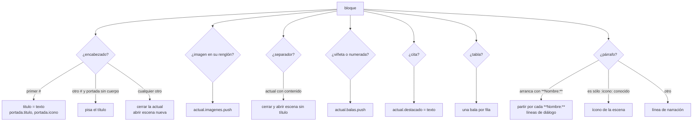

# Guion como línea de tiempo

Un guion es un entregable markdown común (se escribe con `write_artifact`), pero
los motores de video no lo maquetan como documento: lo leen como **una secuencia
temporal** donde lo que se escucha y lo que se ve tienen que coincidir.
`packages/tools/src/skills/guion.ts` hace esa traducción —qué se dice, quién lo
dice, qué se muestra mientras— **sin generar un solo byte de audio ni de video**,
que es lo caro. Por eso se testea sin ffmpeg ni sintetizador.

Los tres motores ([[Motor de video ASS]], [[Motor estudio de láminas HTML]] y
[[Motor de clips grabados]]) y el [[Deck de slides]] parten del mismo
`parseGuion`, y los tres motores ubican el tiempo con el mismo `ubicarEscenas`.
Por eso un mismo guion no puede decir cosas distintas en el video y en el deck,
ni empezar una escena en instantes distintos según el motor.

## Por qué es markdown y no un formato propio

`guion.ts` reusa `parseMarkdown` (`packages/tools/src/skills/markdown.ts`) en vez
de parsear de nuevo. Tres consecuencias buscadas:

- El agente escribe el guion con la misma herramienta que cualquier entregable
  (`write_artifact`), con versiones, secciones y edición parcial. Ver
  [[Entregables]].
- El mismo guion se puede exportar a PDF para que una persona lo lea antes de
  filmar.
- Las reglas de limpieza del markdown (comentarios, imágenes dentro de párrafos,
  backticks) se aplican igual en todos los formatos.

> [!note] Las habilidades reciben la clave, no el contenido
> Todas las exportaciones de video piden `artifact_key`. Un guion largo pasado
> como argumento se trunca cuando el modelo agota `max_tokens` a mitad del JSON.
> Ver [[ADR-005 Las habilidades trabajan sobre entregables ya escritos]].

## La sintaxis, completa

Lo que produce cada construcción en `parseGuion` y en cada motor. "Fallback"
es la lámina de plantilla del motor de estudio (`laminaDeEscena`), la que se usa
cuando una escena no tiene lámina programada.

| En el markdown | Qué hace `parseGuion` | Motor ASS | Motor estudio (fallback) | Motor de clips |
|---|---|---|---|---|
| `# Título` (primer `#`) | título del video y **portada** (`esPortada: true`) | portada: regla, empresa en mayúsculas, título de 104 px, logo grande | lámina `.centrada` con `.titulo.grande` | clip `00-…` o placa lisa |
| un segundo `#` con la portada todavía **sin cuerpo** | **pisa** el título (era el encabezado del documento) | — | — | — |
| un segundo `#` con la portada **ya con cuerpo** | abre escena nueva | — | — | — |
| `## Título` (y también `###` o más) | abre escena; el texto es la placa | título de 62 px + cejilla con el título del video | `.titulo` | rótulo opcional; clip `NN-…` |
| `## :icono: Título` | `escena.icono` y el título sin la marca | ícono de 54 px sobre el título | **no se dibuja** | no se dibuja |
| párrafo | `Linea` de narración: **voz en off** | se oye; si la escena no muestra nada más, se subtitula frase por frase | portada: la primera línea es la `.bajada`; el resto sólo se oye | se oye |
| `**Nombre:** texto` | `Linea` de diálogo; registra al personaje | voz propia; el nombre y la línea aparecen cuando habla | sólo se oye | sólo se oye |
| `- viñeta` o `1. paso` | `Bala` | aparece escalonada mientras se habla | `.lista.escalona` | nada |
| `- :icono: viñeta` | `Bala` con ícono | ícono de 38 px | SVG `.icono` | nada |
| `> frase` | `escena.destacado` | barra de realce y texto de 54 px | `.cita` | nada |
| tabla | cada **fila** entra como viñeta `celda — celda` (el encabezado se descarta) | viñetas | viñetas | nada |
| `` solo en su renglón | `ImagenGuion` de archivo | panel derecho; en la portada, pantalla completa con velo | no se usa | nada |
| `` | imagen a generar: **`alt` es el prompt** | ídem, generada y cacheada | no se usa | nada |
| `` o `visual:llamada\|frase` | `visual` dibujado | dibujo vectorial en el panel | no se usa | nada |
| `` | `clip: true`, el prefijo se saca de la ruta | el clip se reproduce en un hueco 16:9 | no se usa | nada |
| `:icono:` solo en su renglón | ícono de la escena (si el nombre existe) | ídem ícono de escena | — | — |
| `---` (o `***`, `___`) | corta escena **sólo si hay algo que cerrar** | escena sin título | escena sin título | **corre la numeración** |
| bloque de código | se descarta | — | — | — |
| `<!-- comentario -->` | se descarta (propio bloque o dentro de un renglón) | — | — | — |

Los íconos disponibles y los visuales son de [[Íconos y visuales vectoriales]].
Las imágenes, el caché y los clips `video:` están en [[Imágenes y medios]].

### Un ejemplo que usa todo

```markdown
# Cómo trabajamos

## :objetivo: Entendemos el negocio antes que el sistema

Antes de escribir una línea, nos sentamos con quien opera todos los días.

- :persona: Entrevistas en el lugar de trabajo
- Un mapa de cómo se mueve el dato


## Una conversación
**Cliente:** ¿Y si cambia el alcance a mitad de camino?
**Asesora:** Lo vemos en la revisión semanal y lo repriorizamos juntos.

## Cierre

> Cuéntenos su caso.
```

## Cómo funciona `parseGuion`

`packages/tools/src/skills/guion.ts` → `parseGuion(markdown): Guion`. Recorre los
bloques de `parseMarkdown` con una escena "actual" que arranca como portada vacía.



Detalles que el código hace cumplir:

- **Cerrar** una escena sólo la agrega si `tieneContenido` (líneas, balas,
  imágenes o título). Una escena vacía se descarta: un guion vacío no inventa
  escenas.
- **`tieneCuerpo`** (líneas, balas o imágenes, sin contar el título) decide si
  un segundo `#` pisa la portada o abre escena.
- **El personaje** sale de `comoPersonaje`: el primer tramo del párrafo tiene
  que ser negrita, terminar en `:` **adentro** de la negrita y tener como mucho
  **cuatro palabras**. `**Esto no es un nombre sino una frase larga:**` es
  énfasis, no un personaje.
- **`comoDialogos`** vuelve a partir el párrafo por cada tramo que sea un
  personaje. Lo que no es marca se acumula como texto de quien habló último.
- `personajes` guarda el **orden de aparición**: define qué voz le toca a cada
  uno (ver [[Música y narración]]).
- El `destacado` se **asigna**, no se acumula: si hay varias citas, gana la
  última.

### Datos que devuelve

| Tipo | Campos |
|---|---|
| `Guion` | `titulo`, `escenas: Escena[]`, `personajes: string[]` (orden de aparición) |
| `Escena` | `titulo`, `icono` (`""` sin ícono), `lineas: Linea[]`, `balas: Bala[]`, `destacado`, `imagenes: ImagenGuion[]`, `esPortada` |
| `Linea` | `{kind: "narracion", texto}` o `{kind: "dialogo", personaje, texto}` |
| `Bala` | `texto`, `icono` (`""` = viñeta cuadrada) |
| `ImagenGuion` | `alt`, `src` (ruta o `"generar"`), `generar`, `visual?`, `clip?` |

## Las trampas del guion

Todas costaron un video mal filmado, y todas están fijadas con tests en
`guion.test.ts` o `clips.test.ts`.

> [!danger] Un diálogo es un solo párrafo en markdown
> Un guion se escribe con una línea por personaje y **sin renglones en blanco**.
> En markdown eso es **un solo párrafo**. Sin volver a partirlo, las cuatro
> intervenciones las decía de corrido el primero que hablaba, **leyendo en voz
> alta los nombres de los demás**. Pasó en el video de Codytion.

> [!danger] El encabezado del documento arriba del guion
> El guionista escribe `# Guion video institucional (v4)` y recién abajo el `#`
> con el título real. La portada anunciaba el número de versión del borrador y
> el título verdadero quedaba como una placa del medio. Un segundo `#` con la
> portada todavía sin cuerpo **pisa** el título; si la portada ya dijo algo,
> abre escena.

> [!danger] La marca de ícono sola en su renglón
> Los modelos escriben `:objetivo:` en su propio renglón, debajo del título. En
> markdown eso es un párrafo, y un párrafo es voz en off: el video decía
> ":objetivo:" en el medio. Un párrafo que es **sólo** una marca **conocida** se
> toma como el ícono de la escena. Una marca **desconocida** sí se dice, a
> propósito: es la única forma de que el error se note.

> [!danger] Texto suelto entre el `#` y la primera `##`
> "Personajes: …", "Tono: …" o una nota de producción debajo del título es
> **narración de portada**: la voz lo lee al abrir el video. El motor de clips lo
> avisa fuerte en el resultado (`ATENCIÓN: la portada tiene texto narrado…`). El
> tono ya vive en la configuración de voz de la empresa.

> [!danger] Los comentarios se leían en voz alta
> Los agentes anotan cada escena con `<!-- nota de escena: … -->`. Un comentario
> suelto era un párrafo, y un párrafo es voz en off: el narrador los leía,
> signos incluidos, y estiraba la pieza unos cuarenta segundos. Hoy
> `parseMarkdown` los descarta. Es el incidente que dio origen a
> `inspeccionar_medio`: la realizadora informaba 76 s y el video duraba 131.

> [!warning] Cualquier encabezado abre escena, y un `---` también corta
> `###` dentro de una sección abre una escena nueva, igual que `##`. Un `---` con
> algo escrito antes corta la escena en dos (la segunda sin título). En el motor
> de ASS y el de estudio eso es una placa más; en el de clips **corre la
> numeración**: el clip `07-…` termina cubriendo la escena equivocada y la última
> sale como placa lisa. Antes de dar un video de clips por bueno, compará las
> escenas que informa la exportación con las `##` del guion.

> [!warning] La negrita del personaje lleva los dos puntos adentro
> `**Cliente:** texto` es diálogo. `**Cliente**: texto` es narración, y la voz en
> off lee "Cliente: texto".

> [!warning] Un enlace dentro de un párrafo se lee con la URL
> `parseSpans` convierte `[texto](url)` en `texto (url)`, así que la voz en off
> dice la dirección. En un guion, las URLs van escritas como se pronuncian.

> [!warning] Una cita de varios renglones queda con el último
> Cada renglón que empieza con `>` es un bloque aparte y `destacado` se pisa:
> sólo sobrevive el último. Una frase destacada va en un solo renglón.

> [!warning] Un guion con plata o porcentajes no se filma sin verificar
> Las tres exportaciones pasan por `revisarCifras` (`packages/tools/src/skills/index.ts`):
> si el guion tiene algo como `$ 1.500` o `35 %` y nadie corrió
> `verificar_cifras` sobre esa versión, la herramienta se niega. "El 100 % de
> las inspecciones" alcanza para bloquear un video. Ver
> [[Catálogo de herramientas]].

## El reloj: `ubicarEscenas`

**La única fuente de verdad del tiempo son las duraciones medidas del audio.**
Todo lo que se ve se calcula a partir de ellas. Al revés —estirar el audio para
que entre en una animación— el video se despega de lo que se escucha.

`ubicarEscenas(guion, duraciones, minimos = [])` recorre las escenas con un
cursor:

1. Cada línea arranca en el cursor y dura lo que midió el sintetizador
   (`duraciones[indice]`, en el orden de todas las líneas del guion).
2. Entre dos líneas de la misma escena se suma una pausa: `entreDialogos` si la
   línea que **terminó** es diálogo, `entreLineas` si es narración.
3. Una escena **sin nada hablado** recibe aire propio: 3,8 s la portada, 2,4 s el
   resto.
4. Si quien llama pidió un mínimo para esa escena (`minimos[orden]`), se estira
   **durante** el recorrido, no después: estirar una escena corre a todas las
   que siguen.
5. Entre escenas, `entreEscenas`. Al final, se descuenta la última pausa y se
   suma la `cola`.

`total = cursor − PAUSA.entreEscenas + PAUSA.cola`.

| Constante | Valor | Por qué |
|---|---|---|
| `PAUSA.entreEscenas` | 0,5 s | separa escenas; es donde entra el encadenado o el corte |
| `PAUSA.entreDialogos` | 0,34 s | sin ella el diálogo se atropella |
| `PAUSA.entreLineas` | 0,24 s | respiración entre frases de la voz en off |
| `PAUSA.cola` | 1,4 s | el video no corta en seco al terminar la última palabra |
| aire de portada sin voz | 3,8 s | con dos segundos el nombre de la empresa pasaba antes de poder leerlo |
| aire de escena sin voz | 2,4 s | una escena que sólo muestra igual tiene que verse |

Ejemplo: portada sin voz y dos escenas de una línea (5 s y 7 s). La portada va de
0 a 3,8; la escena 1 de 4,3 a 9,3; la escena 2 de 9,8 a 16,8; el total es
16,8 + 1,4 = **18,2 s**.

```mermaid
gantt
  dateFormat x
  axisFormat %S
  section Portada
  aire 3,8 s           :0, 3800
  section Escena 1
  línea (5 s)          :4300, 9300
  section Escena 2
  línea (7 s)          :9800, 16800
  cola 1,4 s           :16800, 18200
```



Cada motor agrega lo suyo **arriba** de este reloj, nunca en contra:

- El de ASS pide `minimos` para que una escena con varias imágenes no las
  muestre como un parpadeo (2 s por imagen o visual). Ver [[Motor de video ASS]].
- El de estudio pisa las ventanas 0,45 s para el encadenado. Ver
  [[Motor estudio de láminas HTML]].
- El de clips corta cada escena desde su inicio hasta el inicio de la siguiente,
  con un piso de 0,5 s. Ver [[Motor de clips grabados]].

## Cuánto va a durar, sin filmar: `estimar_duracion`

Nació de un error caro y repetido: para saber si la pieza entraba en dos
minutos, cada agente contaba palabras a mano y las dividía por una tasa que se
inventaba. **Seis cálculos independientes, tres tasas distintas y cinco
versiones del guion corrigiendo hacia el lado equivocado**, con un guion que,
medido de verdad, ya cumplía.

`estimarDuracion(guion)` usa **el mismo parser y las mismas pausas** que el
render, así que no puede divergir en lo estructural (qué se narra, cuánto aire
lleva una escena sin voz, la cola). Lo único estimado es la voz, con una tasa
**medida** sobre el sintetizador real: `PALABRAS_POR_SEGUNDO = 3.15`.

### Contrato de la herramienta

`packages/tools/src/skills/index.ts` → `estimarDuracionGuion`. Origen `skill`,
`readOnly: true`, sin aprobación. Se registra siempre (no depende de nada
instalado).

| Argumento | Tipo | Obligatorio | Qué es |
|---|---|---|---|
| `artifact_key` | string | sí | clave del guion, como en `write_artifact` |

Devuelve los segundos, `m:ss`, las palabras narradas y el desglose por escena
(`segundos · palabras · título`), con la aclaración de que **la única palanca de
la duración es cuánto se narra**: títulos y viñetas no suman tiempo. Si la clave
no existe, lista las que hay; si el entregable no tiene escenas, lo dice.

> [!warning] Lo que la estimación no ve
> - El piso por imágenes del motor ASS (2 s por imagen o visual en la escena).
> - La velocidad real de cada motor de voz: 3,15 palabras/s está medida sobre el
>   sintetizador; `say` va a 180 palabras por minuto (3 por segundo).
> - El formateo `m:ss` redondea los segundos: 119,6 s se muestra como `1:60`.

> [!warning] Tres tasas conviviendo
> La descripción de `export_video` todavía le dice al agente "unas 15 palabras
> habladas por cada 6 segundos" (2,5 por segundo) y el guionista de
> `scripts/seed-inspia-publicidad.ts` calcula con 160 por minuto (2,7 por
> segundo). La tasa medida es 3,15. Ante la duda, `estimar_duracion`.

## Otros ayudantes exportados

- `imagenesDelGuion(guion)`: todas las imágenes en orden, para resolverlas antes
  de filmar.
- `caracteresHablados(guion)`: el largo de todo lo que se dice. Hoy sólo lo usan
  los tests.

## Qué fijan los tests

`packages/tools/src/skills/guion.test.ts`:

- El `#` es la portada y titula el video; cada `##` abre escena.
- El encabezado del documento no se convierte en la portada; un segundo `#`
  después de contenido sí abre escena.
- `**Nombre:**` crea diálogo y registra al personaje; un diálogo sin renglones en
  blanco se parte igual.
- Una negrita larga terminada en `:` no es un personaje.
- Viñetas y citas se muestran, no se dicen; una tabla entra como viñetas.
- Un separador debajo del título no parte la escena; con contenido previo, sí.
- El código no se dice ni se muestra; un guion vacío no inventa escenas.
- `caracteresHablados` no cuenta lo que sólo se ve.
- Una marca de ícono sola en su renglón no la dice la voz; una desconocida sí.
- Un sinónimo (`:plazo:`) resuelve al ícono canónico (`reloj`).
- La voz en off no lee la ruta de una imagen; una imagen dentro de un párrafo no
  se pronuncia.
- `video:` marca un clip y deja la ruta limpia, tolera espacios, y no se
  confunde con `visual:` ni con `generar`.

`packages/tools/src/skills/clips.test.ts` → "texto suelto bajo el título": una
nota de producción entre `#` y `##` se vuelve narración de portada.

`packages/tools/src/skills/estudio.test.ts` → `planificar` usa `ubicarEscenas`
con duraciones fijas.

## Cómo extenderlo sin romperlo

- Una construcción nueva se agrega en `parseGuion` **y** se decide qué hace en
  cada motor. Si un motor no la muestra, que por lo menos no la lea en voz alta:
  todo lo que cae en `lineas` se narra.
- No agregues pausas o duraciones en un motor que no pasen por `ubicarEscenas`:
  es lo que mantiene alineados los tres motores y `estimar_duracion`.
- Si cambiás `PAUSA` o el aire de una escena, `estimar_duracion` cambia solo; si
  cambiás la voz, volvé a medir `PALABRAS_POR_SEGUNDO`.

## Fuentes

- `packages/tools/src/skills/guion.ts` → `parseGuion`, `comoPersonaje`, `comoDialogos`, `comoImagen`, `ubicarEscenas`, `estimarDuracion`, `PAUSA`, `PALABRAS_POR_SEGUNDO`, `imagenesDelGuion`, `caracteresHablados`
- `packages/tools/src/skills/markdown.ts` → `parseMarkdown`, `parseSpans`, `spansToText`
- `packages/tools/src/skills/iconos.ts` → `separarIcono`
- `packages/tools/src/skills/visuales.ts` → `nombreDeVisual`
- `packages/tools/src/skills/index.ts` → `estimarDuracionGuion`, `buscarEntregable`, `revisarCifras`
- `packages/tools/src/skills/guion.test.ts`, `clips.test.ts`, `estudio.test.ts`

## Ver también

- [[Producción audiovisual]]
- [[Motor de video ASS]] · [[Motor estudio de láminas HTML]] · [[Motor de clips grabados]]
- [[Deck de slides]]
- [[Íconos y visuales vectoriales]]
- [[Imágenes y medios]]
- [[Música y narración]]
- [[Entregables]]
