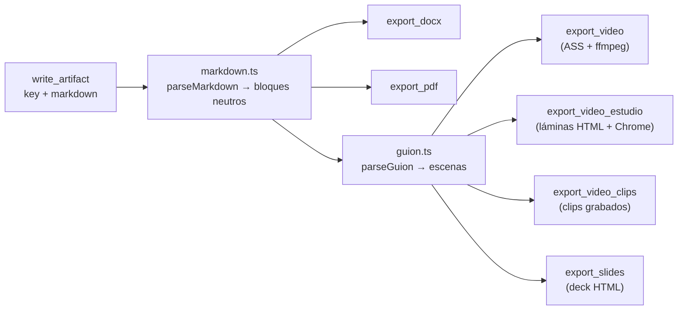
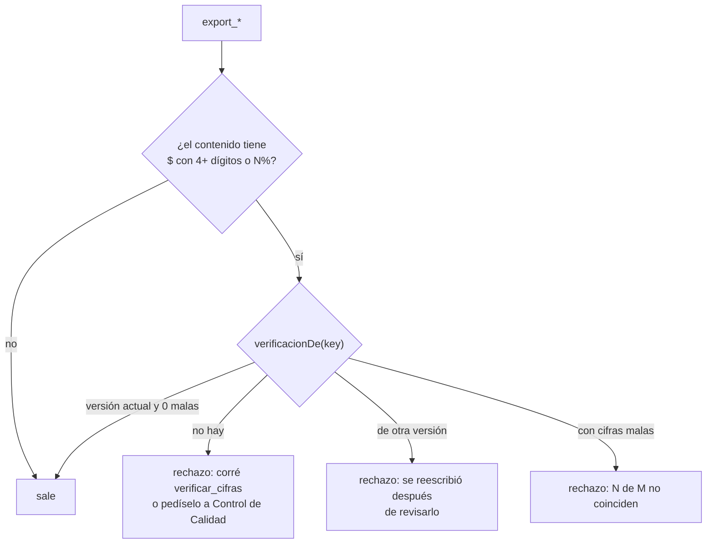

# Habilidades de producción

> Además de con quién habla y de dónde lee, un rol tiene **habilidades**: lo que
> sabe producir.

Una habilidad es una herramienta con `origin: "skill"`
(`packages/tools/src/skills/`). No es un sistema aparte: se registra, se asigna
por rol con `toolIds` y se ve en la UI como cualquier otra herramienta, pero se
distingue porque "puede entregar un Word" es una capacidad del rol, igual que en
una empresa real. Esta nota es la puerta de la carpeta `Producción/`: qué
habilidades hay, bajo qué condición existen, qué comparten todas y dónde está el
detalle de cada salida.

## El flujo de dos pasos

Las habilidades reciben **la clave de un entregable ya escrito**, nunca el
contenido por argumento: un documento largo pasado como argumento se trunca
cuando el modelo agota `max_tokens` a mitad del JSON, y se pierde entero. Así el
contenido ya está guardado y versionado y la exportación no puede romperlo. Ver
[[ADR-005 Las habilidades trabajan sobre entregables ya escritos]] y
[[Entregables]].

El markdown se parsea **una sola vez** a bloques neutros y de ahí salen todas
las salidas: el Word, el PDF, el video y el deck no pueden decir cosas distintas.

## Qué hay y cuándo existe

La regla: **la habilidad que no se puede cumplir no se registra**. Ofrecerle al
agente una herramienta que siempre falla le hace gastar turnos intentándola.
`createSkillTools(storage, opciones)` decide al levantar el runtime de la
empresa (`Runtime.companyRuntime`).

| Habilidad | Qué produce | Se registra | Detalle |
|---|---|---|---|
| `export_docx` | Word `.docx` | Siempre | [[Documentos Word y PDF]] |
| `export_pdf` | PDF | Siempre | [[Documentos Word y PDF]] |
| `export_slides` | Deck HTML de un solo archivo | Siempre | [[Deck de slides]] |
| `export_video` | MP4 narrado dibujado con ASS | Siempre (falla con aviso si falta ffmpeg) | [[Motor de video ASS]] |
| `export_video_estudio` | MP4 con láminas HTML | Sólo con Chrome instalado (`buscarChrome()`) | [[Motor estudio de láminas HTML]] |
| `revisar_lamina` | PNG de una lámina + diagnóstico | Sólo con Chrome | [[Motor estudio de láminas HTML]] |
| `grabar_clip` | Clip MP4 de una app viva | Sólo con Chrome | [[Motor de clips grabados]] |
| `explorar_pantalla` | Reconocimiento sin filmar | Sólo con Chrome | [[Motor de clips grabados]] |
| `export_video_clips` | MP4 empalmando clips | Sólo con Chrome | [[Motor de clips grabados]] |
| `generar_imagen` | Imagen PNG/JPG | Sólo con credencial de imágenes (`GOOGLE_API_KEY`/`GEMINI_API_KEY`, `OPENAI_API_KEY` o `NVIDIA_API_KEY`) | [[Imágenes y medios]] |
| `estimar_duracion` | Duración estimada de un guion | Siempre | [[Guion como línea de tiempo]] |
| `inspeccionar_medio` | Ficha medida de un archivo | Siempre | [[Imágenes y medios]] |
| `extraer_cuadros` | PNG de un video en `revision/` | Siempre | [[Imágenes y medios]] |
| `list_output` | Listado con permiso de borrado | Siempre | [[Archivos de salida y permisos de borrado]] |
| `read_output_file` | Texto de un archivo | Siempre | [[Archivos de salida y permisos de borrado]] |
| `write_output_file` | Archivo de texto | Siempre | [[Archivos de salida y permisos de borrado]] |
| `delete_files` | Borrado, uno o por grupo | Siempre | [[Archivos de salida y permisos de borrado]] |

Las cinco que dependen del navegador **van juntas o no van**: sin Chrome no hay
estudio, ni láminas que revisar, ni clips que empalmar, y `export_video` filma el
mismo guion sin navegador. Las herramientas de código, del teléfono y de R2 no
son de esta carpeta aunque también sean `skill` (ver [[Herramientas de código]]
y [[Depuración de la app móvil]]).

### Cómo llega una habilidad a un agente

1. El runtime de la empresa la registra en su `ToolRegistry`
   (`Runtime.companyRuntime`). Es por empresa porque cada una escribe en su
   propio directorio y no ve los documentos de otra.
2. Tiene que existir su fila en la tabla `tools`: la siembran
   `Runtime.sembrarHerramientas` (al crear la empresa por la API y al generar un
   equipo), el `persistMcpTools` que corre con cada cambio de estado de un MCP,
   y `npm run db:seed`.
3. El rol la tiene en `toolIds`. `ToolRegistry.forRole` **sólo regala las de
   coordinación**: una habilidad no se otorga sola. Un rol sin `export_pdf` en
   `toolIds` explica —con razón— que no la tiene.
4. El router de herramientas **siempre la expone** (`isAlwaysExposed` en
   `router.ts`): son pocas y se asignan a propósito. Cuando competían en el
   ranking, un desarrollador al que le pidieron un PDF no tenía `export_pdf` en
   su lista frente a decenas de tools de MCP. Ver [[Herramientas y tool router]].

## Lo que comparten todas

### El `SkillStorage` lo inyecta el servidor

`packages/tools` no decide dónde van los archivos ni lee el disco por su cuenta.
El servidor le pasa un `SkillStorage` por empresa
(`ExportStore.forCompany(companyId)`), y las habilidades sólo usan eso:

| Método | Qué hace |
|---|---|
| `save({ filename, folder?, bytes })` | Guarda bytes; sanea nombre y carpeta, crea la carpeta, marca el archivo como generado. Devuelve `{ url, path, sizeBytes }`. |
| `list()` | Todos los archivos, planos, con `esMultimedia` y `generadoPorAgente`. |
| `remove(path)` | Borrado **como agente**: sólo multimedia o generado. |
| `removeMany({ kind, folder?, excluir? })` | Borrado en lote, con la misma regla. |
| `writeText(path, content)` | Crea o reemplaza un texto y lo marca como generado. |
| `resolve(path)` | La ruta absoluta **ya saneada** de un archivo existente, o `null`. Es lo único que le da el servidor para abrir un archivo (una imagen del guion, el logo). |

El render nunca escribe: devuelve bytes o texto, y quien llama decide dónde van.
Así los tests verifican el archivo en memoria. `OpcionesHabilidades` suma lo que
el servidor presta además del disco: `musicaHome` (la carpeta `MUSICA_DIR`) y
`generadorImagenes` (`null` es válido: una empresa sin proveedor de imágenes).

La salida de cada empresa vive en `data/proyectos/<Nombre legible>/salida/`
(`PROYECTOS_DIR`), en carpetas: toda habilidad que produce acepta `folder` y la
crea sola —pedirle al agente un paso aparte para crearla sólo agrega una llamada
que a veces olvida—. Ver [[Salida de la empresa]] y [[Directorios en disco]].

### Un archivo por entregable y formato

`<key>.pdf`, `<key>.docx`, `<key>.html`, `<key>.mp4`: **no** `key-v3.pdf`. Con la
versión en el nombre, cada re-exportación dejaba otro archivo y pedir un PDF
terminaba en v1, v2 y v3 conviviendo. La versión va en la portada. Re-exportar
pisa el archivo anterior de la misma carpeta. `export_docx` y `export_pdf`
además borran los `<key>-vN.<ext>` que dejó la forma vieja, y
`write_output_file` le saca la versión al nombre.

### El error dice qué claves existen

`buscarEntregable` resuelve la clave para todas las exportaciones (y para
`estimar_duracion`). Si no existe, lista las que sí; si no hay ninguna, manda a
escribir con `write_artifact` primero. Un "no existe" a secas hace que el agente
vuelva a intentar con la misma clave inventada.

### La guardia de cifras

**Nada con plata sale sin que alguien haya verificado las cuentas.**
`revisarCifras` corre en `export_docx`, `export_pdf`, `export_slides`,
`export_video`, `export_video_estudio` y `export_video_clips`.

Le pedimos exhaustividad al auditor de cinco maneras —la herramienta, el prompt,
la versión en lote, abaratar la lectura, más iteraciones— y verificó una cifra
de seis y se dio por satisfecho. Acá deja de ser algo que *debería* hacer: se
verifica en el ejecutor y no en el prompt.

- "Tiene cifras" es la regex `(\$\s?[\d.,]{4,})|(\d[\d.,]*\s?%)`: un signo `$`
  seguido de al menos cuatro dígitos o separadores, o un porcentaje. "US$ 30"
  no cuenta; "35%" sí. Un documento sin números no tiene nada que verificar.
- La verificación la registra `verificar_cifras` (coordinación, todos los roles
  la tienen) cuando se le pasa `entregable`: guarda versión, total, malas y
  quién la hizo. Sin `entregable` no queda registrada y el documento no sale.
- Vive **en la corrida** (`RunState.verificaciones`), no en la base: verificar
  es parte de producir el documento, no un atributo permanente. Una corrida
  nueva exige verificar de nuevo, y reescribir el entregable también.
- Las cifras que `verificar_cifras` no pudo calcular (`sinVerificar`) **no
  bloquean**: sólo cuentan las que dieron mal.

Ver [[Coordinación entre agentes]] y [[Auditoría de corridas]] (la regla
`export-sin-verificacion`, que audita sólo PDF y Word).

### La portada y la firma

Todas las exportaciones arman el mismo `DocumentMeta` con datos del sistema:
título del entregable, empresa, nombre y cargo del rol que exporta, versión y la
fecha de esa versión en `es-AR`. **La fecha entra formateada desde el llamador**:
el render no tiene reloj, y así los tests son deterministas. En Word y PDF firma
quien exportó; en el deck y el video firma la empresa.

### Los avisos van en el resultado

Lo único que el agente puede leer para corregir su trabajo es lo que devuelve la
herramienta. Una imagen que no apareció, un visual inexistente o una escena sin
clip no hacen fallar la pieza: vuelven como "Atención: …" en el mismo resultado.

## Seguridad

- Toda ruta que propone un agente se sanea segmento por segmento en el servidor
  (`ExportStore.safePath`): una clave como `../../.env` no escribe fuera del
  directorio de la empresa.
- Borrar mira la jerarquía y la procedencia; crear y modificar no. Ver
  [[Archivos de salida y permisos de borrado]].
- El deck se mira en un iframe con `sandbox` vacío: un `.html` que escribió un
  agente no corre con la sesión de la persona. Ver [[Deck de slides]].
- Publicar (mover a `publicado/`) es de una persona. Ver
  [[ADR-008 Publicar lo decide una persona]].

## Qué fijan los tests

- `packages/tools/src/skills/skills.test.ts`: registra exportar, listar y borrar
  con origen `skill`; las que escriben no son `readOnly`; el motor de estudio
  sólo con navegador; un archivo por entregable; el detalle en
  [[Documentos Word y PDF]] y [[Archivos de salida y permisos de borrado]].
- `packages/tools/src/skills/gate.test.ts`: la guardia de cifras (cuatro casos).
- `packages/tools/src/skills/permisos.test.ts`: la jerarquía de borrado.
- `packages/tools/src/skills/guion.test.ts`: guion, íconos, visuales y deck.
- `apps/server/src/exports.test.ts`: saneo, procedencia y vista previa.

## Cómo agregar una

Ver [[Cómo agregar una habilidad]]. Lo esencial: `origin: "skill"`, que reciba
una clave y no el contenido, que pase por `buscarEntregable` y `revisarCifras`
si exporta, que escriba sólo por el `SkillStorage`, y que **no se registre** si
depende de algo que la máquina no tiene. Una empresa ya creada recibe su fila en
`tools` con `sembrarHerramientas` o la próxima vez que un MCP cambie de estado;
después hay que asignarla a un rol.

## Fuentes

- `packages/tools/src/skills/index.ts` → `createSkillTools`, `SkillStorage`, `OpcionesHabilidades`, `buscarEntregable`, `revisarCifras`, `crearSkill`, `LOGO`
- `packages/tools/src/router.ts` → `isAlwaysExposed`; `packages/tools/src/registry.ts` → `ToolRegistry.forRole`
- `packages/tools/src/calculo.ts` → `verificarCifras`; `packages/engine/src/state.ts` → `RunState.registrarVerificacion`, `verificacionDe`
- `apps/server/src/exports.ts` → `ExportStore.forCompany`
- `apps/server/src/runtime.ts` → `Runtime.companyRuntime`, `sembrarHerramientas`, `persistMcpTools`
- `apps/server/src/seed.ts` (siembra `capability` y `skill`)

## Ver también

- [[Documentos Word y PDF]] · [[Deck de slides]] · [[Íconos y visuales vectoriales]] · [[Archivos de salida y permisos de borrado]]
- [[Producción audiovisual]] · [[Guion como línea de tiempo]] · [[Imágenes y medios]] · [[Música y narración]] · [[Voz y marca de la empresa]]
- [[Catálogo de herramientas]] · [[Referencia de herramientas]] · [[Salida de la empresa]]
- [[CU-01 Propuesta comercial]] · [[CU-02 Video institucional]]
