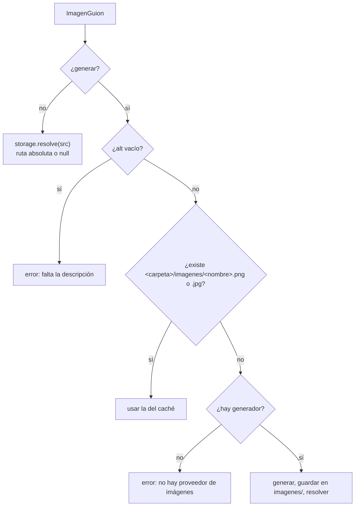

# Imágenes y medios

Todo lo que un video **muestra** y no es texto —fotos del directorio de salida,
imágenes generadas por un modelo, clips `video:` dentro de una escena— y las dos
herramientas con las que la empresa **verifica** lo que produjo: medir
(`inspeccionar_medio`) y mirar (`extraer_cuadros`).

Los diagramas vectoriales (`visual:`) y los íconos son de
[[Íconos y visuales vectoriales]]: no se resuelven contra el disco, se dibujan.

## Las imágenes en el guion

| Sintaxis | Qué es |
|---|---|
| `` | un archivo que **ya está** en el directorio de salida |
| `` (o `()` vacío) | una imagen que todavía no existe; **la descripción es el prompt** |
| `` | un **clip** que se reproduce en la escena (motor ASS) |
| `` | un diagrama dibujado (ver [[Íconos y visuales vectoriales]]) |

La imagen tiene que ir **sola en su renglón**: dentro de un párrafo se descarta
(ni se muestra ni se lee; sin esa regla la voz decía "fotos barra taller punto
jpg"). `video:` se marca en el guion y no se adivina por la extensión: el guion no
debería saber qué extensiones son video este mes. Ver
[[Guion como línea de tiempo]].

En el [[Motor de video ASS]] la imagen **no va de fondo con el texto encima** —una
foto detrás de un párrafo lo vuelve ilegible justo cuando alguien lo está
leyendo—: van en dos columnas (panel derecho de 644×620). La única que ocupa el
cuadro entero es la de la portada, con un velo oscuro que sostiene el título. Un
clip va en un hueco 16:9 de 840×473 y se encaja entero. Los parámetros de
ffmpeg (sobremuestreo, `zoompan`, `setpts`) están en esa nota. El motor de
estudio y el de clips no usan las imágenes del guion.

## De dónde sale cada imagen: `crearResolutorImagenes`

`packages/tools/src/skills/index.ts` → `crearResolutorImagenes(storage,
generador, carpeta, ctx)`. **`packages/tools` no lee el disco**: recibe
`storage.resolve` del servidor (`ExportStore.rutaDe`), que sanea la ruta
segmento por segmento, porque la ruta la propuso un modelo y `../../.env` es una
ruta que un modelo puede escribir. Ver [[Salida de la empresa]].

- **Caché por nombre derivado del prompt**: `nombreDeImagen(prompt, ext)` =
  el prompt en minúsculas, sin tildes, con guiones, hasta 44 caracteres, más los
  primeros 8 hex del SHA-1 del prompt (`un-tablero-abierto-1a2b3c4d.png`). Sin ese
  caché, re-exportar vuelve a pagar todas las imágenes **y además cambia el
  aspecto del video** sin que nadie lo haya tocado.
- Quedan en `<folder>/imagenes/` **dentro del directorio de salida**, no en un
  temporal: alguien tiene que poder verlas, reemplazar la que no le gustó y volver
  a exportar.
- La extensión sale de los primeros bytes (`FF D8` es JPEG; si no, PNG), no de lo
  que diga nadie.
- **Nada de esto corta un video**: una imagen que no se resolvió o un error del
  generador vuelve como aviso en el resultado ("No se pudo mostrar …"), que es lo
  único que el agente puede leer para corregir el guion.

## El generador: `imagenes.ts`

`packages/tools/src/skills/imagenes.ts` → `crearGeneradorImagenes(env)`: una
interfaz (`GeneradorImagenes`: `proveedor`, `modelo`, `generar(pedido)`) y tres
adaptadores. Gana **el primer proveedor con credencial**:

| Orden | Variable | Modelo | Detalle |
|---|---|---|---|
| 1 | `GOOGLE_API_KEY` o `GEMINI_API_KEY` | `gemini-2.5-flash-image` | la imagen vuelve como `inlineData`; si contesta sólo texto, casi siempre es que no quiso hacer el pedido |
| 2 | `OPENAI_API_KEY` | `gpt-image-1` | sólo tamaños de catálogo: `1536x1024` o `1024x1536` según la orientación |
| 3 | `NVIDIA_API_KEY` | `black-forest-labs/flux.1-schnell` | ancho y alto en múltiplos de 64 (si no, 400); 4 pasos, `cfg_scale 0`; nivel gratuito con límite de tasa |

Sin ninguna, `null`: **no es un error**, es una empresa sin proveedor, y todo lo
demás sigue funcionando.

**El estilo lo fija el sistema, no el guion**: a cada prompt se le agrega
`ESTILO` (en inglés, porque ahí los modelos entienden mejor los términos de
fotografía): fotografía editorial, luz lateral suave, paleta grafito y neutros,
espacio vacío a un costado y **"Absolutely no text, no words, no letters, no
logos"**: los modelos escriben palabras deformes, y un cartel ilegible de fondo es
peor que la placa sola.

> [!danger] Ninguna imagen justifica colgar una corrida
> `CORTE_MS = 90_000`: cada pedido lleva `AbortSignal.timeout(90 s)` combinado con
> la señal de la corrida (`AbortSignal.any`). Lo medimos con el endpoint de NVIDIA,
> que aceptaba la conexión y no contestaba nunca: el turno quedaba esperando para
> siempre, sin fallar ni seguir. Toda llamada de red que sale de una herramienta
> lleva corte. El cuerpo de un error se recorta a 300 caracteres.

> [!warning] La key se lee al levantar el runtime de la empresa
> El generador se crea en `createSkillTools`, cuando el servidor arma el registro
> de una empresa (`Runtime.companyRuntime`). Agregar la variable con el servidor
> andando no alcanza: hay que reiniciarlo.

### `generar_imagen`

`crearImagen`. Origen `skill`, `readOnly: false`, sin aprobación. **Se registra
sólo si hay generador**: ofrecer una herramienta que siempre falla le hace gastar
turnos al agente.

| Argumento | Tipo | Obligatorio | Qué es |
|---|---|---|---|
| `descripcion` | string | sí | una escena concreta y visible, no un concepto |
| `folder` | string | no | carpeta; default `imagenes` |
| `orientacion` | `apaisada` \| `vertical` | no | 1344×768 (default) o 1024×1344 |

Guarda con el mismo `nombreDeImagen`, así una imagen generada suelta con la misma
descripción la reusa después un video exportado en la raíz. Devuelve la ruta y
cómo usarla en un guion: ``.

## Medir: `inspeccionar_medio`

Es `check_activity` aplicado al disco: **auditar lo que se hizo, no lo que se
contó**. Una realizadora informaba "76 segundos" porque eso decía el mensaje de su
propia exportación; cuando el motor leía de más (las notas del guion terminaban
en la voz en off), el video salía de **131** y nadie de la empresa podía notarlo
hasta que una persona lo abría. Un dato que sólo se puede repetir no es una
verificación.

`crearInspeccion`. Origen `skill`, `readOnly: true`. Se registra siempre.
Argumento único: `path` (ruta en el directorio de salida). Si no existe, lista
hasta 40 archivos que sí.

`packages/tools/src/skills/medios.ts`:

- `inspeccionarMedio(ruta)`: `stat` para el peso y `ffprobe -v error
  -print_format json -show_format -show_streams` (buffer de 4 MB).
- `leerFicha`: tipo (`video`, `audio`, `imagen`, `otro`), segundos, ancho, alto,
  fps redondeado (`30000/1001` → 30; `0/0` no es una velocidad), códecs y canales.
  Una imagen también trae un stream "de video": lo que la distingue es que no
  tiene velocidad ni duración.
- `describirFicha`: la ficha en castellano. La duración va en minutos **y
  exacta** ("2 min 11 s (131.27 segundos exactos)") para poder compararla.

> [!danger] Un video sin audio se ve perfecto y se manda mudo
> Es la falla que más cuesta notar, así que se dice fuerte: **SIN PISTA DE AUDIO**.
> También se nota una mezcla que quedó en un canal ("audio aac mono").

> [!warning] Sin ffprobe, un video sólo dice cuánto pesa
> Si `ffprobe` falta o está roto, `inspeccionarMedio` cae a `{tipo: "otro"}`
> **sin avisar** (el mismo camino que un `.docx`, que no es un error). El agente
> recibe "pesa 7.3 MB" y ninguna duración. Ver [[Dependencias del sistema]].

## Mirar: `extraer_cuadros`

Medir no reemplaza mirar. Un rol de calidad que sólo puede medir aprueba videos
que nunca vio. `extraer_cuadros` deja PNG en `revision/` y un rol con proveedor
`claude-code` los abre con su `Read`: es "un agente que produce algo visual tiene
que poder verlo", aplicado a quien revisa.

`crearExtraerCuadros`. Origen `skill`, `readOnly: false`. Se registra siempre (no
necesita Chrome, sí ffmpeg).

| Argumento | Tipo | Obligatorio | Qué es |
|---|---|---|---|
| `path` | string | sí | el video o el clip |
| `cantidad` | number | no | cuadros repartidos parejo; default **6**, entre 1 y **12** |

1. Mide el archivo; si no es un video con duración, falla describiendo lo que es.
2. Toma los cuadros en `t = duración × (i + 0,5) / cantidad`: **ni el segundo
   cero** (suele ser negro de entrada) **ni el último** (ya es el colchón quieto).
3. `ffmpeg -ss t -i video -frames:v 1` por cuadro.
4. Guarda `revision/<base>-NN-t<segundo>s.png`: el nombre trae el segundo, para
   compararlo con lo que el guion narra en ese instante.
5. Pide explícitamente abrir cada PNG.

> [!note] `revision/` crece
> Cada extracción con otra cantidad deja otro juego (el segundo en el nombre
> evita pisar). En la producción de INSPIA quedaron más de 450 archivos. Se
> limpia con `delete_files` (`kind: "multimedia"`, `folder: "revision"`).

## Casos borde

| Síntoma | Causa |
|---|---|
| "no hay ningún proveedor de imágenes configurado" | `(generar)` sin key: poné una ruta de archivo o configurá una key |
| la imagen generada es otra en cada exportación | se cambió una letra de la descripción: el caché es por prompt exacto |
| la escena muestra la imagen vieja | el caché la encontró: borrá la de `imagenes/` para regenerarla |
| en el deck el clip `video:` sale como imagen rota | `export_slides` incrusta la primera imagen de cada escena como `data:image/…` y un `.mp4` no es imagen (además infla el HTML con todo el video) |
| `inspeccionar_medio` no da duración | ffprobe ausente o roto |

## Qué fijan los tests

- `packages/tools/src/skills/guion.test.ts` → "de dónde sale cada imagen del
  guion": un archivo existente se usa sin generar; la misma descripción no se paga
  dos veces y queda en `<carpeta>/imagenes/<slug>-<8 hex>.png`; sin proveedor, el
  error dice qué hacer. También: imagen de archivo y a generar se distinguen, y
  `video:` se reconoce.
- `packages/tools/src/skills/medios.test.ts`: fps desde la fracción de ffprobe;
  `0/0` no es velocidad; lectura de un video completo; una imagen no tiene duración
  ni fps; un archivo sin streams degrada a su tamaño; la duración sale en minutos y
  exacta; "SIN PISTA DE AUDIO" sólo cuando falta; "mono" se nota.

## Fuentes

- `packages/tools/src/skills/imagenes.ts` → `crearGeneradorImagenes`, `gemini`, `openai`, `nvidia`, `ESTILO`, `CORTE_MS`, `conCorte`
- `packages/tools/src/skills/index.ts` → `crearResolutorImagenes`, `nombreDeImagen`, `extensionDe`, `crearImagen`, `crearInspeccion`, `crearExtraerCuadros`
- `packages/tools/src/skills/medios.ts` → `inspeccionarMedio`, `leerFicha`, `describirFicha`, `cuadrosPorSegundo`
- `packages/tools/src/skills/slides.ts` → `tipoDe`, `renderSlides`
- `apps/server/src/exports.ts` → `ExportStore.forCompany`, `rutaDe`, `safePath`

## Ver también

- [[Producción audiovisual]]
- [[Motor de video ASS]]
- [[Íconos y visuales vectoriales]]
- [[Deck de slides]]
- [[Variables de entorno]]
- [[CU-09 Tutorial filmado sobre una app real]]
