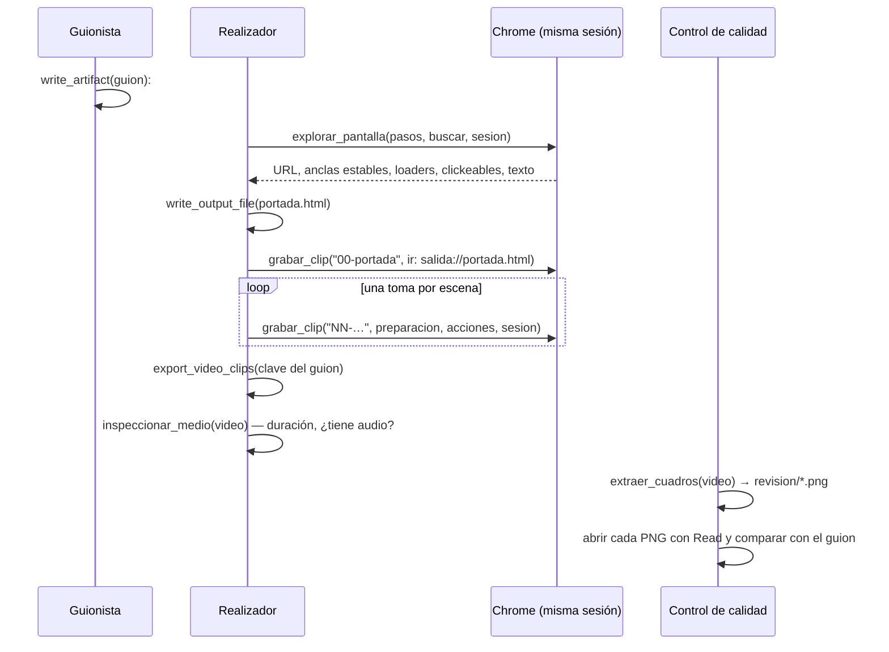

# Motor de clips grabados

El tercer motor de video: **empalma grabaciones reales de una aplicación a
pantalla completa**, con la narración del guion encima. Existe porque un tutorial
o una pieza comercial de software se mira mejor viendo el software moverse: una
captura quieta a un costado cuenta menos que el clic ocurriendo. Como el segundo,
no reemplaza a nadie: el [[Motor de video ASS]] maqueta texto y el
[[Motor estudio de láminas HTML]] filma láminas.

Son tres herramientas que trabajan en cadena, más dos de control de calidad:

| Herramienta | Qué hace | `readOnly` |
|---|---|---|
| `explorar_pantalla` | recorre una pantalla **sin filmarla** y dice qué textos sirven de ancla | sí |
| `grabar_clip` | filma una toma real del navegador y la guarda en `clips/` | no |
| `export_video_clips` | empalma los clips con la narración, la voz y la cama | no |
| `inspeccionar_medio`, `extraer_cuadros` | medir y **mirar** lo producido | ver [[Imágenes y medios]] |

Las tres primeras se registran **sólo si hay Chrome** (van juntas o no van: sin
navegador no hay clips que empalmar). La mecánica del navegador —el arranque, las
acciones, el screencast, las sesiones— está en [[Navegador Chrome por CDP]].

## Lo que comparte y la sincronía por construcción

Comparte con los otros motores el reloj (`ubicarEscenas`), la voz
(`narracion.ts`) y la mezcla con la cama (`sonido.ts`). La sincronía
voz↔pantalla queda garantizada **por construcción**: la duración de cada escena
la manda su narración, y el clip **se recorta** a esa duración si sobra o
**sostiene su último cuadro** si falta. No hay nada que alinear a mano, así que no
se puede desalinear.

El pasaje entre escenas es un **corte**, no un encadenado: en un tutorial el corte
es el lenguaje; el encadenado es de las láminas.

## El flujo completo



## `explorar_pantalla`

`packages/tools/src/skills/index.ts` → `crearExplorarPantalla`. Origen `skill`,
`readOnly: true`, sin aprobación.

| Argumento | Tipo | Obligatorio | Qué es |
|---|---|---|---|
| `pasos` | lista de acciones | sí | cómo llegar a la pantalla (mismas acciones que `grabar_clip`) |
| `buscar` | lista de strings | no | textos a verificar, tal como se usarían en `esperar_texto` |
| `sesion` | string | no | la **misma** sesión que se va a usar para grabar |

Resuelve `ir: "salida://ruta"` a la `file://` del directorio de salida (una lámina
de la empresa se explora igual que una pantalla de la aplicación), toma la sesión,
abre el navegador, ejecuta los pasos y devuelve el informe de
`informeDeExploracion`:

```text
Pantalla: No conformidades
URL: https://…/inspector/nc

✅ Sirven como ancla de esperar_texto: "Abierta"

⚠️ APARECEN Y SE BORRAN (es un loader, NO los uses como ancla): "Cargando proyectos"

❌ No están en esta pantalla: "Sin requisitos"

Clickeable a la vista: Abierta · Solicitar cierre

Texto de la pantalla:
NC-2026-014 · Abierta · …
```

Lo que más importa va primero y con nombre propio: un texto **visible pero no
estable** es la trampa que hace perder una toma entera. Descubrirlo acá cuesta un
segundo; descubrirlo filmando cuesta la toma. La URL viene para que la
preparación de `grabar_clip` no se adivine.

Playwright (MCP) queda para lo que este motor no hace: **crear los datos de demo**
y leer consola y red. Ver [[Integración MCP]].

> [!warning] `readOnly` no quiere decir que no toque nada
> `explorar_pantalla` no escribe en el directorio de salida, pero sus pasos pueden
> hacer clic y escribir en la aplicación viva. Sobre un ambiente de staging, un
> paso de exploración puede cambiar datos igual que una toma.

## `grabar_clip`

`crearGrabarClip`. Origen `skill`, `readOnly: false`, sin aprobación.

| Argumento | Tipo | Obligatorio | Qué es |
|---|---|---|---|
| `archivo` | string | sí | nombre **sin ruta ni extensión**, numerado por escena: `"01-navegacion"` |
| `preparacion` | lista de acciones | no | lo que pasa **fuera de cámara**: login, navegación, esperas |
| `acciones` | lista de acciones | sí (no vacía) | lo que se filma, en orden |
| `colchon_segundos` | number | no | cuánto sostener la pantalla final; default **2,5** |
| `sesion` | string | no | sesión de navegador reusada entre tomas |

Las acciones (`ir`, `esperar_texto`, `clic`, `clic_selector`, `escribir`,
`subir_archivo`, `tecla`, `esperar`) y sus tiempos están en
[[Navegador Chrome por CDP]]. El esquema cierra con
`additionalProperties: false`.

Qué hace:

1. Valida el nombre (se le saca `.mp4`/`.webm`/`.mov`; con `/` falla).
2. Resuelve `salida://` en las dos listas: en `ir` a una URL `file://`, en
   `subir_archivo.archivo` a la **ruta del disco** (es lo que espera
   `DOM.setFileInputFiles`). Si la ruta no existe, falla nombrándola.
3. Toma la sesión, abre el navegador y ejecuta el plan (preparación sin cámara,
   screencast durante las acciones y el colchón).
4. `armarClip` convierte los JPEG en un MP4 y lo guarda en
   **`clips/<archivo>.mp4`** (carpeta fija, `CARPETA_CLIPS`).
5. Devuelve `Clip grabado en clips/…: S segundos, N cuadros, K KB. Verificalo con
   inspeccionar_medio si es una escena clave.` más los avisos (sesión ocupada).

Si falla, nombra la acción: "revisá la acción que nombra el error: un texto que no
aparece suele ser un label mal copiado o una pantalla que todavía no cargó (sumá
`esperar_texto` o `esperar`)".

**La preparación pasa fuera de cámara** y la grabación arranca sobre la pantalla
lista: por eso un clip no puede mostrar el formulario de acceso ni un loader de
entrada. Y cada acción importante arranca con `esperar_texto` sobre un texto que ya
está: es la regla anti-loader.

### `armarClip`: los cuadros con su duración real

El screencast entrega **repintados, no una cadencia fija**. `armarClip(cuadros)`
escribe una lista para el demuxer `concat` con la duración de cada JPEG (y repite
el último archivo, porque el demuxer ignora la duración del último) y codifica:

```text
ffmpeg -f concat -safe 0 -i cuadros.txt
  -vf fps=30,scale=1920:1080:force_original_aspect_ratio=decrease,
      pad=1920:1080:(ow-iw)/2:(oh-ih)/2,setsar=1
  -c:v libx264 -preset veryfast -crf 18 -pix_fmt yuv420p clip.mp4
```

El clip dura lo que duró la grabación, sin acelerones.

## La numeración: portada `00`, escenas por ordinal de `##`

`atarClips(rutas, escenas)` ata cada clip a su escena por el **número al
principio del nombre**, la misma convención que las láminas: el guion ya dice el
orden; el archivo sólo dice cuál es.

- Cuentan `.mp4`, `.webm` y `.mov`; el nombre puede empezar con `escena-`
  (`escena-01.mp4`).
- Los números se cuentan sobre las escenas `##`, **sin la portada**: `01-…` es la
  primera `##`. Numerarlas juntas fue el error que **corrió un video entero una
  escena**.
- `00-…` no entra al mapa de escenas: es la **portada**. `clipDePortada` busca,
  en orden alfabético, un nombre que empiece con `0` o `00` seguido de un corte de
  palabra (`007-espia.mp4` no es portada).
- Un número fuera de rango se ignora.

> [!danger] Dos clips para la misma escena se avisan
> Al regrabar una escena con otro nombre quedaban las dos tomas y ganaba la
> primera por orden alfabético, que solía ser justo la que se quería reemplazar.
> El video salía con la pantalla vieja y no había forma de notarlo salvo
> mirándolo cuadro por cuadro. Ahora se usa igual la primera, pero el resultado
> dice cuál usó, lista las demás y pide borrar la que sobra con `delete_files`.

> [!warning] Cualquier encabezado o un `---` corre la numeración
> Un `###` dentro de una sección, o un `---` después de texto, parte la escena en
> dos (ver [[Guion como línea de tiempo]]). Los clips siguientes quedan atados a
> la escena anterior de la que se pensó, y la última sale como placa lisa. Antes
> de dar el video por terminado, compará la cantidad de escenas que informa la
> exportación con las `##` del guion.

### La portada es un clip filmado sobre HTML de la empresa

La escena del `#` toma como visual el clip `00-…`. Se filma con `grabar_clip`
sobre una página que la empresa ya produjo con `write_output_file`
(`ir: "salida://portada.html"`), con una entrada corta y nada en bucle. Su duración
la da el reloj compartido: **3,8 s de aire si no narra**, más la pausa entre
escenas. Sin clip `00`, la portada sale como placa lisa y el resultado lo avisa.

> [!danger] La portada no narra
> Texto suelto entre el `#` y la primera `##` ("Personajes:", "Tono:") es narración
> de portada: la voz lo lee al abrir el video. El motor lo avisa fuerte:
> `ATENCIÓN: la portada tiene texto narrado ("…"). Si son notas de producción,
> borralas con edit_artifact y re-exportá`. Lo pagamos con un video que arrancaba
> leyendo los metadatos.

## `export_video_clips`

`crearVideoClips`. Origen `skill`, `readOnly: false`, sin aprobación.

| Argumento | Tipo | Obligatorio | Qué es |
|---|---|---|---|
| `artifact_key` | string | sí | clave del guion |
| `folder` | string | no | carpeta donde queda el MP4 |
| `musica` | string | no | clima o pista; `ninguna` = silencio |

Pasos: `buscarEntregable` → `revisarCifras` → lista todo lo que hay bajo `clips/`
→ `renderClips` con la voz de la empresa y su marca (`marca.rotulos`,
`marca.acento`, `marca.panel`) → guarda `<artifact_key>.mp4`.

Devuelve `Video de clips generado en <ruta>: "<título>", N escenas, S segundos,
M MB.` (N = escenas `##`, sin la portada), la cobertura ("Las N escenas con clip
grabado." o "X de N escenas con clip; el resto salió con placa lisa."), si abre con
la portada ("Abre con la portada (00)." o "SIN portada: grabá un clip 00-portada
(salida://…) si el video la necesita."), la pista, y siempre: "Verificalo con
inspeccionar_medio y MIRALO con extraer_cuadros antes de darlo por bueno."

### Cómo arma el video: `renderClips`

`packages/tools/src/skills/clips.ts` → `renderClips(markdown, opciones)`:

1. `parseGuion` (sin escenas → error), síntesis de cada línea,
   `ubicarEscenas`.
2. `planificarCortes`: cada escena dura desde su inicio **hasta el inicio de la
   siguiente** (la última, hasta el total), con un piso de **0,5 s**: una escena de
   duración cero rompería el `concat`.
3. Avisa si la portada narra; resuelve el clip `00`; ata y resuelve los demás
   (cada escena sin clip, o con un clip que no se pudo abrir, deja su aviso).
4. Entradas de ffmpeg: **primero las voces** (índices `0…n−1`: acá no hay un fondo
   generado en el índice 0), después la música, después **una entrada por
   escena**: el clip real o una placa lisa
   `color=c=0x0a0e1a:s=1920x1080:d=<duración>:r=30`.
5. Un filtro por escena (`filtroDeEscena`) y un `concat` de todas:
   `concat=n=<N>:v=1:a=0,format=yuv420p`.
6. La mezcla de `construirSonido` con `primeraVoz: 0`. Ver [[Música y narración]].
7. Salida: `libx264` medium, CRF 19, `yuv420p`, 30 fps, AAC 192k, `+faststart`,
   `-t total`.

`filtroDeEscena(entrada, corte, etiqueta, rotulo?)`:

```text
[i:v]fps=30,
     scale=1920:1080:force_original_aspect_ratio=decrease,
     pad=1920:1080:(ow-iw)/2:(oh-ih)/2:color=0x0a0e1a,
     setsar=1,
     tpad=stop_mode=clone:stop_duration=600,
     trim=duration=<duración exacta>,
     setpts=PTS-STARTPTS
     [,drawtext…,drawbox…]            ← sólo con rótulos
[eN]
```

> [!danger] `tpad` antes de `trim`
> Primero estirar (clonar el último cuadro hasta 600 s), después cortar a la
> duración exacta del reloj. Al revés, un clip más corto que su narración quedaría
> corto y **el corte siguiente entraría antes que su voz**. Hay un test que fija
> el orden.

El clip se encaja entero con barras del color de fondo del kit si la proporción no
da. Este motor **no** pone logo ni fondo generado: la marca va en la portada que
filmó la empresa.

### Rótulos animados (opcionales)

Con `company.marca.rotulos: true` (apagado por defecto), cada escena que no sea la
portada lleva abajo a la izquierda su título con una barra de acento y un panel
detrás, que entran deslizándose y se van antes de cansar.

> [!note] Por qué vienen apagados
> Cuando lo que se filma es una aplicación, la pantalla ya trae sus propios
> títulos, encabezados y menús, y el rótulo compite con ellos en vez de ayudar.
> Sirve cuando el visual no se explica solo —una toma de cámara, un diagrama— y
> ahí se prende a propósito. Ver [[Voz y marca de la empresa]].

| Constante | Valor | Qué es |
|---|---|---|
| `ROTULO.demora` | 0,35 s | cuándo empieza a entrar |
| `ROTULO.entrada` | 0,45 s | cuánto tarda en entrar (sube 26 px) |
| `ROTULO.vida` | 3,6 s | cuánto se queda; en escenas cortas, lo que haya menos la salida, con piso de 0,9 s |
| `ROTULO.salida` | 0,5 s | cuánto tarda en irse |
| base vertical | 1080 − 168 = 912 px | |
| texto | `drawtext`, 44 px, blanco, x = 124 | |
| panel | `box=1`, color `marca.panel` al 92 %, borde 22 px | |
| barra | `drawbox` x = 96, 7×90 px, color `marca.acento` | |

- **Una sola rampa de alfa 0→1→0** la comparten la barra, el texto y el
  deslizamiento: si cada uno tuviera la suya, se desincronizan a la primera
  corrección.
- **El panel va con el texto** (`box=1` del `drawtext`) y no como `drawbox`
  aparte: así se desvanece con la palabra. Separados, quedaba el panel vacío en
  pantalla. Y el panel no es decoración: la aplicación filmada tenía fondo claro y
  el texto blanco desaparecía, se leía sólo por la sombra.
- **Fuente**: la primera que exista de `FUENTES_DE_ROTULO` (Arial Bold,
  Helvetica Neue y Arial de macOS; DejaVu Sans Bold y Liberation Sans Bold de
  Linux). Sin ninguna, el video sale **sin rótulos** en vez de fallar.
- `escaparTexto`: `\` se duplica, `'` pasa a `’` (la recta corta el filtro), `:` y
  `%` se escapan.
- Requiere un ffmpeg con `drawtext` (freetype). Ver [[Dependencias del sistema]].

## Seguridad

> [!danger] Las URLs de las acciones no se sanean
> Sólo `salida://` pasa por el servidor. `ir` acepta `file://` y cualquier
> dirección de la red, y `explorar_pantalla` devuelve el texto de lo que muestra.
> El detalle está en [[Navegador Chrome por CDP]]. Estas habilidades se otorgan a
> roles que las necesitan, y a nadie más.

## Casos borde y fallas conocidas

| Síntoma | Causa |
|---|---|
| una escena salió como placa lisa | no hay `clips/NN-….mp4` para su ordinal, o no se pudo abrir (el resultado lo dice) |
| el video usa una toma vieja | dos clips con el mismo número (el resultado lo avisa) |
| todo el video está corrido una escena | la portada se numeró como `01`, o un `###`/`---` partió una escena |
| el video arranca leyendo "Personajes: …" | texto entre `#` y la primera `##` |
| el final de la interacción no se ve | el clip dura más que la narración de su escena y se recortó: acortá las acciones o alargá la narración |
| la pantalla queda quieta al final de la escena | el clip dura menos que la narración y se clonó su último cuadro |
| la toma arrancó en la pantalla de acceso | otra toma tenía la misma sesión y ésta usó un perfil nuevo (se avisa) |
| la toma buena se perdió | se grabó un sondeo con el nombre numerado de la escena: los sondeos van con un nombre descartable |
| staging quedó con datos cambiados | filmar (y explorar) muta datos; las acciones irreversibles se filman sobre material creado en la preparación |
| no hay rótulos aunque la empresa los pidió | ninguna fuente de `FUENTES_DE_ROTULO` existe, o el ffmpeg no tiene `drawtext` |

## Qué fijan los tests

`packages/tools/src/skills/clips.test.ts`:

- `atarClips` ata por número con o sin `escena-`; deja `null` la escena sin clip e
  ignora números fuera de rango; no ata lo que no es video; el `00` no entra al
  mapa de escenas; avisa cuando hay dos clips para la misma escena (nombrando los
  dos y `delete_files`); sin repetidos, sin avisos.
- Texto suelto bajo el título: una nota de producción se vuelve narración de
  portada (la condición del aviso); una portada limpia no narra.
- `clipDePortada` encuentra el `00` y sólo el `00` (`007-espia` no).
- `planificarCortes`: cada escena dura hasta la siguiente y la última hasta el
  total; una escena degenerada dura por lo menos 0,5 s.
- `filtroDeEscena`: `tpad` antes de `trim` con la duración exacta, entrada y
  etiqueta correctas, `decrease` y `pad=1920:1080`.
- `tomarSesion` e `informeDeExploracion`: ver [[Navegador Chrome por CDP]].

## Cómo extenderlo

- La duración de una escena sale siempre de `planificarCortes`: no la calcules en
  el filtro.
- Un efecto nuevo sobre el clip va después del `trim` y antes de la etiqueta; si
  anima, que comparta la rampa de alfa del rótulo.
- Si cambiás la convención de nombres, cambiala en `atarClips`,
  `clipDePortada`, la descripción de `grabar_clip` y la de
  `export_video_clips` a la vez.

## Fuentes

- `packages/tools/src/skills/clips.ts` → `renderClips`, `atarClips`, `clipDePortada`, `planificarCortes`, `filtroDeEscena`, `filtroDeRotulo`, `fuenteDeRotulo`, `FUENTES_DE_ROTULO`, `ROTULO`, `escaparTexto`, `armarClip`, `CARPETA_CLIPS`
- `packages/tools/src/skills/index.ts` → `crearGrabarClip`, `crearExplorarPantalla`, `crearVideoClips`, `informeDeExploracion`, `tomarSesion`, `esquemaDeAcciones`
- `packages/tools/src/skills/chrome.ts` → `abrirGrabacion`
- `packages/shared/src/schema.ts` → `marcaSchema`
- `scripts/seed-inspia-publicidad.ts` → el equipo que usa este motor

## Ver también

- [[Producción audiovisual]]
- [[Navegador Chrome por CDP]]
- [[Guion como línea de tiempo]]
- [[Imágenes y medios]]
- [[CU-09 Tutorial filmado sobre una app real]]
