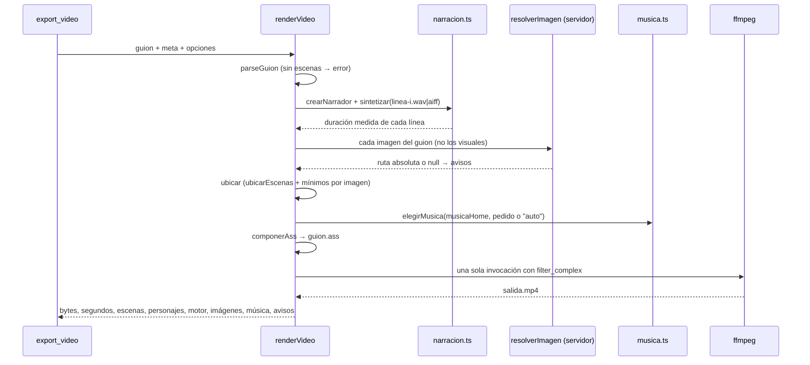
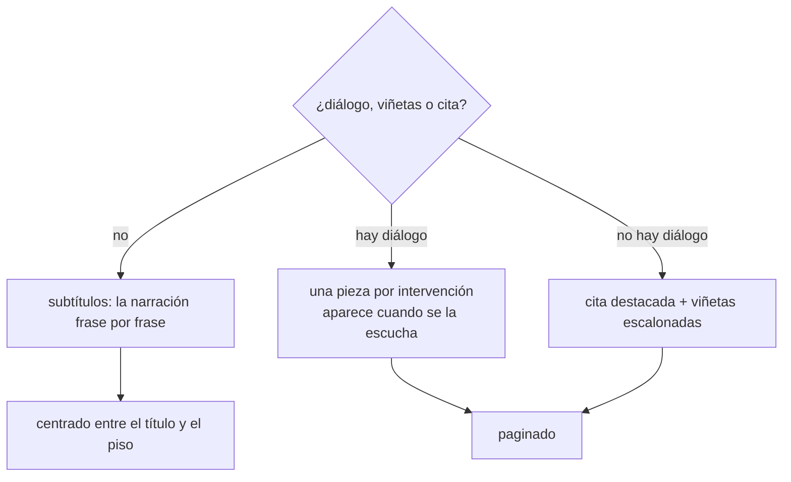

# Motor de video ASS

El primer motor de video, y el que **no necesita nada instalado más allá de
ffmpeg**. `export_video` toma un guion ya escrito y lo filma como un MP4 narrado:
fondo generado por filtro, toda la tipografía como subtítulos ASS dibujados por
libass, imágenes y clips superpuestos en su ventana, y las voces ubicadas en su
instante exacto. Todo en **una sola pasada de ffmpeg**.

Es el motor correcto para un guion que es texto, viñetas, diálogo, íconos,
diagramas vectoriales y fotos. Para láminas diseñadas en HTML está el
[[Motor estudio de láminas HTML]]; para mostrar una aplicación funcionando, el
[[Motor de clips grabados]]. Qué lee de cada construcción del markdown está en
[[Guion como línea de tiempo]].

## Por qué una sola pasada y sin navegador

No hay un clip por escena ni una cadena de `xfade`, así que **no hay archivos
intermedios de video que sincronizar**: cada uno sería un punto donde el tiempo
se puede despegar del audio. La única fuente de verdad del tiempo son las
duraciones medidas de la voz; todo lo que se ve se calcula a partir de ellas.

Se dibuja con lo que ffmpeg ya trae —libass para el texto, `gradients` para el
fondo— en vez de rasterizar HTML: agregar un navegador headless para maquetar
seis placas de texto era cambiar 150 MB de dependencia por un `<div>`. La
decisión y lo que se resignó están en
[[ADR-006 Video en una sola pasada de ffmpeg]]. El segundo motor revisa esa
cuenta para las láminas programadas, no para esto.

## Contrato de `export_video`

`packages/tools/src/skills/index.ts` → `crearVideo`. Origen `skill`,
`readOnly: false`, `requiresApproval: false`. **Se registra siempre**: no
depende de ningún programa opcional (si falta ffmpeg, falla al filmar y lo dice).

| Argumento | Tipo | Obligatorio | Qué es |
|---|---|---|---|
| `artifact_key` | string | sí | clave del guion, tal como se usó en `write_artifact` |
| `folder` | string | no | carpeta del directorio de salida, p. ej. `marketing/videos`; se crea sola |
| `musica` | string | no | clima o nombre de pista (`corporativo`, `calmo`); `ninguna` filma en silencio; sin esto se elige una neutra |

La descripción de la herramienta le enseña al agente el formato del guion con un
ejemplo completo, la lista de íconos disponibles (`ICONOS_DISPONIBLES`) y cómo
pedir imágenes.

### Qué hace, en orden

1. `buscarEntregable`: resuelve la clave; si no existe, **nombra las que sí
   existen** (un "no existe" a secas hace que el agente reintente con la misma
   clave inventada).
2. `revisarCifras`: si el guion tiene plata o porcentajes sin verificar sobre la
   versión actual, se niega. Ver [[Guion como línea de tiempo]].
3. Resuelve el logo en `marca/logo.png` (ruta fija, ver
   [[Voz y marca de la empresa]]).
4. Llama a `renderVideo` con la voz de la empresa (`company.voz.unaSolaVoz`,
   `company.voz.pronunciacion`), `musicaHome`, el pedido de música y un
   resolutor de imágenes (`crearResolutorImagenes`).
5. Guarda `<artifact_key>.mp4` en la carpeta: **un archivo por entregable y
   formato**, que se pisa al re-exportar.

### Qué devuelve

Éxito: `Video generado en <ruta>: "<título>", N escenas, S segundos, K KB.`
seguido de quién habla ("Habla Cliente, Asesora, cada uno con su voz."), cuántas
imágenes, qué pista quedó de fondo y, al final, `Atención: …` con los avisos.

Los avisos van **en el resultado y no en un log**: es lo único que el agente
puede leer para corregir el guion. Una imagen que no apareció o una música que
no se encontró vuelven ahí, y el video sale igual.

Fallo: `No se pudo filmar "<clave>": <primera línea del error>.` más dos pistas
(revisar los `##`; si falta ffmpeg, avisarle a quien opera la empresa, "no es
algo que puedas resolver vos"). El agente recibe eso y no un stack trace.

## Cómo funciona `renderVideo`

`packages/tools/src/skills/video.ts` → `renderVideo(markdown, meta, opciones)`.
Devuelve bytes y no escribe en la salida: dónde va el archivo lo decide el
`SkillStorage` que inyecta el servidor.



Todo pasa en un temporal `orq-video-*` que se borra en el `finally`. ffmpeg corre
con ese temporal como directorio de trabajo, así el filtro puede decir
`ass=guion.ass` sin escapar una ruta absoluta.

### El tiempo

`ubicar` usa el reloj compartido (`ubicarEscenas`) y le agrega un **piso por
escena**: `(imágenes + visuales) × (0,55 × 2 + 0,9)`, o sea **2 s por cada
imagen o visual**. Una imagen que dura menos de lo que tarda en aparecer y
desaparecer es un parpadeo; si el guion pidió mostrarlas, la escena se estira.
Cada elemento de una escena vive hasta `fin + 0,35 s`, así se pisa un poco con
la pausa y el pasaje no queda vacío.

## El lienzo y la retícula

| Constante | Valor | Por qué |
|---|---|---|
| `LIENZO` | 1920×1080 a 30 fps | Full HD; el mismo lienzo que los otros motores |
| `MARGEN` | 180 px | margen izquierdo y derecho de todo el texto |
| `ANCHO_UTIL` | 1560 px | `1920 − 2 × 180` |
| `PISO` | 940 px | última fila utilizable: debajo va la barra de progreso (y = 1002) |
| `PANEL` | x 1096, y 214, 644×620 | el hueco de una foto o un visual, a la derecha |
| `PANEL_CLIP` | x 900, y 304, 840×473 | el hueco de un clip, en 16:9; el borde derecho coincide con el del panel (1740) |
| `ANCHO_CON_IMAGEN` | 844 px | `PANEL.x − MARGEN − 72`: la columna de texto cuando hay imagen |
| `ANCHO_CON_CLIP` | 648 px | `PANEL_CLIP.x − MARGEN − 72` |
| `SOBREMUESTREO` | panel 1,5 · completa 1,25 | se agranda la fuente antes del acercamiento, ver abajo |
| `FUNDIDO_IMAGEN` | 0,55 s | entrada y salida de cada imagen |
| `AVANCE` | 0,52 | ancho medio de un carácter de Avenir Next como fracción del cuerpo |
| `DESLIZ` | 12 px | cuánto sube cada elemento al entrar |
| salida de un texto | 380 ms | `\fad(entrada, 380)`; la entrada por defecto es 420 ms |

> [!note] Por qué el hueco del clip está en x = 900 y no más a la izquierda
> Un clip se encaja entero y una grabación 16:9 metida en el panel casi cuadrado
> usaba 644×362 de los 644×620: un tercio del alto en barras. El hueco 16:9
> crece hacia la izquierda, pero con x = 760 al texto le quedaban 508 px y un
> párrafo de treinta y pico de palabras **se desbordaba por abajo del cuadro**.
> En x = 900 el clip tiene casi el doble de área que una foto y al texto le
> quedan 648 px.

## Tipografía y estilos

`envolver(texto, cuerpo, ancho)` corta por palabras con un máximo de caracteres
por renglón `max(12, ⌊ancho / (cuerpo × 0,52)⌋)` y une los renglones con `\N`.
El `[Script Info]` declara `WrapStyle: 2` (sin corte automático: los cortes los
decide `envolver`), `ScaledBorderAndShadow: yes` e `YCbCr Matrix: TV.709`.

| Estilo | Fuente | Cuerpo | Color | Para qué |
|---|---|---|---|---|
| `Portada` | Avenir Next Demi Bold | 104 | tinta | título de la portada |
| `Titulo` | Demi Bold | 62 | tinta | título de escena |
| `Ceja` | Demi Bold | 30, espaciado 5 | acento | empresa en la portada, título del video arriba de cada escena |
| `Bala` | Avenir Next | 42 | tinta tenue | viñetas |
| `Leyenda` | Avenir Next | 46 | tinta | narración subtitulada |
| `Destacado` | Demi Bold | 54 | tinta | la cita `>` |
| `Personaje` | Demi Bold | 26, espaciado 4 | acento | nombre de quien habla |
| `Dialogo` | Avenir Next | 42 | tinta | lo que dice |
| `Regla`, `Vineta`, `Progreso` | — | — | acento | formas vectoriales |
| `Realce` | — | — | realce (turquesa) | ícono de escena, barra de la cita |
| `Velo` | — | — | fondo | velo de la portada con foto |
| `Riel` | — | — | línea | el riel de la barra de progreso |
| `Tinte*` (12) | — | — | uno por tinte | formas de los visuales |
| `Visual`, `VisualFuerte` | Avenir Next / Demi Bold | 26 | tinta | rótulos dentro de un visual |

Todos con alineación 7 (arriba a la izquierda), sin borde ni sombra.

> [!danger] Una familia con estilo propio, no `Bold=1`
> Pedirle negrita a "Avenir Next" hace que libass sintetice o elija la variante
> oblicua: el título salía **en cursiva** sin que nadie la pidiera. Por eso los
> títulos usan la familia "Avenir Next Demi Bold" con `Bold=0`.

Dos detalles de ASS que el código resuelve:

- **El color va al revés**: `&HAABBGGRR`, con `AA` de transparencia (`00` es
  opaco). `ass(hex)` lo convierte.
- **`{`, `}` y `\` son órdenes de estilo**: `escaparAss` quita las llaves,
  cambia `\` por `/` y junta los saltos de línea. Si pasan, la frase
  **desaparece** de la pantalla en vez de verse mal.

Los colores (`COLOR`) salen del logo de Codytion y están fijos en el motor; ver
[[Voz y marca de la empresa]] para qué implica eso en otra empresa.

## Cómo se compone cada escena

`componerAss(escenas, total, guion, meta)` arma el `.ass` completo. Cada evento
entra con fundido **y** deslizamiento (`\move` de 12 px durante la misma ventana
del fundido): un fundido solo se lee como "apareció algo"; con desplazamiento, se
lee como "esto entró". Lo que hace de fondo —el velo, el riel, las formas de un
diagrama— va `quieto`: si el fondo también se mueve, la placa tiembla.

### La portada

- Con imagen, primero un **velo** a pantalla completa (transparencia `&H66&`):
  suficiente para que el blanco se lea sobre una foto clara, no tanto como para
  apagarla. Sin velo, un cielo claro se llevaba puesto el nombre de la empresa.
- Regla de 90×4 en (180, 392), la empresa en mayúsculas en (180, 434) —sólo si
  hay empresa: una cejilla vacía dejaba un hueco raro—, y el título envuelto a
  104 px en (180, 500).
- La narración de portada se **oye** pero no se escribe.

### Una escena

1. **Cejilla** con el título del video en mayúsculas (180, 150) y una regla de
   56×3 (180, 205): ubican la escena sin robar atención.
2. **Ícono de escena** de 54 px en turquesa, **sobre** el título y no al lado:
   al lado obliga a sangrar el texto y la escena no se alinea con las demás.
3. Con imagen, una **línea de apoyo** debajo del hueco (el ancho del hueco, a
   22 px): ata la imagen al resto de la placa en vez de dejarla como un recorte
   pegado.
4. **Título** de 62 px, envuelto al ancho de la columna (1560, 844 u 648 según
   haya imagen o clip).
5. El **cuerpo**, que se decide así:



- **Subtítulos** (`Leyenda`, 46 px): una escena que se narra y no muestra nada
  quedaba como un título sobre un cuadro vacío durante veinte segundos. La
  narración se parte en frases (`. ! ?`) y cada una aparece en su momento,
  **repartida en proporción al largo** del texto: no se sabe dónde cae cada frase
  en el audio, pero una frase que ocupa un tercio del texto ocupa más o menos un
  tercio del tiempo. Todas en el mismo lugar, como un subtítulo; la última se
  queda hasta el final de la escena.
- **Diálogo**: nombre del personaje en mayúsculas (26 px, acento) y su línea
  (42 px) debajo. **Cada intervención aparece cuando se la escucha**: esa es la
  sincronía.
- **Cita y viñetas**: la cita lleva una barra de realce de 4 px a la izquierda.
  Las viñetas aparecen escalonadas dentro del primer **62 %** de la escena
  (`inicio + i/n × duración × 0,62`), así aparecen mientras se explican. Con
  ícono (38 px) el texto arranca a 68 px; sin ícono, un cuadradito de 10×10 y el
  texto a 48 px. Un ícono inexistente cae en el cuadradito en vez de dejar la
  fila descolgada.

### Lo que no entra pasa de página

Antes de dibujar, se mide cada pieza (alto en píxeles) para **centrar** el bloque
—con el contenido clavado arriba, una escena de dos líneas dejaba media pantalla
vacía— y para saber si entra. Si la pieza que llega no cabe entre el título y el
`PISO`, **empieza una página nueva**: las anteriores se retiran justo cuando
entra la primera pieza de la siguiente. Sin esto, una conversación de cuatro
intervenciones se desbordaba por abajo del cuadro y se comía la barra de
progreso.

### La barra de progreso

Dos eventos fijos en la capa 2, en (180, 1002), del ancho útil y 2 px de alto:
el `Riel` casi transparente (`&HD0&`) y el `Progreso`, que arranca con
`\fscx0` y se estira con `\t(0, total_ms, \fscx100)` durante todo el video. Va
en la capa más alta porque la portada con foto se la comía.

## Imágenes, visuales, clips y logo en el panel

Los **visuales** no se superponen como video: se dibujan como formas de ASS en un
cuadrado de 620 px centrado en el `PANEL`, en los colores de la marca, sin
recorte (ver [[Íconos y visuales vectoriales]]). Las formas van primero y quietas;
los rótulos, después.

Las **imágenes, clips y el logo** se superponen al fondo con `overlay`, cada uno
sólo durante su ventana (`enable='between(t,desde,hasta)'`), uno detrás de otro;
la tipografía (`ass=guion.ass`) va al final, siempre encima de todo.

`ubicarImagenes` reparte el tiempo: varias imágenes en una escena se dividen su
duración en partes iguales (el tiempo lo manda el audio y las imágenes se
acomodan adentro). La de la **portada** ocupa el cuadro entero; las demás, el
panel derecho.

`filtroImagen(indice, k, puesta)` tiene tres ramas:

| Qué | Entrada de ffmpeg | Filtro | Por qué |
|---|---|---|---|
| **foto** | `-loop 1 -framerate 30 -t (dur + 0,2)` | `scale` al hueco × sobremuestreo con `force_original_aspect_ratio=increase`, `crop`, `zoompan=z='min(1+0.00028*on,1.09)'` centrado, `s=` tamaño final, `fps=30`, `format=rgba`, `fade` in/out con alfa, `setpts=PTS+desde/TB` | recorta sin deformar; el acercamiento lento (hasta 1,09, unos 10,7 s) evita la diapositiva pegada |
| **clip** (`video:`) | `-stream_loop -1 -t dur` | `scale` con `decrease` + `pad` transparente centrado (`color=black@0`), `fps=30`, `setpts=PTS-STARTPTS`, `trim=duration`, `setpts=PTS-STARTPTS`, fundidos, `setpts` al instante | se **encaja entero**: una captura recortada pierde justo lo que muestra; sin `zoompan` porque el clip ya se mueve |
| **logo** | `-loop 1 -framerate 30` | `scale=-2:<alto>`, `format=rgba`, fundidos, `setpts` al instante | `-2` conserva la proporción con ancho par; nunca se recorta ni se acerca |

> [!danger] Sobremuestrear antes del `zoompan`
> `zoompan` amplía sobre lo que recibe: si recibe el tamaño final, el
> acercamiento es puro reescalado y la imagen se ablanda. Por eso se agranda
> primero (×1,5 en el panel, ×1,25 a pantalla completa) y `zoompan` entrega el
> tamaño final.

> [!danger] Correr la imagen en el tiempo con `setpts`
> Sin `setpts=PTS+<desde>/TB` el fundido de entrada ocurre en el segundo cero del
> video y la escena la recibe **ya entrada**.

> [!warning] Un clip se reinicia antes de recortarlo
> El clip trae su propia línea de tiempo: sin `setpts=PTS-STARTPTS` antes del
> `trim`, se mide desde el instante equivocado. El `fps` se fija al del lienzo
> porque una grabación a 25 y un video a 30 se desincronizan al superponerse. Y
> `-stream_loop -1` cubre la escena si el clip es más corto: sin el bucle, el
> último cuadro congelado se lee como un video colgado.

El **logo** se pone **una vez por escena** (cada escena tiene su ventana de
`enable`): un solo overlay para todo el video taparía las imágenes que entran
después. Tamaños y posición en [[Voz y marca de la empresa]].

## El fondo y la salida

El fondo se **genera**, no hay assets que empaquetar:

```text
gradients=s=1920x1080:c0=0x0a0e1a:c1=0x1a1f45:c2=0x0a0e1a:n=3:
  x0=1650:y0=60:x1=260:y1=1020:speed=0.0016:r=30:d=<total>
```

Un degradado grafito con el violeta del logo apenas insinuado, que se mueve muy
lento durante todo el video.

El orden de las entradas importa y se lleva a mano: **0** el fondo, **1…n** las
voces, después la música (con `-stream_loop -1`, así una pista de dos minutos
cubre un video de tres) y al final las imágenes (primero los logos, después las
de cada escena). La mezcla de audio sale de `construirSonido` en `sonido.ts`,
compartida con los otros motores; ver [[Música y narración]].

| Parámetro de salida | Valor |
|---|---|
| video | `libx264`, `-preset medium`, `-crf 19`, `-pix_fmt yuv420p`, `-r 30` |
| audio | `aac`, `-b:a 192k` |
| contenedor | `-movflags +faststart` (se reproduce antes de bajar entero) |
| duración | `-t <total>` |
| verbosidad | `-v error`, `maxBuffer` de 8 MB |

> [!danger] Sin viñeta
> El filtro `vignette` oscurece los bordes, y acá el texto va alineado a la
> izquierda: apagaba justo lo que hay que leer. No se usa.

## Dependencias

- **ffmpeg con libass** (el filtro `ass`) y `gradients`. El filtro `drawtext` no
  hace falta en este motor.
- **ffprobe**, para medir la voz cuando se usa `say`.
- La fuente **Avenir Next** (viene con macOS). En otra máquina libass cae a una
  fuente de reemplazo sin avisar.
- Kokoro o `say` para la voz. Ver [[Música y narración]].

> [!danger] Un ffmpeg sin libass no filma este motor
> La fórmula `ffmpeg` actual de Homebrew (9.x) viene **sin** `ass` ni
> `drawtext`; la `ffmpeg@7` sí los trae, pero es keg-only y tiene que ir primero
> en el `PATH`. Y si Homebrew actualiza `x265`, el `ffmpeg@7` instalado queda
> apuntando a una librería que ya no existe: `dyld: Library not loaded:
> …/libx265.216.dylib`, y fallan **ffmpeg y ffprobe** (visto en esta máquina el
> 2026-09-26). Se arregla reinstalando `ffmpeg@7`. Ver
> [[Dependencias del sistema]] y [[Diagnóstico de problemas]].

## Casos borde y fallas conocidas

| Síntoma | Causa |
|---|---|
| "No se pudo filmar …" con un error de ffmpeg sobre `ass` | ffmpeg sin libass (ver arriba) |
| el título sale en cursiva | se pidió `Bold=1` sobre "Avenir Next" en vez de la familia Demi Bold |
| una frase no aparece en pantalla | tenía `{`, `}` o `\` y no se escapó (el código los quita) |
| el video salió sin música y el agente no se enteró | no pidió `musica`: sin pedido explícito, la falta de biblioteca no se avisa |
| "N imágenes en pantalla" con un número mayor al esperado | `ResultadoVideo.imagenes` cuenta los overlays, y **el logo suma uno por escena** |
| la escena dura más que lo narrado | el piso de 2 s por imagen o visual; `estimar_duracion` no lo ve |
| con logo, la regla y la empresa de la portada se pisan con el logo | el logo va en y 250 con 190 px de alto y la regla (y 392) y la empresa (y 434) caen en esa franja |
| el render quedó colgado | ffmpeg y la síntesis de voz no tienen corte por tiempo propio: sólo los corta detener la corrida (`ctx.signal`) |

## Qué fijan los tests

- `packages/tools/src/skills/guion.test.ts` → "herramienta export_video": se
  registra con origen `skill` y `readOnly: false`; con una clave inexistente
  nombra las que hay; un guion sin escenas se rechaza con una explicación que
  menciona `##`.
- `packages/tools/src/skills/skills.test.ts`: `export_video` está siempre entre
  las habilidades registradas.
- `packages/tools/src/skills/estudio.test.ts` → `construirSonido`: la mezcla que
  usa este motor (voces en su instante, `aresample` después de `loudnorm`,
  ducking con cadena lateral).
- El filtro de video y el `.ass` **no** tienen tests propios: se verifican
  filmando. `inspeccionar_medio` y `extraer_cuadros` son la forma de medir y mirar
  el resultado (ver [[Imágenes y medios]]).

## Cómo modificarlo sin romperlo

- Un elemento nuevo en la placa se mide antes de dibujarlo y entra al paginado,
  o se desborda por abajo del cuadro.
- Todo lo que dependa del tiempo sale de `EscenaMedida` (que viene de
  `ubicarEscenas`); no calcules duraciones propias.
- Un filtro nuevo sobre imágenes va **antes** del `setpts` que las corre a su
  instante.
- Si tocás la mezcla, se toca en `sonido.ts`, no acá: la comparten los tres
  motores.

## Fuentes

- `packages/tools/src/skills/video.ts` → `renderVideo`, `componerAss`, `ubicar`, `ubicarImagenes`, `filtroImagen`, `resolverImagenes`, `envolver`, `frasesDe`, `escaparAss`, `ass`, `LIENZO`, `MARGEN`, `PISO`, `PANEL`, `PANEL_CLIP`, `SOBREMUESTREO`, `FUNDIDO_IMAGEN`, `AVANCE`, `DESLIZ`, `MARCA`, `FUENTE`, `COLOR`
- `packages/tools/src/skills/index.ts` → `crearVideo`, `crearResolutorImagenes`, `buscarEntregable`, `revisarCifras`, `LOGO`
- `packages/tools/src/skills/sonido.ts` → `construirSonido`
- `packages/tools/src/skills/guion.ts` → `ubicarEscenas`, `PAUSA`

## Ver también

- [[Producción audiovisual]]
- [[Guion como línea de tiempo]]
- [[ADR-006 Video en una sola pasada de ffmpeg]]
- [[Íconos y visuales vectoriales]]
- [[Imágenes y medios]]
- [[Música y narración]]
- [[Voz y marca de la empresa]]
- [[CU-02 Video institucional]]
