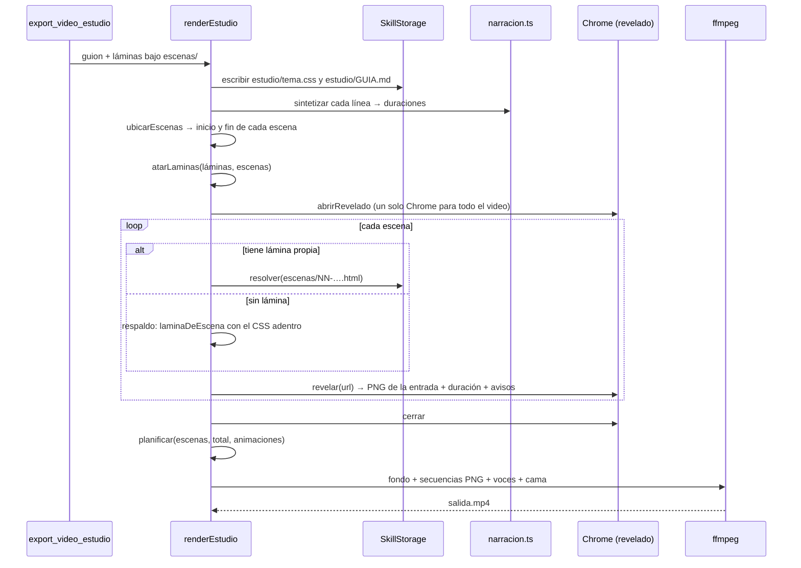

# Motor estudio de láminas HTML

El segundo motor de video. **No reemplaza al primero**: el
[[Motor de video ASS]] dibuja todo con ffmpeg y sigue siendo lo correcto para un
guion de texto y viñetas. Este motor compone **cada escena como una lámina HTML**
y la revela con el Chrome de la máquina: tipografía real, un diagrama SVG que se
dibuja solo, tarjetas de vidrio, una cifra grande, una retícula de tres columnas.
Nada de eso se maqueta en ASS.

La razón de fondo es otra: **HTML es el lenguaje que un agente sabe programar**.
Una lámina se le puede encargar a un rol con capacidad de escribir código, que la
prueba con `revisar_lamina`, la mira, la corrige y la vuelve a probar. Esto
revisa la cuenta de [[ADR-006 Video en una sola pasada de ffmpeg]]: cambiar 150 MB
por un `<div>` seguía siendo mal negocio para seis placas de texto, no para esto.
Y tampoco se instala ningún navegador: se usa el que ya está (ver
[[Navegador Chrome por CDP]]).

## Lo que comparte y lo que no

Comparte con los otros motores lo que no puede divergir: el reloj
(`ubicarEscenas`, ver [[Guion como línea de tiempo]]), la voz (`narracion.ts`), el
catálogo de íconos y la mezcla con la cama (`sonido.ts`, ver
[[Música y narración]]). **Lo único distinto es cómo se dibuja el cuadro.**

## Las herramientas

Las dos se registran **sólo si hay Chrome** (`buscarChrome() !== null` en
`createSkillTools`): ofrecerle al agente una herramienta que siempre falla le
hace gastar turnos intentándola, y `export_video` filma el mismo guion sin
navegador.

### `export_video_estudio`

`packages/tools/src/skills/index.ts` → `crearVideoEstudio`. Origen `skill`,
`readOnly: false`, sin aprobación.

| Argumento | Tipo | Obligatorio | Qué es |
|---|---|---|---|
| `artifact_key` | string | sí | clave del guion |
| `folder` | string | no | carpeta donde queda el MP4 (las láminas **no** dependen de esto) |
| `musica` | string | no | clima o pista; `ninguna` = silencio |

Pasos: `buscarEntregable` → `revisarCifras` → lista las láminas (todo lo que el
directorio de salida tiene bajo `escenas/`, ordenado) → `renderEstudio` con la
empresa, su voz y la música → guarda `<artifact_key>.mp4`.

Devuelve `Video de estudio generado en <ruta>: "<título>", N escenas, S segundos,
K KB.` más cuántas escenas usaron lámina programada ("3 de 8 escenas con lámina
programada", o "Ninguna escena tenía lámina propia: salieron todas con la
plantilla del sistema"), la pista de fondo y `Atención: …` con los avisos (lámina
no encontrada, desbordes, CSS que no cargó, bucles infinitos).

Si falla, lo dice y ofrece la salida: "Mientras tanto, `export_video` filma el
mismo guion sin navegador."

### `revisar_lamina`

`crearRevisarLamina`. Origen `skill`, `readOnly: false` (escribe el PNG y el
kit), sin aprobación.

| Argumento | Tipo | Obligatorio | Qué es |
|---|---|---|---|
| `path` | string | sí | ruta de la lámina, p. ej. `escenas/02-lo-que-hacemos.html` |

1. **Escribe el kit** (`estudio/tema.css` y `estudio/GUIA.md`) aunque la lámina
   no exista: si no, el diseñador tenía que pedirle a alguien que filmara un
   video entero antes de poder leer la guía.
2. Revela **una** lámina con el fondo de la marca (`PALETA.fondo`), **no**
   transparente: la previsualización tiene que mostrar lo que se va a filmar, no
   la lámina sobre el blanco del visor, donde el texto claro desaparece y una
   lámina perfecta parece rota.
3. Guarda el **último cuadro** —la lámina ya acomodada, no la entrada a mitad de
   camino— en `escenas/previsualizacion/<nombre>.png`.
4. Devuelve cuánto dura la entrada y qué hay que corregir, o "Entra en el cuadro y
   no tiró ningún error."

Cuesta segundos contra el minuto de un video entero: es el bucle de trabajo de
quien programa láminas.

> [!tip] Un agente que produce algo visual tiene que poder verlo
> "No reportó errores" no es "se ve bien". Un rol con proveedor `claude-code`
> trabaja con el directorio de salida de la empresa como directorio del CLI
> (`TurnDeps.dirDeTrabajo`) y con herramientas de **sólo lectura** (`Read`,
> `Glob`, `Grep` y las web): abre el PNG de `escenas/previsualizacion/` con su
> propio `Read` y juzga con los ojos. Ver [[Proveedor claude-code]].

Para escribir y releer láminas el diseñador usa `write_output_file` y
`read_output_file` (ver [[Archivos de salida y permisos de borrado]]).

## Cómo funciona `renderEstudio`

`packages/tools/src/skills/estudio.ts` → `renderEstudio(markdown, meta, opciones)`.



El trabajo pasa en un temporal `orq-estudio-*` que se borra en el `finally`, y el
Chrome se cierra también si algo falla a mitad de camino.

### Qué se filma y qué se sostiene

De cada lámina se captura **sólo su entrada** —lo que se mueve— y el render
sostiene el último cuadro por el resto de la escena. Un video de 90 segundos son
2700 cuadros; sus ocho entradas, unos 500. Lo que evita que la pantalla se vea
muerta es que **las láminas son transparentes** y el fondo lo sigue generando
ffmpeg, moviéndose por detrás durante toda la escena.

El protocolo de captura, paso a paso (pausar todas las animaciones, fijar
`currentTime` cuadro por cuadro, capturar PNG), está en
[[Navegador Chrome por CDP]]. En resumen:

1. Navegar a la lámina (`file://`) y esperar la carga (tope 20 s).
2. Esperar `document.fonts.ready`: sin eso el primer cuadro sale con la fuente
   de respaldo y el texto salta de familia a mitad de la entrada.
3. Pausar todas las animaciones y medir cuándo termina la más larga (tope 8 s).
4. Por cada cuadro a 30 fps, adelantar las animaciones a `i / 30` s y capturar.
5. Devolver los PNG, la duración de la entrada y los avisos.

### `atarLaminas`: una lámina por escena, por número

`atarLaminas(laminas, escenas)` ata cada lámina a su escena por el **número al
principio del nombre**: `03-lo-que-medimos.html` es la tercera escena. No es un
campo del guion a propósito: el guion ya dice el orden, y pedirle además que
nombre archivos es pedirle que mantenga dos listas sincronizadas.

- Sólo cuentan `.html` o `.htm` cuyo nombre empieza con 1 a 3 dígitos (`2-x.html`
  vale igual que `02-x.html`).
- Un número fuera de `1…escenas` se descarta: sin ese corte, una lámina vieja de
  un guion más largo se colaba en un video nuevo hablando de otra cosa.
- Ante dos láminas con el mismo número gana **la primera en orden alfabético**,
  que es el orden del directorio: reproducible.
- La escena sin lámina propia queda en `null` y sale con la plantilla.

> [!warning] En el estudio la portada es la `01`; en los clips, la `00`
> Acá se numera sobre **todas** las escenas, portada incluida: `01-portada.html`
> es la escena del `#` y `02-…` la primera `##`. El
> [[Motor de clips grabados]] usa otra convención (la portada es `00-…` y `01-…`
> es la primera `##`). Mezclarlas corre el video entero una escena.

> [!warning] Las láminas viven en `escenas/` en la raíz
> Se buscan bajo `escenas/` del directorio de salida, no bajo la carpeta
> `folder` del video. `folder` sólo decide dónde queda el MP4.

### `planificar` y el armado en ffmpeg

`planificar(escenas, total, animaciones)` es la única cuenta con la que se puede
equivocar el render entero, y por eso es pura y tiene tests.

| Campo del `Plano` | Cálculo | Por qué |
|---|---|---|
| `inicio` | el de la escena (`ubicarEscenas`) | el reloj compartido |
| `fin` | inicio de la escena siguiente **+ `ENCADENADO`**; la última, `total` | las ventanas se pisan: la que entra se funde encima de la que sale. La última se estira hasta el final para que la cola no quede con el fondo pelado |
| `animacion` | lo que midió el revelado | cuánto dura la entrada filmada |
| `sostener` | `max(0, fin − inicio − animacion + 0,5)` | cuánto clonar el último cuadro; el medio segundo de más evita un parpadeo del fondo antes del encadenado |

| Constante | Valor | Dónde |
|---|---|---|
| `ENCADENADO` | 0,45 s | `estudio.ts` |
| `ANIMACION_MAXIMA` | 8 s | `chrome.ts`: más que eso no es una entrada |
| `LIENZO` | 1920×1080 a 30 fps | `chrome.ts` |

Cada lámina entra como **una secuencia de PNG** (`-framerate 30 -start_number 0
-i escNN-%04d.png`), así ffmpeg la lee entera con un patrón. Su filtro:

```text
[i:v]format=rgba,
     tpad=stop_mode=clone:stop_duration=<sostener>,
     fade=t=in:st=0:d=0.45:alpha=1,
     setpts=PTS+<inicio>/TB[sN];
[fondo][sN]overlay=x=0:y=0:format=auto:enable='between(t,<inicio>,<fin>)'[bgN]
```

- `tpad` clona el último cuadro: la entrada ya terminó y lo que sigue moviéndose
  es el fondo, por detrás.
- El `fade` con alfa hace el encadenado: el pasaje entre escenas es un fundido,
  no un corte (el corte es el lenguaje del motor de clips).
- El fondo es el mismo `gradients` del motor ASS (grafito con el violeta del logo,
  `speed=0.0016`), y la salida usa los mismos parámetros: `libx264` medium,
  CRF 19, `yuv420p`, 30 fps, AAC 192k, `+faststart`, `-t total`.

## El kit de diseño

Una lámina programada por un agente sin vocabulario común sale distinta cada vez:
otro azul, otro cuerpo de letra, otra manera de entrar. Seis así no son un video,
son seis plantillas gratis puestas en fila. `packages/tools/src/skills/tema.ts`
define el vocabulario y el agente escribe HTML **usando** esas clases.

| Qué | Ruta en la salida | Constante |
|---|---|---|
| hoja de estilo | `estudio/tema.css` | `RUTA_TEMA`, contenido `TEMA_CSS` |
| guía para el agente | `estudio/GUIA.md` | `RUTA_GUIA`, contenido `GUIA_ESTUDIO` |
| láminas | `escenas/NN-nombre.html` | `CARPETA_ESCENAS` |
| previsualizaciones | `escenas/previsualizacion/NN-nombre.png` | — |

El kit **se reescribe en cada render y en cada `revisar_lamina`**: una copia
vieja pegada por un agente en su primera corrida no puede quedar mandando meses
después, y la guía no puede describir clases que ya no existen. El CSS lo dice
arriba: "No lo edites a mano".

### Tokens

| Variable | Valor |
|---|---|
| `--fondo` | `#0a0e1a` |
| `--tinta` / `--tenue` / `--debil` | `#f8fafc` / `#94a3b8` / `#64748b` |
| `--acento` / `--realce` / `--violeta` | `#40a0f8` / `#3ee8b4` / `#5058e8` |
| `--panel` / `--linea` | `#232f4d` / `#1e293b` |
| `--margen` | 180px |
| `--titulo` | 'Avenir Next Demi Bold', 'Avenir Next', 'Helvetica Neue', system-ui |
| `--cuerpo` | 'Avenir Next', 'Helvetica Neue', system-ui |
| `--entrada` / `--escalon` | 620ms / 110ms |
| `--curva` | `cubic-bezier(0.22, 1, 0.36, 1)` |

`html, body` miden exactamente 1920×1080, con `overflow: hidden` y fondo
**transparente**. Los valores de la paleta son los mismos del motor ASS
(`PALETA` y `COLOR`): es lo que hace que una lámina y una placa se vean de la
misma empresa.

### Vocabulario (los nombres de clase son la API)

| Grupo | Clases |
|---|---|
| estructura | `.lamina` (`.opaca` pinta su propio fondo, `.centrada`), `.ceja`, `.regla`, `.titulo` (`.grande`: 132 px; normal 92 px), `.bajada`, `.pie`, `.pasos` (`i.aqui` marca la escena actual) |
| bloques | `.lista` + `.item` (`.icono` o `.punto`), `.dos` (dos columnas), `.tres` (tres tarjetas), `.tarjeta` (`.rotulo`, `.texto`), `.dato` (cifra de 118 px), `.cita`, `.figura` |
| movimiento | `.anima` (sube 30 px con fundido; `.suave` sólo fundido; `.barre` barrido con `clip-path`), `.escalona` (los hijos entran uno detrás del otro: `i × 110 ms + 260 ms`, hasta 8 hijos), `.tarde` (420 ms), `.mas-tarde` (640 ms), `.traza` (trazo SVG que se dibuja solo; `--largo` = largo del path) |
| marca | `.marca`: el logo, chico y quieto, 62 px de alto arriba a la derecha; en `.centrada`, 190 px |

Todas las animaciones son **finitas y con `fill: both`**: entran, se acomodan y
se quedan. Una entrada típica dura entre 1,2 y 1,7 s (unos 36 a 50 cuadros).

### La guía (`estudio/GUIA.md`)

Va como archivo y no en la descripción de la herramienta: una descripción larga
se paga en cada turno de cada agente de la empresa, y esto lo necesita uno solo.

**Está en inglés a propósito**, como las instrucciones de los roles: un modelo
sigue una especificación técnica larga con más precisión en el idioma en el que
se entrenó mayoritariamente. Y abre con "Output language — read this first":
todo lo que se lee o se escucha va **en el idioma y el registro de la empresa**,
copiado del guion, sin traducir ni "mejorar" a otra variante. Qué idioma es no lo
decide el kit —lo comparten todas las empresas— sino el contexto de cada una:
tener el rioplatense clavado acá le imponía el acento a una empresa de Bogotá.

Reglas duras que declara:

- El cuadro es **exactamente 1920×1080**; lo que sale afuera vuelve como aviso.
- El fondo lo dibuja el render y se mueve toda la escena: el de la lámina queda
  transparente salvo `.lamina.opaca`.
- La duración la manda la narración: se programa **la entrada**, después la
  lámina queda quieta.
- **Nada de bucles infinitos**: no se pueden filmar sin capturar el video entero,
  y una lámina cuya única animación es infinita se congela en su primer cuadro.
- **Nada de `<animate>` de SVG**: SMIL no aparece en
  `document.getAnimations()`, así que no se puede pausar ni adelantar.
- **Nada de pedidos a la red**: ni fuentes web, ni scripts, ni imágenes remotas.
  Las fotos se enlazan relativas: `../fotos/x.jpg`.
- Tipografía del sistema (Avenir Next).
- Probar con `revisar_lamina` antes de filmar.

## La lámina de respaldo

`laminaDeEscena(escena, datos)` maqueta la escena del guion con **las mismas
clases** que se le piden al agente: no es un modo degradado sino el piso. Un guion
sin una sola línea de HTML igual sale filmado, y una lámina programada se ve como
una mejora de eso y no como otra cosa.

Qué dibuja: el logo (si existe `marca/logo.png`), la empresa como ceja, la regla,
el título (`.grande` en la portada), en la portada la **primera línea hablada como
bajada** (el nombre solo en pantalla durante cuatro segundos es una placa vacía),
la cita, las viñetas con su ícono SVG o un rombo, y el pie con la empresa y los
pasos (uno por escena, el actual marcado).

Qué **no** dibuja: las imágenes y visuales de la escena, el ícono del `##` y los
diálogos (que igual se oyen).

Se escribe al temporal del render con **la hoja adentro** (`<style>` en lugar del
`<link>`): vive fuera del directorio de la empresa, así que
`../estudio/tema.css` no resolvería. La que programa el agente sí la enlaza, que
es lo que le permite cambiarla de una vez para todas sus láminas. Todo el texto
del guion pasa por `escapar`: un título con `<script>` sale como texto.

## Seguridad

> [!warning] Una lámina es código de un agente corriendo en un navegador
> El revelado abre el HTML con JavaScript habilitado y con
> `--allow-file-access-from-files` (lo necesita para cargar `../estudio/tema.css`
> y `../fotos/…` por ruta relativa). La guía prohíbe scripts y pedidos a la red,
> pero **el código no lo impide**: no hay bloqueo de red ni de JavaScript en el
> revelado. Quien puede escribir láminas (`write_output_file`) y revelarlas puede,
> en principio, leer archivos locales por `file://` y verlos en la captura. El
> límite real es a quién se le otorgan esas herramientas. Ver
> [[Navegador Chrome por CDP]] y [[Seguridad]].

## Casos borde y fallas conocidas

| Síntoma | Causa |
|---|---|
| la escena salió con la plantilla aunque había lámina | la lámina no empieza con número, el número está fuera de rango, o no está bajo `escenas/` en la raíz |
| una lámina vieja se usó en vez de la nueva | dos archivos con el mismo número: gana el primero alfabético, **sin aviso** (el de clips sí avisa) |
| "se desborda del cuadro (2040×1080 …)" | el contenido mide más que 1920+2 o 1080+2 px |
| "tiene animaciones en bucle infinito" | `animation-iteration-count: infinite`; se filma la parte finita y después queda quieta |
| la animación sale a tirones o no sale | usa SMIL (`<animate>`), que no se puede adelantar |
| la lámina sale con la fuente del sistema | el `.css` no cargó (ruta relativa mal escrita); vuelve como aviso "En escNN: …" |
| el texto salta de fuente al entrar | una fuente web que llegó tarde: la guía las prohíbe |
| la previsualización en un visor se ve "rota" | se abrió un PNG del render (transparente) en vez del de `revisar_lamina` |
| la entrada se cortó | duraba más de 8 s (`ANIMACION_MAXIMA`) |
| la lámina no tiene el logo | la guía no menciona `.marca`: el diseñador tiene que agregarlo a mano |
| una lámina larga leída con `read_output_file` llega cortada | `read_output_file` corta a 24.000 caracteres, pero en un turno delegado todo resultado se acota a 16.000 (`TOPE_RESULTADO`) |

## Qué fijan los tests

`packages/tools/src/skills/estudio.test.ts`:

- `atarLaminas` ata por el número del nombre; la escena sin lámina queda `null`;
  ignora lo que no es una lámina numerada; descarta números fuera de rango; ante
  dos iguales gana la primera, siempre la misma.
- `planificar`: las ventanas se pisan (encadenado); la última llega al `total`;
  `animacion + sostener` cubre toda la ventana; una lámina sin animación igual se
  sostiene.
- `laminaDeEscena`: la portada usa el título grande y la primera línea como
  bajada; viñeta con ícono → SVG, sin ícono → punto; la cita es `.cita`; marca la
  escena actual en los pasos; escapa el texto; sin logo no lo inventa.
- `construirSonido` (compartido): ver [[Música y narración]].

`packages/tools/src/skills/skills.test.ts` → "el motor de estudio se registra sólo
si hay navegador".

## Cómo extenderlo

- Una clase nueva se agrega a `TEMA_CSS` **y** a `GUIA_ESTUDIO`, o el agente no
  la conoce. Si es animación: finita, con `fill: both`.
- Si la plantilla empieza a mostrar algo nuevo, usá clases del kit: la lámina de
  respaldo tiene que verse como el piso de lo que se programa.
- Lo que dependa del tiempo sale de `planificar`, que tiene tests; no lo calcules
  en el filtro.

## Fuentes

- `packages/tools/src/skills/estudio.ts` → `renderEstudio`, `atarLaminas`, `planificar`, `respaldo`, `ENCADENADO`, `Plano`
- `packages/tools/src/skills/tema.ts` → `TEMA_CSS`, `GUIA_ESTUDIO`, `laminaDeEscena`, `PALETA`, `RUTA_TEMA`, `RUTA_GUIA`, `CARPETA_ESCENAS`
- `packages/tools/src/skills/chrome.ts` → `abrirRevelado`, `LIENZO`, `ANIMACION_MAXIMA`
- `packages/tools/src/skills/index.ts` → `crearVideoEstudio`, `crearRevisarLamina`, `createSkillTools`
- `packages/engine/src/claude-mcp.ts`, `packages/engine/src/loop.ts` → `dirDeTrabajo`
- `packages/llm/src/adapters/claude-code.ts` → `ALLOWED_TOOLS_LECTURA`
- `scripts/seed-estudio-codytion.ts` → el rol "Diseñador de escenas"

## Ver también

- [[Producción audiovisual]]
- [[Navegador Chrome por CDP]]
- [[Guion como línea de tiempo]]
- [[Motor de video ASS]]
- [[Íconos y visuales vectoriales]]
- [[CU-02 Video institucional]]
