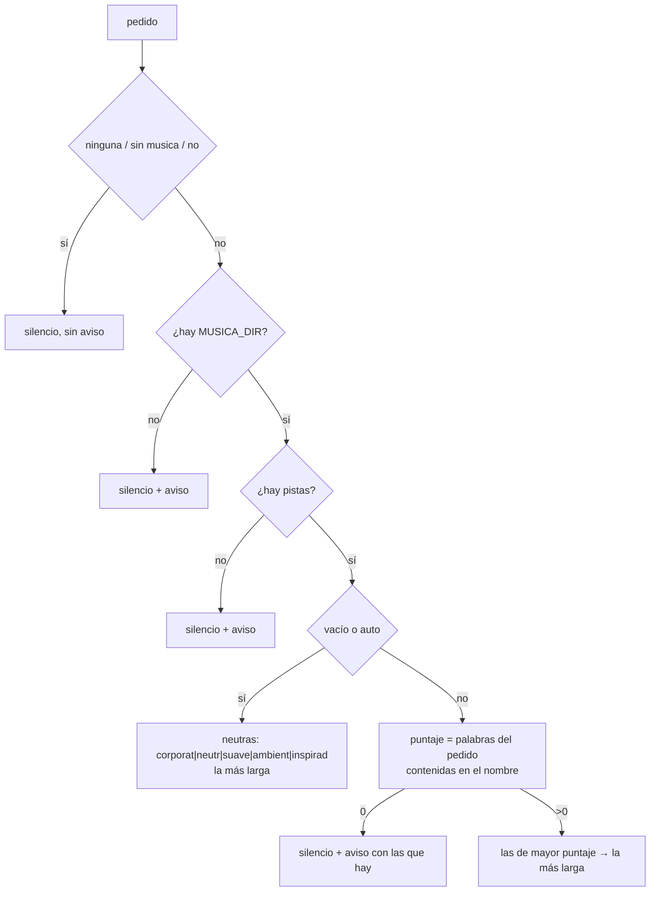
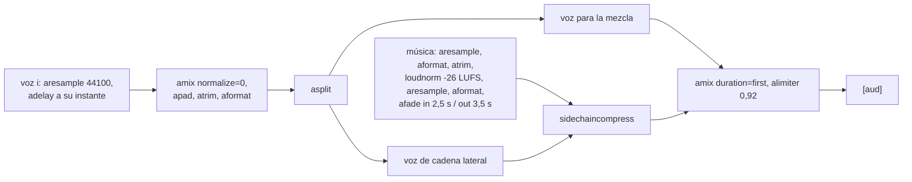

# Música y narración

Todo lo que se **oye** en un video: la voz que sintetiza cada línea del guion
(`narracion.ts`), la cama musical que elige la biblioteca (`musica.ts`) y la
mezcla de las dos (`sonido.ts`). Los tres motores —[[Motor de video ASS]],
[[Motor estudio de láminas HTML]] y [[Motor de clips grabados]]— usan exactamente
el mismo código para esto. La mezcla vive aparte **porque la comparten**: con dos
copias, la próxima corrección de la cama arreglaría un video y dejaría el otro
roto, que es lo que pasó con los íconos hasta que salieron de un solo catálogo.

Cómo suena la marca (pronunciación y una sola voz) está en
[[Voz y marca de la empresa]].

## La voz

`packages/tools/src/skills/narracion.ts` → `crearNarrador(opciones)`. Dos motores,
el mismo contrato (`Narrador`: `motor`, `voces`, `sintetizar(lineas)` → duraciones
en segundos).

### Kokoro, local y gratis

Se busca (`buscarKokoro`) en este orden: la ruta explícita, `ORQ_KOKORO_HOME`,
`~/.cache/orq-kokoro` y `~/.cache/inspia-kokoro`. Una instalación cuenta si tiene
los tres: `kokoro-v1.0.onnx`, `voices-v1.0.bin` y `venv/bin/python`.

- **Un solo proceso para todo el guion**: cargar el modelo cuesta segundos, y
  hacerlo por línea multiplicaba ese costo. Las líneas entran por stdin como JSON
  y sale un JSON con la duración de cada una, medida por cantidad de muestras.
- El script Python (`PYTHON_KOKORO`) usa `kokoro_onnx` y `soundfile`, busca
  `libespeak-ng` y sus datos en `/opt/homebrew` o `/usr/local`, e idioma
  `es-419`. Toma la **última** línea de stdout (antes puede haber avisos de ONNX).
- Cada línea queda en `linea-<i>.wav`.

### `say` de macOS, el respaldo

Sin Kokoro, `say -v <voz> -r <180 × velocidad> -o linea-<i>.aiff`, una línea por
vez, y la duración se mide con `ffprobe`.

> El respaldo no es un lujo: sin él, una máquina sin el modelo descargado no puede
> producir un video y la habilidad quedaría rota sin decir por qué.

### El reparto de voces

| Motor | Voces, en orden de reparto |
|---|---|
| Kokoro | `em_alex` (narrador), `ef_dora`, `em_santa` |
| `say` | `Paulina` (narrador), `Mónica`, `Eddy (Español (México))` |

`repartir`: el narrador (`""`) se queda con la primera; el personaje *i* (en orden
de aparición) recibe la voz `(i + 1) mod 3`, así ninguno de los dos primeros suena
igual que la voz en off. Con `unaSolaVoz`, todos reciben la del narrador.

> [!warning] El tercer personaje suena como el narrador
> Hay tres voces por motor: con tres personajes o más, el reparto da la vuelta y
> el tercero cae en la voz del narrador, el cuarto en la del primero. Se prefirió
> repetir voces antes que no producir el video. Para diálogos, dos personajes.

## La música la ponés vos

`packages/tools/src/skills/musica.ts` → `elegirMusica(home, pedido)`. Las pistas
viven en `MUSICA_DIR` (default `data/musica/`) y **no en el repo**: la música tiene
licencia, y un orquestador que baja un mp3 y lo pega en el video de una empresa la
mete en un problema que no sabe que tiene.

- **El clima se lee del nombre del archivo y de su carpeta**: agregar una pista es
  copiarla. `Corporate/Corporate Harmonics_1.49.mp3` responde a "corporate".
- **La biblioteca se recorre en profundidad** (`NIVELES = 3`): quien compra música
  deja el paquete tal cual, y con un `readdir` a secas esas pistas no existían; el
  video salía en silencio con el archivo ahí, a la vista de todos menos del
  programa. Se saltean los nombres que empiezan con punto.
- Formatos: `mp3`, `m4a`, `aac`, `wav`, `flac`, `ogg`, `opus`.
- **Del mismo tema en varios formatos entra uno**, con preferencia `mp3 > m4a >
  aac > ogg > opus > flac > wav`: si no, la lista se ve repetida y la elección
  puede terminar en un `.wav` de 19 MB para un video de dos minutos.
- **Entre pistas que empatan gana la más larga** (medida por peso del archivo, que
  dentro de un formato es proporcional a la duración): una cama que se repite
  cada cuarenta segundos se escucha como una cama que se repite. A igual peso,
  decide el nombre, para que sea reproducible.

El aviso sólo llega al agente si **pidió** música (`musica` en la herramienta):
sin pedido, que no haya biblioteca no es algo que el agente pueda ni deba
resolver. **Nada de esto puede hacer fallar un video**: sin cama, se filma en
silencio.

> [!note] El puntaje es por substring
> Cada palabra del pedido se busca **contenida** en el nombre normalizado:
> "Corporate Harmonics 1.49" suma 4 contra la toma larga y 2 contra las cortas. El
> seed del estudio pide la pista exacta para no depender del desempate.

## La mezcla: `construirSonido`

`packages/tools/src/skills/sonido.ts` → `construirSonido({inicios, total,
indiceMusica, primeraVoz?})` devuelve el texto del `filter_complex`, terminado en
`[aud]`. Es una **función pura**: se fija con tests sin sintetizar nada.

- Cada voz se **coloca en su instante** (`adelay` en milisegundos) y se suman: no
  hay concatenación, así que un error de milisegundos no arrastra al resto.
- `FORMATO = aformat=sample_fmts=fltp:sample_rates=44100:channel_layouts=stereo`:
  la música y el compresor de cadena lateral exigen entradas iguales, y Kokoro
  entrega mono.
- Sin voces, `anullsrc` estéreo: un video sin narración igual necesita pista.
- Sin música, la voz pasa directo al limitador (`alimiter=level_in=1:level_out=0.92`).
- La música entra con `-stream_loop -1` (una pista de dos minutos cubre un video de
  tres) y el `atrim` la termina.

| Constante | Valor | Por qué |
|---|---|---|
| `MUSICA.lufs` | −26 | una cama va 10-12 dB por debajo de la narración |
| `MUSICA.entrada` / `salida` | 2,5 s / 3,5 s | fundidos de la cama |
| `loudnorm` | `I=-26:TP=-3:LRA=11` | se normaliza la sonoridad, no el volumen |
| `DUCKING.threshold` | 0,06 | |
| `DUCKING.ratio` | 4 | comprime en vez de cortar |
| `DUCKING.attack` | 5 ms | agarra la primera sílaba |
| `DUCKING.release` | 300 ms | la cama vuelve **entre frase y frase** |

> [!danger] `loudnorm` devuelve 192 kHz sí o sí
> El `aresample` va **después**. Antes, la cama entraba a la mezcla al triple de
> velocidad de muestreo y sonaba a **cinta acelerada**.

### La cama se mide en sonoridad, no en volumen

Un `volume=0.22` fijo no significa nada: una pista comprada llega a **−14 LUFS** y
una sintetizada a **−24**, así que el mismo número deja una inaudible y la otra
encima de la voz. Se normaliza con `loudnorm` y recién ahí se la acuesta bajo la
narración: cualquier pista que dejes suena igual de presente.

### Le erramos dos veces al nivel, en direcciones opuestas

1. **−26 LUFS con ducking `ratio=10`**: dos decisiones que por separado parecían
   prudentes. A esa altura el compresor no aparta la música, la apaga (es una
   compuerta). Medido en el video real: en la cola, sin una palabra encima, la
   cama quedaba en **−40 dB**. Inaudible. Y con `release=400` y narración corrida,
   la música vivía hundida de punta a punta.
2. Corregido el ducking, **subirla a −20** la puso encima de la narración: los
   pasajes de música sola a −24 dB contra picos de voz a −20, apenas 4-5 dB. Una
   cama a 4-5 dB no acompaña, compite.

El número sale de una cuenta: con `ratio=4`, **−26** deja los pasajes
instrumentales cerca de −30 y la cama bajo la voz cerca de −34. Renderizando el
mismo guion con y sin música, bajo la voz la cama aporta entre +0,1 y +0,5 dB —o
sea nada— y en los huecos entre frases, +3 a +5 dB, que es donde tiene que oírse.
Bajar más no la hace más sutil, la hace desaparecer: a −30 el aporte se confunde
con el ruido de la mezcla.

> [!tip] Cómo verificar el nivel
> Renderizá **dos veces**, con y sin música, y restá. Medí el **hueco entre dos
> frases**, nunca el promedio del video ni la cola (trae el fundido y siempre da
> bajo). Medir sólo el video mezclado no distingue una cama alta de una voz alta.

## `npm run musica:cama`

`scripts/generar-cama.ts` sintetiza dos camas **con ffmpeg** —osciladores, sin
samples ni descargas—, así que son contenido propio y no hay nada que licenciar.
Van a `MUSICA_DIR`. No pretenden ser pistas producidas: acordes lentos, graves,
sin melodía, nada que compita con la voz.

| Archivo | Progresión | Acorde | Pulso | Pasa-bajos | Para qué |
|---|---|---|---|---|---|
| `corporativo-calmo.mp3` | Am – F – C – G (menor) | 8 s | no | 1100 Hz | institucional: suena a reflexión, sirve para "así trabajamos" |
| `inspirador-crecimiento.mp3` | C – G – Am – F (mayor) | 6 s | 1,7 Hz en la grave | 1700 Hz | campañas: para que alguien sienta ganas de poner plata hace falta modo mayor, más brillo y un pulso que da sensación de que algo avanza |

Cómo se arma cada nota: `sine` → `volume` → `tremolo` → fundido de entrada
(32 % del acorde, curva `qsin`) y de salida (desde el 65 %) → `adelay` a su
compás. Después: `amix`, `lowpass`, `aecho=0.7:0.62:340|520:0.28|0.2` (hace de
sala), `loudnorm=I=-24:TP=-3:LRA=9`, MP3 con `-q:a 3`. Registro grave (segunda y
tercera octava) porque ahí no pisa la voz.

- **El bucle es exacto**: cada acorde entra y sale desde el silencio y el ciclo
  dura un número entero de acordes (32 s y 24 s), así `-stream_loop -1` lo repite
  sin un clic en la costura.
- **El pulso va sólo en la nota grave** (`tremolo=f=1.7:d=0.95`); las de arriba
  quedan sostenidas con un trémolo lento. Pulsando el acorde entero suena a alarma
  de reloj.
- **Y más fuerte que las sostenidas** (nivel 0,5 contra `0,34 − 0,06 × voz`): si
  queda pareja, el pulso se pierde bajo el acorde y la cama vuelve a ser quieta.

## Casos borde

| Síntoma | Causa |
|---|---|
| el video salió en silencio y nadie avisó | no se pidió `musica` y la biblioteca está vacía o no existe |
| la cama suena a cinta acelerada | `aresample` antes de `loudnorm` |
| la cama no se oye / tapa la voz | tocaron `MUSICA.lufs` o `DUCKING` por separado: es la suma la que decide |
| la voz lee mal una sigla | falta en `pronunciacion` (ver [[Voz y marca de la empresa]]) |
| "No se pudo filmar …" con un error de `say` | la voz de macOS pedida no está instalada |
| todo falla con `dyld: Library not loaded` | ffmpeg/ffprobe rotos por una actualización de Homebrew (ver [[Motor de video ASS]]) |

La síntesis no tiene corte por tiempo propio: la corta detener la corrida.

## Qué fijan los tests

- `estudio.test.ts` → `construirSonido`: cada voz en su instante en milisegundos;
  sin voces igual hay pista; `aresample` **después** de `loudnorm`; la cama se
  aparta con `sidechaincompress` sobre `[cama][vozlado]`; sin música no hay
  compresor.
- `guion.test.ts` → música: sin biblioteca se filma igual y el aviso nombra
  `MUSICA_DIR`; `ninguna` apaga sin avisar; gana la pista que comparte más
  palabras y un pedido inexistente nombra las que hay.
- `guion.test.ts` → reparto: el narrador nunca suena igual que un personaje; dos
  personajes, dos voces; con más personajes que voces reparte en ciclo; con una
  sola voz, todos como el narrador.

## Fuentes

- `packages/tools/src/skills/narracion.ts` → `crearNarrador`, `buscarKokoro`, `VOCES`, `repartir`, `PYTHON_KOKORO`, `pronunciar`, `motorDisponible`
- `packages/tools/src/skills/musica.ts` → `elegirMusica`, `recorrer`, `NIVELES`, `EXTENSIONES`, `sinDuplicados`, `masLarga`
- `packages/tools/src/skills/sonido.ts` → `construirSonido`, `MUSICA`, `DUCKING`, `FORMATO`, `LIMITADOR`
- `scripts/generar-cama.ts` → `CAMAS`, `generar`
- `apps/server/src/env.ts` → `musicaDir`; `apps/server/src/runtime.ts` → `companyRuntime`

## Ver también

- [[Producción audiovisual]]
- [[Voz y marca de la empresa]]
- [[Variables de entorno]] — `MUSICA_DIR`, `ORQ_KOKORO_HOME`
- [[Dependencias del sistema]]
- [[Comandos]]
