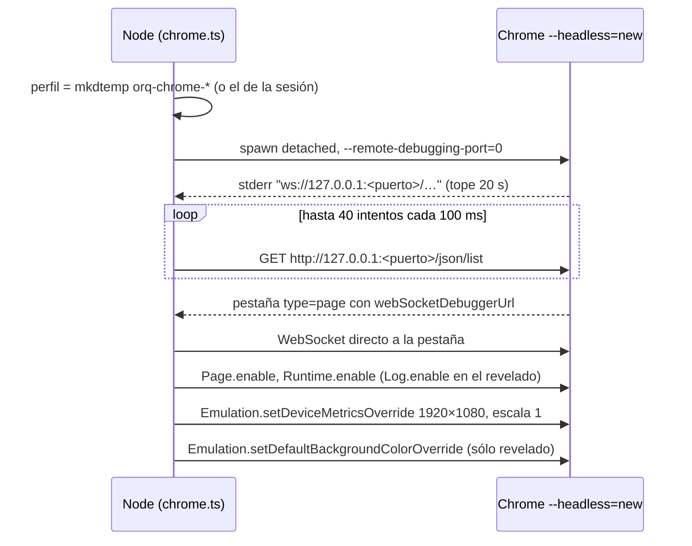
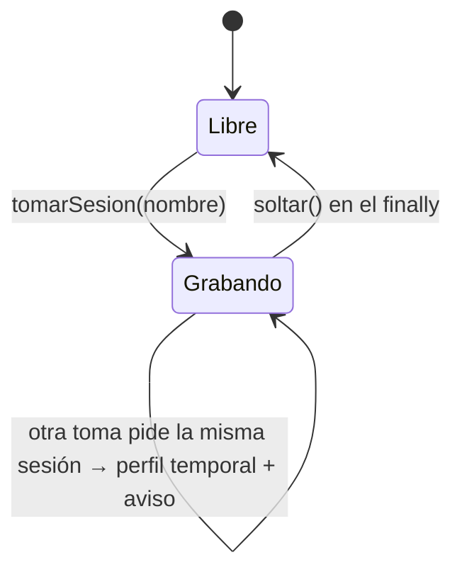

# Navegador Chrome por CDP

`packages/tools/src/skills/chrome.ts` le da al sistema un navegador **sin instalar
ninguno**: maneja el Chrome que ya está en la máquina por su protocolo de
depuración (CDP), con el `WebSocket` nativo de Node. Cero dependencias nuevas,
ningún binario de 150 MB en `node_modules`, y la misma regla que ffmpeg, Kokoro y
`say`: **usar lo que hay y degradar con un aviso claro cuando no está**.

El mismo archivo sirve para tres cosas:

| Uso | Función | Quién lo usa |
|---|---|---|
| **revelar** láminas HTML a PNG, cuadro por cuadro | `abrirRevelado` | `export_video_estudio`, `revisar_lamina` ([[Motor estudio de láminas HTML]]) |
| **grabar** una aplicación en vivo a JPEG con su instante | `abrirGrabacion().grabar` | `grabar_clip` ([[Motor de clips grabados]]) |
| **explorar** una pantalla sin filmarla | `abrirGrabacion().explorar` | `explorar_pantalla` |

Si no hay navegador, **ninguna de esas herramientas se registra** (junto con
`export_video_clips`): ofrecer una herramienta que siempre falla le hace gastar
turnos al agente. `export_video` filma el mismo guion sin navegador.

## Encontrar el binario

`buscarChrome(explicito?)` devuelve la primera ruta que existe, en este orden:

1. la ruta explícita que pase quien llama;
2. la variable `ORQ_CHROME`;
3. `CANDIDATOS`: Google Chrome, Chromium y Microsoft Edge en `/Applications`
   (macOS), y `google-chrome`, `google-chrome-stable`, `chromium`,
   `chromium-browser` en `/usr/bin` (Linux).

`createSkillTools` lo consulta **al registrar** las habilidades de una empresa: si
instalás Chrome con el servidor andando, las herramientas aparecen cuando se
vuelve a levantar el runtime de esa empresa.

## El arranque

- `--remote-debugging-port=0` deja que Chrome elija un puerto libre y lo
  **anuncia por stderr**: no hay forma de pedírselo antes (`esperarPuerto`).
- El cliente se conecta **directo al target de la pestaña** y no al del
  navegador: así los comandos van sin `sessionId` y no hace falta el baile de
  `Target.attach`.
- Si el arranque falla en cualquier paso, se limpia antes de propagar el error.

### Los flags

| Flag | Revelado | Grabación | Por qué |
|---|---|---|---|
| `--headless=new` | sí | sí | sin ventana |
| `--remote-debugging-port=0` | sí | sí | puerto libre, anunciado por stderr |
| `--user-data-dir=<perfil>` | temporal | temporal o de sesión | aislado del Chrome de la persona |
| `--no-first-run`, `--no-default-browser-check`, `--disable-extensions` | sí | sí | nada que interrumpa |
| `--disable-gpu`, `--hide-scrollbars`, `--force-color-profile=srgb` | sí | sí | cuadros iguales en cualquier máquina, sin barras |
| `--window-size=1920,1080` | sí | sí | el lienzo del video |
| `--disable-background-networking` | sí | no | el revelado no tiene nada que bajar |
| `--disable-lcd-text` | sí | no | el texto se compone sobre transparencia: con subpíxeles, los bordes salen con franjas de color |
| `--font-render-hinting=none` | sí | no | tipografía estable entre cuadros |
| `--allow-file-access-from-files` | sí | no | las láminas traen su hoja y sus fotos por ruta relativa |

## El cliente CDP mínimo

La clase `Cdp` numera cada comando, guarda una promesa pendiente por id y la
resuelve cuando llega la respuesta. Los eventos (`Page.loadEventFired`,
`Log.entryAdded`, `Page.screencastFrame`…) van a oyentes registrados con `al`.

- **Cada comando tiene corte**: 30 s (`CORTE.comando`). Un navegador que acepta y
  se queda callado no falla, no sigue y no se le puede pedir al agente que cambie
  de enfoque; es la misma lección que dejó el endpoint de imágenes de NVIDIA.
- Si el WebSocket se cierra con comandos en vuelo, **se rechazan todos juntos**
  ("El navegador cerró la conexión durante el render."): si no, quedaban promesas
  colgadas para siempre.

| Constante | Valor | Para qué |
|---|---|---|
| `CORTE.arranque` | 20.000 ms | que Chrome anuncie su puerto |
| `CORTE.comando` | 30.000 ms | cada comando CDP |
| `CORTE.carga` | 20.000 ms | esperar `Page.loadEventFired` al navegar |
| `LIENZO` | 1920×1080, 30 fps | el mismo que el del video |
| `ANIMACION_MAXIMA` | 8 s | más que esto no es una entrada |
| `TOPE_PANTALLA` | 4.000 caracteres | texto de pantalla que devuelve `explorar` |
| remate de la limpieza | 2.000 ms | `SIGKILL` si alguien ignoró el `SIGTERM` |

## Limpieza: el grupo entero

`--headless=new` es un **árbol de procesos**. El `SIGTERM` al lanzador solo dejaba
a los ayudantes vivos cuando un turno se abortaba a mitad de captura: se midieron
**seis huérfanos tras una tarde de corridas**, comiéndose la memoria que después
faltaba para cargar las páginas. Por eso el `spawn` va `detached` (grupo de
procesos propio) y `crearLimpieza` manda `SIGTERM` al grupo (`kill(-pid)`), con un
`SIGKILL` de remate a los 2 s. El perfil temporal se borra; el de una sesión, no.

## El revelado: el cuadro se calcula, no se graba

Grabar la pantalla mientras corre el reloj da un video que depende de lo rápida
que sea la máquina: en una lenta, la animación sale a tirones. Acá **se pausan
todas las animaciones y se les fija el tiempo cuadro por cuadro**, así el
resultado es idéntico en cualquier máquina y a cualquier velocidad de captura. Es
el mismo principio que el resto del render: el tiempo es un dato, no algo que se
mide con un cronómetro.

`abrirRevelado({ chrome?, fondo?, signal? })` abre **un solo navegador para todo
el video** (arrancar Chrome cuesta un par de segundos; hacerlo por lámina
multiplicaba ese costo) y devuelve `revelar(url, destino, prefijo)`:

1. Limpia los avisos de carga de la lámina anterior.
2. `Page.navigate` a la `file://` de la lámina y espera `Page.loadEventFired` (o
   20 s).
3. `document.fonts.ready`: sin esperar las fuentes, el primer cuadro sale con la
   tipografía de respaldo y el texto salta de familia a mitad de la entrada.
4. Evalúa `GUION_DE_SALA`, que:
   - pausa todas las animaciones de `document.getAnimations()`;
   - expone `window.__orqIr(segundos)`, que les fija `currentTime`;
   - mide el `endTime` más largo entre las animaciones **finitas**;
   - cuenta las **infinitas**;
   - mide `scrollWidth` y `scrollHeight` del documento.
5. Avisa si la lámina **se desborda** (más de 1920+2 o 1080+2 px: "lo que sobra no
   se ve") o si tiene **bucles infinitos** ("se filma sólo la entrada y después
   queda quieta").
6. `animacion = min(medida, 8 s)`; `cuadros = max(1, ⌈animacion × 30⌉)`.
7. Por cada cuadro `i`: `__orqIr(i / 30)` y `Page.captureScreenshot` en PNG
   (`optimizeForSpeed`, sin salir del viewport) → `<prefijo>-NNNN.png`. Con un
   solo cuadro se captura el estado final.
8. Suma como aviso los primeros **tres** errores de consola o excepciones (`En
   escNN: …`): un `.css` que no cargó es la falla más común y la más silenciosa.

Por defecto el fondo es **transparente** (`setDefaultBackgroundColorOverride` con
alfa 0): la lámina se compone encima del degradado que genera ffmpeg, que es lo
único que se mueve toda la escena. `revisar_lamina` pide `fondo` con el color de
la marca porque un PNG transparente abierto en un visor se compone sobre blanco y
el texto claro desaparece: una lámina perfecta se veía rota.

> [!note] Por qué no SMIL ni bucles infinitos
> `<animate>` de SVG no aparece en `getAnimations()`: no se pausa ni se adelanta,
> corre en tiempo real mientras se captura. Una animación infinita no tiene
> `endTime` finito: no suma a la duración, y si es la única, la lámina se congela
> en su primer cuadro.

## La grabación: una aplicación real con su instante

Sobre una aplicación real no se puede calcular el cuadro —su estado avanza con la
red—, así que `abrirGrabacion({ chrome?, signal?, perfil? })` filma lo que pasa
con **`Page.startScreencast`**, que entrega cada repintado con su instante. El
login vive en el perfil, así que el mismo navegador graba varias tomas seguidas
sin volver a entrar; con `perfil`, esa sesión sobrevive **entre llamadas** (ver
"Sesiones" abajo).

### El plan de un clip

`PlanDeClip`: `preparacion` (fuera de cámara), `acciones` (lo que se filma) y
`colchon` (segundos sosteniendo la pantalla final).

`grabar(plan, destino, prefijo)`:

1. Ejecuta la **preparación** sin filmar: login, navegación, esperas. Un fallo se
   informa como `En la preparación (paso N): …`.
2. Registra el oyente de `Page.screencastFrame` y **confirma cada cuadro** con
   `Page.screencastFrameAck` (si no, Chrome deja de mandar).
3. `Page.startScreencast` con `format: "jpeg"`, `quality: 85`, máximo 1920×1080,
   `everyNthFrame: 1`.
4. Ejecuta las **acciones** (fallo: `En cámara (paso N): …`), espera el colchón y
   detiene el screencast en un `finally`.
5. Sin cuadros, falla: "la página no repintó nada. Meté una acción visible".
6. Cada cuadro dura hasta el siguiente (mínimo 0,02 s); el último sostiene el resto
   del tiempo medido (mínimo 0,2 s). Se escriben `<prefijo>-NNNN.jpg`.

Quién convierte esos JPEG en un MP4 con sus duraciones reales (`armarClip`) está
en [[Motor de clips grabados]].

### Las acciones (una mini-DSL)

`AccionDeGrabacion` es deliberadamente chica: lo que no entra acá no se graba —una
grabación no es una suite de pruebas—. **Cada objeto hace una sola cosa**: si trae
varias claves, se ejecuta la primera según el orden de esta tabla.

| Clave | Qué hace | Esperas y topes |
|---|---|---|
| `ir` | `Page.navigate` a una URL **absoluta** | espera la carga (tope 20 s) y 900 ms más |
| `esperar_texto` | espera que `document.body.innerText` contenga el texto **y que siga ahí** | sondea cada 400 ms; al verlo espera 1,2 s y vuelve a mirar; tope 30 s |
| `clic` | clic en el centro de la **última** coincidencia visible de un texto | reintenta 8 s cada 400 ms; 350 ms antes y 700 ms después |
| `clic_selector` | clic en el centro del primer elemento del selector CSS | ídem |
| `escribir` | enfoca el campo (`selector`) e inserta `texto` con `Input.insertText` | 8 s para encontrarlo; 250 ms antes y 400 ms después |
| `subir_archivo` | `DOM.setFileInputFiles` sobre `selector` (default `input[type=file]`), funciona aunque esté oculto | 8 s; 1,5 s después |
| `tecla` | `"Tab"` o `"Enter"` (`rawKeyDown` + `keyUp`) | 500 ms después |
| `esperar` | pausa fija en milisegundos | tope 20 s |

Detalles que deciden si un clip sale:

- **`esperar_texto` es la regla anti-loader**: un esqueleto que se re-dibuja
  muestra el texto y lo borra; no sobrevive a la pausa de 1,2 s, y la grabación
  no arranca sobre un spinner.
- **El clic espera solo**: la mitad de los fallos medidos fueron "tocar antes de
  que exista" —la pantalla venía en camino y el clic instantáneo pagaba el
  intento entero—.
- **La búsqueda por texto** mira `button, a, [role=button], label, td, th, li,
  span, div, h1, h2, h3, p` visibles (`offsetParent !== null`), cuyo texto contiene
  la aguja y que miden menos de 220 px de alto (un contenedor gigante no es un
  botón), hace `scrollIntoView` al centro y toma la **última** coincidencia, que
  suele ser la más adentro.
- **`insertText`** dispara los eventos de entrada como un pegado: React y compañía
  lo toman como tipeo real.
- El mouse hace `mouseMoved`, `mousePressed` y `mouseReleased` en el centro.

## La exploración: reconocer antes de filmar

`explorar(acciones, buscar = [])` recorre la aplicación **sin filmar**, en el mismo
navegador que después graba: el mismo perfil (o sea el mismo login), el mismo
lienzo de 1920×1080 y el mismo motor de acciones. Explorar en otro navegador —el
MCP de Playwright, con otra sesión y otro tamaño— es lo que hacía que un texto
verificado no apareciera después en la toma, y cada `browser_find` devolvía media
página al contexto.

Devuelve una `Exploracion`:

| Campo | Qué es |
|---|---|
| `url`, `titulo` | dónde quedó el navegador |
| `encontrados` | por cada texto pedido: `visible` y `estable` (sigue estando 1,2 s después) |
| `clickeables` | textos de `button, a, [role=button], label, th, li` visibles, sin repetir, de menos de 60 caracteres, hasta 60 |
| `pantalla` | `document.body.innerText` con los saltos triples colapsados, recortado a **4.000 caracteres** |

El tope existe porque en un turno delegado cada resultado se reenvía en todas las
vueltas que le siguen: lo que entra gordo se paga muchas veces (ver
[[Turnos delegados a un CLI]]). La herramienta `explorar_pantalla` y su informe
están en [[Motor de clips grabados]].

> [!danger] La barra que se come el template literal
> El código que se evalúa en la página viaja **adentro de un template literal**
> de TypeScript. Una barra sin escapar se la come el template: la regex de
> espacios llegaba como `/s+/g` y le comía las eses a cada palabra
> ("Orquestador" volvía "Orque tador"). Costó una hora. Por eso se escribe
> `\\s+`, **no se usan backticks** adentro (cierran el template) y los
> comentarios sobre ese código van afuera.

## Sesiones: el login no se repite

`tomarSesion(nombre)` (en `packages/tools/src/skills/index.ts`) convierte el
argumento `sesion` de `grabar_clip` y `explorar_pantalla` en un perfil de Chrome
persistente.

- **Saneo**: minúsculas, todo lo que no sea `a-z`, `0-9` o `-` pasa a `-`, sin
  guiones en los bordes, hasta 40 caracteres. `"Inspector / Electrovatio!!"` es
  `inspector-electrovatio`. El perfil es una ruta, no lo que escribió un modelo.
- **Ruta**: `<tmpdir>/orq-sesiones/<nombre>`. `abrirGrabacion` la crea si no
  existe y **no la borra** al cerrar: adentro está la sesión.
- **Candado**: dos Chrome sobre el mismo `--user-data-dir` no conviven (el
  segundo no arranca o corrompe el perfil). Un `Set` en memoria marca qué
  sesiones están grabando; la toma que llega segunda **graba igual con un perfil
  temporal y lo dice** ("ya está grabando otra toma… Grabá de a una por sesión").
  Fallar sería peor: el clip es lo que importa, la sesión reusada era el atajo.
- Sin nombre, no hay sesión: perfil temporal, como siempre.

Medido en una corrida real: **once tomas de la misma escena repitieron los mismos
seis pasos de login, casi seis minutos de reloj**, porque cada grabación abría un
perfil nuevo. Es la clase de costo que un modelo más capaz no baja: no es una
decisión, es estado que se tiraba.

> [!warning] Una sesión vencida falla en el primer paso
> Si el login del perfil expiró, la toma que saltea el login falla en el primer
> `esperar_texto`. Es la señal de volver a poner el login **una vez** en la
> preparación. El perfil vive en el temporal del sistema: un reinicio de la
> máquina o una limpieza de `/tmp` también lo pierde.

## Seguridad

> [!danger] `ir` acepta cualquier URL, `file://` incluido
> Sólo `salida://ruta` pasa por el saneo del servidor (`storage.resolve`). Una URL
> escrita directamente —`file:///…`, `http://localhost:3001/api/…`, una dirección
> de la red interna— se navega tal cual. Como `explorar_pantalla` devuelve el
> texto de la pantalla (hasta 4.000 caracteres), un agente con esa herramienta
> puede, según el código actual, **leer archivos locales o la API del propio
> orquestador** (incluidos datos de otras empresas), y `grabar_clip` +
> `extraer_cuadros` permiten lo mismo en imagen. Nada de eso respeta la regla de
> "sólo lectura sobre el directorio de la empresa" que rige para el CLI. El
> límite hoy es a qué rol se le otorgan estas habilidades. Ver [[Seguridad]].

> [!warning] Las láminas corren JavaScript con acceso a archivos
> El revelado no bloquea JavaScript ni la red, y lleva
> `--allow-file-access-from-files`. La prohibición de scripts está en la guía del
> kit, no en el código.

- Los perfiles de sesión guardan **cookies de login** en
  `<tmpdir>/orq-sesiones/`, legibles por el usuario del sistema.
- El navegador corre con el usuario del servidor y fuera de cualquier sandbox del
  orquestador (el sandbox de comandos es otra cosa; ver [[Comandos y sandbox]]).

## Casos borde

| Síntoma | Causa |
|---|---|
| "No se encontró Google Chrome en esta máquina…" | ninguna ruta de `CANDIDATOS` existe y `ORQ_CHROME` no está |
| "Chrome no anunció su puerto de depuración a tiempo." | tardó más de 20 s en arrancar (máquina cargada, perfil bloqueado) |
| "Chrome levantó, pero no expuso ninguna pestaña…" | 40 intentos de `/json/list` sin una pestaña `page` |
| "El navegador no contestó a Page.captureScreenshot." | un comando pasó los 30 s |
| `tecla: "Escape"` apretó Enter | cualquier valor que no sea `"Tab"` se manda como Enter |
| una acción con `ir` y `esperar` sólo navegó | una clave por objeto; se ejecuta la primera según el orden de la tabla |
| `escribir` dejó el texto viejo más el nuevo | `insertText` no borra lo que había en el campo |
| un botón flotante no se encuentra con `clic` | los elementos con `position: fixed` tienen `offsetParent` nulo y la búsqueda por texto los descarta: usá `clic_selector` |
| `esperar_texto` no ve un texto que está en pantalla | está dentro de un `iframe`, o no es visible para `innerText` |
| la toma quedó en la pantalla de acceso | otra toma tenía la sesión: ésta usó un perfil temporal (el resultado lo avisa) |
| "La grabación no capturó ningún cuadro" | las acciones no cambiaron nada en pantalla |

## Qué fijan los tests

Ningún test abre un navegador de verdad (fallaría en la máquina de quien no tiene
Chrome). Lo que se fija:

- `packages/tools/src/skills/clips.test.ts` → `tomarSesion`: sin nombre no hay
  perfil; el nombre se sanea; la segunda toma concurrente graba sin perfil y
  avisa, y al soltar la primera la sesión vuelve a estar disponible.
- `packages/tools/src/skills/clips.test.ts` → `informeDeExploracion`: avisa fuerte
  del texto que aparece y se borra, separa anclas de ausentes, trae la URL y pasa
  el aviso de sesión ocupada.
- `packages/tools/src/skills/skills.test.ts`: el motor de estudio se registra sólo
  si `buscarChrome()` encuentra un navegador.

## Cómo agregar una acción

1. Sumá la clave a `AccionDeGrabacion` y su rama en `ejecutar` (dentro de
   `abrirGrabacion`), con espera implícita y corte por tiempo.
2. Declarala en `esquemaDeAcciones` (`packages/tools/src/skills/index.ts`): el
   esquema cierra con `additionalProperties: false`.
3. Si evalúa código en la página: nada de backticks y las barras escapadas.
4. Si recibe una ruta, resolvé `salida://` en la herramienta, no en `chrome.ts`:
   quién puede leer qué lo decide el servidor.

## Fuentes

- `packages/tools/src/skills/chrome.ts` → `buscarChrome`, `CANDIDATOS`, `Cdp`, `CORTE`, `LIENZO`, `ANIMACION_MAXIMA`, `TOPE_PANTALLA`, `crearLimpieza`, `abrirRevelado`, `GUION_DE_SALA`, `abrirGrabacion`, `expresionDeBusqueda`, `esperarPuerto`, `buscarPestaña`, `AccionDeGrabacion`, `PlanDeClip`, `Exploracion`
- `packages/tools/src/skills/index.ts` → `tomarSesion`, `sesionesEnUso`, `esquemaDeAcciones`, `createSkillTools`
- `packages/tools/src/skills/clips.test.ts`, `skills.test.ts`

## Ver también

- [[Motor estudio de láminas HTML]]
- [[Motor de clips grabados]]
- [[Producción audiovisual]]
- [[Dependencias del sistema]]
- [[Variables de entorno]]
- [[Seguridad]]
