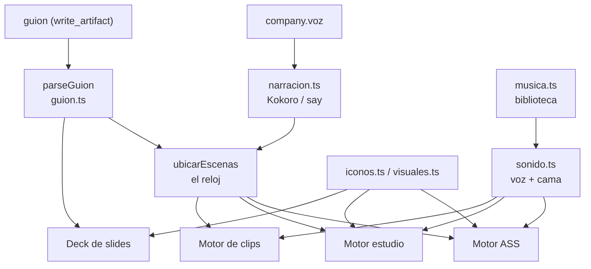

# Producción audiovisual

> **El video es el mismo markdown leído como línea de tiempo.**

Una empresa produce video a partir de un **guion**: un entregable markdown que se
escribe con `write_artifact` como cualquier otro (ver
[[Guion como línea de tiempo]]). Ese guion se filma con uno de **tres motores**, y
el mismo guion sale también como [[Deck de slides]]. Todo vive en
`packages/tools/src/skills/` y se registra como habilidad (origen `skill`): un rol
puede filmar sólo si se le asigna la herramienta.

## Los tres motores

| | [[Motor de video ASS]] | [[Motor estudio de láminas HTML]] | [[Motor de clips grabados]] |
|---|---|---|---|
| Herramienta | `export_video` | `export_video_estudio` (+ `revisar_lamina`) | `export_video_clips` (+ `grabar_clip`, `explorar_pantalla`) |
| Archivo | `video.ts` | `estudio.ts`, `tema.ts` | `clips.ts` |
| Cómo dibuja | ffmpeg + libass, una sola pasada | cada escena es una lámina HTML revelada por Chrome | grabaciones reales de una aplicación, a pantalla completa |
| Qué muestra | título, viñetas, diálogo, íconos, visuales, fotos, clips en un panel | lo que el agente programe; sin lámina, la plantilla del kit | el clip de cada escena; sin clip, una placa lisa |
| Pasaje entre escenas | corte con fundidos de los elementos | encadenado de 0,45 s | corte |
| Necesita | ffmpeg con libass | + Chrome instalado | + Chrome instalado |
| Se registra | siempre | sólo con Chrome | sólo con Chrome |
| Numeración de archivos | — | `01-…` = portada | `00-…` = portada, `01-…` = primera `##` |

**Cuándo usar cada uno**:

- **ASS** para un guion que es texto, viñetas, diálogo y diagramas. No depende de
  nada más que ffmpeg y es el respaldo cuando no hay navegador.
- **Estudio** cuando la pieza necesita diseño —un diagrama que se dibuja solo,
  tarjetas, una cifra grande— y hay un rol que sabe programar HTML (idealmente
  con proveedor `claude-code`, para que pueda mirar sus láminas).
- **Clips** cuando lo que hay que mostrar es software funcionando: un tutorial o
  una pieza comercial filmada sobre la aplicación real.

Los dos últimos no reemplazan al primero: se agregaron por lo que el anterior no
podía dibujar.

## Lo que comparten y no puede divergir

- **El reloj** (`ubicarEscenas`): la única fuente de verdad del tiempo son las
  duraciones **medidas** del audio. Una escena empieza en el mismo instante en los
  tres motores, y `estimar_duracion` usa la misma cuenta.
- **La voz** (`narracion.ts`) y **la mezcla con la cama** (`sonido.ts`). Ver
  [[Música y narración]].
- **El catálogo de íconos** (`iconos.ts`): un segundo set dibujado aparte se
  desincroniza a la primera corrección. Ver [[Íconos y visuales vectoriales]].
- **Cómo suena la marca** (`company.voz`). Ver [[Voz y marca de la empresa]].

Lo único distinto entre los motores es **cómo se dibuja el cuadro**.

## Las herramientas de la carpeta

| Herramienta | Para qué | Nota |
|---|---|---|
| `export_video` | filmar con el motor ASS | [[Motor de video ASS]] |
| `export_video_estudio` | filmar con láminas HTML | [[Motor estudio de láminas HTML]] |
| `revisar_lamina` | revelar una lámina y ver qué salió mal | [[Motor estudio de láminas HTML]] |
| `explorar_pantalla` | reconocer una pantalla sin filmarla | [[Motor de clips grabados]] |
| `grabar_clip` | filmar una toma real | [[Motor de clips grabados]] |
| `export_video_clips` | empalmar los clips con la narración | [[Motor de clips grabados]] |
| `estimar_duracion` | cuánto va a durar, sin filmar | [[Guion como línea de tiempo]] |
| `generar_imagen` | una imagen suelta (sólo con key de imágenes) | [[Imágenes y medios]] |
| `inspeccionar_medio` | **medir** lo producido: duración, pistas, peso | [[Imágenes y medios]] |
| `extraer_cuadros` | **mirar** un video: PNG en `revision/` | [[Imágenes y medios]] |
| `export_slides` | el mismo guion como deck | [[Deck de slides]] |

Todas las exportaciones comparten: la **clave** del entregable y no su contenido
(ver [[ADR-005 Las habilidades trabajan sobre entregables ya escritos]]), la
guardia de cifras (`revisarCifras`: un guion con plata o porcentajes no se filma
sin `verificar_cifras`), la carpeta `folder` que se crea sola, y **un archivo por
entregable y formato** (`<clave>.mp4`) que se pisa al re-exportar.

## Principios que atraviesan la carpeta

- **Nada de esto puede hacer fallar un video por un detalle.** Sin biblioteca de
  música se filma en silencio; una imagen que no se pudo mostrar, una lámina que
  no se encontró o un clip faltante vuelven **como aviso en el resultado de la
  herramienta** —lo único que el agente puede leer para corregir el guion— y el
  video sale igual.
- **Usar lo que hay y degradar con aviso.** ffmpeg, Kokoro, `say`, Chrome: no se
  instala nada; lo que falta no se registra o se reemplaza por su respaldo.
- **Una habilidad que no se puede cumplir no se registra.** Sin Chrome no hay
  estudio ni clips; sin key de imágenes no hay `generar_imagen`.
- **Medir no es mirar.** `inspeccionar_medio` audita lo que se hizo, no lo que se
  contó; `extraer_cuadros` deja que un rol lo vea de verdad. Un rol con proveedor
  `claude-code` trabaja con el directorio de salida montado en sólo lectura y
  abre esos PNG con su `Read`.
- **Todo corte de red lleva tiempo máximo** (Chrome, imágenes): un proceso que
  acepta y se calla cuelga la corrida entera.

## Dónde queda cada cosa

En `data/proyectos/<Nombre>/salida/` (ver [[Directorios en disco]]):

| Ruta | Qué |
|---|---|
| `<folder>/<clave>.mp4` | el video |
| `<folder>/imagenes/` | imágenes generadas (caché por prompt) |
| `marca/logo.png` | el logo, lo deja una persona |
| `escenas/NN-….html`, `escenas/previsualizacion/` | láminas y sus revisiones |
| `estudio/tema.css`, `estudio/GUIA.md` | el kit (se reescribe en cada render) |
| `clips/NN-….mp4` | tomas grabadas |
| `revision/` | cuadros extraídos para mirar |

La música vive aparte, en `MUSICA_DIR` (`data/musica/`). El video se mira en la
[[Pantalla Salida]].

## Casos de uso

- [[CU-02 Video institucional]] — el estudio de Codytion: guion, láminas y video.
- [[CU-09 Tutorial filmado sobre una app real]] — INSPIA filmada en staging.

## Fuentes

- `packages/tools/src/skills/index.ts` → `createSkillTools` y los `crear*` de cada herramienta
- `packages/tools/src/skills/guion.ts`, `video.ts`, `estudio.ts`, `tema.ts`, `clips.ts`, `chrome.ts`, `sonido.ts`, `musica.ts`, `narracion.ts`, `medios.ts`, `imagenes.ts`
- `apps/server/src/runtime.ts` → `companyRuntime` (registra las habilidades por empresa con `musicaHome`)

## Ver también

- [[Habilidades de producción]]
- [[Guion como línea de tiempo]]
- [[Navegador Chrome por CDP]]
- [[ADR-006 Video en una sola pasada de ffmpeg]]
- [[Dependencias del sistema]]
