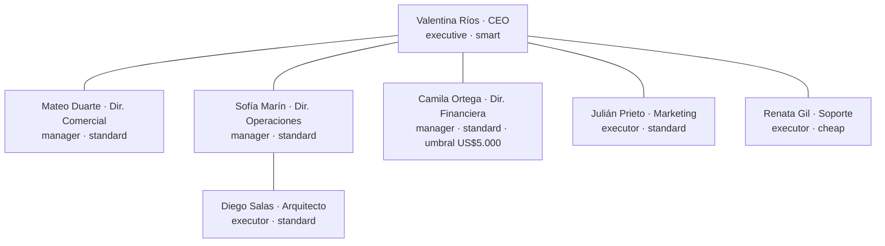
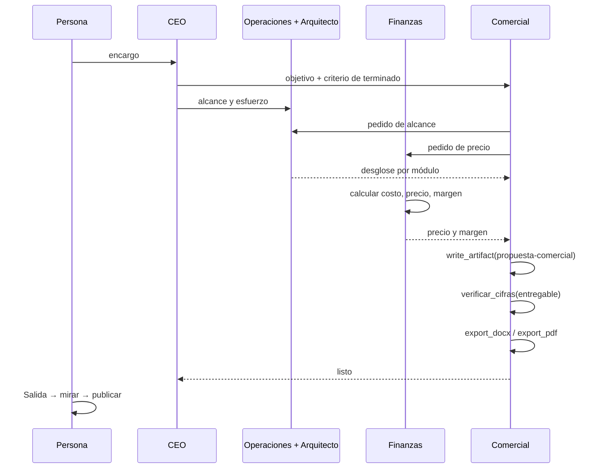

# CU-01 Propuesta comercial

**Qué se quiere lograr:** que la empresa arme una propuesta comercial completa
—alcance técnico, estimación de esfuerzo, precio y margen— a partir de un
encargo de una frase, y la entregue como un Word o un PDF que se le puede mandar
a un cliente.

Es el recorrido que muestra la organización trabajando en red (no un árbol de
delegación) y el circuito de un documento con plata: escribir, verificar las
cifras, exportar, mirar y publicar.

## Configuración

`npm run db:seed` siembra **Codytion S.A.** (`apps/server/src/seed.ts`):
consultora de software de 40 personas en Bogotá, proyectos de US$30.000 a
US$250.000, margen objetivo 35%. Ver [[Empresas de ejemplo]].

| Rol | Herramientas asignadas (`toolIds`) |
|---|---|
| CEO | `web_search`, `fetch_url` |
| Director Comercial | `web_search`, `fetch_url`, `export_docx`, `export_pdf`, `list_output` |
| Arquitecto, Marketing | `web_search`, `fetch_url` |
| Operaciones, Finanzas, Soporte | ninguna propia |

Todos tienen además **las de coordinación**, que se otorgan siempre: entre ellas
`write_artifact`, `edit_artifact`, `read_artifact`, `calcular`,
`verificar_cifras`, `request_approval` y `escalate`. Las habilidades, en cambio,
dependen de `toolIds`: **sólo el Director Comercial puede exportar**, y nadie
tiene `export_slides`, `write_output_file` ni `delete_files`. Ver
[[Habilidades de producción]].

Todos los modelos van por `openrouter` con el tier resuelto al arrancar. La
empresa tiene **`budgetUsd: 1`**: la corrida se corta al gastar un dólar (ver
[[Costos y presupuesto]]). Hay dos servidores MCP (`archivos` y `memoria`) para
que el Hub tenga algo que mostrar, pero no se le asignan a ningún rol.

Tres políticas, todas **sin `gate`** (`gate: null`): son texto que va al prompt
de los agentes alcanzados, no un freno en código.

| Política | Alcance | Qué dice |
|---|---|---|
| Margen mínimo | Toda la empresa | Ninguna propuesta sale con margen bruto menor al 35% sin aprobación explícita de la CEO. |
| Estimaciones fundamentadas | Operaciones y Arquitecto | Esfuerzo desglosado por módulo y perfil, con supuestos explícitos. |
| Una sola propuesta | Toda la empresa | La propuesta final es un único entregable con la clave `propuesta-comercial`; cada revisión es una versión nueva. |

El freno económico real está en el rol: Camila tiene
`spendApprovalThresholdUsd: 5000`, que el prompt traduce en "cualquier
compromiso por encima de US$5000 requiere aprobación previa: usá
request_approval" (`packages/engine/src/prompt.ts`). Y su propio prompt dice que
un descuento que baje el margen del objetivo requiere aprobación de la CEO.

## El recorrido

### 1. El encargo

En la pestaña **Proceso** del proyecto (`/p/<id>/proceso`, ver
[[Pantalla Proceso en vivo]]):

> "Retail Andina pide una plataforma de gestión de inventario multi-sucursal.
> Armá la propuesta."

Modo `manual` para avanzar ciclo a ciclo, o `continuous` para dejarla correr.

### 2. La CEO descompone

El nodo de Valentina pulsa (`agent.thinking`) y el panel del agente muestra qué
modelo le tocó (`model.selected`) y sus "Herramientas a mano"
(`tool.selection`). Su prompt le dice que **decide y desbloquea, no ejecuta**:
descompone el encargo y lo delega con un objetivo y un criterio de "terminado".
Se ven mensajes viajando por las aristas (`agent.message`) y tareas nuevas en el
tablero (`task.changed`).

### 3. El trabajo lateral

Operaciones le pide el desglose técnico al arquitecto; Comercial le pide a
Operaciones el alcance y a Finanzas el precio; Marketing acerca diferenciales.
**Nadie ve el contexto del otro**: cada uno sabe sólo lo que le escribieron.

El ciclo es una **cadena**: lo que un agente entrega lo toma en el mismo ciclo
quien todavía no trabajó, y quien ya tuvo su turno espera al siguiente. Primero
corre quien tiene un pedido sin contestar. Ver
[[Scheduler y ciclo de una corrida]].

### 4. El margen

Camila calcula costo, precio y margen con `calcular` (una cuenta de verdad, no
de cabeza). Si el precio que pide Comercial rompe el 35%, lo dice y propone
alternativas; un descuento por debajo del objetivo lo pide con
`request_approval`, que va a quien ella reporta —la CEO— y deja **esa rama**
detenida en `awaiting_approval` hasta que alguien resuelva. La aprobación se
resuelve desde la pantalla Proceso. Ver [[Aprobaciones y solicitudes]].

### 5. El entregable

Comercial escribe la propuesta con `write_artifact` en la clave
`propuesta-comercial`: `# Título`, `## Secciones` con nombre propio, tablas para
el desglose y el precio. Si el título habla del proceso ("Ciclo 2") o el cuerpo
es un muro de más de 400 caracteres sin estructura, la herramienta lo rechaza; y
una clave variante (`propuesta-comercial-v2`) también. Cada revisión es una
versión nueva de la misma clave. Ver [[Entregables]].

### 6. Verificar las cifras

La propuesta tiene precios y porcentajes, así que **no sale sin verificar**. Un
`export_pdf` a esta altura contesta: "tiene cifras de plata o porcentajes y
nadie las verificó, así que no sale. Corré verificar_cifras…".

Alguien —Camila, que hizo las cuentas, o el propio Mateo— corre
`verificar_cifras` con `entregable: "propuesta-comercial"` y una fila por cada
cifra (concepto, cuenta, valor que afirma el documento). La verificación queda
registrada contra **esa versión**: si después se corrige el documento, hay que
volver a verificar. Si alguna cifra no cierra (tolerancia 0,5%), la exportación
se niega y dice cuántas están mal.

### 7. Exportar

Comercial llama `export_docx` (o `export_pdf`) con `artifact_key:
"propuesta-comercial"` y, si quiere orden, `folder: "comercial/propuestas"`. El
archivo queda en
`data/proyectos/Codytion S.A/salida/comercial/propuestas/propuesta-comercial.docx`
(el punto final del nombre se cae: la carpeta legible no puede terminar en
punto). Re-exportar pisa ese mismo archivo. Ver [[Documentos Word y PDF]].

### 8. Mirar y publicar

En **Salida** (`/p/<id>/salida`) el PDF se dibuja en pantalla y del Word se
muestra el texto, tablas incluidas. Cuando está bien, **✓ publicar** lo mueve a
`publicado/comercial/propuestas/…`: es la aprobación, y un agente no la puede
hacer. Ver [[Pantalla Salida]] y [[ADR-008 Publicar lo decide una persona]].

## Qué mirar

| Dónde | Qué demuestra |
|---|---|
| Proceso → organigrama | Las aristas laterales Comercial↔Operaciones↔Finanzas: una red, no un árbol |
| Proceso → panel del agente | "Herramientas a mano" (`tool.selection`) y el modelo elegido por turno |
| Proceso → Actividad y cronología | Quién ejecutó qué; retroceder en el timeline muestra exactamente lo que se vio en vivo |
| Tablero | Las tareas de cada rol y su estado |
| Costos | El gasto por rol: la CEO en `smart` cuesta más por turno que Soporte en `cheap` |
| Salida | Portada con empresa, "Preparado por Mateo Duarte — Director Comercial", versión y fecha; tablas con bordes; "Página X de Y" |

## Qué puede salir mal

| Síntoma | Causa probable |
|---|---|
| `export_pdf` falla con "nadie las verificó" | Falta `verificar_cifras` con `entregable`, o se verificó una versión anterior. Es el comportamiento buscado. |
| El export falla aunque se verificó en la corrida anterior | La verificación vive en la corrida: hay que repetirla. |
| Otro rol dice que no puede exportar | Sólo el Director Comercial tiene `export_docx`/`export_pdf`; asignalas desde [[Pantalla Empresa y organigrama]]. |
| La corrida se corta enseguida con el presupuesto agotado | `budgetUsd: 1` de la empresa de ejemplo. |
| La corrida muere en el tercer ciclo sin producir nada | 402 del proveedor: cuenta sin crédito. `npm run check:llm`. |
| La CEO se pone a investigar en vez de delegar | Tier `cheap` en un rol que coordina. Ver [[Capa LLM y tiers]]. |
| Tres entregables fragmentados en vez de uno | Modelo barato fragmentando; la guardia de claves-variante lo frena, pero revisá el tier. |
| El mismo agente toma turno ciclo tras ciclo sin ejecutar nada | Livelock por tarea abierta; el scheduler deja de convocarlo a los dos turnos vacíos. |
| "Completed" en pocos ciclos sin entregable | Un pedido perdido, no un éxito: mirá la actividad. |
| En el Word, la segunda lista numerada sigue contando | Limitación conocida del render: ver [[Documentos Word y PDF]]. |

Ver [[Diagnóstico de problemas]].

## Variantes

- **Sembrar la memoria antes de correr** (pestaña Memoria): una tarifa por hora,
  un criterio de estimación. La corrida siguiente los cita en vez de
  re-derivarlos. Ver [[Memoria de la empresa]].
- **Agregar un revisor** que verifique las cifras antes de exportar: ver
  [[CU-04 Control de calidad entre agentes]].
- **Mandarla por correo**: con `send_email` el adjunto viaja como enlace al
  servidor local. Ver [[Correo y avisos]].
- **Con una plantilla**: "Consultora de documentos" arma un equipo con revisor y
  `verificar_cifras` asignado. Ver [[CU-11 Proyecto nuevo desde una plantilla]].

## Fuentes

- `apps/server/src/seed.ts` → `company`, `roles`, `policies`, `entregar`
- `packages/tools/src/skills/index.ts` → `crearSkill`, `revisarCifras`
- `packages/tools/src/calculo.ts` → `verificarCifras`, `calcular`
- `packages/tools/src/coordination.ts` → `request_approval`, `write_artifact`, `revisarCalidad`
- `packages/engine/src/prompt.ts` (umbral de gasto); `packages/shared/src/nombres.ts` → `segmentoLegible`

## Ver también

- [[Habilidades de producción]] · [[Documentos Word y PDF]] · [[Entregables]]
- [[Empresas de ejemplo]] · [[Organización de agentes]] · [[Casos de uso]]
