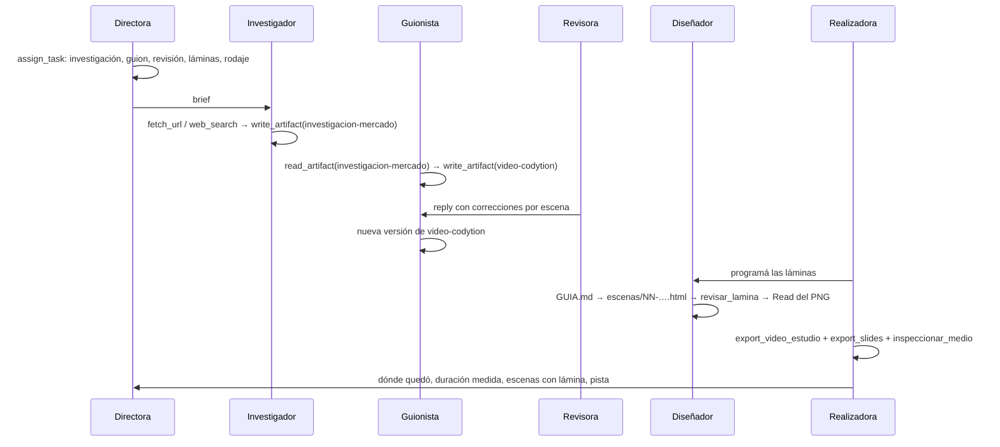

# CU-02 Video institucional

**Qué se quiere lograr:** que la empresa investigue, escriba un guion, lo revise,
programe las láminas y lo filme como un MP4 narrado con música —más un deck del
mismo contenido—, sin que una persona toque nada entre el encargo y la revisión
final.

## Configuración

```bash
npm run db:estudio                          # el estudio audiovisual de Codytion
ORQ_SEED_TIER=standard npm run db:estudio   # con modelos pagos
npm run musica:cama                         # si la biblioteca de música está vacía
```

`scripts/seed-estudio-codytion.ts` crea la empresa **Codytion** con tres áreas
(Marca, Contenido, Producción) y seis roles:

| Rol | Autoridad | Habilidades asignadas |
|---|---|---|
| **Valentina Ríos** — Directora de marca | `executive` | `read_artifact`, `list_artifacts`, `check_activity`, `list_output` |
| **Camilo Restrepo** — Investigador de mercado | `executor` | `web_search`, `fetch_url`, `write_artifact`, `read_artifact`, `list_artifacts` |
| **Julián Prieto** — Guionista | `manager` | `write_artifact`, `read_artifact`, `list_artifacts`, `fetch_url` |
| **Mariana Losada** — Revisora de guion | `manager` | `read_artifact`, `list_artifacts` |
| **Tomás Iriarte** — Diseñador de escenas | `executor` | `write_output_file`, `read_output_file`, `revisar_lamina`, `list_output`, `read_artifact`, `list_artifacts` |
| **Nadia Bercovich** — Realizadora | `executor` | `export_video_estudio`, `export_video`, `export_slides`, `inspeccionar_medio`, `read_artifact`, `list_artifacts`, `list_output` |

Las de coordinación se otorgan siempre. Cinco políticas: **El trabajo se ve en el
tablero**, **Hablamos como en Colombia**, **Un solo guion** (clave
`video-codytion`), **Sólo lo que podemos sostener** y **Se revisa antes de
filmar** (sin revisión no hay filmación, y sin láminas revisadas con
`revisar_lamina` tampoco).

- **Tier `free` por defecto**: una cuenta de OpenRouter sin crédito rechaza todo
  con 402 y la corrida muere en el tercer ciclo. Con `ORQ_SEED_TIER=standard`
  corre con modelos pagos, que escriben bastante mejor.
- **Proveedor**: si `ORQ_CLAUDE_CODE` está prendido, los roles nacen con
  `claude-code` (slug `claude-code/sonnet`), que es lo que le da al diseñador la
  capacidad de **mirar** sus láminas; si no, OpenRouter. `ORQ_SEED_PROVEEDOR` y
  `ORQ_SEED_MODELO` lo pisan.
- **Idioma**: lo que sale es **castellano de Colombia**, de usted. Las
  instrucciones de los roles están en inglés y cada una abre declarando el idioma
  de salida. Ver [[Voz y marca de la empresa]].

### La voz y la marca

```ts
voz: {
  unaSolaVoz: false,   // la pieza tiene un diálogo: dos voces
  pronunciacion: { Codytion: "códishon", IA: "i a", IoT: "i o té", API: "a pe i", … }
}
marca: { acento: "#40a0f8", panel: "#232f4d", rotulos: false }
```

`unaSolaVoz` va en `false` porque el guion incluye un diálogo cliente–Codytion;
para una pieza puramente institucional conviene `true`.

### Lo que hay que dejar preparado

| Qué | Dónde | Si falta |
|---|---|---|
| Chrome | instalado, o su ruta en `ORQ_CHROME` | no se registra `export_video_estudio`: la realizadora cae a `export_video` y **tiene que decirlo** |
| ffmpeg con libass | en el `PATH` del servidor | no se filma (ver [[Motor de video ASS]]) |
| logo | `data/proyectos/Codytion/salida/marca/logo.png` | la pieza sale sin logo |
| música | `data/musica/` (la realizadora pide "Corporate Harmonics 1.49") | se filma en silencio |
| Kokoro | `ORQ_KOKORO_HOME` o `~/.cache/orq-kokoro` | cae a `say` de macOS |
| key de imágenes | `GOOGLE_API_KEY` / `OPENAI_API_KEY` / `NVIDIA_API_KEY` | `generar_imagen` no se registra y `` vuelve como aviso |

## El recorrido



### 1. El encargo y la investigación

> "Armá un video institucional de un minuto y medio sobre lo que hacemos."

La directora abre **una tarea por etapa** con `assign_task`: un mensaje solo es
invisible en el tablero. El investigador escribe `investigacion-mercado`: la
audiencia, tres o cuatro dolores dichos como los diría un cliente, qué capacidad
responde a cada uno, y cada cifra **con su fuente** (o "sin fuente").

### 2. El guion

El guionista escribe `video-codytion`: 7 a 9 escenas, 75 a 95 segundos, abre con
el problema del cliente (no con "somos una empresa de software"), una escena de
diálogo sin renglones en blanco, títulos de escena que no nombran el proceso
(`## El miedo real`, nunca `## Escena 2 — …`), viñetas de menos de siete palabras
y un cierre con un paso siguiente. `estimar_duracion` dice si entra en el tiempo
sin filmar.

```markdown
# Codytion — Software a medida

## :alerta: El sistema que ya no da más

Su operación creció y el sistema no. Cada mes, alguien pasa datos a mano.

- Planillas que nadie actualiza
- Reportes que llegan tarde

## Una conversación
**Cliente:** ¿Y si cambia el alcance a mitad de camino?
**Codytion:** Lo revisamos cada semana y lo repriorizamos juntos.
```

### 3. La revisión

La revisora chequea cinco cosas —que hable como en Colombia, que sea verdad, que
se pueda decir, que se pueda ver, que suene a Codytion— y responde con `reply`,
**nunca** con `write_artifact`: si guarda su revisión sobre el guion, lo que se
filma son sus notas leídas en voz alta.

### 4. Las láminas

El diseñador lee `estudio/GUIA.md` (si no existe, una llamada a `revisar_lamina`
lo escribe), programa `escenas/01-portada.html`, `02-…` con el kit, y prueba cada
una con `revisar_lamina`. Después **la mira**: abre
`escenas/previsualizacion/NN-….png` con su `Read` y corrige lo que ve, no sólo lo
que el revisor de láminas reporta. Ver [[Motor estudio de láminas HTML]].

### 5. Filmar y verificar

```text
export_video_estudio(artifact_key: "video-codytion", folder: "marketing",
                     musica: "Corporate Harmonics 1.49")
export_slides(artifact_key: "video-codytion", folder: "marketing")
inspeccionar_medio(path: "marketing/video-codytion.mp4")
```

Pide la pista exacta y no un clima: es la toma larga de la biblioteca, y las
cortas se repiten cada cuarenta segundos. Verifica con `inspeccionar_medio`
—duración real, que tenga audio— antes de informar: repetir el número que imprimió
la exportación no es verificar.

### 6. Revisar

En la [[Pantalla Salida]], el MP4 se reproduce y el deck se dibuja en un iframe
con `sandbox` vacío.

## Qué mirar

- **El diálogo suena a dos personas**, no a una leyendo los nombres de la otra.
- **"Codytion" se pronuncia "códishon"** y se escribe bien en pantalla.
- **La cama se aparta cuando alguien habla** y vuelve entre frases.
- **Ninguna escena muestra la plantilla** si se pidieron láminas (el resultado dice
  "N de M escenas con lámina programada").
- **La duración medida** entra en lo pedido.

## Qué puede salir mal

| Síntoma | Causa |
|---|---|
| las intervenciones las dice de corrido el primero | el diálogo se escribió con renglones en blanco y sin `**Nombre:**` bien cerrado |
| el video dice ":objetivo:" o lee notas | marca de ícono desconocida sola en su renglón, o texto suelto entre `#` y `##` |
| la portada dice "(v4)" | encabezado de documento (`# Guion … (v4)`) con texto debajo antes del `#` real: con cuerpo, el segundo `#` ya no lo pisa y abre escena |
| todas las escenas con la plantilla | se filmó antes de que existieran las láminas, o no están en `escenas/` con número |
| una lámina corrida una escena | se numeró la primera `##` como `01` (acá la portada es `01`) |
| "no sale: tiene cifras sin verificar" | el guion tiene un porcentaje o un monto: `verificar_cifras` antes |
| el video salió en inglés | una instrucción en inglés sin la línea de idioma de salida |
| la cama suena a cinta acelerada | el `aresample` antes de `loudnorm` (ver [[Música y narración]]) |

## Variante: el motor de placas

`npm run db:inspia` (`scripts/seed-inspia-lanzamiento.ts`, **INSPIA —
Lanzamiento**) es un equipo de cuatro roles por `claude-sesion` que filma un spot
de 60 s con `export_video`, el [[Motor de video ASS]]: sin Chrome ni diseñador,
con una sola voz y la pronunciación de INSPIA.

## Variante: programarlo

Convertí el encargo en una [[Misiones programadas|misión]] que avise por correo.
Ver [[CU-03 Misión semanal con aprobación humana]].

## Ver también

- [[Producción audiovisual]]
- [[Guion como línea de tiempo]]
- [[Motor estudio de láminas HTML]]
- [[CU-09 Tutorial filmado sobre una app real]]
- [[Empresas de ejemplo]]
