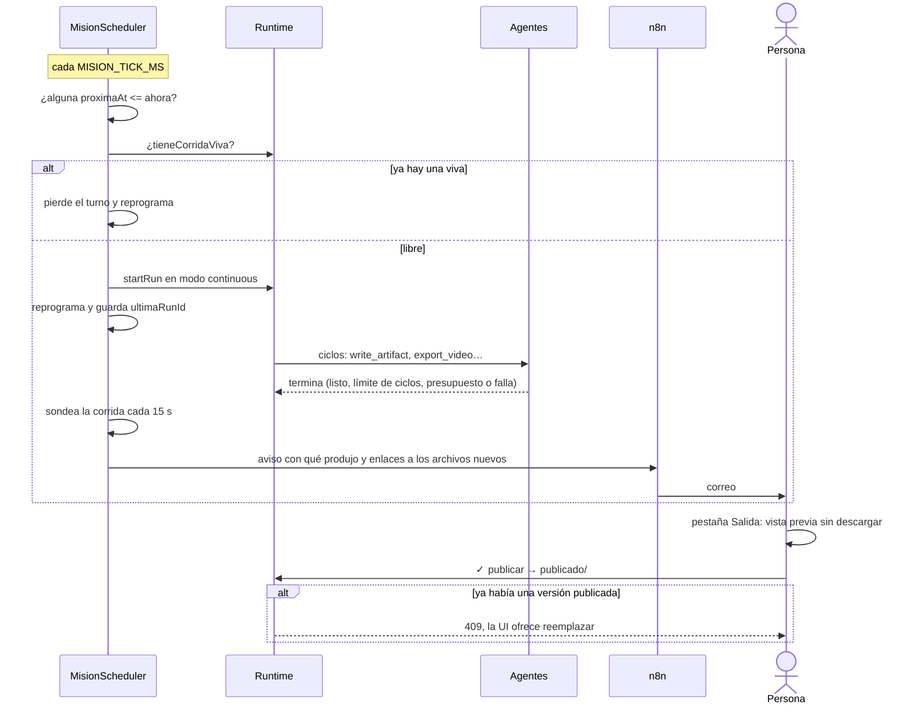

# CU-03 Misión semanal con aprobación humana

**Qué se quiere lograr:** que un encargo se dispare solo todas las semanas,
produzca, avise por correo y **espere** a que una persona lo apruebe antes de
publicar. Cómo funciona por dentro: [[Misiones programadas]].

## Antes de empezar

- Una empresa con roles y, mejor, un rol `executive` sin jefe: es a quien entra
  el encargo.
- Al menos un proveedor LLM configurado (`npm run check:llm` antes de una
  corrida larga: una cuenta sin crédito contesta 402 a todo).
- Un flujo de n8n para el correo.

## 1. El correo

Variables en el `.env` de la raíz (ver [[Variables de entorno]]):

| Variable | Para qué |
|---|---|
| `N8N_EMAIL_WEBHOOK_URL` | el webhook del flujo que manda el mail. Sin ella la misión corre igual pero no avisa, y el servidor lo advierte al arrancar |
| `APP_URL` | la base de los enlaces del aviso (`APP_URL/api/companies/<id>/exports/<ruta>`) |
| `MISION_TICK_MS` | cada cuánto se revisan las misiones (30.000 por defecto) |

Del lado de n8n: un nodo *Webhook* → *Send Email*, mapeando `to`, `subject`,
`text` y `attachments` (`[{ filename, url }]`). El cuerpo trae además
`source: "orquestador-agentico"`. Ver [[Correo y avisos]].

## 2. La misión

No hay editor de misiones en la UI: se crea por la API.

```jsonc
// mision.json
{
  "name": "Institucional semanal",
  "objective": "Armá una pieza institucional corta sobre un caso de esta semana…",
  "programacion": { "type": "semanal", "dias": [1], "hora": 7, "minuto": 0 },
  "enabled": true,
  "budgetUsd": 2,
  "maxTicks": 12,
  "avisarA": ["revision@ejemplo.com"]
}
```

```bash
curl -X POST http://localhost:3001/api/companies/<companyId>/misiones \
  -H 'content-type: application/json' -d @mision.json
```

La respuesta (201) ya trae `proximaAt`: el lunes siguiente a las 7:00, hora
local del servidor. Para "cada 6 horas" va
`{ "type": "intervalo", "cada": 6, "unidad": "horas" }`; para lo que no entra en
esas dos, `{ "type": "cron", "expresion": "30 8 * * 1-5" }`.

## 3. Probarla sin esperar

```bash
curl -X POST http://localhost:3001/api/companies/<companyId>/misiones/<id>/run
```

Devuelve la corrida, o **409** si la empresa ya tiene una en curso. Ojo: el
disparo manual recalcula `proximaAt` desde ahora (en una misión por intervalo
eso corre su reloj).

## El recorrido



El producto de ejemplo es un video: ver [[CU-02 Video institucional]].

## Qué mirar

- **`proximaAt` sobrevive a un reinicio.** Apagá y prendé: sigue programada para
  el mismo momento. Si el servidor estuvo apagado a esa hora, dispara una vez al
  volver.
- **`ultimaRunId`** lleva a la traza de la última corrida en la pestaña Proceso.
- **Una expresión cron inválida deja `proximaAt` en `null`**: no dispara a
  cualquier hora.
- **El aviso lleva enlaces, no bytes**, y sólo de lo que la corrida dejó (archivos
  modificados desde que arrancó).
- **`publicado/`** dentro de la salida: ahí queda lo aprobado. Publicar conserva
  la subcarpeta (`campania/pieza.pdf` → `publicado/campania/pieza.pdf`) y no
  pisa una versión anterior sin confirmación.

## Qué puede salir mal

| Síntoma | Causa |
|---|---|
| no dispara nunca | `enabled: false`, `proximaAt` en `null` por expresión inválida, o la empresa no tiene roles (queda en el log del servidor) |
| se saltea turnos | ya había una corrida de esa empresa `running` o esperando una aprobación |
| corrió con otra corrida pausada | una pausada no cuenta como viva |
| el aviso llega pero el enlace no abre | los enlaces usan `APP_URL` y la API escucha en `127.0.0.1`: se abren desde la máquina del orquestador |
| no llega ningún correo | falta `N8N_EMAIL_WEBHOOK_URL`, `avisarA` vacío, o el flujo de n8n no está activo |
| el aviso dice "se quedó sin presupuesto" | subí `budgetUsd` de la misión (el default es 1) |
| el aviso dice "La corrida no produjo ningún archivo ni entregable" | revisá la traza: suele ser un pedido perdido, no un éxito |
| "el primer lunes del mes" dispara casi todos los días | cron con día del mes y de la semana es un OR; esa regla no se puede expresar |

## Enlaces

- [[Misiones programadas]]
- [[Correo y avisos]]
- [[Salida de la empresa]] · [[Pantalla Salida]]
- [[ADR-008 Publicar lo decide una persona]]
- [[CU-02 Video institucional]]

## Fuentes

- `apps/server/src/misiones.ts` → `MisionScheduler`
- `packages/shared/src/programacion.ts` → `proximaCorrida`
- `apps/server/src/routes.ts` → rutas `/misiones`, `exports-publicar`
- `apps/server/src/exports.ts` → `publicar`
- `packages/tools/src/correo.ts` → contrato del webhook
