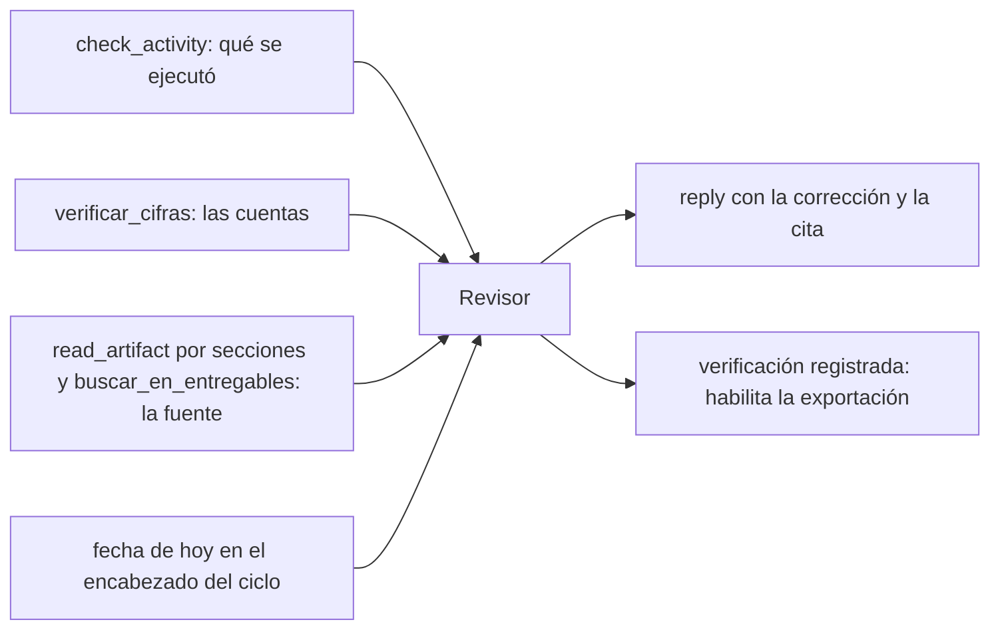
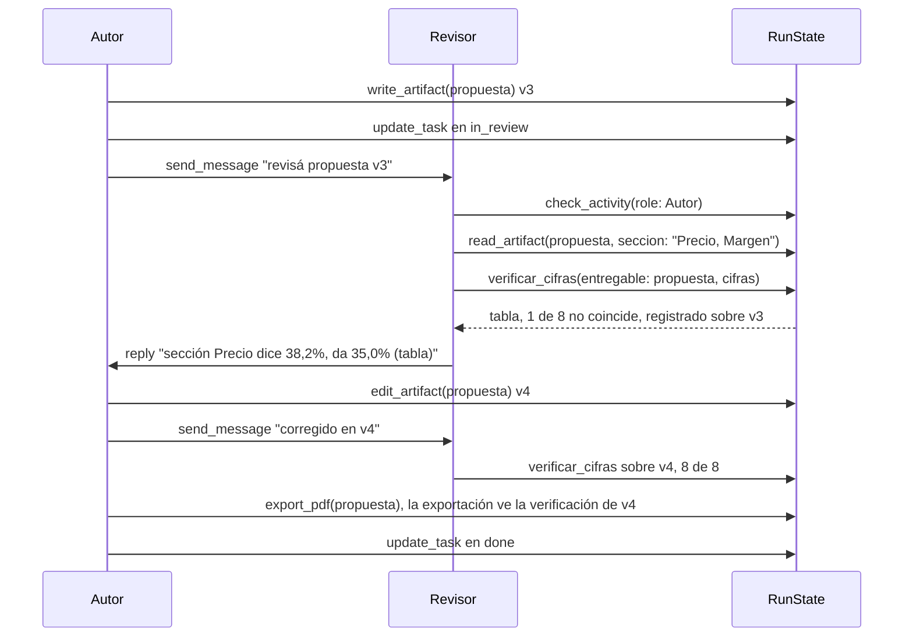

# CU-04 Control de calidad entre agentes

**Qué se quiere lograr:** que un rol revise el trabajo de los demás contra la
realidad —lo que se ejecutó, las fuentes, las cuentas— y devuelva correcciones
**accionables**, con la cita, antes de que algo salga de la empresa.

## Por qué hace falta

El error más difícil de ver desde afuera es el que **el agente informa mal**:
ejecuta algo con éxito y después dice que no pudo, o dice que produjo algo que
nunca escribió. Un revisor que sólo lee lo que le contaron no lo detecta.

Y hay un segundo problema, más caro: **un revisor mal equipado inventa
hallazgos**, y sus falsos positivos viajan aguas abajo con la misma autoridad
que los reales. Medido dos veces:

- Un auditor **sin la fecha de hoy** marcó como typo una fecha correcta; el
  corrector le hizo caso y corrompió el dato. El mismo auditor recalculó bien
  dos márgenes en su informe y no vio que el resumen de la propuesta pegaba el
  38,2% al precio donde iba 35,0%.
- Un revisor en tier `free` aprobó un guion "sin correcciones" y citó como
  prueba cuatro frases inventadas. Un revisor barato no es un revisor con menos
  criterio: es un sello de aprobación.

Por eso casi todo lo que sigue es **mecánico** (herramientas que verifican) y
no confianza en el criterio del modelo.

## Configuración

### El rol revisor

La plantilla "consultora" trae uno listo (`packages/shared/src/plantillas.ts`,
ver [[Plantillas de equipo]]):

| Campo | Valor | Por qué |
|---|---|---|
| `authority` | `manager` | Decide dentro de su área. Para devolver correcciones no hace falta más: `send_message` y `reply` no miran autoridad |
| Escalado | `standard`..`smart` | **Nunca `free` ni `cheap`**: es el único lugar donde el modelo barato no ahorra, borra el control |
| Herramientas | `buscar_en_entregables`, `verificar_cifras` (de coordinación, las tiene igual) y `fetch_url` para ir a la fuente | — |
| Instrucciones | `verificar_cifras` para cada número, `check_activity` para contrastar lo informado, la fecha del encabezado del ciclo, reportar sólo lo que se puede respaldar, aprobar explícitamente | — |

`check_activity`, `read_artifact`, `list_artifacts` y `estado_del_proceso` son
de coordinación: todo rol las tiene sin asignarlas.

### Lo que necesita para verificar de verdad

La fecha la inyecta el servidor (`TurnDeps.fechaHoy`, formateada `es-AR`): los
agentes no tienen reloj.

## El recorrido

1. **La tarea pasa por `in_review`.** Es una etapa visible del tablero: sin
   ella un entregable saltaba de "en curso" a "hecha" y nadie veía si alguien lo
   había verificado. La mueve **el autor**: `update_task` sólo mueve tareas
   propias, también para el revisor. Como `in_review` no convoca a nadie
   ([[Supervisión y continuidad]]), el pedido de revisión va **por mensaje**.
2. **El revisor lee la actividad, no el relato.** `check_activity(role,
   only_failures)` muestra cada llamada con su resultado real, grabado por el
   loop. Si el autor dijo "no pude exportar" y la actividad dice `ok`, ahí está.
3. **Contrasta contra la fuente sin traerse todo.** `read_artifact` con varias
   secciones separadas por coma, o `buscar_en_entregables` para un dato puntual.
4. **Verifica todas las cifras en una llamada**, pasando `entregable` desde la
   primera vez (si la repite en el mismo turno agregando la clave, el memo
   devuelve un puntero y no registra: ver [[Coordinación entre agentes]]).
5. **Devuelve la corrección con `reply`**, no con `write_artifact`: un título
   como "Correcciones de revisión" u "Observaciones sobre…" se rechaza, porque
   guardar el dictamen sobre la clave del original lo pisaba —así se filmó una
   lista de correcciones leída en voz alta—. Ver [[Entregables]].
6. **El autor corrige con `edit_artifact`** y la versión nueva **invalida** la
   verificación anterior: la exportación a Word o PDF de un documento con cifras
   exige la verificación de la versión actual y cero cifras malas.
7. Si el revisor aprendió algo reutilizable, `record_lesson` con evidencia: leer
   cuenta como actividad (ver [[Memoria de la empresa]]).

## Qué mirar

| Dónde | Qué demuestra |
|---|---|
| [[Pantalla Tablero]] | La tarea pasó por `in_review` antes de `done` |
| Proceso en vivo | `check_activity` y `verificar_cifras` en la traza: el revisor auditó de verdad |
| Mensajes | La corrección cita la sección, el valor dicho y el valor correcto |
| `estado_del_proceso` | Nadie quedó "sin ejecutar nada", no hay fallos repetidos |
| `npm run auditar -- --run=<id>` | Después de la corrida: ninguna entrega declarada sin respaldo, ningún export sin verificación ([[Auditoría de corridas]]) |

## Qué puede salir mal

| Síntoma | Causa |
|---|---|
| El revisor "encuentra" errores que no existen | Le falta la fuente o la fecha, o está en un tier barato |
| Aprueba "sin correcciones" citando frases que nadie le dio | Tier `free`: un sello, no un control |
| Devuelve "revisar el documento" | El prompt no le pidió la cita |
| El corrector aplica una corrección equivocada | Falso positivo propagándose: el eslabón débil es el revisor |
| La exportación rechaza aunque "se verificó" | Se verificó sin `entregable`, sobre otra versión, o quedó alguna cifra mala |
| El revisor nunca corre | Nadie le escribió: una tarea en `in_review` no lo convoca |
| `write_artifact` rechaza su informe | El título habla de revisión, hallazgos u observaciones; va por `reply` |
| Revisor y autor se escriben en círculo | La guardia de `send_message` frena la insistencia, y cada rol corre una vez por ciclo |

> [!tip] Medir antes de creer
> No des por bueno un informe de auditoría sin contrastarlo al menos una vez
> contra la verdad establecida a mano. En la prueba de escalado de 1 a 4 roles,
> el revisor fue el único salto de calidad real, pero sólo con las herramientas
> de arriba.

## Ver también

- [[Coordinación entre agentes]]
- [[Entregables]]
- [[Supervisión y continuidad]]
- [[Auditoría de corridas]]
- [[Documentos Word y PDF]]
- [[CU-01 Propuesta comercial]]
