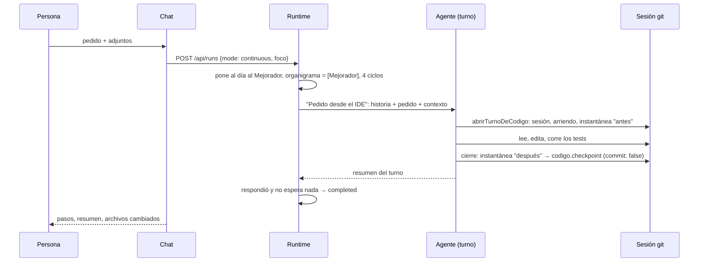

# CU-06 Pedido de código desde el chat

**Qué se quiere lograr:** pedirle a un agente un cambio puntual sobre el código
de un proyecto —"el botón de exportar tiene que quedar deshabilitado mientras
sube"—, verlo trabajar, revisar exactamente qué cambió y quedarse con lo que
sirva, sin que el agente toque la carpeta de la persona ni publique nada por su
cuenta.

## Antes de empezar

- El proyecto tiene un **repo cargado** en la pestaña Código (ver
  [[Configuración de repos y servicios]]), con sus comandos de tests y
  verificación **permitidos**: sin eso el agente no puede comprobar su cambio.
- Hay un **proveedor LLM** configurado; con `claude-code`, el agente usa Opus
  por la suscripción.
- Si el cambio es visual, conviene tener el frontend **levantado** en la vista
  Servicios: se recarga solo con cada edición.

## El recorrido

### 1. Abrir el chat y elegir el agente

⌘L (fuera del editor) o el ícono ✨. Si la empresa no tiene un **Mejorador de
código**, el botón del compositor lo crea en un clic
(`POST /api/companies/:id/mejorador`). El selector ofrece también a cualquier
rol con `editar_codigo` o `manejar_app`.

### 2. Dar contexto

- `@` para adjuntar archivos, o "+ *archivo abierto*".
- Seleccionar las líneas en el editor y ⌘L.
- En la vista previa del frontend, **Seleccionar** y tocar el botón: va con su
  componente y los archivos candidatos.
- Si algo falla, **Al chat** desde el inspector: va con el stack o la respuesta
  del backend.

Todo se arma en el mensaje con un presupuesto de 30.000 caracteres
(`armarContexto`). Ver [[Chat de IA]] y [[Selector de elementos e inspector]].

### 3. Enviar

Enter. El chat crea una **corrida enfocada**:

Mientras trabaja, el editor queda en **sólo lectura** (el agente tiene el
arriendo), la barra de estado se pone violeta y el archivo abierto se actualiza
solo.

### 4. Mirarlo trabajar

El pedido muestra los pasos en vivo ("Leyó", "Editó", "Corrió `npm test` → exit
0"). Si el agente necesita algo, aparece al final del pedido: **Instalar** una
dependencia, **Correr una vez** un comando, o **Aprobar y ejecutar** un SQL que
se ve entero. Contestar reanuda la corrida sola.

### 5. Revisar

Terminado, "N archivo(s) cambiado(s) · sin commitear". Cada archivo abre el diff
**de ese pedido** (entre sus dos instantáneas), no todo lo acumulado en la
sesión. El resumen del agente dice qué cambió, qué corrió y qué conviene mirar;
sus rutas son enlaces.

### 6. Decidir

- **Mantener**: queda como está, sin commitear.
- **Deshacer**: aplica el diff del pedido al revés sobre el árbol. Si después
  tocaste las mismas líneas, no aplica nada y lo dice.
- **Seguir la conversación**: "ahora hacelo con un spinner". El pedido nuevo
  lleva la historia de la conversación; "Nueva conversación" arranca limpia.

### 7. Commitear y publicar

Desde el [[Panel de control de código]]: preparar, escribir o generar (✨) el
mensaje, commit con tu identidad, y **Publicar** en tu rama (opcionalmente,
subir). El agente nunca commitea ni publica.

## Qué mirar

| Dónde | Qué demuestra |
|---|---|
| Pasos del pedido | que corrió los tests y con qué `exit`, no sólo que dice que funciona |
| Diff del pedido | el cambio exacto, contra lo que había antes del turno |
| Vista previa del servicio | el efecto real, recargado con la edición |
| Aviso de archivos sensibles | si tocó `package.json`, un `.sh` o el CI |

## Qué puede salir mal

| Síntoma | Causa |
|---|---|
| "failed — La corrida terminó sin producir nada" | el agente contestó sin usar ninguna herramienta: no cuenta como respuesta |
| queda "esperando tu respuesta ↓" sin nada que contestar en el chat | hay una solicitud pendiente de **otra** corrida de la empresa: la corrida enfocada la adopta, pero el chat sólo muestra las suyas. Está en Solicitudes |
| "Se alcanzó el límite de 4 ciclos" | el pedido era más grande de lo que parecía: partilo o dale más contexto |
| guardar da 409 "está editando este repo" | el agente tiene el arriendo: tu cambio sigue en el editor, guardá cuando termine |
| Deshacer falla | editaste después las mismas líneas: deshacé a mano desde el diff |
| el agente no puede correr los tests | el comando no está permitido: agregalo en Repositorio → Comandos |

## Tests relacionados

- `apps/server/src/ide.test.ts` → "el agente del chat", "deshacer un pedido", "el
  turno de un agente sin commits automáticos".
- `apps/server/src/conversacion.test.ts`.
- `packages/engine/src/scheduler.test.ts` → los tres casos de corridas con `foco`.

## Ver también

- [[Chat de IA]] · [[El IDE]] · [[Panel de control de código]]
- [[Instantáneas y checkpoints]] · [[Arriendo de escritura y resumen de código]]
- [[Scheduler y ciclo de una corrida]] · [[CU-07 Barrido de QA en el teléfono]]
