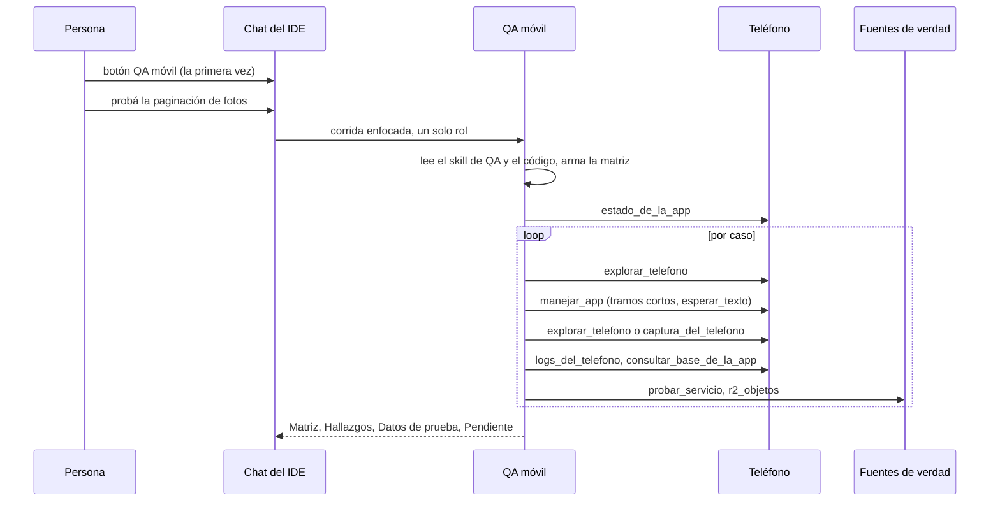

# CU-07 Barrido de QA en el teléfono

**Qué se quiere lograr:** pedirle desde el chat del IDE a un agente que pruebe una
funcionalidad de la app móvil —"la paginación de fotos", "crear una no conformidad
offline"— **en el teléfono de verdad**, como un usuario, y que devuelva qué anda y qué
no, con evidencia: lo que mostró la pantalla **y** lo que confirman la base, el
servidor y el bucket.

Las piezas están en [[QA móvil]], [[Depuración de la app móvil]] y
[[Almacenamiento R2]].

## Lo que hay que dejar preparado

| Qué | Dónde | Si falta |
|---|---|---|
| Un repo con un servicio de tipo `movil` y su sesión abierta | pestaña Código ([[Repositorios y sesiones]]) | las herramientas contestan que no hay app móvil o sesión |
| `adb` en la máquina | platform-tools / Android Studio | las herramientas del teléfono **no se registran** |
| El servicio móvil **levantado** (su Metro) | vista del servicio → Levantar | la app no baja el JavaScript; no hay consola de JS |
| El backend levantado, si la app lo usa | mismo lugar | la app no tiene API; `probar_servicio` no llega |
| El teléfono **vinculado** por QR | modo Teléfono en vivo → Dispositivos | "No hay ningún teléfono conectado" ([[Vinculación del teléfono]]) |
| La **build de desarrollo** instalada y la app **abierta desde el IDE** | panel Dispositivos | sin debuggable no hay archivos ni base; sin abrir, no hay túneles ([[Build de desarrollo y túneles]]) |
| El entorno de la app **en staging** | los `.env` del servicio | `manejar_app` se niega |
| **Marcadores de producción** en el servicio móvil (la ref del proyecto de producción, su dominio) | configuración del servicio | la negativa sólo se apoya en `*_ENV=production` |
| Credenciales `R2_*` en el `.env` del backend | los `.env` del servicio | `r2_objetos` dice cuáles faltan |
| El skill de QA del repo (`.agents/skills/…/SKILL.md`) | en el repo | el agente arma la matriz sólo desde el código |
| Teléfono desbloqueado, con la app al frente | la persona | "La pantalla del teléfono está apagada" / "no está en primer plano" |

## El recorrido



### 1. Crear el QA (una vez)

En el chat, el botón **QA móvil** aparece si el repo tiene app móvil y la empresa no
tiene todavía ese rol. Crea un agente `executor` en el departamento Calidad, con las
herramientas de lectura de código, las diez del teléfono y las dos de R2, y **ninguna
que escriba código**: no toma el arriendo, así que puede probar mientras el
Mejorador corrige. Queda elegido en el selector del chat.

### 2. El pedido

> "Probá la paginación de fotos de una visita: primera página, siguiente, última y
> volver."

Cada pedido es una corrida enfocada con ese único rol (ver [[Chat de IA]]).

### 3. Lo que hace el agente

1. Carga el skill de QA del repo y sus notas (cuentas de prueba, rutas de la API,
   bugs conocidos) y **traduce sus mecánicas**: donde el skill dice `adb input tap`,
   usa `manejar_app` nombrando lo que toca.
2. Arma la **matriz** de casos desde el código (pantallas, validaciones, estados
   vacíos y de error, bordes de la paginación, persistencia) antes de tocar nada.
3. **Precondiciones** con `estado_de_la_app`: build correcta, app al frente, túneles
   al Metro y a la API, pantalla prendida.
4. Por caso: `explorar_telefono` → `manejar_app` con pasos como

   ```json
   [
     { "accion": "tocar_texto", "texto": "Fotos" },
     { "accion": "esperar_texto", "texto": "Página 1", "segundos": 15 },
     { "accion": "tocar_texto", "texto": "Página siguiente" },
     { "accion": "esperar_texto", "texto": "Página 2" }
   ]
   ```

   → verifica con `explorar_telefono` o `captura_del_telefono` (y abre la imagen) →
   `logs_del_telefono` por errores de JavaScript o crashes → `consultar_base_de_la_app`
   si toca datos locales o la cola offline → `probar_servicio` para confirmar que el
   servidor lo tiene → `r2_objetos` con las claves que devuelve la API para lo subido.
5. Los datos que crea llevan el prefijo **`QA-ORQ`**. Una falla se reproduce **dos
   veces** antes de reportarla, con el código probable (archivo:línea).

### 4. El informe

- **Matriz**: cada caso ✅ / ❌ / ⚠️ con una línea de evidencia (pantalla + base o API).
- **Hallazgos**: pasos para reproducir, esperado contra obtenido, evidencia (línea del
  log, resultado de la consulta, ruta de la captura) y dónde está el código.
- **Datos de prueba** creados en staging y las capturas que vale la pena abrir.
- **Pendiente**: lo que necesita a una persona.

Un pedido del chat que el agente ya respondió termina ahí: no lo vuelve a convocar un
aviso que llegó con el turno en vuelo.

## Qué mirar

- **Cada caso tiene dos fuentes**: la pantalla y la base, la API o el bucket. Un caso
  que sólo cita la pantalla no está verificado.
- **Las capturas existen**: están en `revision/` de la salida; abrilas.
- **Lo subido está en R2**, no pesa 0 bytes y su tipo real coincide con el declarado.
- **Los datos creados empiezan con `QA-ORQ`** y se pueden rastrear y limpiar.
- **Lo no validado está marcado como tal**, no como aprobado.

## Qué puede salir mal

| Síntoma | Causa |
|---|---|
| "La app apunta a producción (…)" | un marcador o `*_ENV=production` en el entorno de la app: pasala a staging. No se rodea |
| "La app del repo no está en primer plano" | el teléfono está en otra app: abrila desde el IDE o con `reiniciar_app` |
| "La pantalla del teléfono está apagada" | desbloquealo |
| Un paso se corta con "no está en pantalla. Se ve: …" | lo nombrado no estaba (otra pantalla, texto distinto): es exactamente lo que el paso tiene que decir |
| Las tildes no aparecen en lo escrito | sin el espejo abierto adb sólo escribe ASCII: abrí el modo Teléfono en vivo |
| Tras `tecla: atras` se fue de la pantalla | `atras` navega; para cambiar de campo, `tab` |
| El caso offline queda ⚠️ | cortar el Wi-Fi corta la depuración inalámbrica: lo hace la persona a mano |
| `r2_objetos` dice que faltan variables | cargá las `R2_*` en el `.env` del backend |
| El QA no tiene las herramientas del teléfono | no había adb al arrancar el servidor: reinicialo; el rol se pone al día en el pedido siguiente |
| Detuviste el pedido a mitad de una secuencia | no se toca nada más: "la corrida se detuvo; no se tocó nada más" |

## Variante: QA dentro de un equipo

En la plantilla `desarrollo-software`, el rol QA tiene las mismas herramientas del
teléfono y un protocolo de QA móvil en su prompt: verifica en el teléfono lo que el
programador cambió, dentro de una corrida del equipo (ver
[[Referencia de plantillas de equipo]]).

## Ver también

- [[QA móvil]]
- [[CU-06 Pedido de código desde el chat]]
- [[App móvil en el teléfono]]
