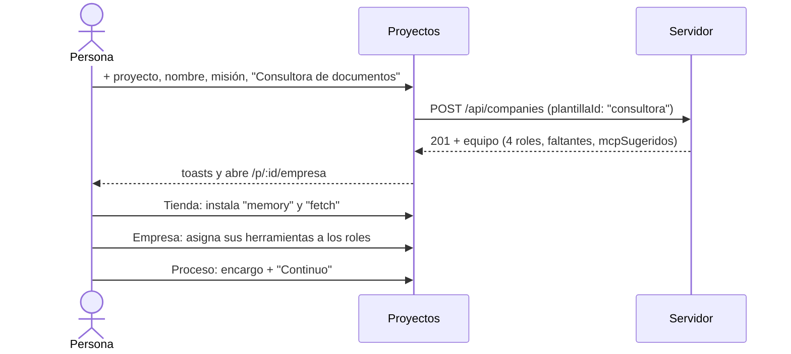

# CU-11 Proyecto nuevo desde una plantilla

**Qué se quiere lograr:** crear un proyecto que nazca con un equipo probado
—áreas, agentes con jerarquía, herramientas asignadas y modelo con escalado— y
darle su primer encargo sin diseñar el organigrama a mano.

**Qué demuestra:** plantillas de equipo, siembra de herramientas, faltantes
nombradas, `proveedorPreferido`, MCP sugeridos que decide una persona.

## Antes de empezar

- Al menos un proveedor LLM configurado (`npm run check:llm`). Sin ninguno el
  equipo no se puede generar.
- Para el equipo de software, conviene `claude-code` logueado: la plantilla lo
  prefiere.
- Lo que la plantilla puede necesitar del entorno: Chrome (estudio audiovisual),
  una API key de imágenes (`generar_imagen`), `adb` (herramientas del teléfono).

## El recorrido



### 1. Elegir la plantilla

En [[Pantalla Proyectos]] (`/proyectos`), **+ proyecto** abre el alta: nombre,
misión y **Equipo inicial**. Cada opción muestra nombre, cantidad de agentes y
descripción; el tooltip dice para qué encargo sirve. "Empezar vacío" crea la
empresa sin agentes pero con sus herramientas listas para asignar.

La UI pide `GET /api/plantillas`, que trae también el proveedor preferido: con
él arma el `defaultModel` de la empresa (tier `standard`, escalado
`cheap..smart`).

### 2. Crear

**crear y abrir** manda:

```json
{
  "name": "Consultora Andina",
  "mission": "Informes de mercado para pymes.",
  "defaultModel": {
    "providerId": "anthropic",
    "modelSlug": null,
    "tier": "standard",
    "escalado": { "activo": true, "tierMinimo": "cheap", "tierMaximo": "smart" },
    "temperature": null,
    "maxOutputTokens": 4096
  },
  "plantillaId": "consultora"
}
```

El servidor guarda la empresa, siembra las herramientas `capability` y `skill`,
y `Runtime.generarEquipo` crea Dirección, Consultoría y Calidad con Valentina
(executive), Julián, Camila y Ernesto. Detalle del mecanismo en
[[Plantillas de equipo]].

### 3. Leer los avisos

Aparecen hasta tres toasts:

- "Equipo creado: 4 agentes listos para trabajar."
- "Sin registrar en esta máquina: …" — herramientas que la plantilla nombra y
  el catálogo no tiene.
- "Este equipo aprovecha servidores MCP: memory, fetch. Instalálos desde la
  Tienda."

> [!warning] En la consultora el segundo aviso es falso
> Va a nombrar `buscar_en_entregables`, `calcular` y `verificar_cifras`. Son
> herramientas de coordinación: los agentes las tienen igual. El aviso sale
> porque `generarEquipo` resuelve contra filas sembradas y las de coordinación
> no se siembran. Lo mismo en la plantilla de investigación.

En el estudio audiovisual, en cambio, el aviso sí importa: si nombra
`export_video_estudio` o `grabar_clip`, falta Chrome; si nombra
`generar_imagen`, falta la API key de imágenes.

### 4. Revisar el organigrama

La app abre [[Pantalla Empresa y organigrama]] (`/p/:id/empresa`). Los roles
nacen en `(0,0)` y el organigrama los acomoda por jerarquía. Ahí se puede
cambiar proveedor, tier o rango de escalado de cada agente, y sumar o quitar
herramientas. Los prompts están en inglés y declaran que la salida es en
castellano: no hace falta traducirlos.

### 5. Conectar los MCP sugeridos (opcional)

Desde [[Pantalla Tienda]] se instalan `memory` y `fetch` (ninguno pide
credencial). Instalar conecta y descubre, pero **no otorga**: volvé a Empresa y
asigná sus herramientas. Ver [[CU-10 Instalar un servidor desde la tienda]].

### 6. Dar el encargo

En [[Pantalla Proceso en vivo]], encargo y modo **Continuo**. El encargo entra
como mensaje `human` a Valentina (el `executive` sin jefe), que reparte. Se ve el
organigrama pulsar, el modelo de cada turno (con su motivo cuando escaló) y los
entregables en Salida.

## Variante: equipo de software

Con `plantillaId: "desarrollo-software"` el equipo trae herramientas de código
aunque todavía no haya repo; cada una dice qué falta y quién lo carga. Antes del
encargo, cargá el código en la pestaña Código ([[Repositorios y sesiones]]).
Irene (QA) no recibe herramientas que escriben: verifica mientras otro corrige.

## Qué puede salir mal

| Síntoma | Causa | Qué hacer |
|---|---|---|
| Error "No hay ningún proveedor LLM configurado…" y el proyecto igual aparece en la lista, vacío | la empresa se guarda antes de generar el equipo | configurá un proveedor y armá el equipo a mano, o borrá el proyecto y crealo de nuevo |
| La corrida muere en el tercer ciclo | el proveedor preferido no tiene crédito (402 a todo) | `npm run check:llm` y cambiá el proveedor de los roles |
| Un agente dice que no tiene una herramienta | quedó en "Sin registrar" | cumplí el requisito del entorno (Chrome, `adb`, API key), reiniciá y asignala en Empresa |
| Los MCP instalados no se usan | la tienda no otorga | asignalos a los roles |

## Fuentes

- `apps/web/src/routes/Proyectos.tsx` — `NuevoProyecto`, mutación `crear`
- `apps/server/src/routes.ts` — `GET /api/plantillas`, `POST /api/companies`
- `apps/server/src/runtime.ts` — `sembrarHerramientas`, `generarEquipo`, `proveedorPreferido`, `startRun`
- `packages/shared/src/plantillas.ts` — `PLANTILLAS_EQUIPO`

## Ver también

- [[Plantillas de equipo]]
- [[Referencia de plantillas de equipo]]
- [[Casos de uso]]
- [[Gestión de proyectos]]
