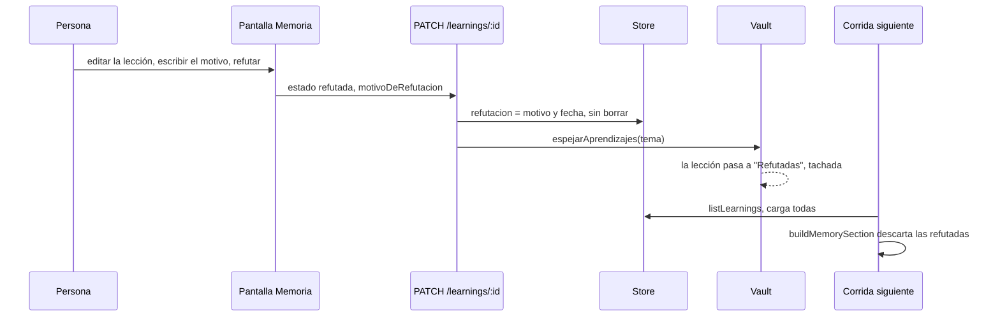

# CU-12 Refutar una lección falsa

**Qué se quiere lograr:** que una lección equivocada deje de entrar al prompt de
las corridas, **sin perder** el registro de por qué se creyó y por qué era falsa.

## El caso que lo motivó

Una agente (Nora) intentó corregir un informe con `edit_artifact` y falló nueve
veces seguidas con "no encontró su texto". Concluyó que la herramienta estaba
rota y registró: "`edit_artifact` no sirve para multilínea, reescribí el
documento entero".

La herramienta estaba bien. El índice de `read_artifact` se armaba con
`bloques`, que parte las secciones largas y **repite el título**: un informe de
18 encabezados se anunciaba como 23 secciones, y al rearmar el texto aparecía un
`## Resumen ejecutivo` que el documento no tenía. Nora copiaba a su `buscar`
texto que no existía (detalle en [[Entregables]]).

La lección falsa quedó en la memoria de la empresa, lista para inducir en todas
las corridas siguientes el gasto de reescribir documentos enteros. **Un falso
positivo persistido es peor que el error que lo causó**, y la regla que queda:
si un agente concluye que una herramienta está rota, sospechá primero de lo que
la herramienta le mostró.

## Qué cambió para que esto sea posible

- `record_lesson` exige `evidence` y rechaza a quien sólo habló. Nora **sí**
  tenía evidencia (sus nueve fallos): el gate no detecta la conclusión
  equivocada, sólo deja el respaldo a la vista para quien revise.
- Cada lección viaja al prompt con su procedencia (autor, fecha,
  confirmaciones).
- Refutar es humano y no borra (`estado: "refutada"` + motivo).

Detalle en [[Memoria de la empresa]].

## Paso a paso



1. **Detectar.** Una lección sospechosa se ve en la pantalla Memoria (con su
   evidencia y quién la cargó), en la nota del tema en el vault
   (`Aprendizajes/<tema>.md`) o en el prompt de un turno, que la muestra con
   `— autor, fecha`.
2. **Verificar antes de refutar.** Mirá la evidencia que citó el agente y la
   actividad de esa corrida (`check_activity` en vivo, o la traza). Preguntate
   qué le mostró la herramienta al agente. Si la lección es cierta, no se toca.
3. **Refutar.** En Memoria: "editar" → "Refutar (opcional)" → escribí el motivo
   ("el índice de lectura mostraba secciones duplicadas que el documento no
   tiene") → "refutar". Por API:

   ```bash
   curl -X PATCH http://localhost:3001/api/companies/<companyId>/learnings/<id> \
     -H 'content-type: application/json' \
     -d '{"estado":"refutada","motivoDeRefutacion":"el índice de lectura mostraba secciones duplicadas"}'
   ```

   Sin motivo: 400 "Refutar exige el motivo: es lo que evita re-aprender el mismo
   error."
4. **Opcional: sembrar la lección correcta** desde la misma pantalla ("Si
   edit_artifact no encuentra el texto, releé la sección con read_artifact y
   copiá una sola línea literal").
5. **Comprobar.** En la corrida siguiente la lección no aparece en ningún prompt;
   en Memoria se ve tachada con "Refutada: …"; en el vault, bajo "## Refutadas"
   con el título tachado.

## Refutar, borrar, restaurar

| Acción | En el prompt | En la base | En el vault |
|---|---|---|---|
| Refutar | No | Sí, con motivo | Sí, tachada bajo "Refutadas" |
| Olvidar (borrar) | No | No | Se reescribe la nota; se borra si queda vacía |
| Restaurar (`estado: "activa"`) | Sí | Sí, sin motivo | Vuelve a las vivas |
| Cuestionar (`estado: "cuestionada"`, sólo API) | Sí, con `(?)` | Sí | "(sin verificar)" |

Borrar una lección falsa invita a re-aprenderla: el registro del error vale
tanto como la lección.

## Qué puede hacer un agente

Un agente **no** puede refutar. Si lo que ve contradice una lección, el prompt le
pide registrar la corrección con `record_lesson` citando la evidencia; las dos
conviven hasta que una persona resuelve la tensión desde Memoria.

## Qué puede salir mal

| Síntoma | Causa |
|---|---|
| Un agente vuelve a registrar el mismo texto y recibe "Lección reafirmada" | La dedupe encuentra la refutada y le suma una confirmación, pero **sigue refutada** y fuera del prompt |
| Corregí la nota del vault a mano y volvió a aparecer | Las notas de `Aprendizajes/` se regeneran con cada cambio del tema: se corrige desde Memoria |
| Cambié el tema de una refutada | Se mueve de nota; sigue refutada |
| No encuentro cómo marcarla "sin verificar" | La pantalla sólo ofrece refutar y restaurar; `cuestionada` es por API |

## Qué lo fija

- `apps/server/src/memoria-persistida.test.ts` → de punta a punta con SQLite y vault reales: la lección llega al prompt, la refutación la saca, sigue en la base y el vault conserva el motivo.
- `apps/server/src/routes.test.ts` → el PATCH exige motivo, refuta y la saca del prompt sin borrarla.
- `packages/engine/src/memory.test.ts` → "una refutada no entra al prompt, pero sigue en la lista"; la procedencia viaja con cada lección.

## Ver también

- [[Memoria de la empresa]]
- [[Vault de contexto]]
- [[Entregables]]
- [[Pantalla Memoria]]
- [[CU-04 Control de calidad entre agentes]]
