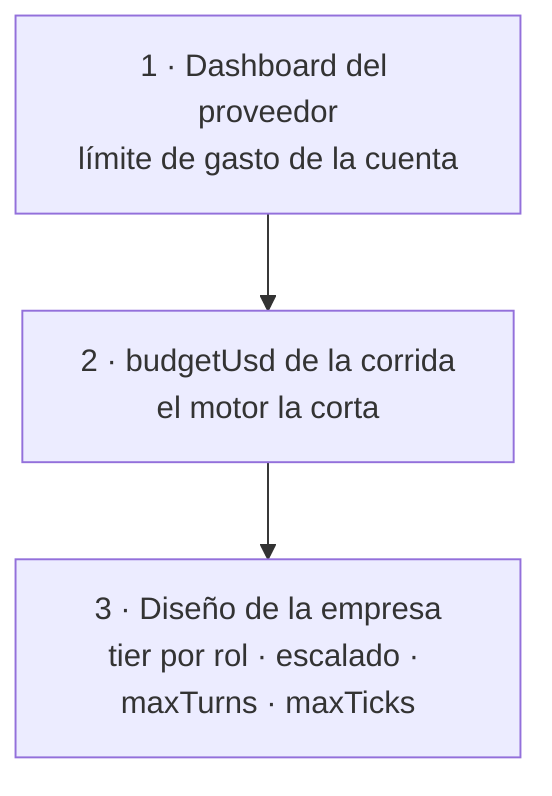
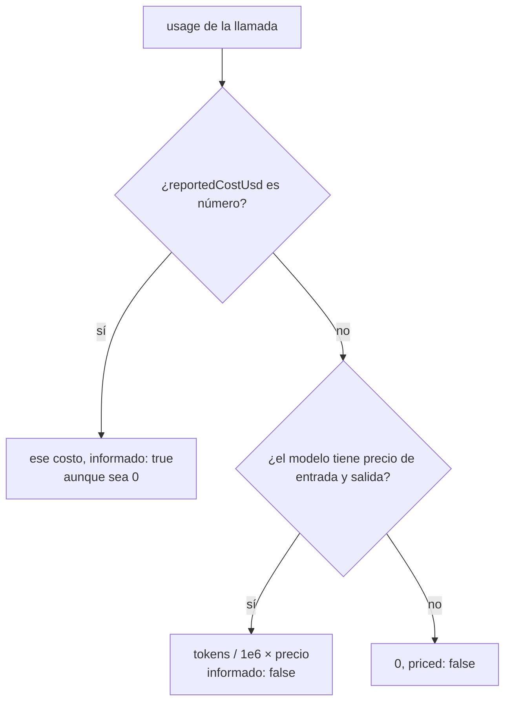

# Costos y presupuesto

Cómo el orquestador cuenta lo que gasta una corrida y cuándo la corta. Cada
llamada al modelo se valoriza (`computeCost`), se acumula en un ledger por
corrida (`RunLedger`) y, al superar el presupuesto, el motor termina la corrida
con `budget_exceeded`. Es la última red de contención: protege contra un bucle
de agentes, no contra una clave filtrada.

## Las tres capas de contención



> [!warning] La capa 2 no alcanza sola
> El tope se evalúa **antes** de cada llamada, no durante: una llamada cara se
> puede pasar antes de que se detecte, y con turnos en paralelo
> (`AGENT_CONCURRENCY`, 4 por defecto) hasta cuatro llamadas en vuelo pueden
> pasarse a la vez. En un proveedor que delega a un CLI, "una llamada" es un
> turno entero de hasta 10-25 minutos. Configurá también un límite en el
> dashboard del proveedor.

## De dónde sale el presupuesto

`apps/server/src/runtime.ts` → `Runtime.startRun`:

```ts
budgetUsd: input.budgetUsd ?? company.budgetUsd ?? this.env.defaultBudgetUsd
```

| Fuente | Valor |
|---|---|
| `POST /api/runs` con `budgetUsd` | positivo, máximo 1000 (`createRunSchema`) |
| `company.budgetUsd` | default 1 del esquema (`companySchema`) |
| `DEFAULT_RUN_BUDGET_USD` | 1; sólo pesa si la fila de la empresa no trae `budgetUsd` |
| Una misión | su propio `budgetUsd` (default 1) — ver [[Misiones programadas]] |

## Cómo se valoriza una llamada

`packages/llm/src/ledger.ts` → `computeCost(modelInfo, usage)`:



| Proveedor | De dónde sale el costo |
|---|---|
| `openrouter` | **informado** por la API (`usage.cost`): lo que se pagó |
| `anthropic`, `claude-sesion` | estimado con los precios de lista curados (`PRECIOS_CLAUDE`) |
| `opencode` | 0; el informado por el CLI si `ORQ_OPENCODE_COSTO=1` |
| `claude-code` | 0 a propósito: la suscripción no factura por token |
| `openai`, `nvidia` | 0: sin precios en el catálogo |
| `ollama` | 0: local |

El informado manda porque el precio del catálogo de OpenRouter es el del
endpoint **más barato**, y el ruteo no lo respeta: medido, una llamada valuada en
US$0,017 costó US$0,068. `modelInfo` es la entrada del catálogo para el slug
resuelto; si fijaste un slug que no coincide exacto con el catálogo, no hay
precio y la llamada vale 0. Detalle por proveedor en [[Capa LLM y tiers]].

> [!danger] Con los proveedores que no cuentan dinero, el presupuesto no corta
> Con `claude-code`, `openai`, `nvidia`, `ollama` y `opencode` sin
> `ORQ_OPENCODE_COSTO`, `spentUsd` no crece: los únicos frenos son `maxTicks` y
> el corte por tres ciclos seguidos sin turnos completados. Con Anthropic el
> presupuesto **sí** corta, por precio de lista, pero la estimación no valoriza
> los tokens de caché (ver [[Proveedor Anthropic y claude-sesion]]).

## El ledger

`RunLedger(budgetUsd, onRecord)` vive en memoria durante la corrida:

| Miembro | Qué hace |
|---|---|
| `record(entrada)` | suma `costUsd` a `spentUsd` y llama `onRecord` |
| `spentUsd`, `remainingUsd`, `exhausted` | `exhausted` es `spentUsd >= budgetUsd` |
| `assertWithinBudget()` | tira `BudgetExceededError` si está agotado |
| `byRole()`, `byModel()`, `all()` | agregados; hoy la UI no los usa (agrega por su cuenta) |

El servidor persiste cada entrada en la tabla `ledger` (`id`, `run_id`, `data`
JSON) vía `Store.saveLedgerEntry`. Campos (`ledgerEntrySchema`):

| Campo | Notas |
|---|---|
| `roleId`, `providerId`, `modelSlug`, `tick` | para atribuir; `modelSlug` es el que respondió de verdad (fallback incluido) |
| `inputTokens`, `outputTokens` | |
| `cachedInputTokens` | de la entrada, cuánto sirvió el proveedor desde caché |
| `costUsd` | informado o estimado |
| `latencyMs`, `createdAt` | |

Borrar la corrida se lleva su ledger. `GET /api/runs/:id` lo devuelve entero.

## Dónde se evalúa y cómo corta

- `packages/engine/src/loop.ts` → `runAgentTurn`: `ledger.assertWithinBudget()`
  **antes de cada iteración**; después de cada llamada, `computeCost`,
  `ledger.record` y el evento `cost.updated` (`deltaUsd`, `totalUsd`,
  `budgetUsd`, tokens de entrada, salida y caché).
- `packages/engine/src/scheduler.ts`: un `BudgetExceededError` es el único error
  de turno que **no** se absorbe — se propaga y la corrida termina
  `budget_exceeded` con "Presupuesto agotado: US$x de US$y". `checkBlockers`
  además revisa `ledger.exhausted` en cada ciclo.

## Dónde se ve

- **Cabecera de [[Pantalla Proceso en vivo]]**: gastado / presupuesto (en ámbar
  pasado el 80%), tokens ↓entrada ↑salida y ⚡% de caché (verde desde 50%). El
  caché es lo que decide la factura.
- **`/p/:companyId/costos`** (componente `Costs` en
  `apps/web/src/routes/Settings.tsx`): por corrida, barra de gasto y tablas por
  agente y por modelo con costo, llamadas y tokens.

## Presión de cierre

Cada turno recibe cuánto queda (`packages/engine/src/prompt.ts` →
`buildClosingPressure`): `urgencia = min(ciclos restantes / maxTicks,
presupuesto restante)`. Por encima de 0,5 no dice nada; entre 0,25 y 0,5 agrega
"Queda poco margen"; por debajo, "Cerrá ahora" y pide el entregable aunque esté
incompleto. Sin esto los agentes se piden información hasta que la corrida muere
sin producir. Con proveedores que cuentan 0, sólo empujan los ciclos. Ver
[[Prompt de un turno]].

## Dónde se va el dinero

**En la entrada, no en la salida.** Cada iteración reenvía historial,
herramientas y bandeja; por eso el precio mezclado de los tiers pesa la entrada
al 80% (`entrada × 0,8 + salida × 0,2`). Y por eso el caché importa tanto: la
misma llamada cuesta US$0,0022 cacheada y US$0,068 sin caché.

> [!danger] El caso de los 534k tokens
> Un `read_artifact` con un argumento inventado (`start=4000`) hacía que el mismo
> entregable de 40k caracteres entrara **once veces**: 534k tokens de entrada
> para 2k de salida (259:1). La huella del memo ahora se calcula sólo sobre lo
> que el esquema declara, y una relectura devuelve un puntero.

En un turno delegado el costo es **cuadrático en su largo**: medido en corridas
de seis agentes, 21,1M de tokens de entrada para 132k de salida (160:1), con
96-100% servido desde caché. El caché abarata pero no exime: bajo suscripción
esos tokens consumen la ventana igual. Ver [[Turnos delegados a un CLI]].

## Las palancas

| Palanca | Efecto |
|---|---|
| **tier por rol** | ejecutores en `cheap`, coordinadores en `standard`, decisiones en `smart`. La más grande |
| **escalado por dificultad** | el tier sube sólo en los turnos pesados, acotado por autoridad ([[Escalado por dificultad]]) |
| **`maxTurns` por rol** | default 8, máximo 50; la base de iteraciones de un turno suma bandeja, tareas y contexto, y el techo es el doble (tope 50) |
| **`maxTicks`** | `DEFAULT_MAX_TICKS` = 50; un pedido del chat del IDE, 4 |
| **`budgetUsd`** | el corte duro |
| **memoria de la empresa** | no re-derivar lo ya establecido ([[Memoria de la empresa]]) |
| **tool router** | menos herramientas expuestas, menos contexto ([[Herramientas y tool router]]) |
| **Ollama, NVIDIA, `free`** | sin costo por token, con sus límites |
| **suscripciones** (`claude-code`, `opencode`) | sin costo por token; lo finito es la ventana de uso |

## La cuenta sin crédito

Una cuenta sin saldo contesta **402 a todo** (en OpenRouter, también a los
modelos gratuitos). Síntoma: cada turno falla al instante. El 402 no se
reintenta; tras tres ciclos seguidos sin un turno completado, con esperas de 30,
60 y 120 s entre ellos, la corrida termina `failed` nombrando el error. El health
check de OpenRouter no lo detecta: corré `npm run check:llm` antes de una
corrida larga.

## Suscripciones

`claude-code` informa sus tokens reales (entrada con caché incluida) aunque el
costo sea 0, y avisa en la traza cuando la ventana de 5 horas o la semanal pasa
el 80% o llega al límite ([[Proveedor claude-code]]).

## Órdenes de magnitud medidos

| Escenario | Valor |
|---|---|
| corrida de 4 ciclos, 1 entregable, modelos `free` | US$0,00 |
| tope por defecto de una corrida | US$1,00 |
| techo de `smart` | 25 US$/MTok mezclado; hay modelos a 60 |
| prima de una variante `-fast` | el doble, por velocidad; penalizada −6 |
| catálogo vs. real en OpenRouter | hasta 4× |

## Si una corrida se corta por presupuesto

`status: "budget_exceeded"` con el motivo en la UI. **El entregable sobrevive**:
`write_artifact` ya lo guardó y los artefactos no se borran con la corrida. Bajá
el tier de los roles que no deciden, activá el escalado, subí `budgetUsd` o
sembrá memoria para que la corrida siguiente no re-derive lo mismo.

## Qué fijan los tests

- `packages/llm/src/ledger.test.ts`: el costo informado gana sobre el catálogo
  (3× más en el caso real), un informado de 0 es 0, sin precio no se inventa y el
  presupuesto corta con el costo real.
- `packages/llm/src/modelos-claude.test.ts`: con el catálogo enriquecido, una
  llamada de Anthropic deja de valer 0.
- `packages/engine/src/scheduler.test.ts`: "corta la corrida cuando se agota el
  presupuesto" y "corta la corrida cuando el proveedor rechaza todos los turnos
  varios ciclos seguidos" (con un 402 simulado).

## Fuentes

- `packages/llm/src/ledger.ts` → `computeCost`, `RunLedger`, `BudgetExceededError`
- `packages/engine/src/loop.ts` → `runAgentTurn`, `presupuestoDeIteraciones`
- `packages/engine/src/scheduler.ts` → `checkBlockers`, `TICKS_FALLIDOS_TOLERADOS`
- `packages/engine/src/prompt.ts` → `buildClosingPressure`
- `apps/server/src/runtime.ts` → `startRun`
- `packages/shared/src/schema.ts` → `ledgerEntrySchema`, `createRunSchema`
- `apps/web/src/routes/LiveProcess.tsx`, `apps/web/src/routes/Settings.tsx` → `Costs`, `apps/web/src/lib/derive.ts` → `porcentajeCache`

## Ver también

- [[Capa LLM y tiers]] · [[ADR-004 Bandas de precio disjuntas]]
- [[Proveedor OpenRouter]] · [[Proveedor claude-code]]
- [[Variables de entorno]]
