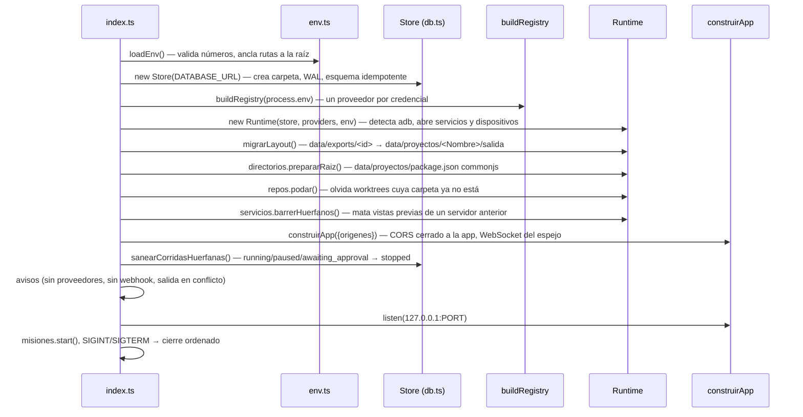

# Instalación y arranque

Cómo pasar de un clon del repo a una empresa trabajando, qué hace el servidor en
cada arranque y dónde deja las cosas. Todo corre **local y para una sola
persona**: el servidor escucha en `127.0.0.1` y la UI es el servidor de desarrollo
de Vite. No hay un modo "producción" con la UI compilada servida por Fastify.

## Requisitos

| Requisito | Versión | Para qué | Nota |
|---|---|---|---|
| **Node** | `engines: ">=22"` (en la práctica **22.9+**) | todo | los scripts usan `--env-file-if-exists`, un flag de Node que apareció en 22.9; el cliente CDP de Chrome y el de Metro usan el `WebSocket` global |
| **npm** | el que trae Node | workspaces (`packages/*`, `apps/*`) | hay `package-lock.json`; ver la advertencia de abajo |
| **git** | cualquiera reciente | cargar repos, sesiones, checkpoints, tests del servidor | `apps/server/src/git.ts` lo invoca por nombre |
| Al menos **un proveedor LLM** | — | que los agentes piensen | ver [[Variables de entorno]] |
| **macOS** (recomendado) | — | `sandbox-exec`, `say`, `cp -c`, `java_home` | en Linux funciona el núcleo; lo que depende de esas piezas se niega o degrada, ver [[Dependencias del sistema]] |

Todo lo demás —ffmpeg, Chrome, Kokoro, adb, scrcpy, JDK, los CLIs de Claude Code y
opencode— es opcional y habilita capacidades puntuales. La tabla completa, con qué
pasa si falta cada una, está en [[Dependencias del sistema]].

> [!warning] `packageManager` dice yarn, el repo usa npm
> `package.json` declara `"packageManager": "yarn@1.22.22…"`, pero el monorepo se
> maneja con **npm workspaces** y un `package-lock.json`. Si tenés Corepack con el
> shim de npm prendido, puede negarse a correr `npm` en esta carpeta. Usá npm.

> [!note] `better-sqlite3` es un módulo nativo
> `npm install` baja el binario precompilado para tu Node y tu arquitectura. Si no
> existe, lo compila, y ahí hacen falta las herramientas de compilación del sistema
> (en macOS, las Command Line Tools de Xcode).

## Arranque rápido

```bash
npm install
cp .env.example .env          # completá al menos una credencial de proveedor
npm run check:llm             # una llamada real: detecta el 402 de una cuenta sin crédito
npm run dev                   # servidor 127.0.0.1:3001 + UI :5173
```

Abrí <http://localhost:5173>: la raíz redirige a `/proyectos`. Desde ahí creás un
proyecto (con o sin [[Plantillas de equipo|plantilla]]) o abrís uno sembrado. Para
confirmar que el servidor está arriba sin abrir la UI:

```bash
curl -s localhost:3001/api/health        # {"ok":true}
```

## Tres formas de tener la primera empresa

1. **Desde la UI con una plantilla** (`/proyectos` → nuevo proyecto →
   plantilla). `POST /api/companies` con `plantillaId` llama a
   `Runtime.generarEquipo` y el proyecto nace con roles, jerarquía y herramientas.
   Ver [[Plantillas de equipo]] y [[CU-11 Proyecto nuevo desde una plantilla]].
2. **Con un seed**: `npm run db:seed` (Codytion S.A.), `npm run db:estudio`,
   `db:inspia`, `db:inspia-publicidad`, `db:observatorio`. Qué trae cada uno en
   [[Empresas de ejemplo]]. Cada corrida de un seed **crea otra empresa**: no son
   idempotentes.
3. **Importando un blueprint** (`POST /api/companies/import`) exportado de otra
   instalación. Ver [[Empresas de ejemplo]] §Armar la tuya.

## Qué pasa en cada arranque

`apps/server/src/index.ts` es corto y el orden importa: nada de MCP puede arrancar
antes de mudar las rutas viejas, y nada se sirve antes de sanear las corridas que
una caída dejó "vivas".



Los orígenes que acepta la API (`construirApp` → `origenes`) son el origen de
`APP_URL`, `http://localhost:5173`, `http://127.0.0.1:5173` y el propio servidor
en `localhost`/`127.0.0.1`. Por eso un `APP_URL` mal escrito **no arranca**:
`new URL(env.appUrl)` tira `TypeError: Invalid URL` antes de escuchar.

### Mensajes del arranque

| Mensaje (log de Fastify) | Qué significa | Qué hacer |
|---|---|---|
| `N corrida(s) habían quedado marcadas como vivas…: se cerraron` | una caída dura dejó filas en `running`; se pasaron a `stopped` | nada: la traza y los entregables quedan, las tareas abiertas las hereda la próxima corrida |
| `Se cerraron N servicio(s) de vista previa que había dejado vivos el servidor anterior` | `tsx watch` reinició sin matar el grupo de procesos de una vista previa | nada; se leen de `data/proyectos/.servicios-vivos.json` |
| `Salida mudada al layout por proyecto…` | primera vez con el layout nuevo | nada; los MCP con la ruta vieja se reescribieron |
| `Estas empresas tienen salida en data/exports y en su carpeta de proyecto` | hay salida en los dos layouts | fusionar a mano: no se mezcla solo |
| `Quedan N carpeta(s) en data/exports sin empresa detrás` | restos de empresas borradas | revisar y borrar a mano |
| `Sin N8N_EMAIL_WEBHOOK_URL…` | las misiones corren pero no avisan | ver [[Correo y avisos]] |
| `No hay ningún proveedor LLM configurado` | `buildRegistry` no registró nada | completar `.env` y reiniciar |
| `Proveedores configurados: …` | lista final de ids | confirmar que está el que esperabas |

## Modos de ejecución

| Comando | Qué levanta | Cuándo |
|---|---|---|
| `npm run dev` | servidor con `tsx watch` + Vite (`concurrently`) | trabajo diario |
| `npm run dev:server` | sólo Fastify con watch | depurar el servidor |
| `npm run dev:web` | sólo Vite en `:5173` (`strictPort`) | tocar la UI con el servidor ya arriba |
| `npm run start --workspace @orq/server` | Fastify **sin** watch | corridas largas mientras editás el repo |

> [!danger] `tsx watch` corta las corridas
> Con `npm run dev`, tocar **cualquier** archivo que el servidor importa —los
> `packages/` incluidos— reinicia el proceso. El cierre ordenado detiene las
> corridas vivas con `"Servidor detenido."` y el turno en vuelo se pierde. Para
> trabajar sobre el orquestador con una corrida larga andando, levantá la UI con
> `dev:web` y el servidor con `start`.

Vite fija el `5173` con `strictPort: true` (si está ocupado, falla en vez de
correrse de puerto en silencio) y le pasa `/api` —incluido el WebSocket del
espejo del teléfono— al `127.0.0.1:<PORT>` que lee del mismo `.env` de la raíz
(`apps/web/vite.config.ts`). `npm run build` sólo compila la UI (`apps/server` no
tiene script de build: corre siempre con `tsx`); sirve como verificación, no como
despliegue.

## Apagado

`SIGINT`/`SIGTERM` → `misiones.stop()` → `Runtime.shutdown()` (detiene servicios
de vista previa, cierra capturas del teléfono, frena corridas con "Servidor
detenido.", desconecta todos los MCP) → `app.close()` → `store.close()`. Además hay
un `process.on("exit")` que mata servicios y capturas aunque el cierre no sea
ordenado. Las corridas **no sobreviven** a un reinicio: ver
[[Estado de una corrida]].

## Preparar capacidades opcionales

- **Video con música**: `npm run musica:cama` sintetiza dos camas en `MUSICA_DIR`
  (necesita ffmpeg con `libmp3lame`). Ver [[Música y narración]].
- **Logo**: `marca/logo.png` **dentro de la salida del proyecto**
  (`data/proyectos/<Nombre>/salida/marca/logo.png`); se sube desde la pestaña
  Salida. Ver [[Voz y marca de la empresa]].
- **Voz local**: Kokoro en `ORQ_KOKORO_HOME` o `~/.cache/orq-kokoro`; sin él, `say`.
- **Láminas y clips**: Chrome instalado. Se detecta al crear el runtime de cada
  empresa: si lo instalás después, **reiniciá el servidor**.
- **Código**: git y, en macOS, `sandbox-exec` (viene con el sistema).
- **Celular**: adb (SDK de Android Studio), scrcpy, JDK 17.

Detalle de cada una en [[Dependencias del sistema]].

## Qué deja en disco

Todo bajo `data/`, que está en `.gitignore`. Las rutas del servidor se anclan a la
raíz del monorepo (`env.ts` → `fromRoot`), así da lo mismo arrancar desde la raíz
o desde el workspace.

```
data/
├── orquestador.db (+ -wal, -shm)   SQLite, esquema aplicado por el constructor de Store
├── mcp-oauth/<serverId>.json       tokens OAuth de MCP remotos (0600, carpeta 0700)
├── proyectos/                      PROYECTOS_DIR
│   ├── package.json                {"type":"commonjs"} a propósito
│   ├── .servicios-vivos.json       pid + inicio de cada vista previa viva
│   ├── .dispositivos.json          qué app se abrió en cada teléfono
│   └── <Nombre legible>/           marca .empresa con el id
│       ├── salida/                 lo que producen los agentes (+ .orq-generado.json)
│       ├── repos/<slug>/           clon gestionado
│       ├── worktrees/<repo>/<rama> sesiones de trabajo
│       └── tmp/                    temporales, logs de comandos, builds
├── contexto/<Empresa>/             CONTEXTO_DIR: vault de Obsidian por empresa
├── musica/                         MUSICA_DIR: las pistas las ponés vos
├── workspace/                      carpeta del MCP "archivos" del seed Codytion S.A.
└── exports/                        layout viejo: se muda solo al arrancar
```

`mcp-oauth/` vive junto a la base (`dirname(DATABASE_URL)`), no en `PROYECTOS_DIR`.
Las carpetas de trabajo de los CLIs (`CLAUDE_CODE_WORKDIR`, `OPENCODE_WORKDIR`)
**no** se anclan a la raíz: una ruta relativa se resuelve contra el directorio
desde el que corre el servidor, que con `npm run dev` es `apps/server/` (por eso
existe `apps/server/data/claude-code/transcripciones/`). Detalle en
[[Directorios en disco]] y [[Variables de entorno]].

## Problemas de arranque

| Síntoma | Causa | Salida |
|---|---|---|
| el servidor sirve código viejo | un proceso anterior sigue en el 3001 | `lsof -ti:3001 \| xargs kill -9` (`pkill -f` no siempre alcanza) |
| `PORT="…" no es un número positivo válido` | `loadEnv` valida los numéricos al arrancar, a propósito | corregir `.env` |
| `TypeError: Invalid URL` al arrancar | `APP_URL` mal formado | corregir `APP_URL` |
| `Port 5173 is already in use` | otra instancia de Vite | cerrarla; no se corre sola de puerto |
| la UI dice que no hay proyectos | base nueva | crear uno desde `/proyectos` o correr un seed |
| el video falla o `export_video_estudio` no aparece | falta ffmpeg con libass / falta Chrome | [[Dependencias del sistema]] |

El resto, por síntoma, en [[Diagnóstico de problemas]].

## Fuentes

- `apps/server/src/index.ts` — secuencia de arranque, avisos, `listen`, señales
- `apps/server/src/env.ts` → `loadEnv`, `fromRoot`, `repoRoot`
- `apps/server/src/app.ts` → `construirApp` (CORS, upgrade del WebSocket)
- `apps/server/src/db.ts` → `Store` (constructor), `sanearCorridasHuerfanas`
- `apps/server/src/runtime.ts` → `migrarLayout`, `shutdown`, `dirOAuth`
- `apps/server/src/directorios.ts` → `Directorios.prepararRaiz`
- `apps/web/vite.config.ts` — puerto, `strictPort`, proxy de `/api`
- `package.json` (raíz y workspaces), `.env.example`, `.gitignore`, `scripts/start.sh`

## Ver también

- [[Variables de entorno]] · [[Comandos]] · [[Dependencias del sistema]]
- [[Diagnóstico de problemas]] · [[Empresas de ejemplo]] · [[Seguridad]]
- [[Runtime del servidor]] · [[Directorios en disco]] · [[Base de datos]]
