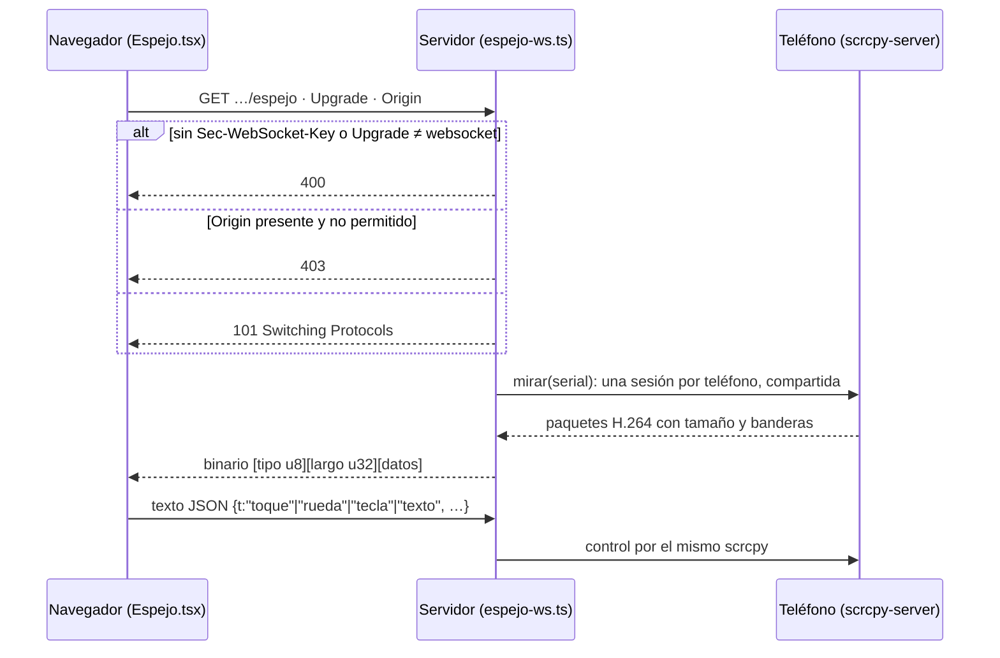

# Referencia de API de código y móvil

Cada endpoint de `apps/server/src/rutas-codigo.ts` → `registrarRutasDeCodigo`:
repos y sesiones, servicios del monorepo, el IDE (archivos, búsqueda, control de
versiones, terminal, chat), la vista previa, el teléfono vinculado (espejo,
depuración, AAB), más el **WebSocket del espejo** y el **contrato del proxy de
vista previa**. Son unas 80 rutas HTTP y un WebSocket.

Las convenciones comunes (base `127.0.0.1:3001`, `invalid` → 400 con `issues`,
CORS cerrado, la trampa del `content-type` con cuerpo vacío) están en
[[Referencia de API]]. Esta nota agrega sólo lo propio.

> [!note] Integrar y descartar son sólo de la persona
> No hay herramienta de agente que integre, publique ni descarte una sesión.
> Viven únicamente acá, del lado de la UI: la misma regla que publicar un
> archivo de la salida. Un agente produce; una persona decide qué sale.

## Convenciones propias de estas rutas

| Tema | Regla | Dónde |
|---|---|---|
| Error de git | `ErrorGit` → **422** `{ error }` con el mensaje de git tal cual; cualquier otro error → 400 | `rutas-codigo.ts` → `fallo` |
| Repo o sesión inexistente | 404 `{ error: "No existe el repo." }`, `"No existe la sesión."` o `"No existe la sesión abierta."` | `conRepo`, `conSesion` |
| Arriendo | Lo que escribe en el árbol devuelve **409** `"<Rol> está escribiendo en su turno…"` mientras un agente tiene el arriendo (`Runtime.titularDeEscritura`) | ver [[Arriendo de escritura y resumen de código]] |
| Corrida viva | Integrar, descartar, sacar un repo y lo que mueve el árbol entero (stash, ramas, fusión) devuelven **409** con una corrida viva en la empresa (`tieneCorridaViva`) | — |
| Trabajo largo | Preparar un servicio, instalar la build en el teléfono y construir un AAB **contestan al toque** y se siguen por polling; los `void` llevan `.catch` | — |
| Eventos | Lo que pasa fuera de una corrida (cargar, abrir sesión, checkpoint, integrar, descartar, estado de un servicio) sale por el SSE de código, no por la traza (que exige `runId`) | `RepoStore` → `emitir`, `Runtime.broadcastCodigo` |

## Repos y sesiones

Ver [[Repositorios y sesiones]], [[Control de versiones y publicación]] y
[[Configuración de repos y servicios]].

| Método y ruta | Entrada | Respuesta | Efectos y notas |
|---|---|---|---|
| `GET /api/companies/:companyId/repos` | — | `[{ repo, sesion, clon }]` | `sesion` = la abierta o `null`; `clon` = ruta del clon gestionado (`repos/<slug>`) |
| `POST /api/companies/:companyId/repos` | `{ nombre?: ≤120, origen: { tipo: "local", ruta } \| { tipo: "git", url }, ramaBase?: ≤200, incluirCambiosSinCommitear?: boolean }` | `{ repo, sugeridos, avisos }` (200) | 404 si la empresa no existe. `RepoStore.cargar`: clona (URL validada: sin `user:token@`, sin `ext::`, `file://` ni `-…`) o copia una carpeta sin git, detecta servicios y **sugiere** comandos sin permitirlos. Después `registrarHerramientasDeCodigo`. `origen.tipo: "creado"` pasa el esquema pero `cargar` lo rechaza (400): eso lo crea `crear_repositorio`. Emite `repo_cargado` |
| `PATCH /api/repos/:repoId/comandos` | `{ permitidos?: argv[], preparar?: argv\|null, test?: argv\|null, verificar?: argv\|null, sinAislamiento?: boolean }` (argv: 1-40 tokens de 1-400) | `Repositorio` | Cada prefijo de `permitidos` pasa por `validarPrefijoPermitido`: `npx`, `bash`, `node` solo o `npm run` sin script → 400 `"<prefijo>": motivo`. **Guardar confirma**: `actualizarComandos` pone `pendienteDeConfirmar: false` (lo que llegó importado queda habilitado). `unaVez` no se edita por acá. Ver [[Comandos y sandbox]] |
| `POST /api/repos/:repoId/renombrar` | `{ nombre: string }` | `Repositorio` | 400 sin nombre; 409 si queda vacío o repite el de otro repo (sin distinguir mayúsculas). Sólo cambia el nombre: la carpeta sigue en `repos/<slug>`, por eso **no** pide detener la corrida |
| `DELETE /api/repos/:repoId` | — | `{ ok: true, respaldo }` | 409 con corrida viva. Detiene sus servicios; `RepoStore.eliminar`: si la sesión abierta tiene trabajo sin integrar, antes deja `salida/respaldos/<slug>-<rama>.bundle` (historia entera) y `.patch`; borra clon, worktrees y filas; vuelve a registrar las herramientas de código. `respaldo` = ruta del bundle o `null`. Emite `repo_eliminado` |
| `POST /api/repos/:repoId/sesion` | — | `SesionCodigo` | `abrirSesion`: idempotente (devuelve la abierta). Un repo que vino de afuera con git trabaja en la **rama del proyecto**; uno creado o una copia, en `orq/<fecha>-<sufijo>`. Emite `sesion_abierta` |
| `GET /api/sesiones/:id` | — | `{ sesion, estado: { archivos, sensibles, commits }, log: [{ sha, autor, at, mensaje }] }` | Con la sesión cerrada: `{ sesion, estado: null, log: [] }` |
| `GET /api/sesiones/:id/diff` | query `ruta?` | `{ diff }` | Contra la base de la sesión, incluido lo no commiteado. **Escribe el índice**: marca los archivos nuevos con `git add -A --intent-to-add` para que aparezcan (ver la trampa del stash en [[Panel de control de código]]) |
| `GET /api/sesiones/:id/patch` | — | `text/x-patch`, `attachment; filename="<slug>-<rama>.patch"` | `git format-patch --stdout` de lo commiteado en la sesión (`git am` lo aplica) |
| `POST /api/sesiones/:id/integrar` | `{ subir?: boolean }` | `{ ok: true, modo: "fast-forward"\|"rama"\|"copia", detalle, sigueAbierta? }` | 409 con corrida viva; **409** `{ error, ok: false, motivo, conflictos? }` si no se pudo (cambios sin commitear sin `commitsAutomaticos`, conflictos con la base, la rama de la persona no avanza). Detiene los servicios sólo si la sesión se cierra (en la rama del proyecto sigue abierta). Con `subir: true`, `git push origin <rama>` sin forzar. Emite `sesion_integrada` |
| `POST /api/sesiones/:id/descartar` | — | `{ ok: true }` | 409 con corrida viva. Detiene servicios, saca el worktree; una `orq/*` se borra, la rama del proyecto **vuelve a `origin/<rama>`** (no se borra). Emite `sesion_descartada` |

## Servicios del monorepo

Ver [[Servicios del monorepo]] y [[Vista previa y proxy]].

| Método y ruta | Entrada | Respuesta | Efectos y notas |
|---|---|---|---|
| `GET /api/repos/:repoId/servicios` | — | `{ servicios: [Servicio & { archivosEntorno: [{ ruta, existe, variables }], preparado, vivo }] }` | Los `.env` se **describen** (si existe y cuántas variables), sus valores nunca salen. `preparado`: tiene `node_modules` en la sesión (`null` sin sesión). `vivo`: `{ servicioId, estado, puerto, url, desde, detalle, redirecciones, externas, variables, comando }` |
| `POST /api/repos/:repoId/servicios/detectar` | — | `Repositorio` | `redetectarServicios`: vuelve a detectar sobre el clon **conservando** lo que la persona ya configuró de los servicios que siguen existiendo |
| `PUT /api/repos/:repoId/servicios/:servicioId` | `servicioSchema` (el `id` lo pone la ruta) | `Repositorio` | Alta o edición. `archivosEntorno`: ruta **absoluta** y nombre `.env*` o `*.env`, o 400 (el servidor los inyecta en un proceso que corre código de un agente: no puede ser la vía para leer `~/.ssh`). `carpeta` se resuelve adentro del clon (`resolverEnWorktree`) |
| `DELETE /api/repos/:repoId/servicios/:servicioId` | — | `Repositorio` | Lo detiene y lo saca de la lista |
| `POST /api/repos/:repoId/servicios/:servicioId/preparar` | — | `{ ok: true }` al toque | 404 si el servicio no existe. `prepararServicio` en segundo plano (clona `node_modules` con `cp -c` si el lockfile coincide, si no `npm ci --ignore-scripts` en el sandbox); el avance se ve en los logs |
| `POST /api/repos/:repoId/servicios/:servicioId/arrancar` | — | `vivo` | 404; 409 con el motivo (sin sandbox ni opt-in, sin dependencias, sin puertos libres entre 4300 y 4399). Levanta sobre el worktree de la sesión |
| `POST /api/repos/:repoId/servicios/:servicioId/detener` | — | `vivo` | Mata el grupo de procesos |
| `GET /api/repos/:repoId/servicios/:servicioId/logs` | query `desde` (número de línea) | `{ lineas, siguiente, vivo }` | Polling incremental: pedí desde `siguiente`. Los secretos del entorno salen tapados |
| `POST /api/repos/:repoId/servicios/:servicioId/probar` | `{ metodo: GET\|POST\|PUT\|PATCH\|DELETE\|HEAD\|OPTIONS = GET, ruta: 1-2000 (empieza con `/`), cuerpo?: ≤200 000, cabeceras?: { [k]: ≤8000 } }` | `{ estado, cabeceras, cuerpo, ms }` | 409 si el servicio no está `listo`. El pedido sale **del servidor** (no depende del CORS del backend), `redirect: "manual"`, corte 30 s; JSON reindentado; cuerpo recortado a 8 000 caracteres; saca `set-cookie` y `authorization`; tapa secretos. Es la misma función que usa `probar_servicio` |

## El IDE: archivos, búsqueda y terminal

Ver [[El IDE]], [[Editor, explorador y búsqueda]] y [[Terminal del IDE]].

| Método y ruta | Entrada | Respuesta | Efectos y notas |
|---|---|---|---|
| `GET /api/repos/:repoId/archivos` | — | `{ sesion, archivos, cambios, sensibles, commits, pendientes, escritor, corridaViva }` | Sin sesión lista la rama base del clon, en sólo lectura: **mirar no abre una sesión**. El IDE lo pide cada 3 s |
| `GET /api/repos/:repoId/buscar` | query `q`, `mayusculas=1`, `regex=1` | `{ resultados: [{ ruta, linea, texto }], cortado }` | `git grep` literal (`-F`) salvo `regex=1` (`-E`); con sesión incluye archivos nuevos (`--untracked`). Tope 500 líneas, cada texto a 300 caracteres |
| `GET /api/repos/:repoId/archivo` | query `ruta`, `ref` = `actual` \| `base` \| sha de 7-40 hex (con `^` opcional) | `{ ruta, ok: true, contenido, binario, bytes, hash }` | 404 si falta la ruta o no existe. `base` = cómo estaba al abrir la sesión; `contenido: null` si no existía. Un `ref` que no es de esos tres se trata como `actual`. Rechaza `..` y `.git` |
| `PUT /api/repos/:repoId/archivo` | `{ ruta: 1-1000, contenido: string, hash?: string\|null }` | `{ ok: true, hash, ruta, sesionId }` | **409** si un agente tiene el arriendo; **409** `{ error, conflicto: true }` si el archivo cambió en disco desde que se cargó (`hash` distinto) o lo borraron; 400 si pasa de 2 MB o la ruta no es válida. `hash: null` = archivo nuevo; sin `hash` no se verifica. **Abre la sesión** si no había |
| `DELETE /api/repos/:repoId/archivo` | query `ruta` | `{ ok: true }` | 409 con arriendo; 400 si no existe o es carpeta. También abre la sesión |
| `POST /api/repos/:repoId/ejecutar` | `{ comando: string, segundos?: 5-600 = 300, carpeta?: string }` | `{ codigo, salida, duracionMs, cortadoPorTiempo, aislamiento, log, error? }` | La terminal **no es una shell**: `tokenizar` a argv (400 si no se puede), 409 si los comandos vinieron importados sin confirmar, **403** si no está en `permitidos` (acá no valen los permisos de una vez). Corre en el mismo sandbox que los agentes, sin reutilizar resultados (`repetir: true`). `exit ≠ 0` no es error HTTP |

## Control de versiones (SCM)

Ver [[Panel de control de código]] y [[Control de versiones y publicación]].

| Método y ruta | Entrada | Respuesta | Efectos y notas |
|---|---|---|---|
| `GET /api/repos/:repoId/scm` | — | `{ sesion, estado: EstadoScm, escritor }` o `{ sesion: null, estado: null }` | Con efectos: pasa una sesión vieja `orq/…` sin trabajo a la rama del proyecto (`alinearConLaRamaDelProyecto`) y dispara `sincronizarConOrigen` en segundo plano (como mucho cada 45 s, con `.catch`) |
| `POST /api/sesiones/:id/scm/sincronizar` | — | `{ ok: true, detalle }` | Fuerza el `fetch` del repo de la persona (corte 90 s). 409 `{ error }` si falla. No toca el worktree: se puede con un agente trabajando |
| `GET /api/sesiones/:id/scm/historial` | query `desde = 0`, `cantidad = 60` (acotada a 10-200), `rama?` | `{ commits: [{ sha, corto, autor, at, asunto, refs, fusion, sinIntegrar }], hayMas }` | La historia **entera** de la rama, paginada; `sinIntegrar` marca lo que no está en la base de la persona |
| `GET /api/sesiones/:id/scm/commit/:sha` | — | `{ archivos: [{ estado, ruta }], padre }` | Cualquier commit, contra su primer padre |
| `POST /api/sesiones/:id/scm/<operación>` | ver abajo | el resultado o `{ ok: true }` | 404 sin sesión abierta; **409** con arriendo; **409** con corrida viva para las marcadas; 409 con el mensaje si la operación tira |
| `POST /api/sesiones/:id/confirmar` | `{ mensaje?: string }` | `{ sha }` (`null` si no había nada) | 409 con arriendo. Commitea **todo** con la identidad de git de la persona; título por defecto "Cambios desde el IDE" |

Las operaciones de `POST /api/sesiones/:id/scm/<operación>` (`operacionScm`):

| Operación | Cuerpo | Resultado | ¿Exige sin corrida? |
|---|---|---|---|
| `preparar`, `quitar`, `descartar` | `{ rutas: string[] \| "todo" }` (tope 2 000) | `{ ok: true }` | no. `descartar` borra lo nuevo, sin papelera |
| `commit` | `{ mensaje, todo?: boolean, amend?: boolean }` | `{ sha }` | no. Sin nada preparado commitea todo; `amend` sólo sobre commits de la sesión |
| `mensaje` | — | `{ mensaje }` | no. Una llamada al tier `cheap` del proveedor preferido; imita los últimos commits y saca las firmas del CLI |
| `stash` | `{ mensaje?, incluirNuevos = true, soloPreparados = false }` | `{ ok: true }` | **sí** |
| `stash/usar` | `{ ref, accion: "aplicar"\|"sacar"\|"borrar" = "aplicar" }` | `{ ok: true }` | **sí** |
| `ramas/crear` | `{ nombre, desde? }` | `SesionCodigo` | **sí** (mueve la sesión) |
| `ramas/cambiar` | `{ nombre }` | `SesionCodigo` | **sí** |
| `ramas/borrar` | `{ nombre }` | `{ ok: true }` | no |
| `ramas/fusionar` | `{ nombre }` | `{ ok: true, detalle }` o **200** `{ ok: false, conflictos, motivo }` | **sí**. Un conflicto se aborta y nombra los archivos: no deja el árbol a medias |

## Chat de IA e instantáneas

Ver [[Chat de IA]], [[Instantáneas y checkpoints]] y [[QA móvil]]. Un pedido del
chat es una corrida enfocada: se crea con `POST /api/runs` y `foco` (ver
[[Referencia de API]]).

| Método y ruta | Entrada | Respuesta | Efectos y notas |
|---|---|---|---|
| `POST /api/companies/:companyId/mejorador` | — | `Role` | 404 sin empresa. Crea (o pone al día, sumando las herramientas que le falten) el Mejorador de código. Idempotente por nombre. Prefiere `claude-code` con Opus |
| `POST /api/companies/:companyId/qa-movil` | — | `Role` | Lo mismo para el QA móvil: sin herramientas que escriben código, nunca toma el arriendo |
| `GET /api/repos/:repoId/pedidos` | query `conversacion?` = id \| `anteriores` | `Run[]` (tope 30, más nuevo primero) | Corridas con `foco.repoId` de ese repo. `anteriores` = las de antes de que existieran las conversaciones |
| `GET /api/repos/:repoId/conversaciones` | — | `[{ id, titulo, pedidos, desde, ultima }]` (tope 50) | `titulo` = el primer pedido, a 80 caracteres |
| `GET /api/sesiones/:id/entre` | query `desde`, `hasta` (sha 7-40 hex) | `{ archivos: [{ estado, ruta }] }` | Lo que cambió un pedido **sin commit**: diferencia entre sus dos instantáneas. 400 con una referencia inválida |
| `POST /api/sesiones/:id/deshacer-entre` | `{ desde, hasta }` | `{ ok: true }` | 409 con arriendo; **409** si la persona tocó después las mismas líneas (`git apply -R --check` falla): no aplica nada y lo dice |
| `GET /api/sesiones/:id/commit/:sha` | — | `{ archivos }` | Sólo checkpoints de la sesión (posteriores a su base, en la rama): cualquier otro sha → `[]` |
| `POST /api/sesiones/:id/revertir` | `{ shas: string[] }` (≥1) | `{ ok: true, revertidos }` | 400 sin shas; 409 con arriendo; **409** si algún sha no es checkpoint de la sesión o si el `revert` choca (vuelve atrás todo: no deja nada a medias). Antes commitea lo pendiente de la persona |
| `PATCH /api/repos/:repoId/ajustes` | `{ commitsAutomaticos?: boolean }` | `Repositorio` | Si los agentes commitean al cerrar cada turno (default `false`) |

## Vista previa estática y stream de código

| Método y ruta | Respuesta | Efectos y notas |
|---|---|---|
| `GET /api/repos/:repoId/vista/*` | los bytes del archivo | Sirve el worktree de la sesión (o el clon, sin sesión). Un directorio → su `index.html`; comodín vacío → `index.html`. `resolverEnWorktree` con `realpath`: `.git/**` o salir del repo → 404. Cabeceras: `content-type` por `tipoWeb` (sin el de JS un ES module no carga), **`content-security-policy: sandbox allow-scripts allow-pointer-lock allow-forms`**, **`access-control-allow-origin: *`** (también en el 404), `cache-control: no-store`, `x-content-type-options: nosniff` |
| `GET /api/companies/:companyId/codigo/stream` | SSE, `event: codigo` con `{ tipo, companyId, repoId, sesionId?, detalle, at }` | `tipo` ∈ `repo_cargado`, `repo_eliminado`, `sesion_abierta`, `sesion_integrada`, `sesion_descartada`, `checkpoint`, `servicio`. Mismo formato que los otros SSE (`openSse`: `: ping` cada 20 s). La UI invalida sus consultas al recibirlo |

> [!danger] Por qué la vista previa manda su propio sandbox
> Sirve código que escribió un agente para que corra en el navegador. El iframe
> del IDE va con `sandbox="allow-scripts"` **sin** `allow-same-origin`, pero ese
> atributo no protege a quien abre la URL en otra pestaña: ahí correría con el
> origen de la app y, por el proxy de Vite, con acceso a toda la API. Por eso el
> servidor pone el mismo sandbox en la CSP. Con origen opaco los ES modules
> necesitan CORS: **sólo estas respuestas** llevan `Access-Control-Allow-Origin: *`,
> y la API rechaza el origen `null` en todo lo demás.

## El teléfono: vínculo, espejo y toques

Ver [[Vinculación del teléfono]], [[Espejo del teléfono]] y
[[App móvil en el teléfono]].

| Método y ruta | Entrada | Respuesta | Efectos y notas |
|---|---|---|---|
| `GET /api/dispositivos` | — | `{ disponible, dispositivos: [{ serial, estado, modelo, inalambrico }], espejo: { motor: "scrcpy"\|"screenrecord", version } }` | `disponible` = hay `adb`. `listar` antes reconecta los teléfonos ya vinculados que anuncian su puerto por mDNS |
| `POST /api/dispositivos/vincular` | — | `{ id, estado, detalle, serial, qr, vence }` | 409 sin adb. `qr` es un SVG con `WIFI:T:ADB;S:<nombre>;P:<clave>;;`; el vínculo vence a los **3 min**; la espera del teléfono corre en segundo plano. La respuesta no incluye nombre ni clave aparte del QR |
| `GET /api/dispositivos/vincular/:id` | — | el vínculo (`esperando`, `vinculando`, `listo`, `fallo`, `vencido`) | 404. Se consulta por polling |
| `GET /api/dispositivos/:serial/pantalla` | — | `multipart/x-mixed-replace; boundary=cuadro`, un JPEG por parte | Respaldo sin scrcpy. 409 si el teléfono no está conectado. El borde va **después** de cada cuadro (Chrome pinta una parte recién al ver el borde siguiente). La captura se corta en el `close` de la **respuesta** |
| `GET /api/dispositivos/:serial/video` | — | `application/octet-stream` con paquetes `[tipo u8][largo u32][datos]` | 409 `{ error, motor: "screenrecord" }` sin scrcpy. La UI no lo usa: el video va por el WebSocket |
| `POST /api/dispositivos/:serial/toque` | `{ accion: "abajo"\|"mover"\|"arriba", x, y }` (x, y ∈ [0,1]) | `{ ok: true }` | Por scrcpy. 409 si no hay espejo abierto. La UI usa el WebSocket |
| `POST /api/dispositivos/:serial/rueda` | `{ x, y ∈ [0,1], h, v ∈ [-16,16] }` | `{ ok: true }` | Ídem |
| `POST /api/dispositivos/:serial/tocar` | `{ x, y }` | `{ ok: true }` | Respaldo: `input tap` |
| `POST /api/dispositivos/:serial/deslizar` | `{ desde: {x,y}, hasta: {x,y}, ms: 0-5000 }` | `{ ok: true }` | `input swipe` |
| `POST /api/dispositivos/:serial/tecla` | `{ tecla: atras\|inicio\|recientes\|enter\|borrar\|menu }` | `{ ok: true }` | — |
| `POST /api/dispositivos/:serial/texto` | `{ texto: 1-300 }` | `{ ok: true, omitidos }` | `input text` sólo escribe ASCII: `omitidos` avisa que se perdieron tildes |
| `GET /api/dispositivos/:serial/arbol` | — | `{ ancho, alto, nodos: [{ id, padre, clase, texto, descripcion, recurso, pulsable, x, y, ancho, alto }] }` | `uiautomator dump` (~3 s). 409 si falla |

Las acciones `tocar`, `deslizar`, `tecla` y `texto` salen de un mismo ayudante
(`accion`): validan con Zod y cualquier error es 409.

## La app en el teléfono

Ver [[App móvil en el teléfono]] e [[Inspector de React Native]].

| Método y ruta | Entrada | Respuesta | Efectos y notas |
|---|---|---|---|
| `GET /api/repos/:repoId/servicios/:servicioId/dispositivo` | query `serial` | `{ paquete, instalada, instalacion }` | 404 sin servicio o sin `serial`; 409 sin sesión abierta. `paquete` sale de `expo.android.package` en `app.json` |
| `POST …/dispositivo/abrir` | `{ serial }` | `{ ok: true, paquete, metro, puertos }` | 409 sin paquete o con el servicio sin levantar (el teléfono baja el JavaScript del Metro). Tiende `adb reverse` al Metro interno y a cada puerto de los servicios vivos, abre la app y **recuerda** el destino para re-tender los túneles cuando el teléfono reconecta |
| `POST …/dispositivo/instalar` | `{ serial }` | `{ estado: "instalando"\|"listo"\|"fallo", lineas, desde }` al toque | La build de desarrollo (`expo prebuild` + Gradle) corre en segundo plano; se sigue con el `GET` de arriba |
| `POST …/dispositivo/componentes` | `{ buscados: string[] (≤20, de ≤300) }` | `{ componentes, pantallas, aviso? }`, siempre 200 | Le pregunta a la app, por el depurador de Hermes que expone Metro, qué componentes dibujan esos textos. Sin Metro o sin resultado, `aviso` lo explica |

## Depuración de la app (panel del IDE)

Ver [[Depuración de la app móvil]]. Es **la misma implementación** que las
herramientas de los agentes (`crearTelefonoStorage` en `depuracion-movil.ts`):
todo mira sólo la app del repo. Error → **409** `{ error: motivo }`; éxito → el
resultado con `ok: true`.

| Método y ruta | Entrada | Respuesta | Notas |
|---|---|---|---|
| `GET /api/repos/:repoId/telefono/logs` | query `alcance: app\|fallas = app`, `nivel: V\|D\|I\|W\|E = I`, `lineas` (10-1500, 300), `buscar?` | `{ ok, paquete, lineas, texto }` | Consola de JavaScript (por Hermes) + logcat de la app; `fallas` muestra los crashes desde su comienzo. JWT, `Bearer` y claves, tapados |
| `GET /api/repos/:repoId/telefono/estado` | — | `{ ok, texto }` | — |
| `GET /api/repos/:repoId/telefono/archivos` | query `ruta = "."`, `leer=1` | `{ ok, texto }` | Lista o lee dentro del sandbox de la app (`run-as`, sólo build de desarrollo) |
| `POST /api/repos/:repoId/telefono/base` | `{ archivo: 1-300, sql: 1-5000 }` | `{ ok, texto }` | Sólo SQL de lectura; copia la base **con su `-wal`** y la abre `-readonly -safe` |
| `POST /api/repos/:repoId/telefono/diagnostico` | `{ comando: 1-300 }` | `{ ok, texto }` | Allowlist por token atada al paquete |
| `POST /api/repos/:repoId/telefono/reiniciar` | — | `{ ok, texto }` | Reabre la app con sus túneles |
| `POST /api/repos/:repoId/telefono/limpiar-datos` | — | `{ ok, texto }` | `pm clear --user current`. En el panel **no pide aprobación** (la persona es quien decide); la herramienta del agente sí |

## Build de producción (AAB / APK)

Ver [[Build de producción Android]]. La clave del trabajo es
`<repoId>:<servicioId>`: uno por app, sea AAB o APK.

| Método y ruta | Entrada | Respuesta | Efectos y notas |
|---|---|---|---|
| `GET /api/repos/:repoId/servicios/:servicioId/aab` | — | `{ plan, trabajo }` | `plan`: paquete, versión actual y sugerida, commit, cambios sin commitear, `.env.prod` (sólo **nombres** de variables), firma, build anterior, historial, avisos. 409 `{ error, trabajo }` si no hay sesión, no es `movil` o `app.json` no declara el paquete |
| `POST …/aab` | `{ version: /^\d+\.\d+\.\d+$/, versionCode: 1-2 100 000 000, incluirCambios = false, formato: "aab"\|"apk" = "aab" }` | `{ trabajo }` al toque | 409 si ya hay uno construyéndose. El build corre en segundo plano sobre una copia exacta en `tmp/builds/` |
| `GET …/aab/trabajo` | — | `{ trabajo: { id, estado: construyendo\|listo\|fallo, paso, lineas, desde, resultado } \| null }` | Polling. Si el archivo del resultado se borró de la salida, el trabajo se olvida (`null`) |
| `POST …/aab/eliminar` | `{ archivos: string[] (1-100) }` o `{ conservar: 1-50 }` | `{ borrados, bytes, protegido }` | 409 con un build en curso, con un nombre que no está en el historial o si se pide borrar el **más reciente** (es contra el que se compara el próximo: versionCode y certificado) |

## WebSocket del espejo

`GET /api/dispositivos/:serial/espejo` con `Upgrade: websocket`. Fastify no
atiende upgrades: `construirApp` engancha `app.server.on("upgrade")` a
`manejarEspejoWs`; un upgrade a cualquier otra ruta se corta
(`socket.destroy()`), no queda colgado. Ver [[Espejo del teléfono]].

**Handshake** (`apps/server/src/ws.ts` → `aceptarWebSocket`, RFC 6455 mínimo):
400 si falta `Sec-WebSocket-Key` o `Upgrade` no es `websocket`; **403 si llega un
`Origin` que no está en la lista permitida** (la misma de CORS); si no, 101. Un
pedido sin `Origin` pasa, igual que en CORS. El `Origin` se verifica acá porque
**un WebSocket no pasa por CORS**: sin esto cualquier página abierta podría
manejar el teléfono.

**Del servidor al navegador**: un mensaje binario por paquete (`empaquetar`):

| `tipo` | Nombre | Contenido |
|---|---|---|
| 0 | `sesion` | ancho y alto del video (u32 + u32): las coordenadas de los toques van en ese sistema |
| 1 | `config` | SPS/PPS; el navegador lo pega adelante del próximo cuadro clave (Annex B para WebCodecs) |
| 2 | `clave` | cuadro clave |
| 3 | `delta` | cuadro intermedio |

Un mensaje de texto `{ error }` avisa por qué no se pudo abrir (sin scrcpy:
"brew install scrcpy"; teléfono no conectado) y el socket se cierra.

**Del navegador al servidor**: texto JSON validado con Zod; lo inválido se
ignora en silencio.

| Mensaje | Campos |
|---|---|
| `{ t: "toque", a, x, y }` | `a` ∈ `abajo`, `mover`, `arriba`; `x`, `y` ∈ [0,1] |
| `{ t: "rueda", x, y, h, v }` | `h`, `v` ∈ [-16,16] |
| `{ t: "tecla", k }` | `k` ∈ `atras`, `inicio`, `recientes`, `enter`, `borrar`, `menu` |
| `{ t: "texto", s }` | `s`: 1-300 caracteres UTF-8 (con scrcpy llegan las tildes) |

| Constante | Valor | Por qué |
|---|---|---|
| `TOPE_PENDIENTE` (`espejo-ws.ts`) | 1 500 000 bytes | Si el navegador no da abasto, se dejan de mandar deltas y se pide un cuadro clave: lo que se ve salta al presente en vez de atrasarse |
| `MAX_MENSAJE` (`ws.ts`) | 1 MiB | Un marco entrante más grande cierra la conexión |
| Cierre de la sesión scrcpy | 5 s después del último espectador | Cambiar de pestaña y volver no rearranca el servidor en el teléfono |

El cliente (`apps/web/src/routes/codigo/Espejo.tsx`) reconecta a 1 s si se
corta y espera un cuadro clave antes de volver a decodificar.

## Contrato del proxy de vista previa

No es una ruta de la API: es un servidor HTTP propio **por cada servicio `web` o
`movil` levantado** (`apps/server/src/proxy-vista.ts` →
`levantarProxyDeVista`). Detalle en [[Vista previa y proxy]] y
[[Selector de elementos e inspector]].

| Aspecto | Contrato |
|---|---|
| Puertos | Público en `PUERTOS` 4300-4399 (el que abre el iframe); el programa escucha en `PUERTOS_INTERNOS` 4400-4499. Una API (`api`) no lleva proxy: escucha directo en el público |
| Escucha | `127.0.0.1` |
| `GET /__orq__/selector.js` | La sonda del inspector y el selector (`SELECTOR_JS`), `no-store` |
| HTML | Se pide sin compresión y **sin** `if-none-match`/`if-modified-since` (un 304 devolvería la página sin selector); se inyecta `<script src="/__orq__/selector.js">` **al principio del `<head>`**, una sola vez; se sacan `content-length`, `transfer-encoding` y `etag` del original y se responde `no-store` |
| Resto | Se reenvía tal cual, con sus cabeceras |
| WebSockets | Se reenvían crudos (la recarga en caliente de Vite y Metro) |
| Programa caído | **502** `text/plain` "El servicio todavía no responde…" |
| `postMessage` página → IDE | `orq-selector-listo` (a `*`, sin datos), `orq-consola`, `orq-red`, `orq-elemento`, `orq-seleccion-cancelada` |
| `postMessage` IDE → página | `orq-inspector` (saludo) y `orq-seleccionar` `{ activo }`. Hasta el saludo lo registrado espera en una cola de 500; después sólo se le habla al origen que saludó |

## Casos borde y fallas conocidas

| Síntoma | Causa |
|---|---|
| Guardar desde el editor da 409 | Un agente tiene el arriendo del repo, o el archivo cambió en disco (`conflicto: true`) |
| Guardar un archivo creó una rama `orq/…` o abrió una sesión | `PUT`/`DELETE …/archivo` abren la sesión si no había |
| `git stash` falla después de mirar un diff | `GET …/diff` marcó archivos nuevos con `--intent-to-add` (el panel los suelta antes del stash) |
| La terminal contesta 403 | El comando no está en `permitidos`; los permisos de una vez son sólo para agentes |
| La terminal contesta 409 "vinieron importados" | Repo de un blueprint: guardá los comandos (`PATCH …/comandos`) para confirmarlos |
| Fusionar "anduvo" pero no fusionó | `ramas/fusionar` contesta **200** con `ok: false` y los conflictos |
| Tocar el espejo por HTTP da 409 | `toque`/`rueda` necesitan una sesión scrcpy abierta (la abre el WebSocket) |
| La vista previa de otro origen no lee la API | Correcto: la API no le contesta al origen `null` |

## Qué fijan los tests

- `apps/server/src/ide.test.ts`: el Mejorador se crea una sola vez con las
  herramientas de código; una corrida enfocada tiene un solo agente y abre la
  sesión del repo elegido; `GET …/pedidos` la lista; `revertir` deshace un
  checkpoint y rechaza (409) un sha que no es de la sesión; `GET …/vista/` sirve
  `text/html` con `access-control-allow-origin: *` y una CSP con
  `sandbox allow-scripts` **sin** `allow-same-origin`, y un módulo con
  `text/javascript`; `.git/config` y `..%2F..` dan 404; CORS no contesta a
  otro origen ni a `null`.
- `apps/server/src/ws.test.ts`: el WebSocket recibe texto enmascarado y manda un
  binario de 70 000 bytes (largo de 16 bits); un `Origin` ajeno recibe **403**.
- `apps/server/src/proxy-vista.test.ts`: inyecta el selector y deja pasar el
  resto; reenvía websockets; 502 con el programa caído; la sonda no suelta nada
  hasta el saludo y no lleva backticks ni `${`.
- `apps/server/src/scrcpy.test.ts`: los bytes de toque, rueda, tecla y texto
  como los tests del propio scrcpy; lectura de paquetes en pedazos.
- `repos.test.ts`, `scm.test.ts`, `servicios.test.ts`, `dispositivos.test.ts`,
  `depuracion-movil.test.ts` y `aab.test.ts` fijan lo que está detrás de cada
  grupo (ver sus notas de capacidad).

## Fuentes

- `apps/server/src/rutas-codigo.ts` → `registrarRutasDeCodigo`, `fallo`, `conRepo`, `conSesion`, `operacionScm`, `accion`, `responder`, `tipoWeb`
- `apps/server/src/espejo-ws.ts` → `manejarEspejoWs`, `TOPE_PENDIENTE`
- `apps/server/src/ws.ts` → `aceptarWebSocket`, `MAX_MENSAJE`
- `apps/server/src/app.ts` → `construirApp` (upgrade)
- `apps/server/src/scrcpy.ts` → `empaquetar`
- `apps/server/src/proxy-vista.ts` → `levantarProxyDeVista`, `inyectarSelector`, `SELECTOR_JS`, `RUTA_SELECTOR`
- `apps/server/src/repos.ts` → `RepoStore`, `EventoDeCodigo`
- `apps/server/src/scm.ts` → `ControlDeVersiones`
- `apps/server/src/servicios.ts` → `ServiciosVivos`, `PUERTOS`, `PUERTOS_INTERNOS`
- `apps/server/src/dispositivos.ts` → `Dispositivos`
- `apps/server/src/depuracion-movil.ts` → `crearTelefonoStorage`
- `apps/server/src/aab.ts` → `ConstructorDeAab`
- `apps/web/src/api.ts`, `apps/web/src/routes/codigo/Espejo.tsx`

## Ver también

- [[Referencia de API]] · [[API HTTP y SSE]]
- [[Trabajo con código]] · [[El IDE]] · [[App móvil en el teléfono]]
- [[Seguridad]]
