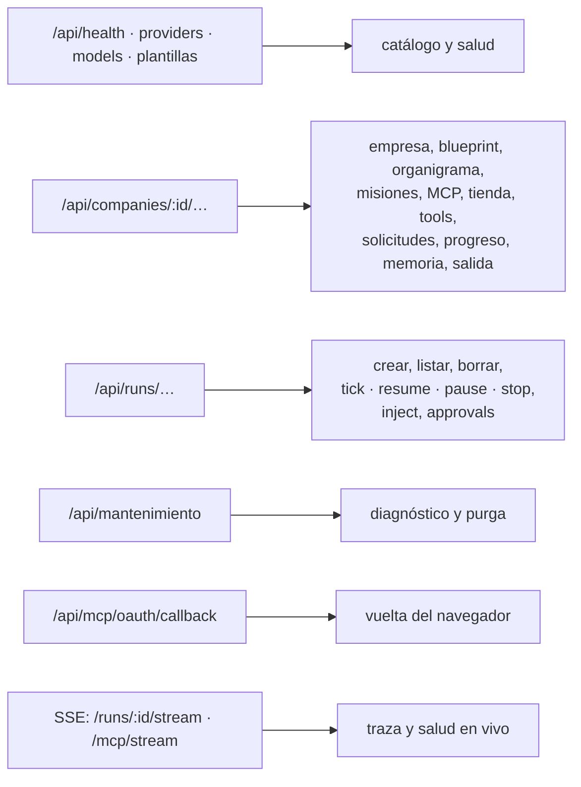

# Referencia de API

Cada endpoint de `apps/server/src/routes.ts` → `registerRoutes`: configuración de
la empresa, corridas, salida, memoria, solicitudes, MCP y mantenimiento. Son 72
rutas. Lo de código, IDE y teléfono vive en `apps/server/src/rutas-codigo.ts` y
está en [[Referencia de API de código y móvil]].

Esta nota es la tabla exhaustiva. **Por qué** la API tiene esta forma —REST para
configurar, SSE para mirar, la UI sin polling— está en [[API HTTP y SSE]]; la
forma de cada cuerpo, en [[Referencia de esquemas]]; lo que viaja por SSE, en
[[Referencia de eventos]]; qué hay detrás de cada llamada al `Runtime`, en
[[Runtime del servidor]].

## Convenciones que valen para todas

| Tema | Regla | Dónde |
|---|---|---|
| Base | `http://127.0.0.1:3001`. El servidor escucha **sólo en loopback** (`app.listen({ port, host: "127.0.0.1" })`): no se llega desde la red local. `PORT` cambia el puerto | `apps/server/src/index.ts` |
| Cómo llega la UI | Por el proxy de Vite: `/api` → `127.0.0.1:<PORT>`, con `ws: true` para el espejo del teléfono. Mismo origen para el navegador | `apps/web/vite.config.ts` |
| Cuerpo | JSON. Tope `bodyLimit` de 10 MB (los entregables pueden ser grandes); más grande → 413 | `apps/server/src/app.ts` → `construirApp` |
| Validación | Zod `safeParse` → **400** `{ error: "Los datos enviados no son válidos.", issues: [{ path, message }] }` | `routes.ts` → `invalid` |
| No existe | **404** `{ error: "No existe <tipo> con id \"<id>\"." }` | `routes.ts` → `notFound` |
| Conflicto | **409** `{ error }`: corrida viva, nombre repetido, un estado que no admite la acción | cada ruta |
| Error no manejado | **500** de Fastify: `{ statusCode, error, message }` | Fastify |
| Autenticación | Ninguna: es una herramienta local de una persona. Lo que acota es el loopback, el CORS y que los ids no se adivinan | — |
| Ids | `<prefijo>_<ms en base36><6 aleatorios>` (`cmp_`, `dep_`, `rol_`, `run_`, `mis_`, `mcp_`, `lrn_`, `req_`…). Un `POST` puede traer su propio `id`, y se usa tal cual | `packages/shared/src/ids.ts` → `newId` |

> [!danger] `content-type: application/json` con el cuerpo vacío da 400
> Fastify contesta `400 FST_ERR_CTP_EMPTY_JSON_BODY` ("Body cannot be empty when
> content-type is set to 'application/json'"). `apps/web/src/api.ts` → `request`
> pone el header **sólo cuando hay cuerpo**. Si lo ponés siempre, se rompen todos
> los `DELETE` y los `POST` sin cuerpo (`/runs/:id/stop`, `/exports-vaciar`…).
> Verificado contra el Fastify 5 del repo.

> [!warning] Un `POST` sin cuerpo a las rutas de alta da 500, no 400
> `POST …/{departments,roles,policies}` (`registerChild`), `POST …/mcp-servers` y
> `POST …/misiones` leen `request.body.id` sin `?? {}`: sin cuerpo, el
> `TypeError` sale como 500. Mandá al menos `{}`.

## Mapa de rutas

## Salud, proveedores y plantillas

Ver [[Capa LLM y tiers]] y [[Plantillas de equipo]].

| Método y ruta | Entrada | Respuesta | Efectos y notas |
|---|---|---|---|
| `GET /api/health` | — | `{ ok: true }` | Sin efectos. Contesta si el proceso está vivo |
| `GET /api/providers` | — | `[{ id, label, ok, detail, modelCount, tiers }]` | Por cada proveedor configurado corre `healthCheck()` y, si da ok, `listModels()`; `tiers` sale de `resolverTodosLosTiers`. **Pega a la red** de cada proveedor: tarda lo que tarde el más lento |
| `GET /api/models` | query `refresh=true` | `ModelInfo[]` de todos los proveedores | `ProviderRegistry.allModels` usa `Promise.allSettled`: un proveedor caído no rompe la lista, sólo no aporta. Sin `refresh` sale del caché de cada adaptador |
| `GET /api/plantillas` | — | `{ plantillas, proveedorPreferido }` | `plantillas` = `PLANTILLAS_EQUIPO`. `proveedorPreferido` = `Runtime.proveedorPreferido()`: `claude-sesion` > `anthropic` > `claude-code` > `opencode` > `openrouter`, o el primero registrado, o `null` |

## Empresas

Ver [[Gestión de proyectos]], [[Directorios en disco]] y [[Plantillas de equipo]].
"Proyecto" es el rótulo de la pantalla; el recurso es `Company`.

| Método y ruta | Entrada | Respuesta | Efectos y notas |
|---|---|---|---|
| `GET /api/companies` | — | `Company[]`, por `updated_at` desc | `Store.listCompanies` |
| `GET /api/companies/resumen` | — | `[{ id, name, mission, updatedAt, roles, departamentos, corridas, entregables, misiones, ultimaCorridaAt, corridaViva, disco: { archivos, bytes } }]` | `Store.resumenEmpresas` (cuentas con `GROUP BY`) + `tieneCorridaViva` + `ExportStore.medirEmpresa`, que **no crea** la carpeta. Convive con `/companies/:id` porque Fastify resuelve el segmento estático antes que el paramétrico |
| `GET /api/companies/:id` | — | `{ company, departments, roles, policies, mcpServers, tools }` | 404 si no existe. `tools` es la tabla tal cual: **no** levanta el runtime (para eso, `GET …/tools`) |
| `POST /api/companies` | `companySchema` con `id`, `createdAt` y `updatedAt` opcionales (obligatorios: `name`, `defaultModel`) + `plantillaId?` | **201** `Company`; con plantilla, además `equipo: { roles, herramientasFaltantes, mcpSugeridos }` | Guarda, `Runtime.sembrarHerramientas` (filas `capability` y `skill` en `tools`) y, con plantilla, `generarEquipo`. Plantilla desconocida o sin proveedor → **400 con la empresa ya creada**. Un `id` propio que ya existe pisa esa empresa (`saveCompany` es upsert) |
| `PATCH /api/companies/:id` | parcial de `Company` | `Company` | 404; valida el merge entero. Si cambia `name`, deriva en `renombrarEmpresa`: si no se puede, 409 con el motivo |
| `POST /api/companies/:id/renombrar` | `{ nombre: string }` | `{ company, carpeta }` (`carpeta: null` si no hubo que mudar nada) | 400 sin `nombre`; 404 si no existe; 409 con corrida viva, con servicios de vista previa levantados o con nombre inválido. Efectos: guarda, `ContextoStore.renombrar` (el vault), `Directorios.mudar` + `RepoStore.repararWorktrees` + `reescribirRutasMcp`, y resincroniza los MCP que cambiaron |
| `DELETE /api/companies/:id` | — | `{ ok: true, archivos, bytes }` | 409 si `tieneCorridaViva` (`running` o `awaiting_approval`). En orden: detiene sus servicios, `olvidarEmpresa` (corta sus corridas en memoria y `disconnectAll` de sus MCP), `Store.deleteCompany`, `ExportStore.removeCompany` (la carpeta entera del proyecto: salida, clones y worktrees) y `Directorios.olvidar`. **No** borra el vault (`CONTEXTO_DIR/<Nombre>/`) ni los tokens OAuth de sus servidores (`data/mcp-oauth/<serverId>.json`) |
| `GET /api/companies/:id/blueprint` | — | `{ version: 1, company, departments, roles, policies, mcpServers, tools, repositorios }` | Sin credenciales: los MCP guardan **nombres** de variables. `tools` sin las de origen `mcp` (se redescubren al conectar); `repositorios` sólo los de origen `git`, con `baseSha: null`, `comandos.unaVez: []` y `servicios[].archivosEntorno: []`. No viajan corridas, entregables, memoria, solicitudes, misiones ni sesiones |
| `POST /api/companies/import` | `companyBlueprintSchema` | **201** `{ companyId, reposClonando: string[] }` | Reasigna **todos** los ids con un mapa que mantiene las referencias: se puede importar la misma empresa dos veces. Los repos se vuelven a clonar **en segundo plano** (`void … .catch(log)`) y llegan con `pendienteDeConfirmar: true`: importar un JSON no autoriza a correr nada en esta máquina |

> [!note] Lo que el import no remapea
> `lookup` devuelve el id viejo cuando no lo conoce, así que los `toolIds` que
> apuntaban a herramientas MCP (que no viajan en el blueprint) quedan como ids
> muertos hasta que alguien reasigne; y `otorgarAlConectar` de cada servidor MCP
> sigue nombrando los roles de la empresa original. Ninguno de los dos rompe
> nada: `forRole` resuelve por intersección.

## Organigrama: departamentos, roles y políticas

`registerChild` genera el mismo CRUD para los tres segmentos. Ver
[[Organización de agentes]] y [[Pantalla Empresa y organigrama]].

| Método y ruta | Entrada | Respuesta | Efectos y notas |
|---|---|---|---|
| `GET /api/companies/:companyId/{departments,roles,policies}` | — | la lista | — |
| `POST /api/companies/:companyId/{…}` | `departmentSchema`, `roleSchema` o `policySchema`; `id` opcional (lo pone `ids.*`), `companyId` lo pone la ruta | **201** la entidad | En `roles`, guardar también llama a `actualizarRolEnCorridasVivas` (sin efecto sobre un rol que ninguna corrida tiene) |
| `PATCH /api/companies/:companyId/{…}/:id` | parcial | la entidad | 404 si no está **en esa empresa**; valida el merge. En `roles`, `actualizarRolEnCorridasVivas` incorpora al catálogo de cada corrida viva las herramientas nuevas y emite un `log` "recibe N herramienta(s)… las tiene en su próximo turno" |
| `DELETE /api/companies/:companyId/{…}/:id` | — | `{ ok: true, cascaded }` | Borra **por id**, sin mirar la empresa de la ruta. `roles`: `Store.deleteRole` se lleva sus solicitudes (`cascaded` = cuántas) y **cancela** sus tareas abiertas diciendo por qué; después `removeRoleFromLiveRuns` lo saca de las corridas vivas (emite un `log` warn). `departments` y `policies`: sólo la fila, `cascaded: 0` |

> [!warning] Borrar un departamento por la API deja roles colgando
> `Store.deleteDepartment` no mira quién está adentro: los roles del área quedan
> con un `departmentId` que no existe. El freno está **sólo en la UI**
> (`apps/web/src/routes/Settings.tsx` no deja borrar un área con agentes).

## Misiones

Ver [[Misiones programadas]]. No tienen cliente en `apps/web/src/api.ts`: hoy
se operan por HTTP (curl o un script).

| Método y ruta | Entrada | Respuesta | Efectos y notas |
|---|---|---|---|
| `GET /api/companies/:companyId/misiones` | — | `Mision[]` | — |
| `POST /api/companies/:companyId/misiones` | `misionSchema`; `createdAt` y `updatedAt` los pone la ruta, `id` opcional | **201** `Mision` con `proximaAt` | `MisionScheduler.reprogramar`: `proximaAt = enabled ? proximaCorrida(programacion, ahora) : null`, y guarda. Una expresión inválida deja `proximaAt: null`: no dispara nunca, en vez de dispararse a cualquier hora |
| `PATCH /api/companies/:companyId/misiones/:id` | parcial | `Mision` | 404; merge + validación; **siempre** reprograma: cambiar la programación o reactivarla corre el próximo turno |
| `DELETE /api/companies/:companyId/misiones/:id` | — | **204** sin cuerpo | Borra por id sin verificar que exista. Una corrida que ya largó sigue |
| `POST /api/companies/:companyId/misiones/:id/run` | — | `Run` (snapshot) | 404; **409** si la empresa ya tiene una corrida viva (y reprograma: se pierde el turno). Si no, `startRun` en modo `continuous` con el `budgetUsd` y el `maxTicks` de la misión, guarda `ultimaAt`/`ultimaRunId` y programa el aviso por correo para cuando termine. Si `startRun` falla (empresa sin roles) → 500 |

## Servidores MCP, tienda y OAuth

Ver [[Integración MCP]], [[Tienda MCP]], [[OAuth para servidores MCP]],
[[Pantalla Hub MCP]] y [[Pantalla Tienda]]. Estas rutas no usan
`registerChild`: el alta conecta al toque, el nombre no se repite y el borrado
va en cascada.

| Método y ruta | Entrada | Respuesta | Efectos y notas |
|---|---|---|---|
| `GET /api/companies/:companyId/mcp-servers` | — | `McpServer[]` | Sin efectos: no conecta |
| `POST /api/companies/:companyId/mcp-servers` | `mcpServerSchema` (`name`: 1-64, `^[a-z0-9_-]+$`); `id` opcional | **201** `McpServer` | **409** si el nombre ya existe (es el segmento de `mcp__<servidor>__<tool>`). Guarda y **espera** `companyRuntime` → `McpBridge.sync`: conecta y descubre en el acto; lo descubierto se persiste en `tools` (`persistMcpTools`) |
| `PATCH /api/companies/:companyId/mcp-servers/:id` | parcial | `McpServer` | 404; 409 si el nombre choca con otro servidor; guarda y resincroniza (reconecta lo que cambió) |
| `DELETE /api/companies/:companyId/mcp-servers/:id` | — | `{ ok: true, cascaded, rolesPodados }` | `Runtime.eliminarServidorMcp`: `disconnect` del proceso, saca su salud del mapa, `deleteToolsByMcpServer` (`cascaded` = cuántas tools), `deleteMcpServer`, `olvidarOAuth` (borra el archivo de tokens) y `podarToolIdsHuerfanos` (`rolesPodados`). Con un id que no existe contesta ceros, no 404 |
| `GET /api/mcp/oauth/callback` | query `code`, `state`, `error`, `error_description` | **página HTML** (200) que se cierra sola a los 2,5 s | La vuelta del navegador después de autorizar. `completarAutorizacionMcp(state, code)` recorre las empresas cargadas en memoria buscando el puente que espera ese `state`. Títulos posibles: "Listo: X está autorizado", "No se autorizó", "Falta información", "No encontré ese pedido" (el servidor se reinició o ya se completó) y "No se pudo completar la autorización". Lo que manda el proveedor se escapa antes de pintarlo |
| `GET /api/tienda-mcp` | query `companyId?` | `[ArticuloDeTienda & { instalado, envFaltantes }]` | `instalado` si algún servidor de la empresa tiene ese `catalogoId` o el mismo `name`; `envFaltantes` = `envRequeridas` obligatorias sin valor **en el entorno del servidor**. Sólo nombres de variables, nunca valores |
| `POST /api/companies/:companyId/tienda-mcp/:articuloId` | — | `{ instalados, yaExistian, estado, toolCount, toolNames, herramientasOtorgadas, avisos }` | 404 si el artículo no existe; **409** `{ error, avisos }` si ya estaba instalado. `Runtime.instalarServidoresMcp`: dedupe por nombre, aviso por credencial faltante (no frena), alta con `autoApproveTools: true`, sync esperando el handshake y descubrimiento. **No le otorga** las herramientas a ningún rol |

> [!note] La URL de vuelta de OAuth sale de `API_URL`
> El proveedor OAuth se registra con
> `${API_URL}/api/mcp/oauth/callback` (`Runtime.fabricaOAuth`). Si el navegador
> donde autorizás no llega a esa URL, la vuelta no encuentra al servidor.

## Herramientas y salud de MCP

| Método y ruta | Entrada | Respuesta | Efectos y notas |
|---|---|---|---|
| `GET /api/companies/:companyId/tools` | — | `Tool[]` | **Levanta el runtime de la empresa**: registra habilidades, contexto, correo, compuestas y código, y sincroniza los MCP (puede arrancar procesos `npx`). Por eso las tools MCP aparecen aunque nunca haya corrido nada. Ver [[Catálogo de herramientas]] |
| `GET /api/companies/:companyId/mcp/health` | — | `McpServerHealth[]` | También levanta el runtime. `Runtime.mcpHealth` filtra por lo que **sigue configurado** en la base: sin servidores fantasma |
| `POST /api/companies/:companyId/mcp/:serverId/reconnect` | — | `{ ok: true }` | 404 si el servidor no está configurado; `McpBridge.connect` |
| `POST /api/companies/:companyId/mcp/probe` | `{ toolName: string (≥1), args: object = {} }` | `{ ok, content }`, siempre 200 | Ejecuta una herramienta fuera de toda corrida, con el **primer rol** como actor y `runId: "probe"`. Contesta `ok: false` para las de coordinación, las habilidades y las compuestas: necesitan una corrida |

## Solicitudes de los agentes

Ver [[Aprobaciones y solicitudes]] y [[Pantalla Solicitudes]].

| Método y ruta | Entrada | Respuesta | Efectos y notas |
|---|---|---|---|
| `GET /api/companies/:companyId/requests` | — | `AgentRequest[]` | Pendientes primero; dentro de cada grupo, la más nueva primero |
| `POST /api/companies/:companyId/requests/:id` | `{ decision: "approve"\|"reject", resolution: string ≤8000 = "", roleProposal: RoleProposal\|null = null, comando: { alcance: "siempre"\|"una-vez", prefijo?: string[] (≤40 tokens de ≤400) }\|null = null }` | `{ request, aplicado, entrega: "bandeja"\|"memoria"\|"descartada" }` | 404; **409** si ya no está `pending`. Al aprobar corre `Runtime.applyRequest`; si tira, **400 y la solicitud sigue pendiente**. Después guarda `status`/`resolution`/`resolvedAt`, `notifyRequester` (la respuesta llega a la bandeja, o a la memoria si su corrida ya no está) y `reanudarSiEsperaba(runId)`: contestar destraba sin apretar "continuar" |

Qué hace **aprobar** según el `type` de la solicitud (`Runtime.applyRequest`):

| `type` | Efecto | `aplicado` |
|---|---|---|
| `context` | Nada en la configuración. La respuesta le llega como mensaje `response` con el dato primero. Si su corrida ya no está viva, entra como lección de la empresa recortada a 600 caracteres, y el texto entero va al vault bajo `Consultas/` | `{}` |
| `create_role` | Crea el rol (y el área si no existe) con el modelo por defecto de la empresa y escalado acotado por autoridad (`conEscaladoPorAutoridad`), `maxTurns: 6`; lo suma a la corrida viva. Nombre repetido → 400. `roleProposal` en el cuerpo permite editar la propuesta antes | `{ roleId, roleName, departmentId }` |
| `tool_access` | Otorga las herramientas que existen en el catálogo; también en la corrida viva (`updateRoleTools`) | `{ otorgadas, inexistentes }` |
| `mcp_server` | `instalarServidoresMcp` otorgando lo descubierto **al solicitante**, también en su corrida viva. Si todos ya existían → 400 | `{ servidores, estado, herramientasOtorgadas, yaExistian?, avisos? }` |
| `comando` | `una-vez`: agrega el argv exacto a `comandos.unaVez` (se consume al usarse). `siempre`: el `prefijo` (tiene que ser el principio del pedido y pasar `validarPrefijoPermitido`) va a `comandos.permitidos` | `{ comando, alcance }` |
| `dependencia` | **Instala**: revalida paquetes y carpeta, corre el gestor en el sandbox con red y sin scripts (corte de 5 min); con `commitsAutomaticos` hace checkpoint a nombre de quien aprobó. Si falla, o si un agente tiene el arriendo del repo → 400 y queda pendiente | `{ instalados, comando, checkpoint, salida }` |

## Progreso y memoria

Ver [[Observabilidad y trazas]], [[Memoria de la empresa]], [[Vault de contexto]]
y [[Pantalla Memoria]].

| Método y ruta | Entrada | Respuesta | Efectos y notas |
|---|---|---|---|
| `GET /api/companies/:companyId/progreso` | — | `{ run, viva, progreso: { eventos, acciones, ultimaSenalAt } }`, o `{ run: null, viva: false, progreso: null }` | La corrida **más reciente**, viva o no. `run` es el snapshot del orquestador si sigue en memoria (el de la base queda viejo al pausar o detener). `progresoDeCorrida` cuenta con agregados sobre `idx_events_run` y lee **una** fila; `acciones` cuenta `tool.end`. Lo pide el shell en todas las pantallas, así que tiene que ser barato |
| `GET /api/companies/:companyId/learnings` | — | `Learning[]` | Por `timesConfirmed` desc y `updatedAt` desc. Incluye las refutadas: la pantalla las muestra aparte. Lee con `Store.listLearnings` (parse por Zod) |
| `POST /api/companies/:companyId/learnings` | `{ topic: 1-120, lesson: 1-4000 }` | **201** la lección nueva, o **200** la gemela confirmada | Dedupe con `normalizarLeccion`, la misma regla que `record_lesson`. Si ya existe: `timesConfirmed + 1` y una entrada en `confirmaciones` `{ roleId: null, runId: null, at }` (tope 20). Si es nueva: `evidencia: "cargada a mano por la persona a cargo"`, `estado: "activa"`. En los dos casos espeja la nota del tema en el vault |
| `PATCH /api/companies/:companyId/learnings/:id` | `{ topic?, lesson?, estado?: "activa"\|"cuestionada"\|"refutada", motivoDeRefutacion?: 1-600 }` | `Learning` | 404; **400** si `estado: "refutada"` llega sin motivo. Refutar pone `refutacion: { motivo, at }` y la saca del prompt sin borrarla; cualquier otro `estado` explícito limpia el tombstone. Espeja el tema nuevo y, si cambió, también el viejo |
| `DELETE /api/companies/:companyId/learnings/:id` | — | `{ ok: true }` | Lee el tema **antes** de borrar y espeja: si el tema quedó vacío, la nota del vault se borra. Sin 404 |

## Salida de la empresa

Ver [[Salida de la empresa]], [[Archivos de salida y permisos de borrado]] y
[[Pantalla Salida]]. El comodín `*` es la ruta dentro de `salida/`.

| Método y ruta | Entrada | Respuesta | Efectos y notas |
|---|---|---|---|
| `GET /api/companies/:companyId/exports` | — | `TreeFolder` (`{ kind: "folder", name: "salida", path: "", children }`) | `ExportStore.tree` con `pathFor`: mirar no crea la carpeta. Oculta lo que empieza con punto (el manifiesto `.orq-generado.json`). Cada archivo trae `sizeBytes`, `modifiedAt`, `esMultimedia` y `generadoPorAgente`. Carpetas primero, cada grupo alfabético |
| `POST /api/companies/:companyId/exports/folders` | `{ path: 1-300 }` | **201** `{ path }` saneado | 400 si la ruta se sanea a nada |
| `DELETE /api/companies/:companyId/exports/*` | — | `{ ok: true }` | 400 `{ error }` si no existe, si es una carpeta o si la ruta no es válida. **Sin** las reglas de jerarquía de `puedeBorrar` (acá decide una persona) y sin papelera. Saca el archivo del manifiesto |
| `GET /api/companies/:companyId/exports-preview/*` | — | `{ kind, text?, motivo?, sizeBytes }` con `kind` ∈ `pdf`, `image`, `video`, `audio`, `page`, `text`, `none` | PDF, imagen, video, audio y `.html` (`page`) se deciden por la extensión **sin leer el archivo** (`previewLiviano` + `pesoDe`); texto se devuelve entero; `.docx` → texto extraído de `word/document.xml`; lo demás, `none` con motivo. 404 si no existe |
| `POST /api/companies/:companyId/exports-publicar/*` | query `reemplazar=1\|true` | `{ ok: true, path }` (`publicado/<subcarpeta>/<archivo>`) | **409** `{ error, existe: true }` si ya hay una versión publicada ahí: la UI pregunta y reintenta con `?reemplazar=1`. 400 si no existe o ya está en `publicado/`. Mueve el archivo (`rename`) y muda su procedencia en el manifiesto. Es lo único del circuito que un agente no puede hacer |
| `POST /api/companies/:companyId/exports-vaciar` | — | `{ borrados, conservados, bytes }` (cuentas) | `ExportStore.vaciarGenerado`: borra lo que el manifiesto marca como generado y conserva lo que trajo una persona (el logo de `marca/`) |
| `GET /api/companies/:companyId/exports/*` | query `inline` (basta con que esté); cabecera `Range: bytes=a-b` | los bytes | `content-type` por extensión (`contentTypeOf`), `content-disposition: attachment` salvo con `?inline`, `accept-ranges: bytes`. Rango válido → **206** con `content-range`; inválido → **416**. 404 si no existe |

> [!warning] `?inline` no es opcional dentro de un iframe
> Un `content-disposition: attachment` dentro de un iframe **dispara la descarga**
> en vez de dibujarse. La pantalla Salida usa `api.exportInlineUrl`.

> [!warning] Un archivo con tildes o espacios se ve pero no se abre
> Toda ruta que llega se sanea con `ExportStore.safePath` (saca las tildes y
> cambia lo que no es `[\w.-]` por `-`), pero el árbol lista el nombre real del
> disco. Un archivo que dejaste a mano como `Presentación final.pdf` aparece en
> el árbol, y `GET`, `DELETE` y publicar buscan `Presentacion-final.pdf`: 404 o
> 400. Lo que escriben los agentes ya nace con nombre saneado. No hay endpoint de
> subida: lo que trae una persona se copia a la carpeta a mano.

> [!warning] Un `.html` con `?inline` corre con el origen de la app
> Se sirve desde el mismo origen que la UI y **sin** `Content-Security-Policy`.
> Lo que lo aísla es el `sandbox=""` del iframe de la pantalla Salida
> (`apps/web/src/routes/Output.tsx`). Abierto por el enlace directo en otra
> pestaña, no lo protege nada. La vista previa de código sí manda la CSP desde el
> servidor: ver [[Referencia de API de código y móvil]].

> [!note] Un pedido de rango lee el archivo entero
> `ExportStore.read` trae todo el archivo a memoria y después se recorta el rango.
> Un video grande se relee completo en cada salto de la barra de tiempo.

## Corridas

Ver [[Scheduler y ciclo de una corrida]], [[Estado de una corrida]],
[[Runtime del servidor]] y [[Pantalla Proceso en vivo]].

| Método y ruta | Entrada | Respuesta | Efectos y notas |
|---|---|---|---|
| `POST /api/runs` | `createRunSchema`: `{ companyId, objective: 1-8000, mode: "manual"\|"continuous"\|"cron" = "manual", maxTicks?: 1-500, budgetUsd?: >0 y ≤1000, cronIntervalMs?: ≥1000, foco?: { rolId, repoId, contexto: ≤40 000 = "", conversacionId?: /^[a-z0-9_-]{4,60}$/i } }` | **201** `Run` (snapshot) | 400 si falla la validación o `startRun` (empresa inexistente, sin roles, rol o repo del foco ajenos). Arma `CompanyConfig` con roles, tools, memoria, solicitudes, **entregables de la empresa** y **tareas abiertas heredadas**; guarda la corrida; manda el encargo como mensaje `human` al rol `executive` sin jefe (o al del foco, con la historia de la conversación y el contexto adjunto); y según `mode` arranca `runContinuous()` o el cron. Con `foco`: el organigrama se reduce a ese rol, no adopta tareas y, si es el Mejorador o el QA móvil, antes los pone al día |
| `GET /api/runs` | query `companyId?` | `Run[]`, por `started_at` desc | Sin `companyId`, **las últimas 100**; con él, todas las de la empresa. Son filas de la base: el estado de una corrida viva puede estar viejo |
| `GET /api/runs/:id` | — | `{ run, messages, tasks, artifacts, approvals, ledger, live }` | 404 si no está ni en memoria ni en la base. `run` es el snapshot del orquestador si vive; `artifacts`, sólo los que guardó esta corrida; `live`, si sigue en memoria (se puede continuar) |
| `GET /api/runs/:id/events` | — | `TraceEvent[]` por `seq` | La traza entera, sin paginar: es el replay |
| `DELETE /api/runs/:id` | — | `{ ok: true }` | **409** si está `running`; **409** si sigue en memoria sin estado terminal (`idle`, `paused`, `awaiting_approval`): todavía se puede continuar. Efectos: `olvidarCorrida` (para el orquestador y suelta a los suscriptores) + `Store.deleteRun`. **Nunca** se lleva entregables. Sin 404 |
| `DELETE /api/companies/:companyId/runs/terminadas` | — | `{ borradas }` | Borra las que no `sePuedeContinuar`: terminales o fuera de memoria |
| `DELETE /api/runs/terminadas` | — | `{ borradas }` | Lo mismo en todas las empresas, sin el tope de 100 (`listAllRuns`). Convive con `/api/runs/:id` porque gana el segmento estático: una corrida no puede llamarse `terminadas` |

`maxTicks` por defecto es 4 con `foco` y `DEFAULT_MAX_TICKS` sin él; `budgetUsd`
sale del pedido, de la empresa o de `DEFAULT_RUN_BUDGET_USD`; `cronIntervalMs`,
60 000. Ver [[Variables de entorno]].

### Ciclo de vida, inyección y aprobaciones

Las cuatro acciones se registran en un bucle sobre
`["tick", "resume", "pause", "stop"]`. **No existe `/start`**: una corrida
arranca al crearla con `mode: "continuous"` o `"cron"`, o se avanza a mano con
`tick`.

| Método y ruta | Entrada | Respuesta | Efectos y notas |
|---|---|---|---|
| `POST /api/runs/:id/tick` | — | `{ advanced, reason }` | **Espera el ciclo entero** antes de contestar (pueden ser minutos) y guarda el snapshot. 409 si la corrida no está en memoria |
| `POST /api/runs/:id/resume` | — | `{ started: true }`, al toque | Valida **antes** con `estaEnMemoria` (409 si no sobrevivió a un reinicio: "las tareas abiertas se heredan") y después `void runtime.resume(id).catch(log)` |
| `POST /api/runs/:id/pause` | — | `{ ok: true, run }` | `Orchestrator.pause` deja `pauseRequested`: la pausa se hace efectiva al cerrar el ciclo en vuelo y no pisa `awaiting_approval`. Persiste el snapshot. 409 fuera de memoria |
| `POST /api/runs/:id/stop` | — | `{ ok: true, run }` | Deja la corrida en estado terminal: ya no se continúa. 409 fuera de memoria |
| `POST /api/runs/:id/inject` | `{ toRoleId, subject: ≤300 = "", body: 1-50 000 }` | `{ ok: true }` | 409 si no está en memoria, si ya terminó (`completed`, `stopped`, `failed`, `budget_exceeded`) o si el rol no existe. Manda un mensaje `human` (asunto por defecto "Mensaje de la persona a cargo") y emite `agent.message` |
| `POST /api/runs/:id/approvals/:approvalId` | `{ decision: "grant"\|"deny", resolution: ≤4000 = "" }` | `{ ok: true }` | 404 si no hay una aprobación **pendiente** con ese id; 409 fuera de memoria. Emite `approval.changed`. Aprobar **ejecuta** la llamada con los argumentos que vio la persona (`ejecutarAprobada`, que emite `tool.start`/`tool.end` con `callId: aprobada-<id>`) y el resultado le llega al solicitante. Contesta **después** de ejecutar. Si era la última, la corrida pasa a `paused` y `reanudarSiEsperaba` la retoma sola |

> [!danger] La promesa sin dueño que tiraba el servidor
> `resume` contesta sin esperar porque retomar dura minutos. Antes hacía
> `void runtime.resume(id)` sin validar: sobre una corrida que no sobrevivió a
> un reinicio, el `throw` salía por una promesa rechazada sin manejar y **Node se
> caía**, llevándose puestas las corridas que sí trabajaban. Lo pagamos dos veces
> en la misma tarde. Por eso las dos defensas: validar antes con
> `estaEnMemoria` (no `estaViva`: una pausada no corre y sí se puede continuar) y
> el `.catch` en el `void`. Cualquier otro "contestar y seguir" del servidor
> necesita las dos.

## Mantenimiento

Ver [[Limpieza y mantenimiento]] y, del lado de la base,
[[Persistencia y esquema SQL]].

| Método y ruta | Entrada | Respuesta | Efectos y notas |
|---|---|---|---|
| `GET /api/mantenimiento` | — | `{ base: { bytes, residuos: { porEmpresa, porCorrida, filas } }, carpetas: [{ carpeta, archivos, bytes, modifiedAt }], corridasTerminadas }` | Sólo mide: `Store.pesoEnDisco` (tamaño lógico), `Store.residuos`, `ExportStore.carpetasResiduales` y cuántas corridas no `sePuedeContinuar` |
| `POST /api/mantenimiento/purgar` | `{ residuos: boolean = false, carpetas: string[] = [], corridas: boolean = false, compactar: boolean = false }` | `{ corridas, residuos: Residuos\|null, carpetas, rechazadas: [{ carpeta, motivo }], bytesEnDisco, base: { antes, despues } }` | Orden fijo: mide la base → borra las corridas terminadas de todas las empresas → `purgarResiduos` (después, porque cada corrida borrada deja huérfanas sus filas) → borra sólo las carpetas que **siguen** siendo residuales ahora (las demás van a `rechazadas` con "Ya no figura como residual.") → `VACUUM` al final, fuera de toda transacción |

> [!note] `antes === despues` sin `compactar` es lo correcto
> SQLite marca las páginas borradas como libres y las reusa: sin `VACUUM` el
> tamaño no cambia, y eso es justamente lo que explica para qué está la opción.
> Con `compactar`, `despues` es el tamaño **lógico** y baja en el acto aunque el
> archivo en disco tarde hasta el próximo checkpoint del WAL. Ver
> [[Base de datos]].

## Streams SSE

| Método y ruta | Respuesta | Notas |
|---|---|---|
| `GET /api/runs/:id/stream` | `event: trace`, un `TraceEvent` por mensaje | Primero reenvía la traza guardada (`listEvents`) y después engancha lo vivo; las dos cosas son sincrónicas, así que no hay hueco entre medio. Una reconexión reenvía todo: el cliente (`apps/web/src/lib/stream.ts` → `useRunStream`) deduplica por `id` |
| `GET /api/mcp/stream` | `event: mcp`, un `McpServerHealth` por mensaje | **Global**: la salud de todos los servidores de todas las empresas cargadas, haya o no corridas. La UI filtra por lo que está configurado |

`openSse` escribe `Content-Type: text/event-stream`,
`Cache-Control: no-cache, no-transform`, `Connection: keep-alive` y
`X-Accel-Buffering: no`; manda `: conectado` al abrir y `: ping` cada **20 s**
para que ningún proxy corte la conexión (el intervalo lleva `unref`). Al cerrarse
el pedido se desuscribe. El tercer stream, el de código, está en
[[Referencia de API de código y móvil]].

## Seguridad

- **Loopback.** Sin autenticación, lo primero que protege es que el servidor
  escucha en `127.0.0.1`. Ver [[Seguridad]].
- **CORS cerrado a la app.** `construirApp({ origenes })` recibe desde
  `index.ts` la lista `new URL(APP_URL).origin`, `localhost:5173`,
  `127.0.0.1:5173`, `localhost:<PORT>` y `127.0.0.1:<PORT>`. La regla es
  `!origen || permitidos.has(origen)`: un pedido **sin** `Origin` (curl, otro
  proceso) pasa; `Origin: null` —la vista previa de código, que corre con
  origen opaco— no recibe `Access-Control-Allow-Origin`. Sin la lista (los
  tests con `inject`), `origin: true`.
- **Sin secretos en las respuestas.** El blueprint y la tienda devuelven
  nombres de variables, nunca valores; los tokens OAuth viven fuera de la base.

> [!warning] El CORS cerrado no es una protección contra CSRF
> CORS decide qué página puede **leer** la respuesta y bloquea lo que necesita
> preflight (`DELETE`, `PUT`, `PATCH` y todo `POST` con JSON). Un `POST` "simple"
> —sin cuerpo, o con `text/plain`— desde cualquier página **igual se ejecuta**:
> verificado con `@fastify/cors` y la misma regla, el handler corrió y sólo faltó
> la cabecera. Las rutas que actúan sin cuerpo (`/runs/:id/stop`,
> `/exports-vaciar`, `/misiones/:id/run`…) dependen de que los ids no se
> adivinan. Lo mismo vale para los `GET` con efectos: `GET …/tools` y
> `GET …/mcp/health` arrancan servidores MCP.

## Casos borde y fallas conocidas

| Síntoma | Causa |
|---|---|
| La pantalla de proveedores tarda | `GET /api/providers` pega a la red de cada proveedor en cada pedido |
| Abrir el diseñador de la empresa arranca procesos | `GET …/tools` y `GET …/mcp/health` levantan el runtime y conectan los MCP |
| Crear un proyecto con plantilla da 400 pero el proyecto aparece | La empresa se guarda antes de `generarEquipo` |
| Un rol queda con un área inexistente | Se borró el departamento por la API, que no valida |
| Borrar una corrida pausada da 409 | Está en memoria y se puede continuar: hay que terminarla primero |
| `POST /runs/:id/resume` da 409 "no está activa en memoria" | La corrida no sobrevive a un reinicio del servidor; se arranca una nueva y hereda las tareas abiertas |
| `tick` tarda minutos en contestar | Espera el ciclo entero, a diferencia de `resume` |
| Aprobar tarda | El endpoint ejecuta la herramienta aprobada antes de contestar |
| Un archivo de la salida aparece y da 404 | Nombre con tildes o espacios: el pedido se sanea y no coincide |
| Borrar un proyecto deja carpetas | El vault y los tokens OAuth no se borran con la empresa |

## Qué fijan los tests

- `apps/server/src/routes.test.ts` (HTTP de verdad con `app.inject` sobre
  `construirApp`):
  - una lección vacía contesta **400 con `issues`**, no 500;
  - cargar dos veces la misma lección (distinta capitalización) no crea una fila
    gemela: `timesConfirmed` pasa a 2 con una confirmación;
  - `PATCH` refutar sin motivo → 400; con motivo queda `refutada` y la nota del
    vault dice "Refutada:";
  - `DELETE` saca la lección de la base **y** del vault;
  - una fila vieja sin los campos nuevos se lee `activa`, sin evidencia y sin
    confirmaciones (el parse por Zod de `listLearnings`).
- `apps/server/src/ide.test.ts` → "CORS": la app (`http://localhost:5173`)
  recibe `Access-Control-Allow-Origin`; `https://malicioso.example` y el origen
  `null` de la vista previa, no. Y `POST /api/runs` con `foco` da 201, un solo
  rol y `maxTicks: 4`.
- `apps/server/src/db.test.ts` fija lo que sostienen las rutas de borrado y de
  mantenimiento: `deleteRun` conserva los entregables, `residuos` anuncia
  exactamente lo que `purgarResiduos` borra, `deleteCompany` no deja residuos.
  Ver [[Persistencia y esquema SQL]].

La cobertura por HTTP es parcial a propósito: prioriza la memoria, donde una fila
mal escrita degrada todas las corridas siguientes. El resto de las rutas se
prueba a través del `Runtime` y del `Store`.

## Cómo agregar un endpoint

1. Elegí el archivo: `registerRoutes` (`routes.ts`) o `registrarRutasDeCodigo`
   (`rutas-codigo.ts`). Los dos se montan en `construirApp`, que usan
   `index.ts` y los tests.
2. Validá con Zod —el esquema de `@orq/shared` si el dato es del dominio— y
   contestá con `invalid` y `notFound`, así los errores tienen la misma forma.
3. Si tarda, contestá al toque con `void promesa.catch(log)`, pero validá
   **antes** todo lo que pueda fallar de entrada (la lección de `resume`).
4. Si lo que cambiás tiene que llegar a una corrida viva, pasá por el `Runtime`
   (`actualizarRolEnCorridasVivas`, `removeRoleFromLiveRuns`,
   `resolverSolicitud`), no por el `Store` directo: la corrida congela su
   configuración al arrancar.
5. Si pasa algo que la UI tiene que ver, que emita: un evento de la traza (ver
   [[Cómo agregar un evento]]) o el canal de código.
6. Agregá el método en `apps/web/src/api.ts`, **sin** `content-type` si no hay
   cuerpo.
7. Un segmento estático al lado de uno paramétrico (`/runs/terminadas` y
   `/runs/:id`) funciona: Fastify resuelve primero el estático, se declaren en
   el orden que sea.
8. Probalo con `app.inject` sobre `construirApp` y `armarEntorno`
   (`apps/server/src/testing/entorno.ts`), como `routes.test.ts`.

## Fuentes

- `apps/server/src/routes.ts` → `registerRoutes`, `registerChild`, `limpiarTerminadas`, `invalid`, `notFound`, `openSse`
- `apps/server/src/app.ts` → `construirApp` (CORS, `bodyLimit`, upgrades)
- `apps/server/src/index.ts` → orígenes permitidos, `listen` en loopback
- `apps/server/src/runtime.ts` → `startRun`, `applyRequest`, `notifyRequester`, `reanudarSiEsperaba`, `eliminarEmpresa`, `renombrarEmpresa`, `eliminarServidorMcp`, `instalarServidoresMcp`, `probeTool`, `mcpHealth`, `espejarAprendizajes`, `estaEnMemoria`, `sePuedeContinuar`, `tieneCorridaViva`
- `apps/server/src/misiones.ts` → `MisionScheduler.reprogramar`, `disparar`
- `apps/server/src/exports.ts` → `ExportStore.tree`, `publicar`, `vaciarGenerado`, `safePath`, `previewLiviano`, `previewDe`, `contentTypeOf`
- `packages/engine/src/scheduler.ts` → `Orchestrator.resolveApproval`, `ejecutarAprobada`, `pause`
- `packages/shared/src/schema.ts` → `createRunSchema`, `injectMessageSchema`, `resolveApprovalSchema`, `companyBlueprintSchema`, `mcpServerSchema`, `misionSchema`
- `apps/web/src/api.ts` → `request`, `api`
- `apps/server/src/routes.test.ts`, `apps/server/src/ide.test.ts`

## Ver también

- [[API HTTP y SSE]] — el contrato y por qué
- [[Referencia de API de código y móvil]] — `rutas-codigo.ts` y el WebSocket
- [[Referencia de esquemas]] · [[Referencia de eventos]]
- [[Runtime del servidor]] · [[Persistencia y esquema SQL]] · [[Base de datos]]
- [[Frontend web]] — quién consume esto
