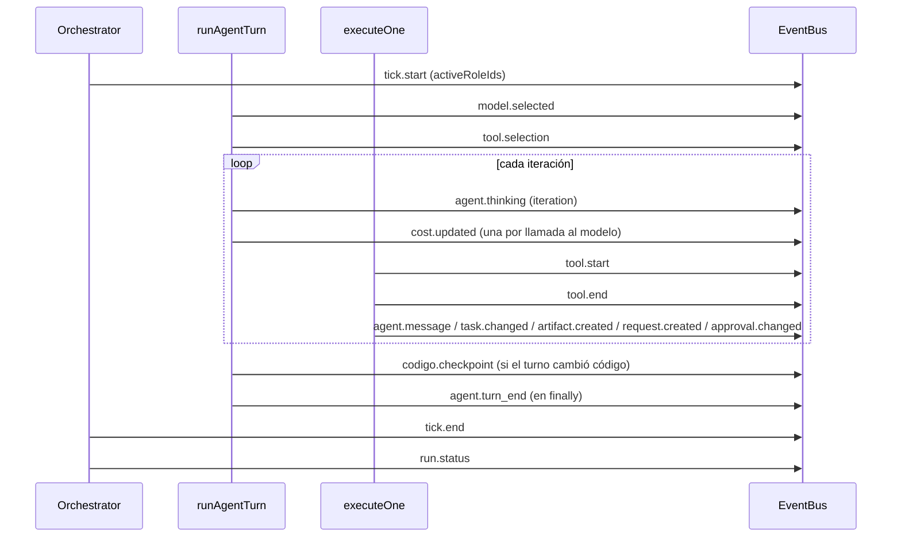

# Referencia de eventos

`packages/shared/src/events.ts`: la traza de una corrida como unión
discriminada por `type`, **18 variantes**. El motor emite, el servidor persiste
y reemite por SSE, y la UI dibuja todo a partir de este stream: un paso que no
está acá es un paso que nadie puede ver. El circuito completo está en
[[Observabilidad y trazas]].

## Lo común

Todos los eventos llevan:

| Campo | Tipo | Quién lo pone |
|---|---|---|
| `id` | `idSchema` (`evt_…`) | `EventBus.emit` |
| `runId` | `idSchema` | el emisor |
| `tick` | entero ≥ 0 | el emisor (`state.tick` casi siempre) |
| `at` | timestamp | `EventBus.emit` (`Date.now()`) |

- `TraceEventInput` es el mismo evento **sin `id` ni `at`**: es lo que recibe
  `EventBus.emit` (`packages/engine/src/events.ts`).
- `isEvent(event, "tipo")` estrecha la unión a una variante.
- `TraceEventType` es la unión de los `type`.

> [!warning] Nadie parsea eventos en runtime
> `traceEventSchema` sólo sirve para inferir tipos. Ni el bus ni `Store` lo usan,
> así que los `.default()` de acá no se aplican: cada emisor pasa todos los
> campos (el tipo `TraceEventInput` se lo exige) y los topes (`preview` ≤ 500 o
> ≤ 2.000) son un contrato que respetan los emisores —recortan a 300 y 400—, no
> una validación.

## Resumen

| Evento | Familia | Emisor principal | Lo dibuja |
|---|---|---|---|
| `run.status` | corrida | `Orchestrator.setStatus` | estado de la corrida, feed |
| `tick.start` | corrida | `Orchestrator.tick` | encabezado del ciclo |
| `tick.end` | corrida | `Orchestrator.tick` | encabezado del ciclo |
| `agent.thinking` | agente | `runAgentTurn` | el nodo pulsa |
| `model.selected` | agente | `runAgentTurn` | ícono de modelo, feed si escaló |
| `agent.turn_end` | agente | `runAgentTurn` (`finally`) | el nodo deja de pulsar, respuesta del chat |
| `agent.message` | agente | `emitCoordinationEffect`, `Runtime.inject` | paquete por la arista |
| `tool.selection` | herramientas | `runAgentTurn` | "Herramientas a mano" |
| `tool.start` | herramientas | `executeOne`, `ejecutarAprobada`, CLI | herramienta en curso |
| `tool.end` | herramientas | `executeOne`, `ejecutarAprobada`, CLI | acciones, contador del pulso, auditoría |
| `mcp.status` | MCP | **nadie** | (feed, si llegara) |
| `task.changed` | trabajo | `emitCoordinationEffect` | tablero |
| `artifact.created` | trabajo | `emitCoordinationEffect` | feed |
| `request.created` | trabajo | `emitCoordinationEffect` | feed |
| `approval.changed` | trabajo | `executeOne`, `emitCoordinationEffect`, `resolveApproval` | feed |
| `cost.updated` | costo | `runAgentTurn` | barra de presupuesto, tokens |
| `log` | diagnóstico | motor y servidor | feed |
| `codigo.checkpoint` | código | `Runtime.depsDeCodigo` → `emitirCheckpoint` | feed, chat del IDE |

Rutas: `emitCoordinationEffect`, `executeOne` y `runAgentTurn` están en
`packages/engine/src/loop.ts`; `Orchestrator` en `packages/engine/src/scheduler.ts`.

## Orden de un turno

`model.selected` y `tool.selection` salen **antes** de la primera llamada al
modelo. El checkpoint sale al cerrar el espacio de código, en el `finally`,
justo antes de `agent.turn_end`.

---

## Ciclo de la corrida

### `run.status`

| Campo | Tipo | Default | Nota |
|---|---|---|---|
| `status` | `RunStatus` | — | los 8 estados |
| `reason` | string, nullable | `null` | el motivo que muestra la UI (`stopReason`) |

- **Emite**: `Orchestrator.setStatus`, que sólo emite si cambia el par estado +
  motivo, y además persiste la corrida (`onRunUpdate` → `Store.saveRun`).
  `finish` pasa por acá.
- **Consume**: `apps/web/src/lib/derive.ts` → `derive` (`status`,
  `stopReason`); feed y timeline de `LiveProcess.tsx`.
- **Borde**: `Store.sanearCorridasHuerfanas` cierra al arrancar las corridas que
  quedaron vivas escribiendo la fila, **sin evento**: la traza de esa corrida
  termina en el último estado que alcanzó a emitir.

### `tick.start`

| Campo | Tipo | Nota |
|---|---|---|
| `activeRoleIds` | id[] | los roles con trabajo, ya ordenados por urgencia |

- **Emite**: `Orchestrator.tick`, una vez por ciclo, después de reencolar
  pedidos sin respuesta.
- **Borde**: lista sólo la **primera tanda** de la cadena; quien recibe trabajo
  dentro del mismo ciclo (`correrCadena`) corre sin figurar acá. Con la lista
  vacía, el ciclo no tiene `tick.end`: termina en `run.status`.

### `tick.end`

| Campo | Tipo | Nota |
|---|---|---|
| `messagesEmitted` | entero ≥ 0 | mensajes nuevos en el ciclo |
| `costUsd` | número ≥ 0 | gasto del ciclo |

- **Emite**: `Orchestrator.tick` al cerrar la cadena. No sale si el ciclo
  termina la corrida antes (tres ciclos sin turnos buenos, excepción,
  presupuesto).
- **Consume**: encabezado del ciclo en el feed de `LiveProcess.tsx`.

## Actividad del agente

### `agent.thinking`

| Campo | Tipo | Nota |
|---|---|---|
| `roleId` | id | el nodo del organigrama empieza a pulsar |
| `providerId` · `modelSlug` | string | |
| `iteration` | entero ≥ 0 | vuelta dentro del turno, desde 1 |

- **Emite**: `runAgentTurn`, al empezar cada iteración, antes de llamar al
  modelo. Un turno delegado a un CLI tiene una sola.
- **Consume**: `derive` (`thinking = true`, `modelSlug`) → `OrgGraph`; feed
  ("piensa", "sigue pensando · vuelta N").

### `model.selected`

| Campo | Tipo | Default | Nota |
|---|---|---|---|
| `roleId` | id | — | |
| `providerId` · `modelSlug` | string | — | lo que resolvió `ProviderRegistry.resolveModel` |
| `tier` | `ModelTier`, nullable | `null` | `null` cuando el rol fijó un slug |
| `escalado` | boolean | `false` | `true` si el tier lo eligió el medidor de dificultad |
| `motivo` | string | — | explicación legible |

- **Emite**: `runAgentTurn`, **en todo turno**, con o sin escalado: sin él, un
  costo que varía entre turnos no se podría explicar. `motivo` es
  `"<razones> → <tier> (puntaje N, rango min..max)"` si escaló
  (`dificultad.ts` → `elegirTierPorDificultad`), `"Modelo fijado por el rol: <slug>."`
  o `"Tier <tier> del rol, sin escalado."`.
- **Consume**: `derive` (`providerId`, `tier`, `escaladoPorDificultad`,
  `motivoModelo`) → ícono de modelo del organigrama (`ui/modelo.tsx`); el feed
  lo dibuja **sólo si `escalado`**; `apps/server/src/auditoria.ts` marca
  `turno-sin-modelo` si un `agent.turn_end` no tiene su `model.selected` en el
  mismo tick.
- **Tests**: `packages/engine/src/loop.test.ts` → "escalado de modelo por
  dificultad" (tier mínimo, tier máximo con bandeja cargada, "un modelSlug fijo
  apaga el escalado y el evento lo dice").

### `agent.turn_end`

| Campo | Tipo | Default | Nota |
|---|---|---|---|
| `roleId` | id | — | |
| `iterations` | entero ≥ 0 | — | |
| `costUsd` | número ≥ 0 | — | suma del turno |
| `summary` | string, nullable | `null` | último texto que escribió el agente |

- **Emite**: `runAgentTurn` en el `finally`: sale aunque el turno falle.
- **Consume**: `derive` (`thinking = false`, `turns`, `costUsd`,
  `lastSummary`); `routes/codigo/Chat.tsx` (la respuesta del pedido es el último
  `summary`); `Runtime.historiaDeConversacion` (la memoria de una conversación
  del chat sale de acá: **es un dato funcional, no sólo visual**); auditoría
  (`exito-sin-respaldo`).
- **Tests**: `packages/engine/src/memory.test.ts` → "un turno que falla igual
  emite turn_end".

> [!danger] Se emite en `finally`
> Si un turno falla y no lo emite, el nodo queda "pensando…" para siempre: la UI
> espera un cierre que no llega.

### `agent.message`

| Campo | Tipo | Default | Nota |
|---|---|---|---|
| `messageId` | id | — | |
| `fromRoleId` · `toRoleId` | id, nullable | — | `null` = la persona / un broadcast |
| `toDepartmentId` | id, nullable | `null` | |
| `messageType` | `MessageType` | — | |
| `subject` | string | — | |
| `preview` | string ≤ 500 | — | los emisores recortan a 300 |

- **Emite**: `emitCoordinationEffect` tras un `send_message`, `reply`,
  `broadcast` o `escalate` exitoso; `Runtime.inject` cuando una persona escribe
  desde la UI.
- **No emite**: el encargo inicial (`Runtime.startRun`), el pedido de cierre al
  responsable, las notificaciones de aprobación concedida o denegada ni las
  respuestas a solicitudes. Todos entran a la bandeja por `RunState.sendMessage`,
  que no conoce el bus.
- **Consume**: `derive` → `flows` → `recentFlows` (ventana de 4 s) anima la
  arista del organigrama; feed.

## Herramientas

### `tool.selection`

| Campo | Tipo | Nota |
|---|---|---|
| `roleId` | id | |
| `candidates` | string[] | todas las permitidas al rol |
| `exposed` | string[] | las que se le pasaron al modelo |
| `strategy` | `all`/`ranked` | `ranked` cuando el router acotó |
| `reason` | string | legible; si la búsqueda web nativa de OpenRouter está activa, lo agrega |

- **Emite**: `runAgentTurn`, después de `selectTools` y antes de llamar al
  modelo.
- **Consume**: `derive` → `toolSelections` → panel del agente. No va al feed.
  Ver [[Herramientas y tool router]].

### `tool.start`

| Campo | Tipo | Default | Nota |
|---|---|---|---|
| `roleId` · `callId` · `toolName` | string | — | |
| `origin` | `ToolOrigin` | — | |
| `mcpServerId` | id, nullable | `null` | |
| `args` | record | — | los argumentos tal cual |

### `tool.end`

| Campo | Tipo | Default | Nota |
|---|---|---|---|
| `roleId` · `callId` · `toolName` · `origin` · `mcpServerId` | ídem | | |
| `durationMs` | número ≥ 0 | — | |
| `ok` | boolean | — | |
| `preview` | string ≤ 2.000 | — | `result.preview` de la herramienta o el contenido recortado a 400 (`preview` de `packages/tools/src/types.ts`) |
| `error` | string, nullable | `null` | |

Emisores de la pareja `tool.start`/`tool.end`:

| Caso | Dónde | Particularidad |
|---|---|---|
| llamada normal | `loop.ts` → `executeOne` + `emitToolEnd` | también la usan los turnos delegados por el puente del org (`claude-mcp.ts`) |
| herramienta con `requiresApproval` | `executeOne` | `tool.end` con `ok: false`, `preview: "esperando aprobación"`, precedido por `approval.changed` |
| herramienta inexistente | — | **no emite nada**: vuelve un error al modelo |
| herramientas propias del CLI (`Edit`, `Read`…) | `runAgentTurn` | `toolName: "cli:<nombre>"`, `origin: "capability"`, `durationMs: 0`, `callId: cli-<tick>-<vuelta>-<n>`; llegan todas juntas al final del turno |
| aprobación concedida | `scheduler.ts` → `ejecutarAprobada` | `callId: aprobada-<approvalId>`, `preview` ≤ 400 |

- **Consume**: `derive` (`runningTool`, `acciones` —las últimas 120—,
  `mcpCalls`); feed; `Chat.tsx` (los pasos del pedido: une `args` de
  `tool.start` con el `tool.end` por `callId`); `Store.progresoDeCorrida` cuenta
  los `tool.end` como "acciones" del pulso; auditoría (`exito-sin-respaldo`,
  `export-sin-verificacion`, `tasa-de-fallos`, `relectura-repetida`).

## MCP

### `mcp.status`

| Campo | Tipo | Default |
|---|---|---|
| `serverId` · `serverName` | string | — |
| `status` | `McpConnectionStatus` | — |
| `toolCount` | entero ≥ 0 | `0` |
| `handshakeMs` | número ≥ 0, nullable | `null` |
| `error` | string, nullable | `null` |

> [!note] Variante sin emisor
> `LiveProcess.tsx` sabe dibujarla, pero ningún código la emite: la salud de los
> servidores viaja como `McpServerHealth` por `GET /api/mcp/stream`, que es un
> stream global y no traza de corrida. Ver [[Esquemas de herramientas y MCP]].

## Trabajo

### `task.changed`

| Campo | Tipo | Default | Nota |
|---|---|---|---|
| `taskId` · `title` · `assigneeRoleId` | string | — | |
| `status` | `TaskStatus` | — | |
| `created` | boolean | `false` | `true` sólo en la creación, para animarla distinto |

- **Emite**: `emitCoordinationEffect` tras `assign_task` (`created: true`) o
  `update_task`. Toma la tarea de `updatedAt` más reciente de `RunState`.
- **No emite**: las tareas **heredadas** de corridas anteriores al adoptarse.
  Como el tablero se deriva de la traza, una corrida que heredó trabajo muestra
  esas tarjetas recién cuando alguien las mueve.
- **Consume**: `derive` → `tasks` (con `historia` de etapas y `from`) →
  `Board.tsx`; feed.

### `artifact.created`

| Campo | Tipo | Nota |
|---|---|---|
| `artifactId` · `key` · `title` · `authorRoleId` | string | |
| `version` | entero > 0 | |

- **Emite**: `emitCoordinationEffect` sólo tras `write_artifact`.
- **No emite**: una versión nueva hecha con `edit_artifact` (también llama a
  `writeArtifact`), ni los archivos que producen las habilidades.
- **Consume**: feed.

### `request.created`

| Campo | Tipo | Nota |
|---|---|---|
| `requestId` | id | |
| `requestedByRoleId` | id, nullable | |
| `requestType` | `AgentRequestType` | el mismo enum del dominio |
| `reason` | string | |
| `summary` | string | nombre y título del rol propuesto, nombres de servidores MCP, la pregunta o las herramientas |

- **Emite**: `emitCoordinationEffect` tras `request_new_role`,
  `request_context`, `request_tool_access` o `solicitar_servidor_mcp`.
- **No emite**: `solicitar_comando` e `instalar_dependencia`. Son de origen
  `skill` y `emitCoordinationEffect` sólo corre para `coordination`: esas
  solicitudes están en la bandeja pero no en la traza.

### `approval.changed`

| Campo | Tipo | Default |
|---|---|---|
| `approvalId` · `requestedByRoleId` | id | — |
| `approverRoleId` | id, nullable | — |
| `status` | `pending`/`granted`/`denied`/`expired` | — |
| `reason` | string | — |
| `toolName` | string, nullable | `null` |

- **Emite**: `executeOne` (herramienta con `requiresApproval`, `pending`);
  `emitCoordinationEffect` tras `request_approval`; `Orchestrator.resolveApproval`
  al resolver (`granted`/`denied`).
- **Consume**: feed. La lista de pendientes de la pantalla sale de
  `GET /api/runs/:id`, no de la traza.

## Costo

### `cost.updated`

| Campo | Tipo | Default | Nota |
|---|---|---|---|
| `roleId` | id, nullable | — | quién gastó |
| `providerId` · `modelSlug` | string | — | `modelSlug` es el que respondió |
| `deltaUsd` | número ≥ 0 | — | esta llamada |
| `totalUsd` | número ≥ 0 | — | acumulado de la corrida (`ledger.spentUsd`) |
| `budgetUsd` | número > 0 | — | |
| `inputTokens` · `outputTokens` | entero ≥ 0 | — | |
| `cachedInputTokens` | entero ≥ 0 | `0` | |

- **Emite**: `runAgentTurn`, una vez por llamada al modelo, justo después de
  `RunLedger.record`.
- **Consume**: `derive` (total, presupuesto, tokens totales y **por rol**) →
  barra de presupuesto y `porcentajeCache`. No va al feed. Ver
  [[Costos y presupuesto]].

## Diagnóstico

### `log`

| Campo | Tipo | Default |
|---|---|---|
| `level` | `debug`/`info`/`warn`/`error` | — |
| `message` | string | — |
| `roleId` | id, nullable | `null` |

Qué se registra así: reintentos contra el proveedor, avisos del proveedor
(fallback de modelo, suscripción cerca del límite), compactación de contexto,
freno por error repetido, iteraciones agotadas, turno cortado y guardado,
espacio de código que no abre o no cierra, pedidos reencolados, rol que habla
sin hacer nada, turno que falla, ciclo sin turnos buenos (`loop.ts`,
`scheduler.ts`); relecturas memoizadas y resultados acotados en turnos
delegados (`claude-mcp.ts`); herramientas nuevas otorgadas y roles retirados de
una corrida viva (`runtime.ts`).

## Código

### `codigo.checkpoint`

| Campo | Tipo | Nota |
|---|---|---|
| `roleId` · `repoId` · `rama` | string | |
| `sha` | string | el commit, o la instantánea al cerrar el turno |
| `mensaje` | string | ≤ 200 caracteres, en una línea |
| `archivos` | entero ≥ 0 | archivos tocados |
| `antes` | string, opcional | instantánea del principio del turno |
| `commit` | boolean, opcional | `false` = instantánea sin commit; ausente en los eventos viejos, que eran commits |

- **Emite**: `apps/server/src/codigo-servidor.ts` → `abrirTurnoDeCodigo(…).cerrar`
  a través de `Runtime.depsDeCodigo` → `emitirCheckpoint`, que busca la corrida
  viva y emite en su bus. Sin commits automáticos sale sólo si hubo cambios.
- **Por qué existe**: es el único rastro de lo que editó el CLI de Claude con su
  propio `Edit`, que no pasa por el puente del org.
- **Consume**: feed; `Chat.tsx` arma "Ver cambios" y "Deshacer" con el tramo
  `antes` del primero → `sha` del último. Ver [[Instantáneas y checkpoints]].

---

## Streams que no son `TraceEvent`

| Stream | Payload | Emisor |
|---|---|---|
| `GET /api/mcp/stream` (evento `mcp`) | `McpServerHealth` | callback de `McpBridge` en `Runtime.companyRuntime` → `broadcastMcp` |
| `GET /api/companies/:id/codigo/stream` (evento `codigo`) | `EventoDeCodigo` (`repo_cargado`, `repo_eliminado`, `sesion_abierta`, `sesion_integrada`, `sesion_descartada`, `checkpoint`, `servicio`) | `RepoStore.emitir` y `ServiciosVivos` → `Runtime.broadcastCodigo` |

No se persisten: sirven para que la UI invalide sus consultas.

## Agregar una variante

Ver [[Cómo agregar un evento]]. En corto: la variante entra en `events.ts` y en
`traceEventSchema`; si usa un enum del dominio, lo **importa** en vez de
copiarlo; se emite antes de que el paso ocurra; `derive` y el feed de
`LiveProcess.tsx` (`enCriollo`, `armarCronologia`) deciden si la dibujan.

## Fuentes

- `packages/shared/src/events.ts` — `traceEventSchema`, `TraceEvent`, `TraceEventInput`, `isEvent`
- `packages/engine/src/events.ts` — `EventBus`
- `packages/engine/src/loop.ts` — `runAgentTurn`, `executeOne`, `emitToolEnd`, `emitCoordinationEffect`
- `packages/engine/src/scheduler.ts` — `tick`, `setStatus`, `resolveApproval`, `ejecutarAprobada`
- `packages/engine/src/claude-mcp.ts` — logs del puente delegado
- `apps/server/src/runtime.ts` — `inject`, `depsDeCodigo`, `historiaDeConversacion`, `broadcastMcp`, `broadcastCodigo`
- `apps/server/src/codigo-servidor.ts` — `abrirTurnoDeCodigo`
- `apps/server/src/auditoria.ts` — `auditarCorrida`
- `apps/web/src/lib/derive.ts` — `derive`
- `apps/web/src/routes/LiveProcess.tsx` — `enCriollo`, `armarCronologia`
- `apps/web/src/routes/codigo/Chat.tsx` — `pasosDe`, checkpoints

## Ver también

- [[Observabilidad y trazas]]
- [[Referencia de esquemas]]
- [[Cómo agregar un evento]]
- [[API HTTP y SSE]]
- [[Auditoría de corridas]]
