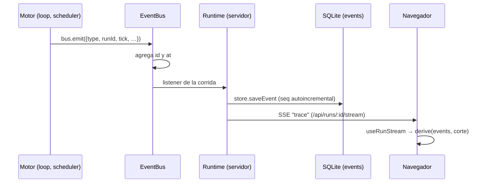

# Cómo agregar un evento

> **Un paso que no emite evento es un paso invisible.**

La UI no hace polling: todo lo que se ve —el organigrama que pulsa, la
cronología, el timeline que retrocede, la auditoría— se **deriva de la traza**.
Si agregaste algo que una persona debería poder ver, en vivo o al reproducir la
corrida, necesita su variante. Lista completa de las que existen en
[[Referencia de eventos]].

## Cómo viaja un evento



- `EventBus.emit` (`packages/engine/src/events.ts`) completa `id` y `at`; un
  listener que tira no tumba la corrida.
- `Runtime.startRun` suscribe un listener que **persiste** (`Store.saveEvent`,
  tabla `events` con `seq`) y **reemite** a los suscriptores SSE
  (`broadcastRun`).
- `GET /api/runs/:id/stream` reenvía primero la traza ya ocurrida y después
  engancha lo vivo; `GET /api/runs/:id/events` devuelve la traza entera.
- `useRunStream` (`apps/web/src/lib/stream.ts`) descarta ids repetidos y retiene
  una ventana de 5.000 eventos (`MAX_EVENTS`).

## 1. La variante

`packages/shared/src/events.ts`:

```ts
const miEvento = z.object({
  ...base,                          // id, runId, tick, at
  type: z.literal("mi.evento"),
  roleId: idSchema,
  detalle: z.string().max(500),     // acotá los textos largos
});
```

- **Acotá los textos**: `tool.end.preview` va hasta 2.000 caracteres y
  `agent.message.preview` hasta 500. Cada evento se persiste y viaja por SSE.
- **Si usás un enum del dominio, importalo** de `schema.ts` (`agentRequestTypeSchema`,
  `taskStatusSchema`…). Copiarlo a mano fue un bug: un tipo nuevo de solicitud
  parseaba en la base y rompía el evento que la anunciaba.
- **Campos nuevos en una variante existente**: con `.default()` o
  `.optional()`, porque la traza persistida de corridas viejas no los tiene
  (así se agregaron `antes` y `commit` a `codigo.checkpoint`).

## 2. Sumarla a la unión

```ts
export const traceEventSchema = z.discriminatedUnion("type", [
  // …
  miEvento,
]);
```

`TraceEvent`, `TraceEventInput` (sin `id` ni `at`) e `isEvent()` se derivan
solos.

## 3. Emitirla

```ts
bus.emit({ type: "mi.evento", runId: state.runId, tick: state.tick, roleId: role.id, detalle: "…" });
```

> [!important] Emití **antes** del paso, no después
> Así la UI muestra lo que está pasando y no un resumen a posteriori
> (`tool.start` antes de ejecutar, `model.selected` antes de `agent.thinking`).

> [!danger] Si el paso puede fallar, el cierre va en `finally`
> La lección de `agent.turn_end`: sin eso el nodo del organigrama queda
> "pensando…" para siempre (`runAgentTurn` en `packages/engine/src/loop.ts`).

Si el evento lo produce el servidor y no el motor, hace falta una corrida: la
traza exige `runId`. Lo que pasa fuera de toda corrida —cargar un repo,
integrar una sesión— va por el canal de código (`EventoDeCodigo` en
`apps/server/src/repos.ts`, `Runtime.subscribeCodigo`), no por la traza.

## 4. El servidor

No hay nada que tocar: persiste y reemite todo lo que llega al bus.

## 5. La UI

| Dónde | Qué | ¿Obligatorio? |
|---|---|---|
| `apps/web/src/routes/LiveProcess.tsx` → `enCriollo` | la etiqueta del timeline en castellano | **sí**: es un `switch` exhaustivo que devuelve `string`; sin tu caso, `npm run typecheck` falla |
| `apps/web/src/lib/derive.ts` → `derive` | si cambia el estado derivado (roles, tareas, flujos, costo) | si aplica |
| `apps/web/src/routes/LiveProcess.tsx` → `armarCronologia` | una fila en "Lo que viene pasando" (con `nivel` y `punto`) | si una persona tiene que verlo en la cronología; tiene `default`, así que no avisa |
| `apps/web/src/routes/codigo/Chat.tsx` | si el chat del IDE lo usa (como `codigo.checkpoint`) | si aplica |

`apps/web/src/lib/acciones.ts` **no** es de eventos: traduce **nombres de
herramientas** (`ACCION_HUMANA`) para la cronología.

## 6. Otros consumidores

- `apps/server/src/auditoria.ts` (`npm run auditar`) lee `model.selected` y
  `tool.end`; si tu evento cambia qué se considera un turno o una acción,
  revisá sus reglas.
- `Runtime.historiaDeConversacion` lee `agent.turn_end.summary`.

## 7. Documentarlo

[[Referencia de eventos]] y, si cambia cómo se lee el sistema,
[[Observabilidad y trazas]].

## Antes de agregar uno, preguntate

| Pregunta | Si la respuesta es… |
|---|---|
| ¿es diagnóstico y no un paso del proceso? | usá `log` con su `level` |
| ¿ya hay una variante que lo cubre con otro campo? | agregá el campo (con default), no el evento |
| ¿alguien necesita verlo? | si no, no va: todo se persiste |
| ¿tiene un cierre? | si tiene inicio tiene fin, y el fin va en `finally` |
| ¿pasa fuera de una corrida? | canal de código, no traza |

## Lista de control

- [ ] variante en `events.ts` y en `traceEventSchema`
- [ ] textos acotados con `.max()`; enums importados; campos nuevos con default
- [ ] se emite **antes** del paso; si hay inicio hay fin, en `finally`
- [ ] caso en `enCriollo` (el typecheck lo exige)
- [ ] `derive.ts` y `armarCronologia`, si corresponde
- [ ] [[Referencia de eventos]] actualizada
- [ ] `npm run typecheck && npm test`

## Fuentes

- `packages/shared/src/events.ts` → `traceEventSchema`, `TraceEventInput`, `isEvent`
- `packages/engine/src/events.ts` → `EventBus`
- `apps/server/src/runtime.ts` → `startRun` (suscripción), `subscribeRun`, `subscribeCodigo`
- `apps/server/src/db.ts` → `saveEvent`, `listEvents`
- `apps/server/src/routes.ts` → `/api/runs/:id/stream`, `/api/runs/:id/events`, `openSse`
- `apps/web/src/lib/stream.ts`, `apps/web/src/lib/derive.ts`, `apps/web/src/routes/LiveProcess.tsx`

## Ver también

- [[Observabilidad y trazas]] · [[Referencia de eventos]] · [[API HTTP y SSE]] · [[Frontend web]]
