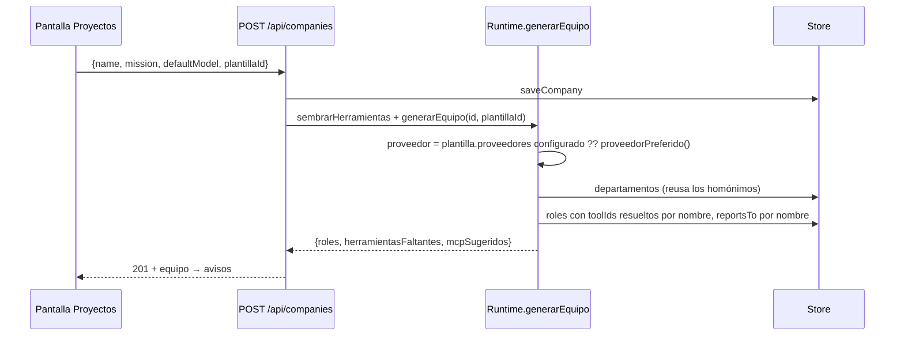

# Cómo agregar una plantilla de equipo

Una **plantilla** es un organigrama probado con el que un proyecto nace: áreas,
roles con su prompt, jerarquía, herramientas por nombre y servidores MCP
sugeridos. Vive en código (`PLANTILLAS_EQUIPO`, `packages/shared/src/plantillas.ts`)
y se valida en CI, no al usarla. Las que existen están en
[[Referencia de plantillas de equipo]]; cómo se usan, en [[Plantillas de equipo]].

## Cómo se materializa



- Cada nombre de herramienta se busca en el catálogo de la empresa; **la que no
  está se nombra** en `herramientasFaltantes`, nunca se descarta en silencio.
- El modelo de cada rol: `providerId` del proveedor elegido, `modelSlug: null`,
  `tier` = `escalado.tierMinimo`, escalado activo con el rango del rol,
  `maxOutputTokens` 4096.
- `proveedorPreferido()`: `claude-sesion` > `anthropic` > `claude-code` >
  `opencode` > `openrouter` > el primero configurado.
- Los roles nacen en `(0,0)`: el organigrama los ubica solo, en anillos por
  jerarquía (`radialLayout` en `OrgGraph.tsx`).
- **Los `mcpSugeridos` no se instalan**: la UI avisa "instalálos desde la
  Tienda". Conectar lo decide una persona.

## 1. El esquema

`plantillaEquipoSchema`:

| Campo | Qué es |
|---|---|
| `id` | único, hasta 64 caracteres; lo manda la UI como `plantillaId` |
| `nombre`, `descripcion` | lo que se ve en el alta |
| `icono` | nombre de ícono de Lucide (está en el esquema; la pantalla de alta hoy no lo dibuja) |
| `tipoDeEncargo` | una frase; es el `title` de la opción |
| `departamentos` | `{nombre, proposito}` |
| `roles` | ver abajo, al menos uno |
| `mcpSugeridos` | ids de artículos de `CATALOGO_MCP` |
| `proveedores` | opcional, en orden de preferencia |

Cada rol (`plantillaRolSchema`): `nombre`, `titulo`, `systemPrompt`,
`authority` (`executive`/`manager`/`executor`), `reportaA` (nombre de otro rol
de la plantilla o `null`), `departamento` (nombre de un departamento de la
plantilla), `maxTurns` (1-50, default 8), `escalado` `{tierMinimo, tierMaximo}` y
`herramientas` (nombres de `capability`/`skill`/código del catálogo).

## 2. Las reglas que el test impone

`packages/shared/src/plantillas.test.ts` corre sobre **todas** las plantillas:

| Regla | Por qué |
|---|---|
| valida contra el esquema y el `id` no se repite | se descubre en CI, no al crear un proyecto |
| `reportaA` y `departamento` apuntan a algo de la misma plantilla | una jerarquía que apunta al vacío |
| **exactamente un `executive`**, que no reporta a nadie | el responsable de cerrar y el único que convoca |
| **ningún `executor` llega a `smart`** | el rango sigue a la autoridad (usá `ESCALADO.executor`) |
| los `mcpSugeridos` existen en la tienda | un id inventado no se puede instalar |
| **todo `systemPrompt` menciona "castellano"** | una instrucción larga en inglés arrastra la salida al inglés |

Y `apps/server/src/equipo.test.ts` materializa plantillas contra un catálogo real:
las únicas herramientas que pueden faltar son las **condicionadas al entorno**
(`generar_imagen`, `revisar_lamina`, `export_video_estudio`, `grabar_clip`,
`export_video_clips`, `extraer_cuadros`). Cualquier otro nombre faltante es un
typo en tu plantilla.

## 3. Escribir los prompts

- Abrí con `SALIDA_ES` (la constante del archivo): la especificación va en
  inglés porque el modelo la sigue con más precisión, y la salida se declara en
  castellano rioplatense arriba de todo.
- Escribí contra fallas concretas, no generalidades: cuándo delegar, qué
  verificar antes de dar por bueno, cuándo exportar.
- Para quien revisa: dale **contra qué verificar** (las fuentes, `verificar_cifras`,
  `check_activity`). Un verificador sin datos inventa hallazgos.
- Rangos de modelo: `ESCALADO.executive` (`standard`–`smart`) para quien decide;
  `manager` y `executor` (`cheap`–`standard`). Nunca `cheap` como techo de
  quien coordina.

## 4. Herramientas por nombre

- Sólo nombres que el catálogo de **toda** empresa tenga (o condicionados al
  entorno, a sabiendas). Las de coordinación no se listan: se otorgan siempre.
- Las de código se registran aunque no haya repo, así que un equipo de software
  puede nacer con ellas.
- Quien sólo verifica código no lleva herramientas que escriben: así nunca toma
  el arriendo y puede probar mientras otro edita.

## 5. Probar

```bash
npx vitest run packages/shared/src/plantillas.test.ts apps/server/src/equipo.test.ts
```

Después, crear un proyecto con la plantilla desde la UI y mirar los avisos
(herramientas sin registrar, MCP sugeridos).

> [!warning] Cambiar una plantilla no cambia equipos ya creados
> La plantilla se aplica al generar el equipo. Sumarle una herramienta a un
> equipo ya armado lo decide una persona desde Empresa. Por eso, si una
> herramienta nueva necesita que el agente sepa **cuándo** usarla, eso va en el
> resumen de turno (como `bloqueDeTelefono`), no sólo en el prompt de la
> plantilla.

## Lista de control

- [ ] entrada en `PLANTILLAS_EQUIPO` con `id` nuevo
- [ ] un solo `executive`; `reportaA` y departamentos coherentes
- [ ] prompts con `SALIDA_ES`; rangos con `ESCALADO`
- [ ] herramientas por nombre existentes; MCP sugeridos de la tienda
- [ ] los dos tests pasan
- [ ] [[Referencia de plantillas de equipo]] actualizada

## Fuentes

- `packages/shared/src/plantillas.ts` → `plantillaEquipoSchema`,
  `plantillaRolSchema`, `PLANTILLAS_EQUIPO`, `ESCALADO`, `SALIDA_ES`,
  `plantillaEquipo`
- `apps/server/src/runtime.ts` → `generarEquipo`, `sembrarHerramientas`,
  `proveedorPreferido`
- `apps/server/src/routes.ts` → `GET /api/plantillas`, `POST /api/companies`
- `apps/web/src/routes/Proyectos.tsx` (alta con plantilla y avisos)
- `packages/shared/src/tienda-mcp.ts` → `CATALOGO_MCP`

## Ver también

- [[Plantillas de equipo]] · [[Referencia de plantillas de equipo]] · [[CU-11 Proyecto nuevo desde una plantilla]]
- [[Organización de agentes]] · [[Escalado por dificultad]] · [[Tienda MCP]]
