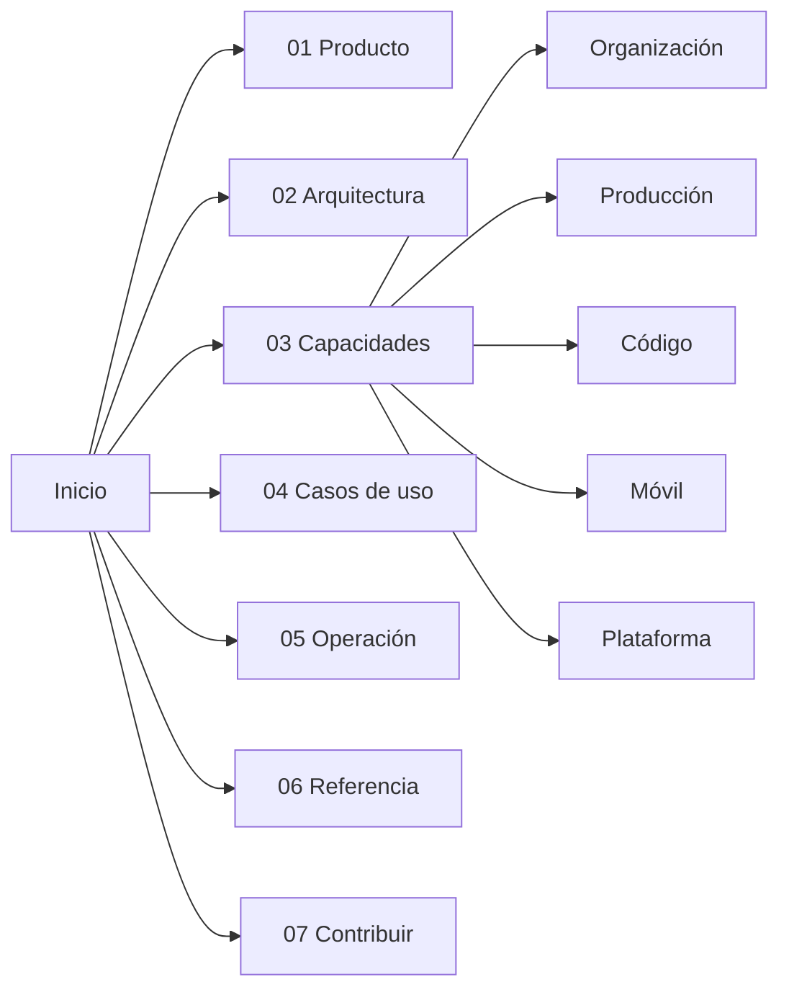

# Orquestador Agéntico — documentación

> Plataforma para **modelar una empresa completa con agentes LLM y verla operar**.
> Configurás departamentos, roles, herramientas y políticas; le das un encargo; y
> mirás cómo los agentes se escriben entre sí, delegan, piden aprobación y
> producen entregables reales —documentos, videos, código, builds de una app— con
> el costo a la vista y un tope que corta solo.

Esta bóveda documenta el producto, la arquitectura, cada capacidad, los casos de
uso y la operación, con cada afirmación anclada al archivo del código del que
sale. Si es tu primera vez, seguí [[Cómo navegar esta bóveda]].

---

## Por dónde entrar

| Si sos… | Empezá por |
|---|---|
| alguien que quiere entender **qué hace** | [[Visión del producto]] → [[Casos de uso]] |
| desarrollador que va a **tocar el código** | [[Arquitectura general]] → [[Invariantes de arquitectura]] → [[Trampas conocidas]] |
| quien lo va a **poner a correr** | [[Instalación y arranque]] → [[Dependencias del sistema]] → [[Variables de entorno]] |
| quien va a **diseñar una empresa** | [[Organización de agentes]] → [[Plantillas de equipo]] → [[Catálogo de herramientas]] |
| quien va a **programar con agentes** | [[Trabajo con código]] → [[El IDE]] → [[Chat de IA]] |
| quien trabaja con **la app móvil** | [[App móvil en el teléfono]] → [[QA móvil]] → [[Build de producción Android]] |
| quien busca **un dato puntual** | [[Referencia de API]] · [[Referencia de eventos]] · [[Referencia de esquemas]] · [[Referencia de herramientas]] |

---

## Mapa de la bóveda

### 00 · Meta

- [[Cómo navegar esta bóveda]] · [[Convenciones de documentación]] · [[Glosario]]

### 01 · Producto

- [[Visión del producto]] — qué es y por qué existe
- [[Problema y público]] — a quién le sirve
- [[Estado del producto]] — qué está verificado y qué no
- [[Hoja de ruta]] — lo próximo y lo descartado

### 02 · Arquitectura

**Visión de conjunto:** [[Arquitectura general]] · [[Invariantes de arquitectura]] ·
[[Mapa del monorepo]] · [[Modelo de dominio]] · [[Decisiones de arquitectura]]

**Motor:** [[Scheduler y ciclo de una corrida]] · [[Motor de agentes]] ·
[[Estado de una corrida]] · [[Prompt de un turno]] · [[Escalado por dificultad]] ·
[[Turnos delegados a un CLI]]

**Modelos:** [[Capa LLM y tiers]] · [[Proveedor Anthropic y claude-sesion]] ·
[[Proveedor claude-code]] · [[Proveedor opencode]] · [[Proveedor OpenRouter]] ·
[[Proveedores OpenAI, NVIDIA y Ollama]]

**Herramientas:** [[Herramientas y tool router]] · [[Integración MCP]]

**Servidor y datos:** [[Runtime del servidor]] · [[API HTTP y SSE]] ·
[[Persistencia y esquema SQL]] · [[Directorios en disco]]

**Interfaz:** [[Frontend web]] · [[Sistema de diseño y temas]] · pantallas:
[[Pantalla Proyectos]] · [[Pantalla Empresa y organigrama]] ·
[[Pantalla Proceso en vivo]] · [[Pantalla Tablero]] · [[Pantalla Solicitudes]] ·
[[Pantalla Salida]] · [[Pantalla Memoria]] · [[Pantalla Hub MCP]] ·
[[Pantalla Tienda]] · [[Pantalla Configuración]] (y la pestaña Código en [[El IDE]])

### 03 · Capacidades

**Organización** — puerta: [[Organización de agentes]]
- [[Coordinación entre agentes]] · [[Entregables]] · [[Aprobaciones y solicitudes]]
- [[Supervisión y continuidad]] · [[Especialistas convocados]] · [[Herramientas compuestas]]
- [[Memoria de la empresa]] · [[Vault de contexto]] · [[Auditoría de corridas]] · [[Plantillas de equipo]]

**Producción** — puerta: [[Habilidades de producción]]
- [[Documentos Word y PDF]] · [[Deck de slides]] · [[Íconos y visuales vectoriales]] · [[Archivos de salida y permisos de borrado]]
- [[Producción audiovisual]] · [[Guion como línea de tiempo]] · [[Motor de video ASS]] · [[Motor estudio de láminas HTML]] · [[Motor de clips grabados]]
- [[Navegador Chrome por CDP]] · [[Música y narración]] · [[Imágenes y medios]] · [[Voz y marca de la empresa]]

**Código** — puerta: [[Trabajo con código]]
- [[Repositorios y sesiones]] · [[Git endurecido]] · [[Arriendo de escritura y resumen de código]]
- [[Herramientas de código]] · [[Comandos y sandbox]] · [[Instalación de dependencias]]
- [[Instantáneas y checkpoints]] · [[Control de versiones y publicación]]
- [[Servicios del monorepo]] · [[Vista previa y proxy]]
- IDE: [[El IDE]] · [[Editor, explorador y búsqueda]] · [[Terminal del IDE]] · [[Chat de IA]] · [[Selector de elementos e inspector]] · [[Notas de Obsidian en el IDE]] · [[Panel de control de código]] · [[Configuración de repos y servicios]]

**Móvil** — puerta: [[App móvil en el teléfono]]
- [[Vinculación del teléfono]] · [[Build de desarrollo y túneles]] · [[Espejo del teléfono]]
- [[Depuración de la app móvil]] · [[Inspector de React Native]] · [[QA móvil]]
- [[Build de producción Android]] · [[Almacenamiento R2]]

**Plataforma** — puerta: [[Catálogo de herramientas]]
- [[Tienda MCP]] · [[OAuth para servidores MCP]] · [[Correo y avisos]]
- [[Gestión de proyectos]] · [[Salida de la empresa]] · [[Misiones programadas]]
- [[Observabilidad y trazas]] · [[Limpieza y mantenimiento]]

### 04 · Casos de uso

- [[Casos de uso]] (índice de los doce recorridos)

### 05 · Operación

- [[Instalación y arranque]] · [[Dependencias del sistema]] · [[Variables de entorno]] · [[Comandos]]
- [[Base de datos]] · [[Pruebas y calidad]] · [[Diagnóstico de problemas]]
- [[Costos y presupuesto]] · [[Seguridad]]

### 06 · Referencia

- [[Referencia de API]] · [[Referencia de API de código y móvil]]
- [[Referencia de esquemas]] ([[Esquemas de empresa y organización]] · [[Esquemas de corrida y trabajo]] · [[Esquemas de herramientas y MCP]] · [[Esquemas de código y servicios]])
- [[Referencia de eventos]] · [[Referencia de herramientas]] · [[Referencia de la tienda MCP]]
- [[Referencia de plantillas de equipo]] · [[Empresas de ejemplo]]

### 07 · Contribuir

- [[Guía de contribución]] · [[Trampas conocidas]]
- [[Cómo agregar un proveedor LLM]] · [[Cómo agregar una herramienta]] · [[Cómo agregar una habilidad]]
- [[Cómo agregar un evento]] · [[Cómo agregar una plantilla de equipo]] · [[Cómo agregar un servidor a la tienda MCP]]

---

## Los cuatro conceptos que hay que entender sí o sí

1. **Un rol es un agente con bandeja propia.** No comparten contexto: cada uno
   sabe sólo lo que le escriben. Ver [[Coordinación entre agentes]].
2. **Un ciclo es una cadena, no una ronda.** Cada rol con trabajo corre a lo sumo
   una vez por ciclo, y lo que entrega lo toma **en el mismo ciclo** quien todavía
   no corrió. Ver [[Scheduler y ciclo de una corrida]].
3. **Los frenos viven en el ejecutor, no en el prompt.** Un agente puede ignorar
   una instrucción, no el `execute` de una herramienta. Ver
   [[Invariantes de arquitectura]].
4. **Todo lo que pasa emite un evento.** La UI deriva su estado de la traza: ver
   en vivo y retroceder son la misma operación. Ver [[Observabilidad y trazas]].
